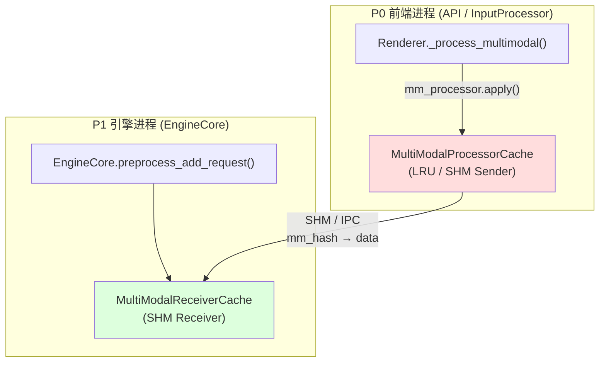
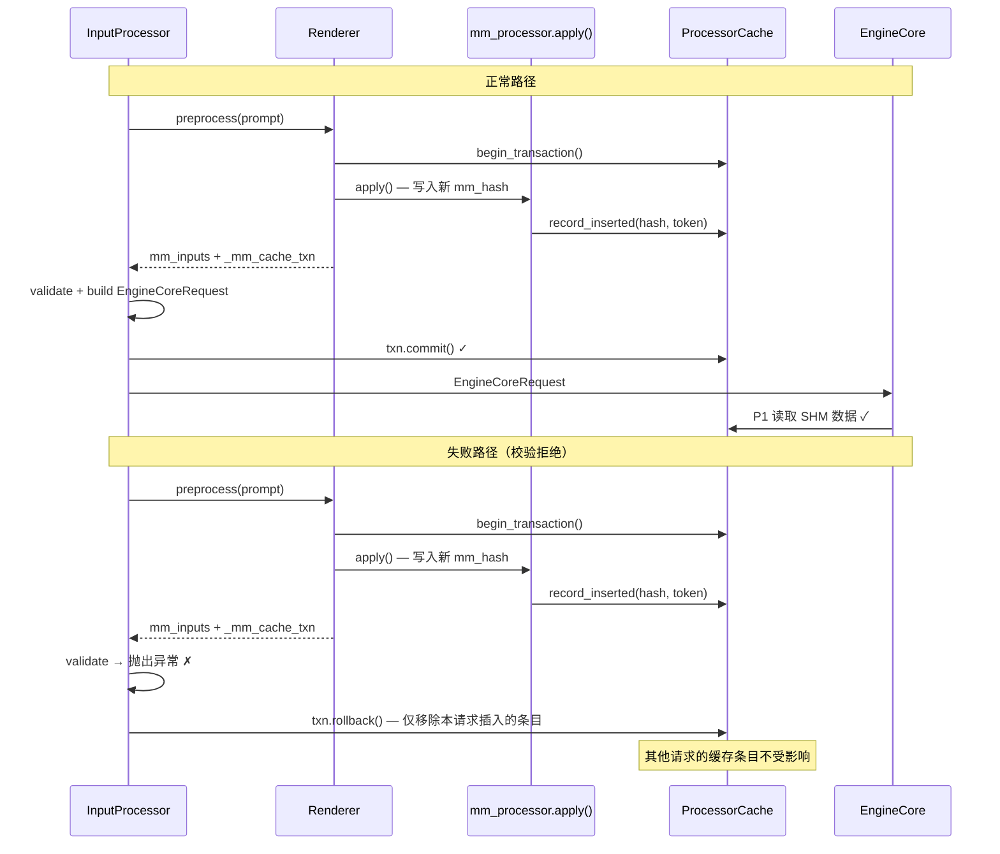
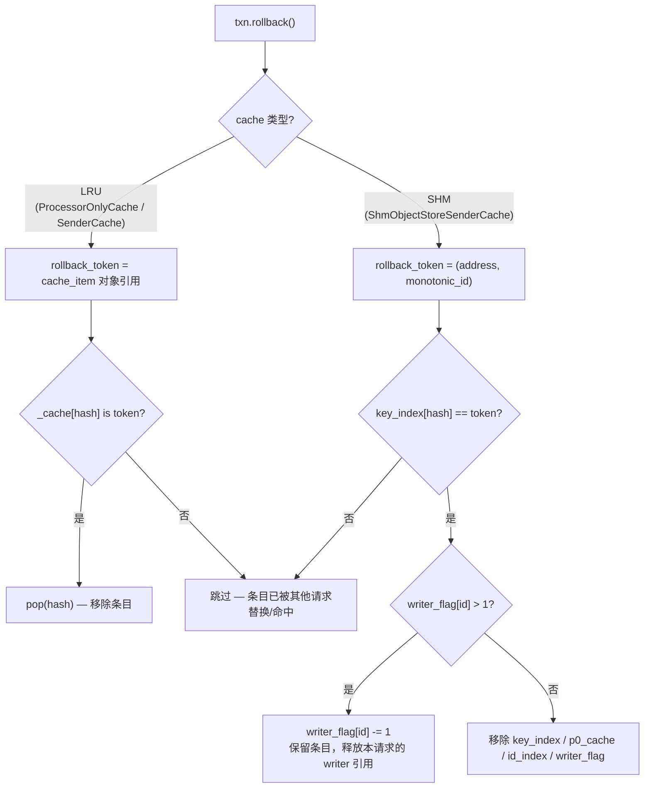

# PR #46451: Fix multimodal cache desync after input rejection

> **Author**: @zihaomu | **State**: OPEN | **Date**: 2026-06-23
> **Branch**: `verify-vllm-46354` → `main` | **Labels**: `v1`, `multi-modality`
> **Changes**: +625 -104 lines across 7 files
> **Review Requests**: @NickLucche, @njhill, @tjtanaa, @DarkLight1337, @shen-shanshan, @ywang96

---

## 1. 总结 (Summary)

本 PR 修复了 vLLM 多模态推理中 **前端 MM Processor 缓存与 EngineCore 侧缓存不同步** 的 bug（#46354）。当请求在 `mm_processor.apply()` 阶段写入了前端 P0 缓存，却在到达 EngineCore 之前因校验失败被拒绝时，后续相同图片的请求会在前端命中缓存、但引擎侧找不到对应数据，最终触发 `AssertionError: Expected a cached item for mm_hash=...` 并使 EngineCore 崩溃。

核心方案是引入 **请求级 MM Processor 缓存事务（transaction）**：在 MM 处理开始时开启事务，仅在 `InputProcessor.process_inputs()` 成功构建 `EngineCoreRequest` 后 commit；任何中间失败路径只 rollback 本请求插入的条目，而非清空整个缓存——避免了旧方案「失败即全量清缓存」带来的 DoS 风险。

---

## 2. 背景与动机 (Background & Motivation)

### 2.1 问题现象

Issue [#46354](https://github.com/vllm-project/vllm/issues/46354) 报告：在多模态 serving 场景（如 Qwen3.6-27B-FP8，4 卡 TP，连续多图请求）中，EngineCore 在处理后续请求时崩溃：

```
AssertionError: Expected a cached item for mm_hash='1ea9aa7482abe46e1abad1e3e9c2078c12a65b7cf6589f4b7802e54c6d2d6450'
```

崩溃栈位于 `multimodal/cache.py` 的 `get_and_update_item`，说明引擎侧 receiver cache 期望从共享缓存中读取已存在的 MM 数据，但实际为 `None`。

### 2.2 根因分析

vLLM V1 多模态路径存在 **双层缓存架构**：

| 层级 | 位置 | 角色 |
|------|------|------|
| P0（前端） | API / InputProcessor 进程 | `MultiModalProcessorCache`：缓存 MM 预处理结果（pixel values → kwargs） |
| P1（引擎） | EngineCore 进程 | `MultiModalReceiverCache`：从 SHM / IPC 读取 P0 写入的数据 |

正常流程：P0 写入 → 请求到达 EngineCore → P1 读取同一 `mm_hash` 对应的数据。

**故障路径**：
1. 请求 A 的图片在 P0 侧 `mm_processor.apply()` 中被处理并写入 processor cache；
2. 请求 A 在后续校验（token 长度、参数合法性等）阶段失败，**从未到达 EngineCore**；
3. P0 缓存中仍保留该 `mm_hash` 条目，P1 侧无对应数据；
4. 请求 B 携带相同图片 → P0 cache hit（`get_and_update_item(None, mm_hash)` 路径）→ 认为数据已缓存；
5. 请求 B 到达 EngineCore → P1 尝试读取 → `mm_item is None` → AssertionError → `EngineDeadError`。

### 2.3 旧方案的问题

早期修复尝试在失败时 **清空整个 MM processor cache**（`renderer.clear_mm_cache()`）。这虽然能恢复 P0/P1 一致性，但会驱逐所有无关条目，攻击者可通过反复提交无效请求触发 cache thrashing，构成 **DoS 向量**。

本 PR 的 transaction 方案精确回滚失败请求插入的条目，保留其他请求的缓存数据。

---

## 3. 代码修改分析 (Code Change Analysis)

### 3.1 修改的模块

| 文件 | 操作 | 说明 |
|------|------|------|
| `vllm/multimodal/cache.py` | 修改 | 新增 `MultiModalProcessorCacheTransaction` 类、`ContextVar` 追踪、三种 cache 的 `remove_item()` 实现 |
| `vllm/renderers/base.py` | 修改 | 在 `_process_multimodal()` 中围绕 `mm_processor.apply()` 开启事务，异常时 rollback，成功后将 txn 附加到 `mm_inputs` |
| `vllm/v1/engine/input_processor.py` | 修改 | 重构 `process_inputs()`：收集/去重 txn，成功构建 request 后 commit，任何异常路径 rollback |
| `vllm/inputs/engine.py` | 修改 | 新增 `MM_CACHE_TXN_FIELD` 常量；enc-dec 输入转换时传播 transaction 对象 |
| `vllm/distributed/device_communicators/shm_object_storage.py` | 修改 | `free_unused()` 和 `default_is_free_check()` 改用 defensive `pop`/`get`，避免 rollback 时 KeyError |
| `tests/multimodal/test_cache.py` | 修改 | 新增 LRU / SHM cache 事务 rollback/commit 单元测试（+160 行） |
| `tests/v1/engine/test_input_processor.py` | 新增 | 新增 InputProcessor 层 commit/rollback 集成测试（+138 行） |

### 3.2 架构 / 流程图 (Architecture / Flow Diagram)

#### 多模态缓存双层架构与 desync 场景



#### 事务生命周期（正常 vs 失败路径）



#### Rollback Token 策略



### 3.3 关键实现细节 (Key Implementation Details)

**事务核心类（`cache.py` — `MultiModalProcessorCacheTransaction`）**
- 通过 `ContextVar`（`_ACTIVE_PROCESSOR_CACHE_TXN`）在 `get_and_update_item()` 中自动关联当前活跃事务；
- `record_inserted(mm_hash, rollback_token)` 记录本请求新插入的条目；
- `commit()` 清空记录并标记 closed；`rollback()` 调用 `cache.remove_items()` 逐条精确移除；
- `__exit__` 在异常时自动 rollback；支持 `collect_mm_processor_cache_transactions()` 上下文管理器收集嵌套创建的事务。

**Renderer 集成（`renderers/base.py`）**
- 在 `_process_multimodal()` 中，当 cache 可用且非 `skip_mm_cache` 时调用 `cache.begin_transaction()`；
- 用 `with cache_txn` 包裹 `mm_processor.apply()`，确保 apply 期间的所有 cache 写入被追踪；
- apply 异常时显式 rollback；成功后将 txn 写入 `mm_inputs[MM_CACHE_TXN_FIELD]`。

**InputProcessor 集成（`input_processor.py`）**
- `process_inputs()` 重构为 try/except 结构，分三阶段管理 txn：
  1. `preprocess()` 阶段：通过 `collect_mm_processor_cache_transactions()` 收集 + 从 processed_inputs 中 pop txn；
  2. 校验 / 构建 request 阶段：任何异常触发 `_rollback_mm_cache_txns()`；
  3. 成功返回前：`_commit_mm_cache_txns()`；
- `_dedupe_mm_cache_txns()` 按 `id(txn)` 去重，避免 enc-dec 场景重复 commit/rollback。

**LRU Cache Rollback（`MultiModalProcessorOnlyCache` / `MultiModalProcessorSenderCache`）**
- rollback token 为 `MultiModalProcessorCacheItem` 对象本身（identity check）；
- 仅当 `_cache.get(mm_hash) is rollback_token` 时才 pop，避免误删已被其他请求 hit 并更新的条目。

**SHM Cache Rollback（`ShmObjectStoreSenderCache`）**
- rollback token 为 `(address, monotonic_id)` 元组；
- 若 `writer_flag[monotonic_id] > 1`（说明另一请求已 hit 此条目），仅递减 writer 计数，保留 SHM 数据可见性；
- 否则完整移除 key_index、p0_cache、id_index、writer_flag 四项索引。

**Enc-Dec 传播（`inputs/engine.py`）**
- 新增 `MM_CACHE_TXN_FIELD = "_mm_cache_txn"` 常量；
- `mm_enc_dec_input()` 和 `build_enc_dec_input()` 在 encoder → decoder 转换时传播 txn 对象，确保 enc-dec 模型的事务不被丢失。

**SHM 防御性修复（`shm_object_storage.py`）**
- `free_unused()` 中 `del` 改为 `pop(key, None)` + None 检查，避免 rollback 与 eviction 并发时的 KeyError；
- `default_is_free_check()` 中 `writer_flag[id]` 改为 `writer_flag.get(id, 0)`，处理 rollback 已 pop 的 id。

---

## 4. 涉及的技术原理 (Technical Principles)

### 4.1 vLLM 多模态双层缓存（P0 / P1）

vLLM 的多模态数据流采用 **进程间缓存分离** 设计：前端进程（P0）负责 CPU 侧的图像预处理（resize、normalize、tokenize placeholders），结果写入 processor cache；引擎进程（P1）通过共享内存（SHM）或 IPC 读取预处理结果，避免重复计算。两层缓存通过 `mm_hash`（内容哈希）关联，必须保持 **写入可见性一致**——P0 认为已缓存的条目，P1 必须能读到。

### 4.2 LRU Cache vs SHM Object Store

- **LRU Cache**（`MultiModalProcessorOnlyCache`）：纯内存 dict + LRU 驱逐，适用于单进程或 P0-only 场景；rollback 通过对象 identity 判断条目是否仍为本请求写入的版本。
- **SHM Object Store**（`ShmObjectStoreSenderCache`）：跨进程共享内存，使用 `(address, monotonic_id)` 索引 + `writer_flag` 引用计数；支持多 writer / 多 reader 的并发访问。rollback 需处理「条目已被其他请求 hit（writer_flag > 1）」的情况，不能简单删除。

### 4.3 ContextVar 与请求级状态追踪

Python 的 `contextvars.ContextVar` 允许在异步/多线程环境中隐式传递请求级状态，无需修改 `get_and_update_item()` 的函数签名。事务通过 ContextVar 自动关联到当前请求的 cache 写入操作，对现有 cache API 侵入性最小。

### 4.4 精确 Rollback vs 全量 Clear

事务模式的核心优势是 **最小影响原则**：
- 精确 rollback：O(k)，k = 本请求插入的条目数（通常 1–N 张图片）；
- 全量 clear：O(n)，n = 整个 cache 条目数，且导致所有并发请求 cache miss → 重新预处理 → 性能雪崩。

在高并发多模态 serving 中，后者可被恶意利用：反复发送「图片合法但 prompt 超长」的请求，每次触发全量 cache clear，等效于对 MM 预处理 pipeline 的 DoS 攻击。

---

## 5. 评论区讨论亮点 (Discussion Highlights)

### 生产环境验证（MikeWang0316tw）

用户在 DGX Spark（GB10, aarch64）上部署 vLLM 0.24.0 + `nvidia/Qwen3.6-35B-A3B-NVFP4`，连续多图多轮对话场景下确认修复有效：

> **Before**: EngineCore 崩溃 `AssertionError: Expected a cached item for mm_hash='...'` → `EngineDeadError`，后续所有请求 500。
>
> **After**（仅应用 `input_processor.py` 变更）: 相同 workload 下不再出现 assertion 错误，P0/P1 缓存一致性恢复。

这提供了独立于单元测试的 **真实部署验证**。

### 合并优先级讨论（DarkLight1337）

DarkLight1337 向 @ywang96 询问 PR #30373 的 review 进度，暗示若 #30373 短期无法 review，可以先合并本 PR：

> "@ywang96 are you going to review #30373 soon? If not maybe we can work on merging this PR first"

说明维护者认可该 bug 的紧迫性，但合并可能被更大的 MM cache 重构 PR（#30373）所阻塞。

### 关联 Issue

- [#47958](https://github.com/vllm-project/vllm/issues/47958)：EngineCore 在 MM cache eviction（`popitem`）时 hang，与本 PR 涉及的 cache 生命周期管理相关；
- [#43941](https://github.com/vllm-project/vllm/issues/43941)：400/500 序列后复用图片时 EngineCore 无限循环，可能为同一根因的不同表现。

### 当前状态

- PR 自 2026-06-23 创建，经历 3 次 commit 和多次 force-push；
- Mergify 曾在 6 月和 8 月两次报告 **merge conflicts**，需要 rebase；
- 6 位 reviewer 被请求审查，目前 **尚无 Approved review**；
- 0 条 inline review comments。

---

## 6. 风险与潜在问题 (Risk Analysis)

| 风险 | 严重程度 | 说明 |
|------|---------|------|
| **Rollback 遗漏路径** | High | 若存在未纳入 try/except 的代码路径在 MM 处理后写入 cache 但不触发 rollback，desync 仍会复现。当前覆盖了 preprocess、validate、request 构建三条路径，但自定义 `MultiModalProcessor.apply()` 实现可能引入新路径。 |
| **SHM writer_flag 竞态** | Medium | 高并发下，rollback 递减 writer_flag 与另一请求的 hit（递增 writer_flag）之间可能存在竞态。当前逻辑在 `writer_flag > 1` 时保留条目，但极端时序下可能出现计数不一致。 |
| **Enc-Dec txn 传播遗漏** | Medium | txn 通过 `MM_CACHE_TXN_FIELD` 手动传播到 enc-dec 输入转换路径。若未来新增其他 multimodal 输入类型（如 multi-encoder），需确保 txn 不被丢弃。 |
| **ContextVar 在 multiprocessing 中的行为** | Low | vLLM 使用多进程架构，ContextVar 仅在同一进程内有效。当前设计正确（txn 在同一 P0 进程内创建和 commit/rollback），但若未来改为跨进程 preprocess，需重新设计。 |
| **与 #30373 的功能重叠** | Medium | 若 #30373（更大的 MM cache 重构）先合入，本 PR 可能产生大量冲突，需要 rebase 并验证 transaction 逻辑与新架构的兼容性。 |
| **测试覆盖** | Low | 单元测试覆盖了 LRU rollback/commit、SHM rollback（含 touched entry 保留）、InputProcessor 异常路径。缺少端到端多进程 SHM 集成测试（依赖实际 SHM 环境），CI 中可能无法完全覆盖 P0→P1 一致性场景。 |
| **Merge conflicts 悬而未决** | Low | PR 目前需要 rebase，主分支持续演进可能扩大冲突范围。 |

---

## 7. 结论 (Conclusion)

PR #46451 针对多模态 serving 中一个 **高影响、可复现的 cache desync bug** 提供了设计合理的修复：请求级事务 + 精确 rollback 替代全量清缓存，在恢复 P0/P1 一致性的同时消除了 DoS 向量。代码改动集中在 cache 层和 input 处理链路，测试覆盖较充分，且已有生产环境验证。主要阻塞因素是尚未获得 maintainer approval、存在 merge conflicts 需要 rebase，以及与更大的 MM cache 重构 PR #30373 的合并优先级协调。建议优先 rebase 并推动 review，该修复对多模态 serving 稳定性有直接价值。
