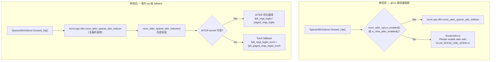
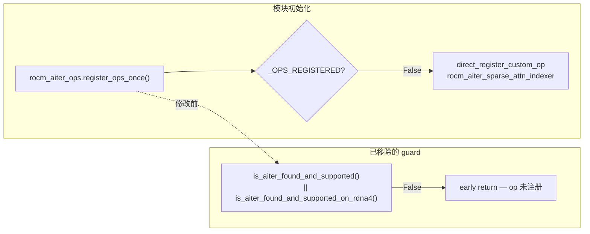

# PR #47017: [ROCm] Enable DeepSeek-V4 on gfx11

> **Author**: @JoursBleu (Letian Kang) | **State**: OPEN | **Date**: 2026-06-29
> **Branch**: `feat/dsv4-gfx1151-autoround` → `main` | **Labels**: `rocm`, `deepseek`, `verified`
> **Changes**: +16 -26 lines across 3 files

---

## 1. 总结 (Summary)

本 PR 在 ROCm gfx11/RDNA 消费级与工作站 GPU（如 gfx1100 W7900D、gfx1151 Radeon 8060S）上启用 DeepSeek-V4 推理。核心思路是移除 Python 层对 AITER 可用性的硬性拦截，让 `SparseAttnIndexer.forward_hip()` 始终调用已注册的 `rocm_aiter_sparse_attn_indexer` custom op，由 op 内部自动降级到 Torch fallback；同时在 `RocmPlatform.supported_quantization` 中加入 `inc`，使 `Intel/DeepSeek-V4-Flash-W4A16-AutoRound` 等 AutoRound 量化 checkpoint 能通过 ROCm 平台校验。改动极小（3 文件、净减 10 行），但解开了 DeepSeek-V4 在 gfx11 上的启动阻塞。

---

## 2. 背景与动机 (Background & Motivation)

DeepSeek-V4 采用 **稀疏注意力（Sparse Attention）** 架构，每层需要一个 **Sparse Attention Indexer** 从完整 KV cache 中选出 Top-K token 参与注意力计算。在 ROCm 路径上，Indexer 的实现依赖 `rocm_aiter_sparse_attn_indexer` custom op，该 op 内部会根据 AITER 库是否可用，选择 AITER 优化 kernel 或 PyTorch fallback。

**现有阻塞**：

1. **`register_ops_once()` 提前返回**：`_aiter_ops.py` 在 AITER 未检测到或不支持当前架构时直接 `return`，导致 `rocm_aiter_sparse_attn_indexer` 根本不会被注册。
2. **`forward_hip()` 硬性报错**：`sparse_attn_indexer.py` 在 `rocm_aiter_ops.is_enabled()` 为 False 时抛出 `RuntimeError`，要求用户设置 `VLLM_ROCM_USE_AITER=1`，而 gfx11/RDNA 设备并不具备完整 AITER 支持。
3. **量化格式校验失败**：AutoRound 量化 checkpoint 映射到 `INCConfig`，但 `RocmPlatform.supported_quantization` 未包含 `"inc"`，导致模型加载阶段即被拒绝。

**目标硬件**：

- 2× Strix Halo / Radeon 8060S（gfx1151），TP=2 + EP=2
- 8× Radeon PRO W7900D（gfx1100），TP=8

**验证 checkpoint**：`Intel/DeepSeek-V4-Flash-W4A16-AutoRound`

---

## 3. 代码修改分析 (Code Change Analysis)

### 3.1 修改的模块

| 文件 | 操作 | 说明 |
|------|------|------|
| `vllm/_aiter_ops.py` | 修改 | 移除 `register_ops_once()` 中对 `is_aiter_found_and_supported()` / `is_aiter_found_and_supported_on_rdna4()` 的前置 guard，使 custom op 在 gfx11 上也能注册 |
| `vllm/model_executor/layers/sparse_attn_indexer.py` | 修改 | `forward_hip()` 不再检查 AITER 是否启用，直接调用 `torch.ops.vllm.rocm_aiter_sparse_attn_indexer`；移除 `rocm_aiter_ops` import |
| `vllm/platforms/rocm.py` | 修改 | 在 `supported_quantization` 列表中新增 `"inc"`，支持 AutoRound/INC 量化格式 |

### 3.2 架构 / 流程图 (Architecture / Flow Diagram)

#### Sparse Indexer 调用路径（修改前 vs 修改后）

#### Op 注册路径

### 3.3 关键实现细节 (Key Implementation Details)

- **`register_ops_once()` 去 guard**（`_aiter_ops.py`）：删除 5 行前置检查。修改前，若 AITER 未安装或不支持当前 GPU arch，`register_ops_once()` 直接返回，所有 ROCm AITER custom op（含 sparse indexer）均不会注册。修改后，op 始终注册，AITER 可用性判断下沉到各 op 的实现函数内部。

- **`forward_hip()` 简化**（`sparse_attn_indexer.py`）：删除 `if rocm_aiter_ops.is_enabled() or rocm_aiter_ops.is_rdna_aiter_enabled()` 分支和对应的 `RuntimeError`。现在无条件调用 `torch.ops.vllm.rocm_aiter_sparse_attn_indexer(...)`，与 CUDA 路径 `forward_cuda()` 直接调用 custom op 的模式一致。

- **Op 内部 fallback 机制**（已有代码，本 PR 未修改）：`rocm_aiter_sparse_attn_indexer` 内部调用 `rocm_fp8_mqa_logits` / `rocm_fp8_paged_mqa_logits`，这些函数在 AITER module 不可用时自动走 `fp8_mqa_logits_torch` / `fp8_paged_mqa_logits_torch` 纯 PyTorch 实现。skyguan92 的独立验证确认：在 `VLLM_ROCM_USE_AITER=0` 且 `is_aiter_found_and_supported() == False` 时，dispatch 仅触发 Torch fallback，零 AITER scorer 调用。

- **`"inc"` 量化支持**（`rocm.py`）：一行新增，将 Intel Neural Compressor (INC) / AutoRound 量化格式加入 ROCm 平台白名单，使 `Intel/DeepSeek-V4-Flash-W4A16-AutoRound` checkpoint 能通过 `RocmPlatform.check_and_update_config()` 中的量化格式校验。

---

## 4. 涉及的技术原理 (Technical Principles)

### DeepSeek-V4 稀疏注意力 Indexer

DeepSeek-V4 在长上下文场景下使用稀疏注意力：每层 Indexer 对 query 与 KV cache 做 FP8 量化后的 MQA（Multi-Query Attention）logits 计算，选出 Top-K（默认 512）个 KV token 索引，后续注意力层仅对这些 token 做计算。Indexer 是 DeepSeek-V4 推理的关键路径组件，无法绕开。

### AITER 与 Op 级 Fallback

**AITER**（AMD Inference Tuned Engine Repository）是 AMD 为 ROCm 提供的优化 kernel 库，包含 FP8 MQA logits、Paged Attention 等高性能实现。在 CDNA（gfx942/gfx950）上 AITER 完整可用；在 RDNA/gfx11 消费级 GPU 上 AITER 支持有限或不可用。

vLLM 的设计模式是：**Python 层无条件调用 custom op → op 实现内部检测 AITER 可用性 → 选择优化 kernel 或 Torch fallback**。本 PR 修复的是 Python 层过早拦截、导致 op 甚至无法注册/调用的问题。

### gfx11 / RDNA 架构差异

- **gfx942/gfx950**（MI300/MI350）：CDNA 数据中心 GPU，AITER 完整支持，sparse indexer 走优化路径。
- **gfx1100/gfx1151**（W7900D / Radeon 8060S）：RDNA 消费级/工作站 GPU，无完整 AITER 支持，依赖 Torch fallback 实现功能正确性，性能非首要目标。

### INC / AutoRound 量化

`Intel/DeepSeek-V4-Flash-W4A16-AutoRound` 使用 Intel Neural Compressor 的 AutoRound 方案做 W4A16 权重量化，vLLM 中映射为 `INCConfig`。ROCm 平台需在 `supported_quantization` 中显式声明支持的量化格式，否则模型加载阶段即报错。

---

## 5. 评论区讨论亮点 (Discussion Highlights)

| 时间 | 参与者 | 要点 |
|------|--------|------|
| 2026-08-04 | mergify[bot] | 报告 merge conflict，要求 rebase；后添加 `needs-rebase` 标签 |
| 2026-08-04 | @JoursBleu | 冲突已解决，分支已与 `main` 同步；请求 maintainer 添加 `verified` 标签以通过 pre-commit 检查（contributor 已有 3 个 merged PR，触发 pre-run 限制） |
| 2026-08-04 | @shen-shanshan | 添加 `verified` 标签，解除 pre-commit 阻塞 |
| 2026-08-07 | @skyguan92 | **独立硬件验证**（W7900D gfx1100），详见下方 |

**skyguan92 验证摘要**（最有价值的讨论）：

- 在 `VLLM_ROCM_USE_AITER=0` 环境下，`torch.ops.vllm.rocm_aiter_sparse_attn_indexer` 成功注册。
- TP1、3-layer dummy-weight DeepSeek-V4 跑通 KV cache 初始化和服务启动；`/v1/completions` 返回 HTTP 200。
- 形式化 scorer gate：9/9 shape 组合（M∈{1,8,32} × N∈{512,2048,8192}）全部通过，TopK512 索引与 Torch fallback 和独立 reference 完全一致。
- 明确边界：未验证完整 43 层 TP8 性能、CUDA Graph 捕获、或 AITER 优化路径；gfx1100 默认 Triton W8A8 kernel 编译可能超过 600s。

**Review 状态**：5 位 reviewer 被请求（tjtanaa, zyongye, AndreasKaratzas, shen-shanshan, dllehr-amd），尚无 approve/changes requested 的正式 review；Claude bot 因 fork PR 跳过自动 review。

---

## 6. 风险与潜在问题 (Risk Analysis)

| 风险 | 严重程度 | 说明 |
|------|---------|------|
| Torch fallback 性能远低于 AITER 优化路径 | Medium | gfx11 上功能正确但无性能优化；skyguan92 测得 scorer-only p50 0.19–1.0 ms，全模型端到端性能未验证 |
| gfx1100 Triton kernel 编译失败/超时 | Medium | DeepSeek-V4 的 `fused_q_kv_rmsnorm` Triton kernel 在 Triton 3.6.0 AMD backend 上编译失败，需 `export AMDGCN_USE_BUFFER_OPS=0` workaround；默认 W8A8 shape 编译可能超过 600s |
| 无自动化 CI 测试 | Medium | 全部验证为手动测试，PR 未添加 unit/integration test；gfx11 硬件不在 CI 覆盖范围 |
| `register_ops_once()` 去 guard 影响其他 op | Low | 所有 AITER custom op 现在都会在 gfx11 上注册，但各 op 实现内部仍有 AITER 可用性检查；仅增加注册开销，不应影响功能 |
| INC 量化在 gfx11 上的正确性 | Low | `"inc"` 加入白名单仅通过平台校验；实际量化 kernel 执行路径未在本 PR 中单独验证（skyguan92 未测试 inc commit） |
| Merge 状态 unstable | Low | `mergeable_state: unstable`，可能仍有 CI 检查未通过；需 maintainer review 和 approve |
| 首次请求 JIT 编译延迟 | Low | skyguan92 报告首次 `/v1/completions` 需 JIT 编译 4 个 sparse decode/packing helper，首 token 延迟 4.5s |

---

## 7. 结论 (Conclusion)

本 PR 以极小改动（+16 -26，3 文件）解除了 DeepSeek-V4 在 ROCm gfx11 上的 Python 层启动阻塞，设计思路清晰——将 AITER 可用性判断从 Python 拦截下沉到 op 内部 fallback，符合 vLLM 已有的 custom op 架构模式。作者在 W7900D 和 Radeon 8060S 上完成了端到端手动验证，skyguan92 的独立 scorer 形式化测试进一步确认了 fallback 路径的功能正确性。主要不足是缺少自动化测试、gfx11 性能未优化、以及 Triton 编译 workaround 依赖。建议 maintainer 在确认 CI 通过后 approve，并考虑后续 PR 补充 gfx11 专项测试和 Triton 兼容性修复。
