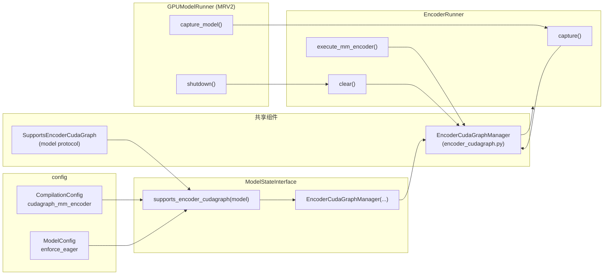
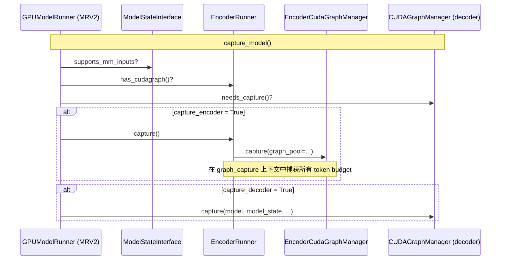

# PR #49852: [MRV2][Multimodal] Enable encoder cuda graph for model runner v2

> **作者**: @Isotr0py | **状态**: OPEN | **日期**: 2026-07-26
> **Branch**: `v2-encoder-cuda-graph` → `main` | **Labels**: `v1`, `nvidia`, `mrv2`
> **变更规模**: +96 -17 行，涉及 4 个文件

---

## 1. 总结 (Summary)

本 PR 将已有的 **Encoder CUDA Graph** 能力接入 **Model Runner V2（MRV2）** 的多模态编码路径。它不引入新的 graph 捕获算法，而是在 MRV2 的模块化架构中完成 `EncoderCudaGraphManager` 的初始化、捕获、执行与生命周期管理。核心改动包括：在 `ModelStateInterface` 中按配置条件创建 manager 并注入 `EncoderRunner`；在 `capture_model()` 中将 encoder 与 decoder 的 graph 捕获解耦；在 `execute_mm_encoder()` 中优先走 CUDA Graph 回放并在未捕获或不支持时回退 eager 模式。

---

## 2. 背景与动机 (Background & Motivation)

vLLM 已在 MRV1（`gpu_model_runner.py`）路径上通过 PR #35963 等引入了 ViT Encoder CUDA Graph 支持，基于 `SupportsEncoderCudaGraph` 协议和 `EncoderCudaGraphManager` 实现了 budget-based 图捕获与贪心装箱调度，显著降低多模态编码的 kernel launch 开销。

与此同时，**Model Runner V2**（`vllm/v1/worker/gpu/`）作为 MRV1 的重写版本，采用了更模块化的设计——`EncoderRunner` 独立负责多模态编码、`CUDAGraphManager` 显式管理 decoder graph 生命周期。但 MRV2 在合入本 PR 前，`EncoderRunner.execute_mm_encoder()` 始终调用 `model.embed_multimodal()` 的 eager 路径，无法复用已有的 encoder CUDA Graph 基础设施。

**本 PR 要解决的问题**：
- MRV2 多模态模型（如 Qwen3-VL）在开启 `cudagraph_mm_encoder` 时无法获得 ViT 编码加速；
- MRV2 的 `capture_model()` 仅以 decoder graph 是否需要捕获作为整体开关，导致「只需 encoder graph、decoder 不需要捕获」的场景被错误跳过；
- encoder graph 资源在 worker shutdown 时未被释放。

---

## 3. 代码修改分析 (Code Change Analysis)

### 3.1 修改的模块

| 文件 | 操作 | 说明 |
|------|------|------|
| `vllm/v1/worker/gpu/model_states/interface.py` | 修改 | 在 `ModelStateInterface.__init__` 中按条件创建 `EncoderCudaGraphManager` 并注入 `EncoderRunner` |
| `vllm/v1/worker/gpu/mm/encoder_runner.py` | 修改 | 新增 `capture()` / `clear()` / `has_cudagraph()`；`execute_mm_encoder()` 接入 CG 执行路径 |
| `vllm/v1/worker/gpu/model_runner.py` | 修改 | `capture_model()` 解耦 encoder/decoder 捕获逻辑；`shutdown()` 释放 encoder graph |
| `vllm/v1/worker/encoder_cudagraph.py` | 修改 | 新增 `is_captured()` 方法，用于运行时判断 graph 是否已全部捕获 |

### 3.2 架构 / 流程图 (Architecture / Flow Diagram)

#### 模块依赖关系



#### 启动阶段：Graph 捕获流程



#### 推理阶段：Encoder 执行路径

```mermaid
flowchart TD
    A["execute_mm_encoder(mm_kwargs)"] --> B["group_and_batch_mm_kwargs()"]
    B --> C{每个 modality batch}
    C --> D{cudagraph_manager 存在<br/>且 is_captured()<br/>且 supports_modality()?}
    D -->|是| E["cg_manager.execute(mm_kwargs_batch)"]
    D -->|否| F["model.embed_multimodal(**mm_kwargs_batch)"]
    E --> G["sanity_check_mm_encoder_outputs()"]
    F --> G
    G --> H["encoder_outputs"]
```

### 3.3 关键实现细节 (Key Implementation Details)

**`model_states/interface.py` — Manager 创建条件**

```python
enable_encoder_cuda_graph = (
    not self.model_config.enforce_eager
    and vllm_config.compilation_config.cudagraph_mm_encoder
    and supports_encoder_cudagraph(model)
)
```

三个条件同时满足时才创建 `EncoderCudaGraphManager`，并通过 `cast(SupportsEncoderCudaGraph, model)` 传入 manager。manager 作为可选参数注入 `EncoderRunner`。

**`encoder_runner.py` — 捕获与执行**

- `capture()`：在 `graph_capture(device=...)` 上下文中调用 `manager.capture(graph_pool=current_platform.graph_pool_handle())`，与 MRV1 路径保持一致的 graph pool 共享策略。
- `execute_mm_encoder()`：对每个 modality batch，先检查 manager 是否存在、`is_captured()` 为真、且 `supports_modality(modality)`；三者均满足时调用 `cg_manager.execute()`，否则回退 `embed_multimodal()`。
- `clear()`：shutdown 时调用 `cudagraph_manager.clear()` 释放 graph 和 pool。

**`model_runner.py` — 捕获逻辑解耦**

原逻辑：`if not self.cudagraph_manager.needs_capture(): skip`

新逻辑：
- `capture_encoder = supports_mm_inputs and encoder_runner.has_cudagraph()`
- `capture_decoder = cudagraph_manager.needs_capture()`
- 仅当两者均为 False 时才跳过捕获

这修复了「encoder 需要 graph 但 decoder 不需要（如 `cudagraph_mode=NONE` + `cudagraph_mm_encoder=True`）」时整体跳过捕获的问题。

**`encoder_cudagraph.py` — `is_captured()`**

遍历 `path_token_budgets` 中所有配置的 budget，检查每个 budget 是否已在 `budget_graphs[path]` 中完成捕获（`token_budget <= 0` 视为无需捕获）。运行时以此 gate 决定是否走 CG 路径，避免 capture 未完成时误用未初始化的 graph。

---

## 4. 涉及的技术原理 (Technical Principles)

### 4.1 Model Runner V2 架构

MRV2 位于 `vllm/v1/worker/gpu/`，与 MRV1 共享 Scheduler 和 KV Cache 接口，但在 Worker 侧采用模块化设计：`EncoderRunner` 负责多模态编码、`CUDAGraphManager` 显式管理 decoder graph、`ModelStateInterface` 封装模型状态与 encoder 组件。本 PR 是在此架构下「补齐」encoder CUDA Graph 集成，而非重新实现 graph 机制。

### 4.2 Encoder CUDA Graph（已有基础设施）

Encoder CUDA Graph 的核心设计（由 #35963 等 PR 引入）：
- **Token Budget 策略**：预定义若干 budget 级别，输入不足时 padding 至固定大小后 capture/replay；
- **贪心装箱**：按 token 数升序排列图片，选择最小满足 budget 的 graph 批量回放；
- **`SupportsEncoderCudaGraph` 协议**：模型实现 9+ 个方法（配置、dummy input、replay buffer、forward 等），manager 完全模型无关。

本 PR 复用 `vllm/v1/worker/encoder_cudagraph.py` 中的 `EncoderCudaGraphManager`，不修改其核心 capture/execute 算法。

### 4.3 CUDA Graph 捕获上下文

`EncoderRunner.capture()` 使用 `vllm.distributed.parallel_state.graph_capture` 上下文管理器，确保在分布式环境下 capture 期间各 rank 同步，并使用 `current_platform.graph_pool_handle()` 共享 graph memory pool——与 MRV2 decoder graph 捕获和 MRV1 encoder graph 捕获保持一致。

### 4.4 Encoder / Decoder Graph 独立生命周期

MRV2 的设计哲学是将 decoder CUDA Graph（由 `CUDAGraphManager` 管理）与 encoder CUDA Graph（由 `EncoderCudaGraphManager` 管理）作为两个独立子系统。本 PR 在 `capture_model()` 和 `shutdown()` 中分别处理两者的捕获与释放，互不干扰。

---

## 5. 评论区讨论亮点 (Discussion Highlights)

本 PR 目前 **无 issue 评论和 inline review 评论**。唯一的 review 来自 `claude[bot]`，说明该 PR 来自 fork 仓库，自动化 code review 默认禁用，需 maintainer 评论 `@claude review` 触发。

**Reviewer 请求情况**：
- 已请求 @njhill、@yewentao256、@WoosukKwon、@shen-shanshan 审查
- Assignee: @shen-shanshan
- 尚无 Approved 状态的 review

**CI 状态**（来自 PR metadata）：
- `mergeable_state`: **unstable**（CI 可能未全部通过或存在 flaky check）
- `rebaseable`: false（可能需要 rebase main）

---

## 6. 风险与潜在问题 (Risk Analysis)

| 风险 | 严重程度 | 说明 |
|------|---------|------|
| **Encoder-only 捕获时的内存峰值** | Medium | `capture_model()` 现在可能在不捕获 decoder graph 的情况下单独捕获 encoder graph（或反之），两种 graph 的显存占用叠加时的峰值行为需要验证，尤其在多 budget 配置下。 |
| **`is_captured()` gate 与 partial capture** | Low | 若 capture 过程中某个 budget 失败但 manager 未抛异常，`is_captured()` 返回 False 会静默回退 eager，功能正确但可能掩盖 capture 失败根因。 |
| **MRV1/MRV2 行为一致性** | Medium | MRV1 的 encoder CG 集成在 `gpu_model_runner.py` 中，MRV2 在 `EncoderRunner` 中。两条路径的 fallback 条件、DP 分片、FlashInfer bucket 覆盖等行为是否完全一致，需端到端对比验证。 |
| **测试覆盖依赖已有测试** | Low | PR 未新增测试文件，仅依赖 `tests/models/multimodal/generation/test_vit_cudagraph.py`。该测试是否覆盖 MRV2 路径（`VLLM_USE_V2=1` 或等价 flag）需确认。 |
| **Shutdown 顺序** | Low | `shutdown()` 中 `encoder_runner.clear()` 在 `del self.model_state` 之前调用，顺序合理；但若 `model_state` 已被部分销毁，需确保 `hasattr` 检查足够。 |
| **Rebase 冲突风险** | Low | PR 基于 fork，`rebaseable: false`，MRV2 目录持续演进可能导致合入前需要 rebase 并解决冲突。 |

---

## 7. 结论 (Conclusion)

PR #49852 是一个 **精准、小范围的集成 PR**（+96 -17 行，4 文件），将已有的 Encoder CUDA Graph 基础设施正确接入 MRV2 的模块化架构。改动逻辑清晰：条件化创建 manager、解耦 encoder/decoder 捕获开关、运行时 gate + eager fallback、shutdown 资源释放。作为 MRV2 多模态性能补齐的关键一环，合入后 MRV2 路径下的 ViT 编码将可获得与 MRV1 相同的 CUDA Graph 加速。主要待确认项是 MRV2 专用测试覆盖和 CI 稳定性；建议 reviewer 重点验证「仅 encoder graph、decoder eager」以及「encoder + decoder 同时 capture」两种配置下的正确性与显存行为。
