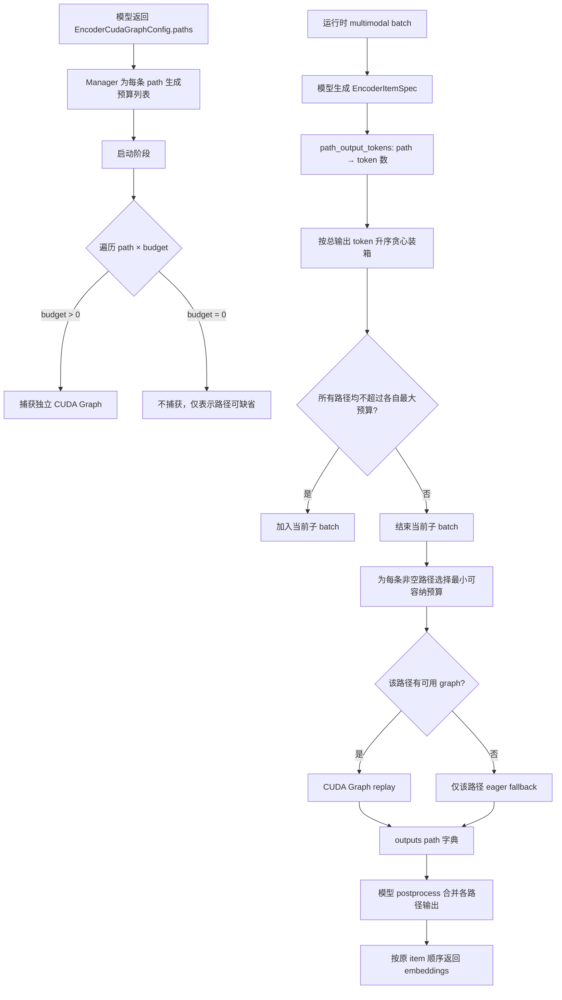

# PR #49934: [1/N] Unify multiple-path encoder cuda graph support

> **作者**: @Isotr0py | **状态**: OPEN | **日期**: 2026-07-27
> **Branch**: `multi-path-ecg` → `main` | **Labels**: `documentation`, `v1`, `deepseek`, `nvidia`
> **变更规模**: +189 -382 行，涉及 7 个文件、3 个提交

---

## 1. 总结 (Summary)

本 PR 将多模态 Encoder CUDA Graph 管理器中针对 `global/local` 双路径的硬编码，重构为由模型声明的通用多路径机制。核心做法是引入 `EncoderCudaGraphPathConfig` 和 `paths` 映射，以统一的逐路径预算生成、贪心装箱、独立 graph/eager 执行和字典化后处理流程，同时迁移 DeepSeek-OCR 与 Step3-VL。该改动是从较大的 #49432 中拆出的系列 PR 第 1 部分，重点在架构解耦，而非引入新的性能算法。

---

## 2. 背景与动机 (Background & Motivation)

现有 Encoder CUDA Graph 已支持 DeepSeek-OCR 等具有两条视觉编码路径的模型，但 Manager 直接理解 `global`、`local`、`enable_dual_path_graph`、`global_token_per_image` 和 `local_token_per_patch` 等模型语义。这会带来两个问题：

- Manager 与 DeepSeek-OCR/Step3-VL 的具体双塔结构耦合，新模型若有不同路径名称或超过两条路径，需要继续增加特殊分支。
- 单路径与双路径分别维护 `_execute_local_single_path()` 和 `_execute_local_dual_path()`，预算选择、回退、输出重排等逻辑大量重复。

本 PR 将“有哪些可独立 capture/replay 的路径、每条路径的最小预算、该路径是否允许零 token”下沉为模型配置；Manager 只遍历抽象路径，不再感知全局图、局部 patch 等业务含义。

---

## 3. 代码修改分析 (Code Change Analysis)

### 3.1 修改的模块

| 模块 / 文件 | 操作 | 说明 |
|---|---|---|
| `vllm/v1/worker/encoder_cudagraph_defs.py` | 修改 | 新增 `EncoderCudaGraphPathConfig`；将 `EncoderItemSpec` 的 global/local token 字段替换为通用 `path_output_tokens`；`EncoderCudaGraphConfig` 改用 `paths` |
| `vllm/v1/worker/encoder_cudagraph.py` | 重构 | 用统一多路径预算、capture 和执行循环替代单路径/双路径两套实现，净删除约 200 行重复逻辑 |
| `vllm/model_executor/models/interfaces.py` | 修改 | `postprocess_encoder_output` 从单个主输出和可选 local 输出改为 `outputs: dict[str, Tensor]` |
| `vllm/model_executor/models/deepseek_ocr.py` | 迁移 | 声明 `global`/`local` 路径配置，提供逐路径 token 数，并适配字典化后处理接口 |
| `vllm/model_executor/models/step3_vl.py` | 迁移 | 与 DeepSeek-OCR 类似，迁移双路径配置、item spec 和输出后处理 |
| `tests/v1/cudagraph/test_encoder_cudagraph.py` | 小幅修改 | 测试辅助 Manager 显式初始化默认路径预算；未增加新的多路径行为测试 |
| `docs/design/cuda_graphs_multimodal.md` | 更新 | 将 Dual-Path 设计文档改写为 Multi-Path，说明逐路径预算、零 token、部分 eager fallback 和新接口 |

### 3.2 架构 / 流程图 (Architecture / Flow Diagram)

### 3.3 关键实现细节 (Key Implementation Details)

**配置与数据模型**

- 新增不可变数据类 `EncoderCudaGraphPathConfig`：
  - `min_token_budget: int | None`：该路径的最小捕获预算；为空时复用模型默认预算列表。
  - `allow_zero_tokens: bool`：该路径在某个 batch 中是否可完全缺省。
- `EncoderCudaGraphConfig.paths` 默认为 `{"default": EncoderCudaGraphPathConfig()}`，因此普通单路径模型无需额外适配配置。
- `EncoderItemSpec.path_output_tokens` 取代固定的 `global_output_tokens` / `local_output_tokens`；`get_path_output_tokens("default")` 对空映射回退到原有 `output_tokens`，保留单路径行为。

**预算生成与图捕获**

- Manager 初始化时要求 `paths` 非空，并为每条路径生成 `path_token_budgets`。
- 若路径给出 `min_token_budget`，使用幂次增长策略生成到全局 `max_budget` 的列表；配置非法（≤0 或超过最大预算）时直接报错。
- `allow_zero_tokens=True` 会在预算列表中加入 `0`，但 capture 阶段明确跳过零预算图。零预算只表达“当前 batch 不执行该路径”。
- `get_num_graphs_to_capture()` 改为统计所有路径中的正预算数量。

**统一贪心装箱**

- 删除 `_execute_local_single_path()` 与 `_execute_local_dual_path()`，由 `_execute_local()` 同时处理单路径和任意多路径。
- 每个 item 对每条路径贡献独立 token 数；只有在 item 数未超限且所有路径累计 token 均未超过各自最大预算时，才加入当前子 batch。
- 子 batch 固定后，为每条路径独立选择最小 fitting budget。零 token 路径跳过；找不到预算的路径单独 eager；其他路径仍可 replay，实现通用 partial fallback。
- 各路径结果收集到 `graph_outputs: dict[str, Tensor]`，再由模型负责按自身语义组合。

**模型迁移**

- DeepSeek-OCR 与 Step3-VL 都声明：
  - `global`：最小预算为每张全局图的输出 token 数。
  - `local`：最小预算为每个局部 patch 的输出 token 数，并允许零 token。
- 两个模型的后处理入口均从 `(output, local_output=None)` 改为 `outputs` 字典，并对存在 local patch 却缺少 local 输出的情况增加断言。

**接口兼容**

- 默认 Protocol 实现读取 `outputs["default"]` 并调用 `scatter_output_slices`，维持普通单路径模型的后处理语义。
- 这是 vLLM 内部模型协议的签名变更；仓库内实现需要同步迁移，第三方 out-of-tree 模型若实现该接口也必须更新。

---

## 4. 涉及的技术原理 (Technical Principles)

### 4.1 CUDA Graph 与固定缓冲区

CUDA Graph 将一段 GPU 操作捕获后重复 replay，可减少 Python、CPU 调度和 kernel launch 开销。Replay 要求参与图的张量地址和主要执行结构保持稳定，因此 vLLM 会按 token budget 预先捕获多张固定形状的图，运行时把实际输入复制进对应的固定 buffer。

### 4.2 多路径视觉 Encoder

DeepSeek-OCR 和 Step3-VL 的视觉处理并非单一 encoder 调用：一条路径处理全局缩放图，另一条路径处理高分辨率切出的局部 patch。两条路径的 batch 维度、输入 buffer 和 token 增长规律不同，因此需要独立 capture 和预算选择；最终由模型把局部网格、全局特征及分隔 token 重新组装成每张图的 embedding。

### 4.3 多约束贪心装箱

每条路径相当于一个独立容量约束。Manager 按 item 总输出 token 从小到大排序，再尝试把 item 放入当前子 batch；只有全部路径都不溢出才接受。子 batch 确定后，每条路径选择最小可容纳的图，以减少 padding 浪费。该策略实现简单且倾向于减少 oversized fallback，但它不是一般多维 bin-packing 的全局最优算法。

### 4.4 Partial Fallback

多路径独立执行允许某一路径命中 CUDA Graph、另一路径因超预算改用 eager，而不必让整个视觉 encoder 一起回退。零 token 路径则完全跳过。这既避免为不存在的 patch 做无效计算，也让路径规模分布不均时仍能保留部分 CUDA Graph 收益。

---

## 5. 评论区讨论亮点 (Discussion Highlights)

截至 2026-07-29，PR 尚无人工 inline review 或正式 approval：

- 作者说明该改动从 #49432 拆分，以避免在单个 PR 中混入过大的设计调整；标题中的 `[1/N]` 表明后续仍有系列改动。
- PR 已请求 @njhill 审查，并由作者抄送 @shen-shanshan。
- Claude 自动 review 因 PR 来自 fork 而未运行，仅提示维护者可手动触发。
- Mergify 提供了文档预览链接，但没有给出设计反馈。
- PR 描述中的 **Test Plan** 和 **Test Result** 仍为空，模板检查项也尚未勾选；提交历史包含 `revert test`、`fix test`，但无法据此确认实际运行了哪些测试或结果是否通过。

---

## 6. 风险与潜在问题 (Risk Analysis)

| 风险 | 严重程度 | 说明 |
|---|---|---|
| 多路径行为缺少针对性测试 | High | 测试文件只为辅助对象补充 `path_token_budgets={"default": ...}`，未看到覆盖 3+ 路径、某路径零 token、混合 graph/eager、非法路径配置、输出顺序恢复等新逻辑的测试。PR 也未提供 Test Plan/Result。 |
| 内部模型协议签名兼容性 | Medium | `postprocess_encoder_output` 和 `EncoderItemSpec` 字段发生不兼容变更；仓库外插件或下游模型实现仍使用 `local_output`、`global_output_tokens` 时会失败。 |
| 路径 token 声明错误导致静默错误 | Medium | Manager 完全依赖模型提供的 `path_output_tokens`。遗漏路径名时 `get(..., 0)` 会将该路径视为零 token并跳过，可能直到后处理断言或输出错误时才暴露。 |
| 多约束贪心并非全局最优 | Medium | 按总 token 排序不能保证多维容量下最少的 batch/replay 数；路径负载高度偏斜时可能产生较多拆包或 padding，需用真实分辨率分布验证性能。 |
| 统计口径可能弱化诊断 | Low | 仅当所有非空路径都 eager 时才按 item 增加 `graph_misses`；部分路径 fallback 不计为 miss，命中率日志可能高估实际 graph 覆盖程度。 |
| 空路径配置直接启动失败 | Low | 新代码要求 `config.paths` 非空。默认配置安全，但模型若显式传入空字典会在 Manager 初始化时报错；需要在接口文档和测试中明确。 |
| 系列 PR 的中间状态 | Medium | 本 PR 标记为 `[1/N]` 且从 #49432 拆分，需确认单独合入后所有调用方均完整适配，不依赖后续 PR 才能保证功能或性能。 |
| 缺少性能与显存数据 | Medium | 重构改变了装箱和逐路径执行的公共路径，但没有 before/after benchmark、graph 数量、capture 时间或显存开销结果，无法确认行为等价且无性能回退。 |

---

## 7. 结论 (Conclusion)

该 PR 的方向合理：它删除了 Manager 对 global/local 双路径的模型特定认知，并把单路径与多路径统一到可扩展的配置和执行框架中，代码量也明显下降。当前主要阻碍不是设计意图，而是验证证据不足；在补充多路径边界测试、DeepSeek-OCR/Step3-VL 端到端结果及性能对比，并完成核心维护者审查后，才适合判断是否可合入。
