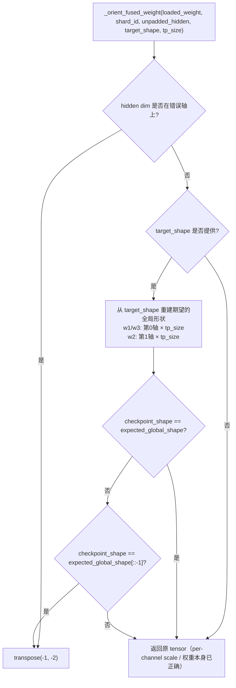
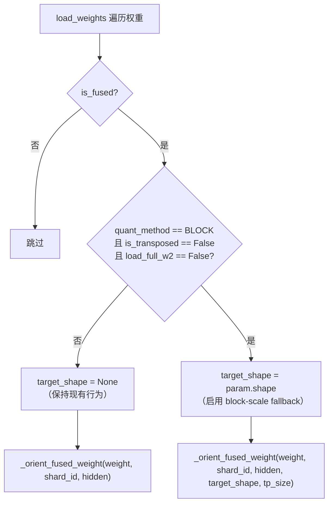

# PR #50727: [Bugfix][MoE] Fix fused block-scale orientation

> **作者**: @AndreasKaratzas | **状态**: OPEN | **日期**: 2026-08-02
> **Branch**: `akaratza_fix_fused_block_scales` → `main` | **Labels**: `bug`, `ready`
> **变更规模**: +125 -5 行，涉及 2 个文件

---

## 1. 总结 (Summary)

本 PR 修复了 fused MoE 权重加载中 block-scale 张量方向判断错误的 bug。PR #50137 曾通过 hidden dimension 来判定 fused tensor 的方向，但 block-scale 的两个维度都被量化 block size 除过，hidden dimension 信号已丢失，导致 Qwen 系列模型的 fused gate/up 和 down-projection scale 被加载为错误的方向，引发 AMD CI 中的大模型精度验收失败。本 PR 引入目标参数形状作为窄义的 fallback 机制，仅在 checkpoint 形状与期望形状严格互为转置时才执行 transpose，同时保持 per-channel scale 的现有行为不变。

## 2. 背景与动机 (Background & Motivation)

vLLM 的 fused MoE 层支持将 w1 和 w3（gate 和 up projection）的权重及 scale 合并存储在同一个 fused tensor 中。由于不同 checkpoint 格式可能以 (intermediate, hidden) 或 (hidden, intermediate) 两种方向存储，`_orient_fused_weight` 方法负责在加载时将 tensor 统一为规范方向。

PR #50137 的修复思路是：**利用 hidden dimension 的大小来判断方向** —— 如果 hidden dim 出现在了错误的轴上，就执行 transpose。这对 per-channel scale（形状为 `(2 * intermediate, 1)`，hidden dim 为 1）和权重本身（形状为 `(2 * intermediate, hidden)`，hidden dim 明确）都有效。

但 **block-scale** 的情况不同：block-scale 的形状为 `(experts, 2 * intermediate // block_size, hidden // block_size)`，两个维度都除以了 block size。此时 hidden dim 不再直接出现在 shape 中，导致 #50137 的启发式规则无法判断方向。

**具体影响**：Qwen3-VL 等模型的 checkpoint 中 block-scale 以权重方向存储（如 w1 scale 为 `(2*intermediate//block, hidden//block)`），而 vLLM 内部期望 w1 的方向为 `(hidden//block, 2*intermediate//block)`。由于方向判断失败，scale 未被 transpose，导致后续计算使用了错误方向的 scale，引发精度问题。

实际触发场景是 [AMD CI 的 large-model acceptance test 失败](https://buildkite.com/vllm/amd-ci/builds/11556/list?sid=019fbc8d-6c30-4005-b988-abe526a8ec8e&tab=output)。

## 3. 代码修改分析 (Code Change Analysis)

### 3.1 修改的模块

| 文件 | 操作 | 说明 |
|------|------|------|
| `vllm/model_executor/layers/fused_moe/routed_experts.py` | 修改 (+43/-4) | 核心修复：`_orient_fused_weight` 新增 `target_shape`/`tp_size` 参数和 block-scale fallback 逻辑；`load_weights` 中仅在 canonical BLOCK 参数时传入 target shape |
| `tests/kernels/moe/test_moe_weight_loading_padded.py` | 修改 (+82/-1) | 新增 4 个测试用例，覆盖 TP1/TP2、padded、square 等场景 |

### 3.2 架构 / 流程图 (Architecture / Flow Diagram)

#### `_orient_fused_weight` 决策流程



#### `load_weights` 中的 target_shape 传入条件



### 3.3 关键实现细节 (Key Implementation Details)

**核心修复：`_orient_fused_weight` 新增 block-scale fallback**

- 新增 `target_shape: torch.Size | None` 和 `tp_size: int = 1` 两个可选参数，保持向后兼容。
- 当 hidden-dimension 启发式规则无法判断方向时（即 block-scale 场景），进入 fallback 逻辑：
  1. 从 `target_shape[-2:]` 重建 **全局期望形状**：w1/w3 在第一维乘 `tp_size`，w2 在第二维乘 `tp_size`（因为 fused checkpoint tensor 包含全局 intermediate dimension，而 target param 是 TP-local 的）。
  2. 仅当 checkpoint 的 shape **与期望形状严格互为转置**时才 transpose。
  3. 若 checkpoint 形状与期望形状完全相同，或 padded/square 导致两者既不相同也不互为转置，则不做任何操作。

- 这种"严格互为转置"的检查是刻意的保守设计：padded、square、或其他歧义布局不会被猜测，避免引入更隐蔽的错误。

**调用侧：`load_weights` 中的条件启用**

- 仅在以下条件**全部满足**时才传入 `target_shape`：
  - `param.quant_method == FusedMoeWeightScaleSupported.BLOCK.value` — 只处理 canonical block-scale
  - `param.is_transposed == False` — 转置存储的格式保持现有行为
  - `param.load_full_w2 == False` — 完整 W2 加载场景不受影响
- 这确保了 GROUP、WNA16、transposed storage 等非 canonical 格式**不受影响**，最小化修复的 blast radius。

**测试覆盖**

- `test_block_scale_is_untouched`: 更新为传入 `target_shape`，验证同形状不触发 transpose
- `test_padded_target_does_not_guess_block_scale_orientation`: padded 目标（两维都被 pad）不应触发 transpose，因为无法确定方向
- `test_square_target_does_not_guess_orientation`: 方形目标不应触发 transpose，保证 `data_ptr` 不变
- `test_qwen3_vl_transposed_block_scale_matches_target`: 参数化测试 Qwen3-VL 风格的 w1/w2 block-scale 在 TP=1 时正确 transpose 到目标形状
- `test_qwen3_vl_transposed_block_scale_matches_tp_shard`: 参数化测试 TP=2 场景，验证按 TP shard 正确重建全局形状并 transpose

## 4. 涉及的技术原理 (Technical Principles)

### 4.1 Fused MoE 权重加载

vLLM 的 fused MoE 层将多个 expert 的 w1（gate）和 w3（up）权重合并为一个 `(experts, 2 * intermediate, hidden)` 的 fused tensor，加载时再按 expert 维度切分。不同 checkpoint 格式可能以不同方向存储此 tensor，因此 `_orient_fused_weight` 需要在加载前规范化方向。

### 4.2 Block-Scale 量化

Block-scale 量化将权重矩阵按 block（如 128×128）分组，每组共享一个 scale factor。对于 fused MoE 权重，block-scale 的形状为 `(experts, 2 * intermediate // block_size, hidden // block_size)`。由于两个空间维度都除以了 block_size，hidden dimension 的大小信息丢失。

### 4.3 Tensor Parallelism（TP）对权重形状的影响

在 TP 模式下，w1/w3 沿 intermediate 维度切分（dim=1），w2 沿 intermediate 维度切分（dim=0）。因此每个 TP rank 看到的本地 param 形状是全局形状按 `tp_size` 缩小后的结果。但 checkpoint 中存储的是全局 fused tensor，因此需要从 TP-local 的 target_shape 反推全局形状再做比较。

### 4.4 为什么选择"严格互为转置"作为判断条件

在 block-scale 场景下，两个维度都除以了 block size，无法直接从数值判断谁是 hidden dim、谁是 intermediate dim。唯一可用的信号是 checkpoint 形状与期望形状的 **相对关系**：
- 如果形状相同 → 方向正确，无需 transpose
- 如果形状严格互为转置 → 方向错误，需要 transpose
- 其他情况（如 padded 导致两维不同但也不互为转置、方形导致转置后形状相同无法区分）→ 无法判断，不做任何操作

这种保守策略避免了在信息不足时做出错误猜测。

## 5. 评论区讨论亮点 (Discussion Highlights)

该 PR 目前尚无 review comments 和 issue comments（仅有 Claude Code Review bot 的自动评论）。Review 请求已发送给 @mgoin、@tlrmchlsmth、@WoosukKwon、@yewentao256、@zyongye、@pavanimajety 六位 reviewer。

## 6. 风险与潜在问题 (Risk Analysis)

| 风险 | 严重程度 | 说明 |
|------|---------|------|
| **target_shape 条件覆盖面不足** | Medium | `can_match_block_target` 条件排除了 `is_transposed`、`load_full_w2` 等非 canonical 格式，但这些格式中也可能存在 block-scale 方向问题。若未来有新模型使用这些格式且 checkpoint 方向不一致，修复不会生效。 |
| **方形 block-scale 无法判断方向** | Low | 当 `intermediate // block_size == hidden // block_size` 时（方形 block-scale），转置后形状相同，无法判断是否需要 transpose。当前实现不做任何操作（conservative），不会引入错误但也不会修复。实际场景中两个维度相等的情况极少。 |
| **padded 目标形状的静默跳过** | Low | 当 target_shape 被 padding 后，checkpoint 形状可能既不完全匹配也不严格互为转置，此时 fallback 静默跳过。这在当前设计中是刻意的安全策略，但意味着 padded 模型仍需依赖 hidden-dimension 启发式规则（已被证明对 block-scale 无效）。 |
| **TP > 2 的全局形状重建** | Low | 全局形状重建逻辑 `expected_global_shape[tp_shard_axis] *= tp_size` 假设均匀切分，适用于大多数场景。但若 checkpoint 本身的 fused tensor 已经做过特殊处理（如非均匀切分），该假设可能不成立。实际 vLLM 中不会出现此类场景。 |
| **测试仅覆盖 Qwen3-VL 风格的方向** | Low | 测试仅验证了 Qwen3-VL 的 checkpoint 方向模式（w1 scale: `(2I//B, H//B)` → `(H//B, 2I//B)`），未覆盖其他可能的反向存储格式。不过 fallback 的"严格互为转置"逻辑是对称的，对称性保证了两种方向都能正确处理。 |

## 7. 结论 (Conclusion)

PR #50727 是一个精准的 bugfix，通过引入目标参数形状作为 block-scale 方向判断的 fallback 机制，修复了 PR #50137 留下的 block-scale 方向判断盲区。代码改动量小（+125/-5），测试覆盖全面（TP1/TP2、padded、square、Qwen3-VL 风格），且通过条件守卫确保了非 canonical 量化格式不受影响。设计上刻意保守（仅在形状严格互为转置时才执行操作），避免了在信息不足时做出错误猜测。等待 reviewer 批准后即可合入。

---

## 8. Review 意见 (Review Suggestions)

以下是对本 PR 代码 diff 的详细审查意见，供 reviewer 参考：

### 8.1 `can_match_block_target` 条件中 GROUP/WNA16 的排除不够显式

```python
can_match_block_target = (
    getattr(param, "quant_method", None)
    == FusedMoeWeightScaleSupported.BLOCK.value
    and not getattr(param, "is_transposed", False)
    and not getattr(param, "load_full_w2", False)
)
```

PR 描述提到 GROUP 和 WNA16 也应保持现有行为，但代码中并未显式检查。目前依赖 `quant_method != BLOCK` 隐式排除。**建议在注释中明确说明 GROUP/WNA16 的 `quant_method` 值不等于 `BLOCK`，因此被第一个条件自动排除**，避免 reviewer 误以为遗漏了显式守卫。

### 8.2 `tp_shard_axis` 与已有的 `hidden_axis`/`intermediate_axis` 存在逻辑重复

```python
# 原有的 hidden_axis / intermediate_axis 定义
if shard_id == "w2":
    hidden_axis, intermediate_axis = -2, -1
else:
    hidden_axis, intermediate_axis = -1, -2

# 新增的 tp_shard_axis 独立计算
tp_shard_axis = 1 if shard_id == "w2" else 0
```

`tp_shard_axis` 表达的是"intermediate 维在最后两维中的索引"，而 `intermediate_axis` 已经定义了 intermediate 在最后两维中的位置（-1 表示 index 1，-2 表示 index 0）。**建议统一使用已有的 `intermediate_axis` 来推导 `tp_shard_axis`**（即 `tp_shard_axis = intermediate_axis + 2`），减少重复逻辑，降低两个变量在后续维护中出现不一致的风险。

### 8.3 `target_shape[-2:]` 缺少维度数校验

```python
if target_shape is not None and len(target_shape) >= 2:
    expected_global_shape = list(target_shape[-2:])
```

目前仅检查 `len(target_shape) >= 2`，但未检查 `fused_weight` 是否也有 >= 2 维。如果 weight tensor 意外是 1D 的（几乎不可能，但作为防御性编程），`fused_weight.shape[-2:]` 会取到最后 1 维。**建议加 `len(fused_weight.shape) >= 2` 的 guard**，或在 docstring 中说明调用方保证 shape 维度。

### 8.4 TP > 2 场景缺少测试覆盖

当前测试只覆盖了 TP=1 和 TP=2，而修复逻辑 `expected_global_shape[tp_shard_axis] *= tp_size` 对任意 `tp_size` 都生效。**建议加一个 TP=4 或 TP=8 的参数化用例**，增强对非均匀切分等边界情况的信心。

### 8.5 测试中硬编码的 expected_shape

```python
expected_shape = (8, 12, 16) if shard_id == "w1" else (8, 16, 6)
```

这个值本质上是 `target_shape` 在 TP=1 时的值（即 transpose 后去掉了 TP 切分的效果）。**建议直接从参数推导**，例如将 `target_shape` 的转置作为期望值，提高可读性，也方便 reviewer 验证测试逻辑的正确性。

### 8.6 `can_match_block_target` 命名不够直观

这个变量描述的是"当前 param 是否满足启用 target_shape fallback 的条件"，但名字读起来像是"能否匹配 block target"。**建议改为 `is_canonical_block_param`**，语义更清晰：它是一个 canonical（非转置、非 full-W2、quant_method=BLOCK）的 block-scale 参数。

### 8.7 `quant_method` 属性缺失时的静默回退

```python
getattr(param, "quant_method", None) == FusedMoeWeightScaleSupported.BLOCK.value
```

如果某个 block-scale param 的 `quant_method` 意外未设置（为 None），条件为 False，`target_shape` 不会被传入，静默回退到 hidden-dimension 启发式规则。这对于 block-scale 来说必然失败（因为 hidden dim 信号缺失），但不会报任何错，可能导致**静默精度问题**。**建议在 `can_match_block_target` 为 False 但 param 实际上是 block-scale 时加一个 warning 日志**，或至少在 block-scale 路径失败时让 hidden-dimension 规则产生一个可观测的错误。

### 8.8 （minor）`load_weights` 中注释块的引用格式

```python
# PR #50137's hidden-axis heuristic cannot orient block
# scales because both dimensions are divided by the block
# size.
```

在代码中引用 PR 号是好的上下文，但建议也加上 `_orient_fused_weight` 方法名，方便 `git grep` 快速定位。

### Review 优先级总结

以上 8 条中，**第 2 条（逻辑重复）和第 7 条（静默回退）建议重点关注**，前者涉及代码可维护性，后者可能导致生产环境中难以排查的精度问题。其余属于代码质量和测试覆盖的提升建议，可根据作者时间和 reviewer 判断选择性采纳。
