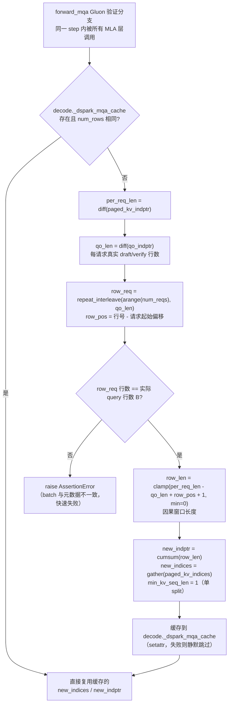
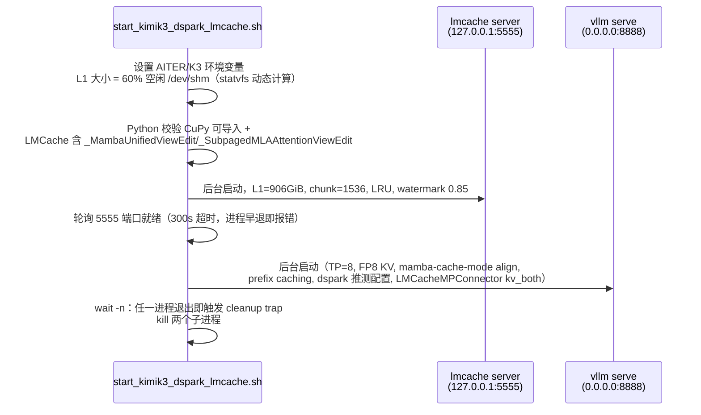

# PR #51004: [Rocm] Fix LMcache support issues for the kimik3-dspark model

> **Author**: @haic0 | **State**: OPEN | **Date**: 2026-08-04（最近更新 2026-08-25）
> **Branch**: `haic0:rocm-kimik3-dspark` → `vllm-project:main` | **Labels**: rocm, kv-connector, kimi, k3, dflash, documentation, verified
> **Changes**: +167 -37 across 2 files | **Assignee**: @shen-shanshan | **Reviewers**: @tjtanaa, @AndreasKaratzas

---

## 1. 总结 (Summary)

该 PR 修复了 ROCm 上 Kimi-K3 + DSpark 推测解码与 LMCache 离线方案的两类问题：(1) 在 `rocm_aiter_mla.py` 的 Gluon 多 token 验证路径中，原来假设所有请求的验证 query 长度统一为 `max_qo_len`，而 DSpark 每步每个请求产生的 draft token 数不同，导致 paged-KV 元数据按行展开时 request→row 映射错位，引发错误索引与 GPU 非法访问；修复方式是改为基于 `qo_indptr` 的真实逐请求 query 偏移做展开，并把展开结果缓存在 decode 元数据对象上供所有 MLA 层复用，同时将小头 Gluon 验证固定为单 split（`min_kv_seq_len=1`）避免 split-K 触发的非法内存访问。(2) 新增一个可复现的启动脚本 `start_kimik3_dspark_lmcache.sh`，一键拉起 LMCache server + vLLM（LMCacheMPConnector / SimpleCPUOffloadConnector 两种方案），并在 8x MI355X 上验证通过：2/2 请求成功，推测接受率 98.98%。

## 2. 背景与动机 (Background & Motivation)

Kimi-K3 是 Moonshot 的混合架构模型（Mamba + MLA），在 ROCm 上推理依赖 AITER 算子栈；DSpark 是其推测解码方案（draft 模型每次提出最多 2 个 token，验证阶段一次验证多个 token）。将 Kimi-K3 + DSpark 部署与 LMCache（KV 传输/前缀缓存）结合时暴露了两个问题：

1. **验证阶段 paged-KV 元数据展开错误**：DSpark 验证时每个请求的 query 行数（draft token 数 + 1）在每步之间是**可变且不均匀**的。原实现用 `qlen = decode.max_qo_len` 统一展开，`row_req = arange(num_reqs).repeat_interleave(qlen)` 假定每个请求恰好 `qlen` 行，行到请求的映射与实际 query batch 不一致，轻则验证结果错误，重则触发 GPU 非法内存访问（ILA）。
2. **LMCache 集成缺少可复现的部署方式**：Kimi-K3 的 KV cache 包含 Mamba state 与 subpaged MLA 两种视图，需要 LMCache ≥ 0.5.3 的 `_MambaUnifiedViewEdit` / `_SubpagedMLAAttentionViewEdit`；ROCm 下 GPU cache 注册路径依赖 CuPy；L1 池大小需按 `/dev/shm` 动态计算（过大的 pinned 池会触及 GPU-IPC 映射上限）。此前无脚本沉淀这些经验。

此外，小头（small-head）Gluon 验证模式下若 `min_kv_seq_len` 推导为 0，AITER 内部会选择 split-K 路径，实测会触发非法内存访问，需要与普通 decode 保持一致走单 split。

## 3. 代码修改分析 (Code Change Analysis)

### 3.1 修改的模块

| 文件 | 状态 | 说明 |
|------|------|------|
| `vllm/v1/attention/backends/mla/rocm_aiter_mla.py` | 修改 (+50/-37) | 抽出 `_expand_dspark_mqa_metadata()` 辅助函数；`forward_mqa` 的 Gluon 验证分支改用真实逐请求 qo 偏移展开，带缓存；`min_kv_seq_len` 固定为 1 |
| `examples/online_serving/start_kimik3_dspark_lmcache.sh` | 新增 (+117) | Kimi-K3 + DSpark + LMCache 一键启动脚本：AITER 环境变量、L1 池动态计算、LMCache 版本能力校验、server 就绪等待、进程清理 trap |

### 3.2 架构 / 流程图 (Architecture / Flow Diagram)

**元数据展开流程**（修复核心，`_expand_dspark_mqa_metadata`）：

**启动脚本进程编排**：

### 3.3 关键实现细节 (Key Implementation Details)

- **`_expand_dspark_mqa_metadata(decode, num_rows)`**（`rocm_aiter_mla.py:996`）：把原先内联在 `forward_mqa` 中的展开逻辑抽成模块级函数，核心变化：
  - 用 `decode.qo_indptr`（CSR 前缀和）计算**逐请求**的 `qo_len`，替换原先统一的 `qlen = int(decode.max_qo_len)`，`row_req` 按每请求实际行数 `repeat_interleave`，正确映射 verify 行→请求。
  - 行数一致性断言：`qo_indptr` 推导出的总行数与实际 query batch `B` 不符时抛出带诊断信息的 `AssertionError`，防止静默产生错误索引。
  - **跨层缓存**：展开结果 `(new_indices, new_indptr, min_kv_seq_len)` 以 `num_rows` 为 key 缓存在 `decode._dspark_mqa_cache` 上（`setattr` + try/except，元数据对象若无 `__dict__` 则静默退化为每层重算）。Kimi-K3 数十层 MLA 共享同一份 decode 元数据，缓存避免每层重复的 gather/cumsum 及 `int(new_indptr[-1].item())` 主机同步。
  - `min_kv_seq_len` 由原先的 `int(row_len.min())`（可为 0，触发 split-K）固定为 `1`，与普通 decode 单 split 路径一致，规避小头 Gluon 验证下 split-K 的非法内存访问（代码注释明确说明原因）。
- **`forward_mqa` Gluon 分支简化**（`rocm_aiter_mla.py:1332`）：删除 ~35 行内联展开代码，改为一次函数调用；`min_kv_seq_len` 直接使用返回值。
- **启动脚本要点**：
  - `LMCACHE_L1_SIZE_GB` 默认按 `statvfs("/dev/shm")` 空闲量的 60% 动态计算（注释说明避免 multi-TB pinned 池触及 GPU-IPC 映射上限），可用环境变量覆盖。
  - 启动前用 Python 校验 LMCache 具备 Kimi-K3 所需的两类 cache-view edit（Mamba 统一视图 + subpaged MLA 视图），缺则明确报错退出。
  - `trap cleanup EXIT INT TERM` + `wait -n`：任一进程退出即回收两个子进程。
  - vLLM 侧关键参数：`--mamba-cache-mode align`、`--kv-cache-dtype fp8`、`--enable-prefix-caching`、`--enforce-eager`，推测配置 `num_speculative_tokens=2, method=dspark, attention_backend=TRITON_MLA, rejection_sample_method=block`。

## 4. 涉及的技术原理 (Technical Principles)

- **DSpark 推测解码与多 token 验证**：draft 模型每步提议最多 2 个 token；验证阶段需要对「每个请求的每个验证 token」分别做因果 attention（第 t 个验证 token 只能看到 context + 前 t-1 个 draft token）。因此验证 batch 的 query 行数是**逐请求可变**的，这是原实现统一 `max_qo_len` 假设失效的根本原因。
- **Paged KV 的 CSR 表示**：`paged_kv_indptr`/`paged_kv_indices` 是分页 KV 的标准 CSR（压缩行）结构。把「每请求一段 KV」展开成「每验证行一个因果窗口」本质是 CSR 的二次展开：新 `indptr` 由逐行窗口长度 `row_len` 的 `cumsum` 得到，`indices` 由原表按 `row_req` 切片再 `gather` 得到；每行的窗口是请求 KV 切片的一个前缀（页内位置升序保证）。
- **MLA 与 Kimi-K3 混合架构**：MLA（Multi-head Latent Attention）把 KV 压缩为低秩 `kv_c` + 共享 `k_pe`，验证 kernel 消费展平后的 `kv_buffer`。Kimi-K3 同时含 Mamba 层与 MLA 层，KV cache 中存在 Mamba state 与 subpaged MLA 两种视图，LMCache 需通过 view edit 统一处理，否则跨请求传输/加载会视图错乱。
- **Gluon 小头验证与 split-K**：ROCm AITER 在 num_heads 较小（small-head）时使用 Gluon MLA kernel 做验证；`min_kv_seq_len=0` 会让 AITER 选择 split-K 路径，实测触发非法内存访问（ILA），因此与普通 decode 保持一致强制单 split。
- **LMCache MP Connector**：`LMCacheMPConnector` 通过 TCP 与独立 `lmcache server` 进程通信，L1 池基于 `/dev/shm`（SHM 传输），`kv_role=kv_both` 表示该实例同时作为 KV 生产者与消费者；ROCm 下 GPU cache 注册需要 CuPy。

## 5. 评论区讨论亮点 (Discussion Highlights)

- **mergify[bot]**（2026-08-04）：生成文档预览链接。
- **claude[bot]**（2026-08-04）：因 PR 来自 fork，自动代码审查被禁用，提示 maintainer 可评论 `@claude review` 触发一次性审查。
- **mergify[bot]**（2026-08-25，最新）：**pre-commit 检查失败**，要求运行 `pre-commit run --all-files` 后重新推送——这是当前合并阻塞项之一。
- 暂无人工 review 评论（`review_comments` 为空），两位请求的 reviewer 尚未给出意见；PR 状态为 `mergeable_state: unstable`、`rebaseable: false`，与 main 存在冲突需 rebase。

## 6. 风险与潜在问题 (Risk Analysis)

| 风险 | 严重程度 | 说明 |
|------|---------|------|
| 缓存一致性：`_dspark_mqa_cache` 以 `num_rows` 为 key 挂在 decode 元数据对象上 | Medium | 若 vLLM V1 的 decode 元数据对象存在跨 step 复用/池化（而非每 step 新建），相同 `num_rows` 但内容不同的情况会命中脏缓存。当前 V1 实现中 metadata 一般按 step 生成，但值得 reviewer 确认 `AiterMLADecodeMetadata` 的生命周期 |
| `min_kv_seq_len=1` 对空行（row_len=0）的语义 | Medium | 旧代码传 `int(row_len.min())`，在有 0 长行的 batch 中为 0。固定为 1 后，若 Gluon 单 split 路径对长度 0 行的处理与注释所述不一致（cudagraph padding 请求仍会 clamp 出 0 行），需要实测确认无越界；PR 的 benchmark（2 请求）未覆盖 padding/多请求混合场景 |
| 缺少单元测试 | Medium | `_expand_dspark_mqa_metadata` 是纯张量逻辑（可由 `qo_indptr`/`paged_kv_indptr` 完全确定），可脱离 GPU 用 CPU tensor 单测：变长 qo、0 长度请求、行数断言分支均未覆盖 |
| 合并阻塞：pre-commit 失败 + 需 rebase | Medium | mergify 已报 pre-commit 失败；`rebaseable: false` 且 `mergeable_state: unstable`，需先修复格式并解决与 main 的冲突 |
| 正确性验证仅 2 条请求 | Low | 98.98% 接受率与 0 失败来自 2 prompt × 8192/1024 的 benchmark，未能覆盖长会话、多请求并发（max-num-seqs=8 未跑满）、prefix cache 命中后的 offload/load 路径 |
| 脚本环境假设 | Low | 硬编码端口 5555/8080/8888 无冲突检测；`python`（非 `python3`）调用；默认 `HF_HUB_CACHE=/models/huggingface_hub` 为特定机器约定（均可通过环境变量覆盖，`set -euo pipefail` 保证失败即退出） |
| 静默缓存失败 | Low | `setattr` 失败仅 `pass`，退化为逐层重算——功能正确但无告警，排障时不易察觉性能差异来源 |
| 兼容性影响面 | Low | 修改集中在 `rocm_aiter_mla.py`（ROCm 专用文件），不影响 CUDA 路径；辅助函数为模块级纯函数，无 API 变更 |

## 7. 结论 (Conclusion)

PR 修复思路正确：以真实逐请求 qo 偏移替换统一 `max_qo_len` 假设，配合跨层缓存与单 split 固定，直击 DSpark 变长验证在 ROCm Gluon 路径上的错位与非法访问问题，且提供了经 8x MI355X 实测验证的 LMCache 部署脚本，整体质量良好。当前主要工作项是修复 pre-commit、rebase 到 main，并建议补充 `_expand_dspark_mqa_metadata` 的单元测试与更多并发场景验证后再合并。
