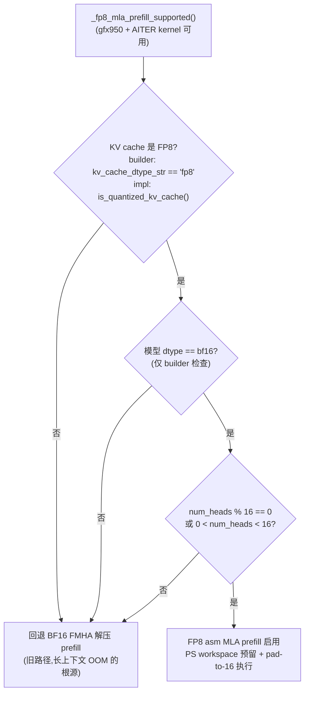
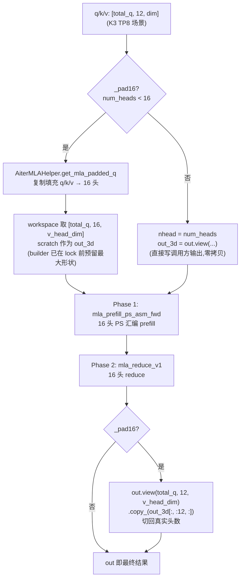
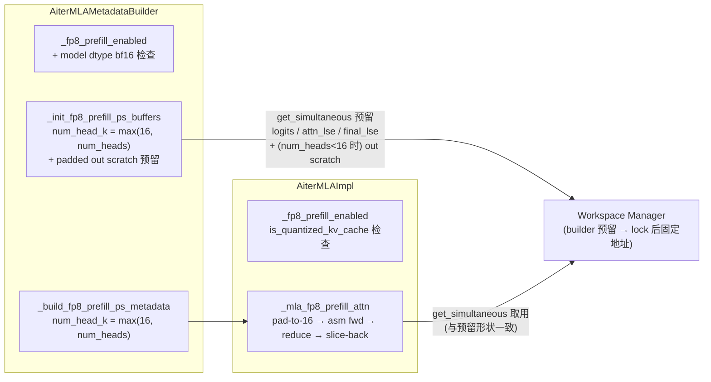

# PR #51040: [ROCm][K3] Extend FP8 asm MLA prefill to non-divisor small head counts

> **作者**: @xiaohuguo2023 | **状态**: OPEN | **日期**: 2026-08-04(最近更新 2026-08-26)
> **Branch**: `xguo/rocm-mla-fp8-prefill-independent` → `main` | **Labels**: `rocm`, `ready`, `verified`, `k3`
> **变更规模**: +85 -28 行,涉及 2 个文件(5 个 commit)

---

## 1. 总结 (Summary)

本 PR 将 AITER FP8 MLA **prefill** 汇编路径(`mla_prefill_ps_asm_fwd` + `mla_reduce_v1`)从"仅支持 16 对齐头数"扩展到 **0 < num_heads < 16 的非整除小头数**场景,是已合并的 #50578(decode 侧 pad 12→16)的 prefill 对应物。核心思路是利用 MLA 注意力按 query head 独立计算的特性,将 Q/K/V 复制填充到 16 头、以 16 头运行汇编 kernel 后再切回真实头数(数学上精确)。实测 Kimi-K3(TP8 下 12 heads/rank)长上下文 prefill 从 OOM ~197k tokens 提升到 470k/590k tokens 正常完成,同时 PS workspace 部分 tile 数从 ~4032 降至 ~960,节省约 6 GiB 显存。

---

## 2. 背景与动机 (Background & Motivation)

**问题链条**:

1. AITER 的 FP8 MLA prefill 汇编 kernel(`kn_mla_reduce_v1`)要求 `num_heads % 16 == 0`,不满足时 vLLM 自动回退到 BF16 FMHA 解压路径。
2. Kimi-K3 有 96 个头、`kv_lora_rank=512`,在 TP8 下每 rank 仅 **12 个头**——不是 16 的倍数,因此 K3 的 FP8 prefill 一直被排除在汇编路径之外。
3. 回退路径会构建一套 bf16 working set,**不受 FP8 KV pool 显存核算覆盖**,长上下文时耗尽 activation arena:实测 **~197k tokens 时 OOM,而此时 KV pool 使用率不到 4%**。

**为何 pad 到 16 是安全的**:MLA 中每个 query head 对共享的 latent KV 独立做注意力,彼此之间没有交叉依赖。因此把 query heads 从 12 复制填充到 16、计算完再切回前 12 个头,结果是**精确**的——这正是 #50578 在 decode 路径已验证过的同一技巧,本 PR 将其推广到 prefill。

**依赖关系**:
- **#50578**(已合并):`AiterMLAHelper.get_mla_padded_q` 复制填充工具 + decode 侧 asm 支持。
- **ROCm/aiter#4452**(已合并 `a63ede724`):64-bit paged-KV 字节偏移,支持 >4 GB 寻址。
- 与 **#48712**(按 fp8 KV gate PS workspace)配合,本 PR 在本地包含了同样的 gate。

---

## 3. 代码修改分析 (Code Change Analysis)

### 3.1 修改的模块

| 文件 | 操作 | 说明 |
|------|------|------|
| `vllm/v1/attention/backends/mla/rocm_aiter_mla.py` | 修改 (+70 -22) | 核心改动:放宽 `_fp8_prefill_enabled` 门控(builder 与 impl 两处)、`num_head_k = max(16, num_heads)`、pad-to-16 执行路径、workspace 预留扩展 |
| `tests/kernels/attention/test_rocm_aiter_mla_fp8_prefill.py` | 修改 (+15 -6) | 引入 `ATTN_OUT_DTYPE = torch.bfloat16` 常量,metadata builder 调用传入 `attn_out_dtype` |

### 3.2 架构 / 流程图

#### 门控决策树(builder 与 impl 两处 `_fp8_prefill_enabled`)

#### pad-to-16 prefill 执行流程(`_mla_fp8_prefill_attn`)

#### 工作区预留与调用关系

### 3.3 关键实现细节 (Key Implementation Details)

**门控放宽(builder,`rocm_aiter_mla.py:414`)**
- 原条件 `num_heads % 16 == 0` → 新条件 `(num_heads % 16 == 0 or 0 < num_heads < 16)`。
- 新增 FP8 KV gate:`kv_cache_dtype_str == "fp8"`,避免 bf16 KV 服务白白预留 PS workspace(与 #48712 同思路)。
- 新增 bf16 模型 dtype gate:`vllm_config.model_config.dtype == torch.bfloat16`——汇编 kernel 通过裸指针写 bf16,若不 gate,则 fp16 模型 + fp8 KV 会把 bf16 位模式误读为 fp16,**输出错数且无报错**(这是 review 过程中发现的真实 bug,已在第二个 commit 修复)。

**门控放宽(impl,`rocm_aiter_mla.py:1060`)**
- impl 侧用 `is_quantized_kv_cache(kv_cache_dtype)` gate(比 builder 的精确字符串 `"fp8"` 更宽),head 条件与 builder 一致。两处门控语义略有差异,但实际路径由 builder 生成的 metadata 驱动,impl 侧多出的情况不会真正执行。

**head 数对齐(`num_head_k = max(16, self.num_heads)`)**
- 在 `_init_fp8_prefill_ps_buffers` 和 `_build_fp8_prefill_ps_metadata` 两处将 PS 元数据按填充后的 head 数构建,使 work/reduce map 与 16 头张量匹配。
- 附带收益:**部分 tile 数大幅下降**——tile 数由 `gcd(num_heads, cu_num=256)` 决定,gcd(16,256)=16 → ~960 tiles,而 gcd(12,256)=4 → ~4032 tiles,**节省约 6 GiB PS workspace**。

**pad-to-16 执行(`_mla_fp8_prefill_attn`)**
- `AiterMLAHelper.get_mla_padded_q(_real_nhead, q/k/v)` 将 12 头复制填充到 16 头(复用 #50578 的工具)。
- 关键内存处理:未 pad 时 `out_3d = out.view(total_q, nhead, v_head_dim)` 直接别名调用方输出(零拷贝);pad 时调用方的 `[total_q, 12*v_head_dim]` 存储装不下 16 头视图,**必须**从 workspace 另取 `[total_q, 16, v_head_dim]` scratch,最后 `out.view(total_q, 12, v_head_dim).copy_(out_3d[:, :12, :])` 切回。
- 该 scratch 的最大形状在 builder 的 `_init_fp8_prefill_ps_buffers` 中通过 `get_simultaneous` 预留在 workspace lock 之前,因此获得**固定地址**(对 CUDA Graph 友好),无需第二套 sizing 机制。代价:8K token 预算下约 32 MiB,且仅在 `num_heads < 16` 时发生。

**测试文件**
- 新增模块级常量 `ATTN_OUT_DTYPE = torch.bfloat16`,统一 q/k/v/out 与 workspace 预留的 dtype,`_build_prefill_metadata` 增加 `attn_out_dtype` 参数传入真实 builder。

---

## 4. 涉及的技术原理 (Technical Principles)

### 4.1 MLA(Multi-head Latent Attention)

DeepSeek 系(Moonshot K3 同源)的 MLA 将 KV 压缩到低秩 latent 空间:`kv_lora_rank`(K3 为 512)表示共享的 latent KV 维度,推理时 KV cache 只存 latent + 旋转部分,query 侧通过 `q_b_proj` 解压、decode 时 K 经 `kv_b_proj` 解压回全维度。注意力在解压后的完整 K/V 上逐 query head 独立进行,**head 之间无耦合**——这是 pad 头数方案精确性的数学基础。

### 4.2 AITER FP8 MLA prefill 汇编路径

`mla_prefill_ps_asm_fwd`(persistent-scheduling 汇编 prefill)+ `mla_reduce_v1`(reduce kernel)是 AITER 为 gfx950 提供的 FP8 MLA prefill 专用 kernel,性能显著优于通用 FMHA,但硬性要求 16 对齐头数。vLLM 侧通过 PS metadata(`work_map`/`reduce_map`、partial tile 计数)描述分块调度,metadata 的 `num_head_k` 必须与实际传入 kernel 的 head 数一致,否则 map 索引错位。

### 4.3 部分 tile(partial tile)与 workspace 核算

PS 调度按 tile_q × head 粒度分块,当 (qlen × heads) 不能整除 CU 调度单元(cu_num=256)时产生部分 tile。部分 tile 数 = 相关 gcd 的函数:heads=12 时 gcd(12,256)=4 → 每个 CU 只覆盖 4 头,碎片化严重(~4032 tiles);heads=16 时 gcd=16 → ~960 tiles。部分 tile 的 logits/reduce 工作区由 workspace manager 按 `max_num_partial_tiles` 预留,碎片越多预留越大——这正是 pad 后省出 ~6 GiB 的来源,也是 FP8 路径必须显式 gate(否则 bf16 KV 服务也白付这部分显存)的原因。

### 4.4 Workspace Manager 的"预留-锁定-取用"协议

vLLM V1 的 workspace manager 在 warmup 阶段收集各组件通过 `get_simultaneous` 声明的**最大形状**预留,之后锁定,运行时按相同声明取用,返回固定地址 buffer(满足 CUDA Graph 对地址稳定性的要求)。因此新增的 padded out scratch 必须在 builder 初始化时预留,而不能在 impl 每次调用时临时分配——这也回答了 review 中"为什么不直接放在构造函数里"的疑问:builder 持有 `max_num_batched_tokens` 等信息,impl 不持有。

---

## 5. 评论区讨论亮点 (Discussion Highlights)

### Rohan138:能否去掉额外的输出 copy / 是否应改为静态地址?(2026-08-10)

> "Is there a way to drop the extra induced copy here btw? Could we maybe have a follow-up to have AITER support the padding+slicing in-kernel?"

同时质疑 `out_3d` 从 workspace 动态获取与 CUDA Graph / persistent MLA / prefix caching 的兼容性,建议放在构造函数中作为静态内存。

**作者回应**(要点):
- copy 无法从 vLLM 侧去掉:`out` 按 12 头打包存储,而 kernel 写 16 头行,任何 view 都接不住,必须 scratch + slice-back。愿意开 AITER follow-up。
- 成本对比:**输出 copy 仅 ~6 KB/token,而 q/k/v 的 pad 拷贝 ~28 KB/token**;AITER 增加 `num_real_heads` 参数可一次性省掉全部四份拷贝。
- `out_3d` 已改为来自 workspace manager 的同一个 `get_simultaneous` 调用,最大形状在 builder 中预留于 lock 之前——**以零额外机制获得固定地址**;构造函数方案需要 `max_num_batched_tokens`,impl 拿不到但 builder 有。代价仅 32 MiB(@8K token 预算)且仅在 `num_heads < 16` 时。

### AndreasKaratzas:测试里为何硬编码 `torch.bfloat16`?(2026-08-21)

作者回应"Good catch"并顺手发现了一个**真实的生产路径 bug**:此前 fp16 模型 + fp8 KV cache 在 gfx950 上会误入该路径,bf16 位模式被当作 fp16 解读——**输出错误数值且不报错**。修复:builder 的 `_fp8_prefill_enabled` 增加 `model_config.dtype == torch.bfloat16` 门控,fp16 模型回退到 bf16 标准 prefill 路径。

### 流程性讨论

- **hongxiayang** 要求补充完整 `vllm serve` 命令与精度评测结果(PR 模板 checklist)→ 作者补齐:8× MI355X TP8 长上下文功能测试 + GSM8K 1319 题全量评测。
- **mergify bot** 两次提示 merge conflict 需 rebase;hongxiayang 要求在 #51011 合并后重新 rebase 并重跑测试。
- CI 进程:Buildkite #84031 → 失败 job retry → pre-commit 失败修复 → #84484 → 最新 #85576(commit `d05ffe8e`,2026-08-26 触发)。标签 `verified` 已加(新贡献者 pre-commit 门控豁免)。

### 实测数据(PR 正文)

| 指标 | Before | After |
|------|--------|-------|
| Fresh prefill @ util 0.95 | OOM ~197k tokens(BF16 回退,KV <4%) | **470k(68 s)**、**590k(28.6 s)** OK |
| PS workspace 部分 tile | ~4032(12 heads) | ~960(节省 ~6 GiB) |
| GSM8K strict-match EM(1319 题) | 96.66% / 96.89%(两组基线) | **97.04%**(无回归,差值在噪声内) |

---

## 6. 风险与潜在问题 (Risk Analysis)

| 风险 | 严重程度 | 说明 |
|------|---------|------|
| **pad 引入的计算/拷贝开销** | Medium | 12→16 头意味着多算 33% 的 head 计算,外加 q/k/v 三份 pad 拷贝(~28 KB/token)与输出 slice-back 拷贝。相比 OOM 回退是净收益,但 head 数越接近 16 浪费越小(如 15 头);对吞吐敏感场景值得等 AITER `num_real_heads` follow-up。 |
| **单测未覆盖 pad 路径** | Medium | 测试文件仅做了 dtype 重构,`test_fp8_prefill_matches_reference` 仍用对齐的 `NUM_HEADS`,`0 < num_heads < 16` 分支无单元测试覆盖。正确性验证目前完全依赖 K3 硬件实测(GSM8K + 长上下文)。 |
| **两处门控语义不一致** | Low | builder 用精确字符串 `kv_cache_dtype_str == "fp8"`,impl 用更宽的 `is_quantized_kv_cache()`。显式指定 `--kv-cache-dtype fp8_e4m3` 等别名时 builder 关闭而 impl 打开(路径由 metadata 驱动,实际不会执行错,但状态不一致易误导后续维护者)。 |
| **适用范围有上限** | Low | 仅覆盖 `0 < num_heads < 16` 与 16 整除两种情形;若未来模型在 TP 切分后落在 17–31 头区间(如 34 头/rank),仍回退 BF16 路径。`max(16, num_heads)` 的写法决定了 16 是硬编码上界,可维护性一般。 |
| **CUDA Graph / prefix caching 兼容性** | Low | padded out scratch 已按 workspace 预留协议在 lock 前固定,与 CUDA Graph 地址稳定性要求一致;但 persistent MLA + prefix caching 组合下的 chunked prefill 边界场景仅靠长上下文实测覆盖,缺少针对 partial tile 边界的定向测试。 |
| **fp16 模型静默错数(已修复)** | 已解决 | review 中发现的 fp16 + fp8 KV 位模式误读问题,已通过 bf16 dtype 门控关闭;同时说明此类汇编裸指针路径的 dtype 假设需要显式断言,而非依赖隐式配置。 |

---

## 7. 结论 (Conclusion)

PR #51040 是一个目标明确、数学上严谨(逐 head 独立 ⇒ pad 精确)的 ROCm 优化 PR,以 +48/-11 的单文件核心 diff 解决了 K3 长上下文 FP8 prefill OOM 的根因(不正确的回退路径 + 显存核算盲区),实测收益显著(197k→590k tokens,省 ~6 GiB workspace,精度无回归),且 review 过程中还修复了一个 fp16 静默错数的真实 bug。主要遗留问题是 pad 路径缺少单元测试、pad 拷贝开销有待 AITER 侧 `num_real_heads` 支持来消除;CI(Buildkite #85576)正在运行,merge 前预期还需一次 rebase 后的绿 CI 确认。
