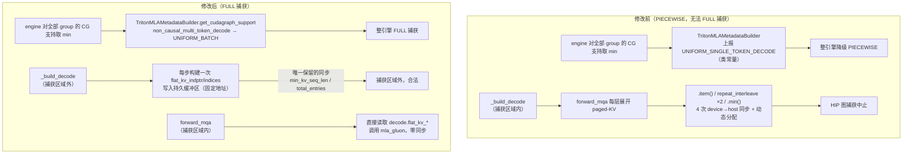
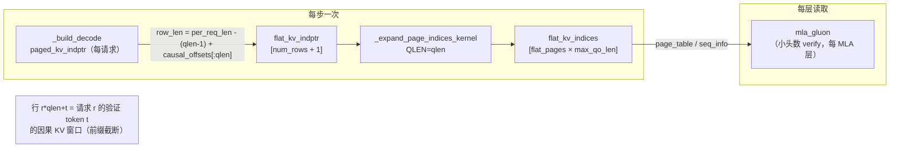

# PR #51171: [ROCm][MLA] Reach FULL cudagraphs for AITER MLA speculative decoding

> **作者**: @yudigege86 | **状态**: OPEN | **日期**: 2026-08-05（最近更新 2026-08-18）
> **Branch**: `yudigege86:rocm-mla-full-cudagraphs` → `vllm-project:main` | **Labels**: `rocm`, `nvidia`, `verified`
> **变更规模**: +225 -44 行，涉及 3 个文件（3 commits，mergeable_state: unstable）
> **Reviewers**: njhill, tjtanaa, pavanimajety, AndreasKaratzas, dllehr-amd

---

## 1. 总结 (Summary)

本 PR 解决了 ROCm 上 MLA 模型（Kimi-K3 + DSpark 草稿模型）推测解码无法达到 **FULL CUDA Graph** 的两个独立问题：一是 `TritonMLAMetadataBuilder` 从类常量上报 `UNIFORM_SINGLE_TOKEN_DECODE`，导致整个引擎被降级为 PIECEWISE 图模式；二是 `AiterMLAImpl.forward_mqa` 的小头数（< 16 query heads/rank）验证路径在捕获区域内执行 4 次 device→host 同步和一次数据依赖分配，直接中止 HIP 图捕获。修复后，在 8x MI355X（TP8）上 c1 吞吐从 12.10 提升到 46.30 tok/s（3.8x），c16 从 174.01 提升到 326.46 tok/s（1.9x），且 GSM8K 准确率不变。

---

## 2. 背景与动机 (Background & Motivation)

在 vLLM V1 中，CUDA/HIP Graph 捕获模式分为 FULL（整步捕获）和 PIECEWISE（分段捕获）两档。FULL 模式消除的是每步 Python 调度与 kernel 启动开销，对低并发场景（c1）的延迟收益极大。推测解码（speculative decoding）路径由于草稿模型 + 目标模型的复杂交互，一直是 FULL 图捕获的困难场景。

**两个具体障碍**：

1. **上报的支持等级过低**。DSpark 草稿组将整个 `1 + num_speculative_tokens` 的 token 块走 decode 路径，但 `TritonMLAMetadataBuilder` 通过类常量 `_cudagraph_support` 上报 `UNIFORM_SINGLE_TOKEN_DECODE`。引擎对所有 attention group 的图支持等级**取最小值**，因此这一个 group 就把整个引擎拉下 FULL。实际上 `forward_mqa` 用 Python int 做 `repeat_interleave` 展开该块、且无任何 device→host 同步，完全满足 `UNIFORM_BATCH` 契约。

2. **捕获区域内的同步**。`AiterMLAImpl.forward_mqa` 的小头数验证路径在每个 MLA 层上把每个请求的 paged-KV 范围展开为「每个验证 token 一行」的因果视图，其中包含 4 次 device→host 同步（一次 `.item()`、两次 tensor 驱动的 `repeat_interleave`、一次 `.min()`）以及一个依据刚读回数据定尺寸的分配——每一次都会中止 HIP 图捕获。

附带修复：`cache_config.kv_cache_size_tokens` 只在 engine core 和前端被填充，worker 进程里始终是 `None`，导致多进程部署下新缓冲区的预留回退到由 `max_model_len` 推导的宽松上界（约为真实容量的 6 倍），每 rank 多预留约 250 MiB。

---

## 3. 代码修改分析 (Code Change Analysis)

### 3.1 修改的模块

| 文件 | 操作 | 说明 |
|------|------|------|
| `vllm/v1/attention/backends/mla/rocm_aiter_mla.py` | 修改 (+181/-44) | 核心变更：小头数验证路径的 paged-KV 展开从 `forward_mqa` 移入 `_build_decode`；新增持久化扁平 KV 缓冲区；`_expand_page_indices_kernel` 泛化出 `QLEN` 参数 |
| `vllm/v1/attention/backends/mla/triton_mla.py` | 修改 (+30/-0) | 新增 `get_cudagraph_support` 类方法，在 KV cache group 标记为 `non_causal_multi_token_decode` 时上报 `UNIFORM_BATCH` |
| `vllm/v1/worker/gpu_worker.py` | 修改 (+14/-0) | `initialize_from_config` 中调用 `get_kv_cache_capacity` 填充 worker 侧缺失的 `kv_cache_size_tokens` / `kv_cache_max_concurrency` |

### 3.2 架构 / 流程图 (Architecture / Flow Diagram)

#### 修改前后的数据流对比

#### 小头数验证路径的因果窗口展开

### 3.3 关键实现细节 (Key Implementation Details)

**`rocm_aiter_mla.py`**：
- `AiterMLADecodeMetadata` 新增 `flat_kv_indptr` / `flat_kv_indices` 两个可空字段，传递预构建的扁平 KV 视图。
- `__init__` 预留持久缓冲区：`flat_kv_indptr` 为 `max_num_reqs × max_qo_len + 1`；`flat_kv_indices` 的尺寸以 KV 池真实 token 容量 `kv_cache_size_tokens` 为界（回退链：`num_gpu_blocks × block_size` → `max_num_pages`），使 `mla_gluon` 在回放中看到固定地址。`_flat_causal_offsets`（`[0, 1, ..., max_qo_len-1]`）预物化一次，避免每步分配。
- `_build_decode` 中每步构建一次逐验证 token 的因果 paged-KV 视图：`row_len = (per_req_len - (qlen-1) + causal_offsets[:qlen]).clamp_(min=0)`，用 `cumsum` 写入 `flat_kv_indptr[1:num_rows+1]`；尾部重复填充最后一个 offset，使 cudagraph 回放时超出捕获行数的 padding 行报告长度为 0（与 `paged_kv_indptr` 尾部相同的处理方式）。保留的唯一同步 `.tolist()` 一次读回 `min_kv_seq_len` 与 `total_entries` 两个值（Gluon 把 `min_kv_seq_len` 转为 split 数，必须是实际提交的最短行）。随后用 `assert total_entries <= flat_kv_indices.numel()` 做内存越界防护。
- `_expand_page_indices_kernel` 泛化出 `QLEN` 编译期参数：`req_idx = row_idx // QLEN`，`num_tokens` 改从 `cu_num_tokens[row+1] - cu_num_tokens[row]` 读取（不再依赖 `seq_lens`）；普通 decode 用 `QLEN=1`，行为不变。
- `forward_mqa` 小头数验证路径删除全部展开逻辑，仅断言 `flat_kv_*` 非空且 `attn_metadata.causal`（builder 的 `supports_non_causal_multi_token_decode=False` 保证非因果块到不了这里），然后把预构建的 `page_table` / `seq_info` / `min_kv_seq_len` 传给 `mla_gluon`。

**`triton_mla.py`**：
- 新增 `get_cudagraph_support` 类方法：`kv_cache_spec.non_causal_multi_token_decode` 为真时返回 `UNIFORM_BATCH`，否则回退类常量 `_cudagraph_support`。该谓词是 **KV cache group 级**的（`MLAAttentionSpec.merge` 对组内所有层取 OR），与 `__init__` 中抬高 `reorder_batch_threshold` 的谓词保持一致；副作用是共享草稿 KV 组的因果目标模型也会被一并提升——docstring 中明确记录了这一点。

**`gpu_worker.py`**：
- `initialize_from_config` 中当 `kv_cache_config.kv_cache_groups` 非空时，用 `get_kv_cache_capacity(self.vllm_config, kv_cache_config)` 填充 `self.cache_config.kv_cache_size_tokens` 与 `kv_cache_max_concurrency`，供 warmup 阶段的缓冲区尺寸计算使用。

---

## 4. 涉及的技术原理 (Technical Principles)

- **CUDA/HIP Graph 捕获模式**：vLLM V1 编译配置 `cudagraph_mode` 分为 NONE / PIECEWISE / FULL。FULL 将整个 decode step 捕获为单图，消除 Python 层调度开销；但捕获区域内任何 device→host 同步（`.item()`、`.tolist()`）、数据依赖的分配、或动态形状都会中止捕获。因此需要把「必须读回 host 的值」移到捕获区域外（本 PR 的做法），或改用固定上界（`flex_attention.py` 的 `.item()` 在 `build_for_cudagraph_capture` 中同理）。
- **AttentionCGSupport 等级**：`UNIFORM_SINGLE_TOKEN_DECODE` 只保证单 token decode 块形状统一；`UNIFORM_BATCH` 额外允许多 token decode 块（如推测解码的 `1 + num_speculative_tokens` 块）。engine 对所有 attention group 的支持等级取 min，因此任何一个 group 低报都会拖垮整引擎。
- **MLA（Multi-head Latent Attention）**：DeepSeek-V3 / Kimi 系列采用的压缩 KV 注意力。AITER 的 `mla_gluon` kernel 是小头数场景下 ROCm 的 decode/verify 实现；其 split 数由 `min_kv_seq_len` 推导，故必须以实际提交行的最短长度为准。
- **推测解码（DSpark 草稿）**：草稿模型一次生成 `num_speculative_tokens` 个候选，目标模型以块为单位 verify。草稿的 KV cache group 标记为 `non_causal_multi_token_decode`，是本次提升图支持等级的判定依据。
- **Paged KV 与扁平视图**：`paged_kv_indptr` 记录每个请求的 KV token 数前缀和，`paged_kv_indices` 是逐 token 的扁平 page 索引。小头数 verify 需要「每验证 token 一行」的因果窗口视图（行 `r*qlen+t` 只含该 token 可见的 KV 前缀），本 PR 将其构建移入 `_build_decode` 并持久化。
- **KV 池容量语义**：混合 KV 布局下，`num_gpu_blocks × block_size` 不等于池的 token 容量（一个请求占用多个 KV group），`kv_cache_size_tokens`（= `max_concurrency × max_model_len`）才是真实上界。此前 worker 进程缺失该值，是缓冲区超配的根源。

---

## 5. 评论区讨论亮点 (Discussion Highlights)

- **@yudigege86（作者）补充测量**：拆解了收益来源——仅移除同步为 c1 1.085x / c16 1.078x，叠加 FULL 图后再乘 3.60x / 1.81x；两者不独立（同步位于捕获区域内，移除是 FULL 捕获的前提）。GSM8K 全 1319 题 5-shot 贪婪测试：0.9651 → 0.9629，准确率无变化。
- **@reger-men 独立复现**：在另一代 GPU（gfx950, 8x MI355X, TP8）上独立命中同样的两个缺陷并采用相同的两个机制修复。其数据更完整：spec 关闭时强制 PIECEWISE 比 FULL_DECODE_ONLY 慢 **5.2x**（c1），说明 decode 图本身的价值与推测解码无关；spec 开启时未打补丁 15.12 → 双修复 89.22 tok/s。他还提供了作者未覆盖的**表构建 CPU-only 正确性检查**（新旧两种展开方式逐元素对比，覆盖 5 种 batch/qlen 形状及 padding 零长度行），并主动提出可移植到本 PR 的 `QLEN` kernel 上作为测试。另指出两个缺陷在 main 和 v0.27.1 上均存在。
- **@mergify[bot]**：提示存在合并冲突需 rebase（`mergeable_state: unstable`）。
- **@depthfirst-app[bot]（自动评审，LOW）**：`total_entries` 越界检查用了 `assert`，在 `python -O` 下会被剥离，届时 `_expand_page_indices_kernel` 可能越界写 `flat_kv_indices` 造成显存破坏；建议改为显式 `if ... raise ValueError`（代码库在 `kv_cache_spec_registry.py:161` 等处已有此约定）。
- 另注：作者提到相关 PR **#50578** 改动同一文件，二者可任意顺序合并、互不冲突，建议对照审阅。

---

## 6. 风险与潜在问题 (Risk Analysis)

| 风险 | 严重程度 | 说明 |
|------|---------|------|
| `assert` 越界检查在 `python -O` 下失效 | Medium | 若未来某布局使上界推导失效，`_expand_page_indices_kernel` 会越界写 `flat_kv_indices` 静默破坏显存；depthfirst bot 已建议改 `raise ValueError`，作者尚未回应 |
| FULL 图捕获显存开销 | Low | 捕获内存每 rank 0.51 → 2.11 GiB，增长约 1.6 GiB；换来了大幅性能提升，属可接受代价，但需注意 `--max-num-seqs` / 捕获尺寸配置 |
| `UNIFORM_BATCH` 提升是 group 级的 | Low | 共享草稿 KV cache group 的因果目标模型也会被一并提升（docstring 已记录）；正确性依赖 `forward_mqa` 确实满足 UNIFORM_BATCH 契约（无同步、固定形状） |
| 每步保留一次 device→host 同步 | Low | `_build_decode` 中的 `.tolist()` 每步一次，虽在捕获区域外合法，但引入了每步 host 往返；这是 Gluon split 数的既有约束，非本 PR 引入 |
| 缓冲区预留依赖 `kv_cache_size_tokens` 正确性 | Medium | 该字段此前在 worker 中一直缺失（本 PR 修复），但若某些部署路径仍不填充，回退的 `num_gpu_blocks × block_size` 在混合布局下高估；高估只会浪费显存，低估则被 assert 拦截（前提是 assert 生效） |
| 合并冲突 / 与 #50578 的耦合 | Medium | mergify 已报冲突需 rebase；#50578 改同一文件，虽然声称可任意顺序合并，但长期看两者都需关注对方演进 |
| 测试覆盖 | Medium | PR 自身未新增测试文件，依赖 #50578 的 causal-mask 测试覆盖迁移后的代码；reger-men 的 CPU-only 表对比测试尚未合入 |
| 跨后端影响 | Low | `gpu_worker.py` 与 `triton_mla.py` 的改动对所有平台生效（PR 因此带 `nvidia` 标签）；`triton_mla.py` 的 `get_cudagraph_support` 覆盖了 NVIDIA 上使用 TRITON_MLA 的 MLA 部署，行为变化需 CI 验证 |

---

## 7. 结论 (Conclusion)

这是一个动机清晰、机制扎实的性能 PR：两个根因定位准确，修复方式（构建期持久化 + 图支持等级纠正）与 vLLM 现有 FULL 图捕获范式一致，且有作者与第三方独立复现的双重性能数据及准确率验证支撑。当前主要待办是处理 rebase 冲突、回应 `assert` → `raise` 的评审意见，并考虑合入 CPU-only 表对比测试以补足正确性回归覆盖。
