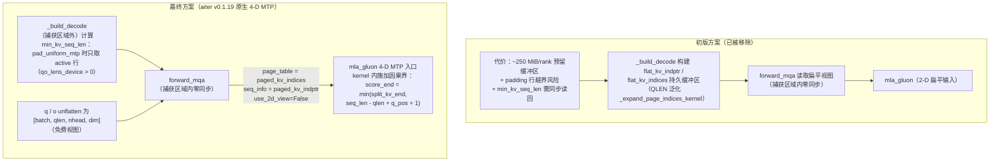
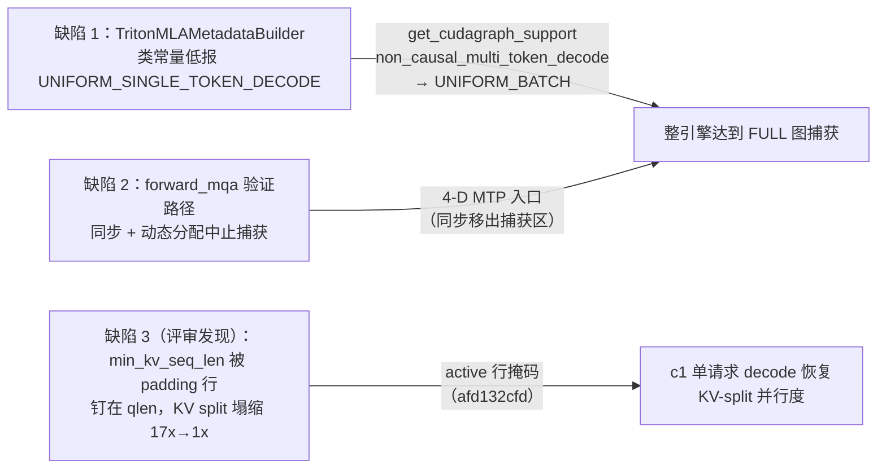

# PR #51171: [ROCm][MLA] Reach FULL cudagraphs for AITER MLA speculative decoding

> **作者**: @yudigege86 | **状态**: OPEN | **日期**: 2026-08-05（最近更新 2026-08-26）
> **Branch**: `yudigege86:rocm-mla-full-cudagraphs` → `vllm-project:main` | **Labels**: `rocm`, `nvidia`, `verified`
> **变更规模**: +192 -125 行，涉及 5 个文件（8 commits，mergeable_state: unstable）
> **Reviewers**: njhill, tjtanaa, pavanimajety, AndreasKaratzas, dllehr-amd | **已获 APPROVED**: okorzh-amd
>
> ⚠️ *更新说明（2026-08-27）*：初版报告（基于 2026-08-10 快照）中的「扁平 KV 展开」方案已被作者按评审意见**整体移除**，改为使用 aiter v0.1.19 原生 4D MTP 入口；新增 `min_kv_seq_len` padding 行修复与 2 个测试文件；新增 nightly 复测数据与 APPROVE 记录。本版报告基于 2026-08-26 最新快照重写。

---

## 1. 总结 (Summary)

本 PR 解决了 ROCm 上 MLA 模型（Kimi-K3 + DSpark 草稿模型）推测解码无法达到 **FULL CUDA Graph** 的两个独立问题：一是 `TritonMLAMetadataBuilder` 从类常量上报 `UNIFORM_SINGLE_TOKEN_DECODE`，导致整个引擎被降级为 PIECEWISE 图模式；二是 `AiterMLAImpl.forward_mqa` 的小头数（< 16 query heads/rank）验证路径在捕获区域内执行多次 device→host 同步和动态分配，中止 HIP 图捕获。

最新版本中，第二个问题的解法经历了**方案重写**：初版把 paged-KV 展开移入 `_build_decode` 并写入持久扁平缓冲区，后经 @tjtanaa 提示 aiter v0.1.19 的 `mla_gluon` 已原生支持 4-D MTP 输入，作者**删除了整个扁平展开机制**，改为把 `q` unflatten 为 `[batch, qlen, nhead, dim]` 后直接走 `mla_gluon` 的 4-D MTP 入口，因果掩码由 kernel 内部施加。实测（nightly 复测）c1 吞吐 12.38 → 44.00 tok/s（修复 padding 行 bug 后 45.33），c16 175.93 → 340.76 tok/s，GSM8K 准确率不变，已获 @okorzh-amd APPROVE。

---

## 2. 背景与动机 (Background & Motivation)

在 vLLM V1 中，CUDA/HIP Graph 捕获模式分为 FULL（整步捕获）和 PIECEWISE（分段捕获）两档。FULL 模式消除每步 Python 调度与 kernel 启动开销，对低并发场景（c1）的延迟收益极大（reger-men 的独立测量显示：即使关闭推测解码，强制 PIECEWISE 比 FULL 慢 **5.2x**）。推测解码路径由于草稿 + 目标模型的复杂交互，一直是 FULL 图捕获的困难场景。

**两个具体障碍**：

1. **上报的支持等级过低**。DSpark 草稿组将整个 `1 + num_speculative_tokens` 的 token 块走 decode 路径，但 `TritonMLAMetadataBuilder` 通过类常量 `_cudagraph_support` 上报 `UNIFORM_SINGLE_TOKEN_DECODE`。引擎对所有 attention group 的图支持等级**取最小值**，因此这一个 group 就把整个引擎拉下 FULL。实际上其 `forward_mqa` 用 Python int 做 `repeat_interleave` 展开该块、且无任何 device→host 同步，完全满足 `UNIFORM_BATCH` 契约。

2. **捕获区域内的同步**。`AiterMLAImpl.forward_mqa` 的小头数验证路径原先在每个 MLA 层上把每个请求的 paged-KV 范围展开为「每验证 token 一行」的因果视图，包含多次 device→host 同步和依据刚读回数据定尺寸的分配，每一次都会中止 HIP 图捕获。

附带修复：`cache_config.kv_cache_size_tokens` 只在 engine core 和前端被填充，worker 进程里始终是 `None`，导致多进程部署下 warmup 阶段按 KV 池尺寸预留缓冲区的代码回退到由 `max_model_len` 推导的宽松上界（约为真实容量的 6 倍）。

---

## 3. 代码修改分析 (Code Change Analysis)

### 3.1 修改的模块

| 文件 | 操作 | 说明 |
|------|------|------|
| `vllm/v1/attention/backends/mla/rocm_aiter_mla.py` | 修改 (+55/-54) | 核心变更：小头数验证路径改为 `mla_gluon` 原生 4-D MTP 入口；`_build_decode` 计算 `min_kv_seq_len`（padding 场景只取 active 行）；删除初版的扁平展开机制 |
| `vllm/v1/attention/backends/mla/triton_mla.py` | 修改 (+30/-0) | 新增 `get_cudagraph_support` 类方法，在 KV cache group 标记为 `non_causal_multi_token_decode` 时上报 `UNIFORM_BATCH` |
| `vllm/v1/worker/gpu_worker.py` | 修改 (+14/-0) | `initialize_from_config` 中调用 `get_kv_cache_capacity` 填充 worker 侧缺失的 `kv_cache_size_tokens` / `kv_cache_max_concurrency` |
| `tests/kernels/attention/test_rocm_aiter_mla_causal_verify_mask.py` | 修改 (+48/-71) | 因果掩码回归测试改写：从校验「扁平行窗口」改为校验「4-D q + 每请求 paged_kv 元数据」的 MTP 契约 |
| `tests/v1/attention/test_rocm_aiter_mla_mtp_split.py` | 修改 (+45/-0) | 新增 `test_min_kv_seq_len_ignores_cudagraph_padding_rows`：验证 `min_kv_seq_len` 不被 cudagraph padding 行污染 |

### 3.2 架构 / 流程图 (Architecture / Flow Diagram)

#### 小头数验证路径：初版方案 → 最终方案

#### 两个缺陷的修复路径总览

### 3.3 关键实现细节 (Key Implementation Details)

**`rocm_aiter_mla.py`**：
- `AiterMLADecodeMetadata` 新增 `min_kv_seq_len` 字段（默认 1），由 builder 计算、`forward_mqa` 消费。
- `_build_decode` 在 `use_gluon_verify` 命中的路径上计算 `min_kv_seq_len`：`per_req_len = paged_kv_indptr[1:] - paged_kv_indptr[:-1]`；当 `pad_uniform_mtp` 开启时，用 `qo_lens_device > 0` 掩码只对 **active 请求**取 `.min()`（无 active 行时保持默认值 1），否则对全部行取 min。唯一的 `.item()` 同步位于 builder 内、捕获区域外，合法（与 `flex_attention.py` 的 `build_for_cudagraph_capture` 中 `.item()` 同理）。
- `forward_mqa` 小头数验证路径重写：先 `assert attn_metadata.causal`（builder 的 `supports_non_causal_multi_token_decode=False` 保证非因果块到不了这里）；校验 `B % qlen == 0`（不满足时 `raise ValueError`，注意此处用的是 `raise` 而非 `assert`）；然后 `q_nope` / `q_pe` / `o` 用 `unflatten(0, (num_reqs, qlen))` 变成 4-D（扁平布局本身是 row-major `r*qlen+t`，unflatten 是零拷贝视图）；直接传普通的每请求 `paged_kv_indptr` / `paged_kv_indices` 给 `mla_gluon`（`use_2d_view=False`）。因果界由 kernel 内部施加：`score_end = min(split_kv_end, seq_len - qlen + q_pos + 1)`，与初版「截断每行 page 列表」给出的窗口数学上等价。
- `use_gluon_verify` 的 docstring 同步更新为描述 4-D MTP 路径（注意：docstring 写的是 `use_2d_view=True`，而调用点传的是 `use_2d_view=False`，二者存在一处小不一致，见风险表）。
- `_expand_page_indices_kernel` 恢复到无 `QLEN` 形态，但保留了初版的一个小改进：`num_tokens` 改从 `cu_num_tokens[row+1] - cu_num_tokens[row]` 读取，`_build_decode` 调用点不再传 `seq_lens_for_kernel`。
- **初版机制已全部移除**：`AiterMLADecodeMetadata.flat_kv_indptr/flat_kv_indices`、`__init__` 中的持久缓冲区预留（以及 `_flat_causal_offsets`）、`_build_decode` 中的扁平展开块、`_expand_page_indices_kernel` 的 `QLEN` 泛化——全部删除。

**`triton_mla.py`**（与初版一致，无变化）：
- 新增 `get_cudagraph_support` 类方法：`kv_cache_spec.non_causal_multi_token_decode` 为真时返回 `UNIFORM_BATCH`，否则回退类常量。该谓词是 **KV cache group 级**的（`MLAAttentionSpec.merge` 对组内所有层取 OR），与 `__init__` 中抬高 `reorder_batch_threshold` 的谓词一致；副作用是共享草稿 KV 组的因果目标模型也会被一并提升——docstring 中明确记录。

**`gpu_worker.py`**（与初版一致，无变化）：
- `initialize_from_config` 中当 `kv_cache_config.kv_cache_groups` 非空时，用 `get_kv_cache_capacity(self.vllm_config, kv_cache_config)` 填充 `self.cache_config.kv_cache_size_tokens` 与 `kv_cache_max_concurrency`。初版中此修复的动机是给扁平缓冲区定尺寸，重写后该需求消失，但 worker 侧缺失该字段是独立存在的既有缺陷，修复本身仍保留（注释中「AITER MLA verify view, for one」的说法已部分过时）。

**测试**：
- `test_rocm_aiter_mla_causal_verify_mask.py` 改写：spy 拦截传给 Gluon 的 kwargs，断言 `q_nope` 为 4-D、shape `[:2] == (num_reqs, QLEN)`、`use_2d_view is False`、`page_table` 为 1-D 且与 `paged_kv_indices` 一致、`seq_info` 为 `[num_reqs+1]` 且与 `paged_kv_indptr` 一致。回归叙事保留：修复前「每行拿到整个 KV 范围」会让验证位置 attend 到它本应检查的草稿 token。
- `test_min_kv_seq_len_ignores_cudagraph_padding_rows`（新增）：构造 c1 场景（1 个 active 请求 seq_len=1032 + 7 个 padding 行），断言 `metadata.min_kv_seq_len == 1032` 而非被 padding 钉住的 qlen=8。

---

## 4. 涉及的技术原理 (Technical Principles)

- **CUDA/HIP Graph 捕获模式**：FULL 将整个 decode step 捕获为单图，消除 Python 层调度开销；捕获区域内任何 device→host 同步（`.item()`、`.tolist()`）、数据依赖的分配都会中止捕获。因此必须把「必须读回 host 的值」移到捕获区域外（builder 中）或用固定上界。
- **AttentionCGSupport 等级**：`UNIFORM_SINGLE_TOKEN_DECODE` 只保证单 token decode 块形状统一；`UNIFORM_BATCH` 额外允许多 token decode 块（推测解码的 `1 + num_speculative_tokens` 块）。engine 对所有 attention group 的支持等级取 min，任何 group 低报都会拖垮整引擎。
- **MLA（Multi-head Latent Attention）与 aiter 的 `mla_gluon`**：DeepSeek-V3 / Kimi 系列采用的压缩 KV 注意力。小头数（<16）场景下 ROCm 的 verify 走 Gluon kernel；aiter v0.1.19 起 `mla_gluon` 提供 4-D MTP 入口（`q` 为 `[batch, qlen, nhead, dim]`），一个 launch 服务整个 verify 块，且 kernel 内部对每个 query 位置施加因果界 `score_end = min(split_kv_end, seq_len - qlen + q_pos + 1)`。
- **KV-split 并行度**：`mla_gluon` 的 split 数由 `min_kv_seq_len` 推导（形如 `NUM_KV_SPLITS = max(1, min(256//(bs*heads), cdiv(min_kv_seq_len, 64)))`）。若 `min_kv_seq_len` 被 padding 行钉到小值（qlen），单请求 decode 的 KV split 并行度会从 17x 塌缩到 1x——这正是 okorzh-amd 发现的隐藏性能陷阱。
- **`pad_uniform_mtp` 与 cudagraph padding**：FULL 图捕获后回放时，batch 不足捕获尺寸的槽位用 padding 行填充；`pad_uniform_mtp` 会把这些行的 `seq_lens_for_kernel` 从 0 覆写为 `max_qo_len` 以保持元数据形状统一。任何对「全部行」取统计量的逻辑都必须意识到这些行是合成的。
- **推测解码（DSpark 草稿）**：草稿模型一次生成 `num_speculative_tokens` 个候选，目标模型以块为单位 verify；草稿的 KV cache group 标记为 `non_causal_multi_token_decode`，是本 PR 提升图支持等级的判定依据。

---

## 5. 评论区讨论亮点 (Discussion Highlights)

评审驱动的方案重写是本 PR 讨论的主线：

- **@tjtanaa（2026-08-20）**：质疑扁平展开的必要性——aiter v0.1.19 的 `mla_gluon` 已文档化支持 4D 张量输入，可直接使用 `decode.paged_kv_indptr` / `paged_kv_indices`。作者采纳：**最新版本中扁平展开机制（flat_kv_indptr / flat_kv_indices / QLEN kernel 路径）已全部删除**，改为原生 4-D MTP 入口。
- **@claude[bot] 代码评审（2026-08-20，由 @shen-shanshan 的 `@claude review` 触发）**：提出两个发现——🔴 初版 `flat_kv_indices` 尺寸计算未计入 `pad_uniform_mtp` padding 行（其 `per_req_len` 被覆写为 qlen 而非 0，每行额外贡献 `qlen*(qlen+1)/2` 个合成条目，紧密 KV 池 + 粗捕获粒度下可溢出缓冲区）；🟡 越界检查用 `assert` 会被 `python -O` 剥离。**两点均随扁平方案的整体移除而不再适用**（但 assert/raise 的评审意见已体现在新代码风格中：`forward_mqa` 的 `B % qlen` 校验用的是 `raise ValueError`）。
- **@okorzh-amd（2026-08-25）**：发现重写后遗留的关键 bug——`min_kv_seq_len` 对**全部行**（含 padding 行）取 min；在 `pad_uniform_mtp` 下 padding 行被钉在 `max_qo_len`，导致 PR 自己的 c1 复现（qlen=8，7 个 padding 行）中 `min_kv_seq_len = 8`，`mla_gluon` 的 KV-split 数从 17 塌缩为 1——即 PR 宣称的 c1 加速是在 split 路径被关掉的情况下测得的。作者在 commit `afd132cfd` 修复：padding 场景改用 `per_req_len[qo_lens_device > 0].min()`，并新增对应单元测试；复测 c1 = **45.33 tok/s**（修复前 44.00），吞吐未降。随后 **okorzh-amd APPROVED**。
- **@yudigege86（作者，2026-08-25）**：在 `vllm/vllm-openai-rocm:nightly` 上复测（stock nightly vs PR overlay，Kimi-K3 + DSpark，isl=1024 / osl=256）：c1 12.38 → 44.00 tok/s（ITL 174.66 → 35.14 ms），c16 175.93 → 340.76 tok/s（ITL 180.86 → 86.12 ms）。
- **@reger-men（2026-08-14，独立复现）**：在 gfx950（8x MI355X, TP8）上独立命中同样的两个缺陷并采用相同的机制修复；其数据补充了关键对照——spec 关闭时强制 PIECEWISE 比 FULL_DECODE_ONLY 慢 **5.2x**（c1），说明 decode 图本身的价值与推测解码无关；另指出两个缺陷在 main 与 v0.27.1 上均存在。
- **@mergify[bot]**：两次报告合并冲突（2026-08-05、2026-08-22）需 rebase；两次报告 pre-commit 检查失败（2026-08-24、2026-08-25）。
- **@seungrokj（2026-08-26）**：催促 @tjtanaa 尽快复审——重写后的版本尚未获得其确认。

---

## 6. 风险与潜在问题 (Risk Analysis)

| 风险 | 严重程度 | 说明 |
|------|---------|------|
| pre-commit 失败 + rebase 未完成 | High | mergify 已两次报告 pre-commit 失败（需作者运行 `pre-commit run --all-files`），且 08-22 仍报合并冲突（当前 mergeable=True 但 mergeable_state=unstable）；这是当前合并的**实际阻塞项** |
| PR 描述已过时 | Medium | PR body 仍在描述初版的扁平展开方案（"That expansion moves into `_build_decode`…"）及初版 Test Result 表（12.10 → 46.30），与当前 4-D MTP 实现不符；新数据只散落在评论里。合并前应更新描述，否则未来读者会被误导 |
| aiter 版本依赖 | Medium | 4-D MTP 入口需要 aiter ≥ v0.1.19；diff 中未见显式版本门槛，需确认 vLLM 的 ROCm 依赖链是否已保证该版本，否则旧 aiter 环境下小头数验证路径会失败 |
| `use_gluon_verify` docstring 与调用点不一致 | Low | docstring 写 `use_2d_view=True`，`forward_mqa` 实际传 `use_2d_view=False`，测试断言 `False`；有一处笔误待澄清 |
| `min_kv_seq_len` 全 padding 退化 | Low | 若某步全部为 padding 行（`active.any()` 为假），`min_kv_seq_len` 保持默认值 1，KV-split 会退化为 1；实践中该场景应不会出现，且 1 是安全值而非错误值 |
| `UNIFORM_BATCH` 提升是 group 级的 | Low | 共享草稿 KV cache group 的因果目标模型也会被一并提升（docstring 已记录）；正确性依赖对应 `forward_mqa` 确实满足 UNIFORM_BATCH 契约 |
| 每步保留一次 device→host 同步 | Low | `_build_decode` 中的 `.item()` 每步一次，位于捕获区域外，合法；这是 Gluon 需要 `min_kv_seq_len` 的既有约束 |
| `gpu_worker.py` 修复的动机注释过时 | Low | 扁平缓冲区已删除，但该修复（worker 侧填充 `kv_cache_size_tokens`）本身仍是对既有缺陷的正确修复，保留合理 |
| 跨后端影响 | Low | `gpu_worker.py` 与 `triton_mla.py` 的改动对所有平台生效（PR 因此带 `nvidia` 标签）；`triton_mla.py` 的图支持等级变化覆盖 NVIDIA 上使用 TRITON_MLA 的 MLA 部署，需 CI 验证 |

---

## 7. 结论 (Conclusion)

PR 经历了一轮高质量的评审驱动重构：初版的扁平展开方案在 tjtanaa 的提示下被更简洁的 aiter 原生 4-D MTP 方案取代（净删代码、消除整类缓冲区越界风险），okorzh-amd 又揪出 `min_kv_seq_len` 被 padding 行污染的隐藏性能 bug 并已修复，当前实现正确性有 2 个针对性单元测试、性能有作者与第三方双重数据支撑，且已获 okorzh-amd APPROVE。合并前仅剩工程性收尾：跑通 pre-commit、完成 rebase、更新已过时的 PR 描述，并等待 tjtanaa 对重写后版本的复审。
