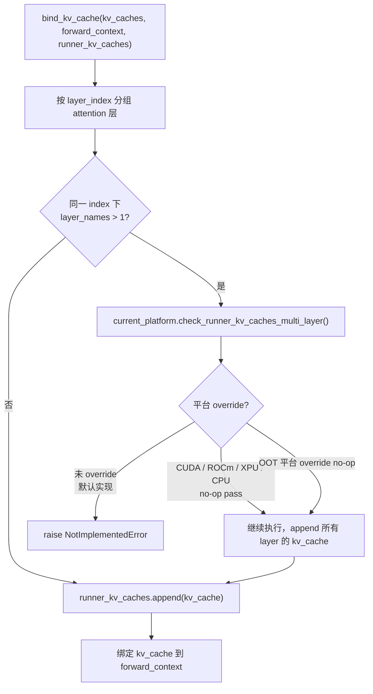
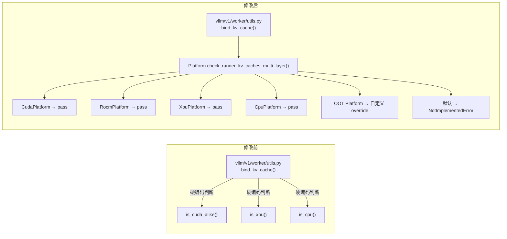

# PR #51633: [Platform] Add check_runner_kv_caches_multi_layer

> **作者**: @wangxiyuan | **状态**: OPEN | **日期**: 2026-08-10
> **Branch**: `wangxiyuan/check_runner_kv_caches_multi_layer` → `main` | **Labels**: nvidia, rocm, intel-gpu, cpu
> **变更规模**: +37 -11 行，涉及 6 个文件

---

## 1. 总结 (Summary)

本 PR 在 vLLM 的 Platform 抽象层新增 `check_runner_kv_caches_multi_layer()` 接口，并将 `bind_kv_cache()` 中原本硬编码的平台判断（`is_cuda_alike()` / `is_xpu()` / `is_cpu()`）替换为对该接口的调用。核心目的是消除 worker 模块对具体平台的耦合，使 **Out-of-Tree (OOT) 平台**（如 vllm-ascend 等第三方后端）可以通过 override 该方法声明自身对「同一 layer index 下存在多个 attention 层」场景的支持，而无需修改 upstream 的 `utils.py`。

---

## 2. 背景与动机 (Background & Motivation)

`bind_kv_cache()` 是 V1 worker 中将已分配的 KV cache 绑定到 ModelRunner 和 forward context 的关键工具函数。在构建 `runner_kv_caches` 列表时，它按 `layer_index` 对 attention 层分组；当同一 index 下存在多个层名时（典型场景是 encoder-decoder 模型如 BART，decoder block 中 self-attention 与 cross-attention 共享 layer index 但 layer name 不同），会触发特殊处理逻辑。

**现有问题**：

- `vllm/v1/worker/utils.py` 中直接通过 `current_platform.is_cuda_alike() or is_xpu() or is_cpu()` 判断平台是否"已知不受影响"，否则 `raise NotImplementedError`。
- 这种硬编码方式违反了 Platform 抽象的设计原则：worker 层不应感知具体平台列表，OOT 平台也无法在不修改 upstream 代码的情况下声明自身能力。
- 对于已验证不受影响的内置平台（CUDA/ROCm/XPU/CPU），当前逻辑只是 `pass`（允许继续执行），并未真正修复 `runner_kv_caches` 与多层 attention 的语义不一致问题——代码中仍留有 TODO 注释。

**PR 目标**：将平台相关的策略判断下沉到 Platform 类，OOT 平台只需 override `check_runner_kv_caches_multi_layer()` 为 no-op 即可绕过 `NotImplementedError`，无需 touch worker 代码。

---

## 3. 代码修改分析 (Code Change Analysis)

### 3.1 修改的模块

| 文件 | 操作 | 说明 |
|------|------|------|
| `vllm/platforms/interface.py` | 修改 (+17) | 在 `Platform` 基类新增 `check_runner_kv_caches_multi_layer()` 类方法，默认实现抛出 `NotImplementedError` |
| `vllm/platforms/cuda.py` | 修改 (+4) | override 为 no-op（`pass`），表示 CUDA 平台已验证不受影响 |
| `vllm/platforms/rocm.py` | 修改 (+4) | 同上，ROCm 平台 |
| `vllm/platforms/xpu.py` | 修改 (+4) | 同上，Intel XPU 平台 |
| `vllm/platforms/cpu.py` | 修改 (+7) | 同上，CPU 平台，附带注释说明测试代码依赖 |
| `vllm/v1/worker/utils.py` | 修改 (+1 -11) | `bind_kv_cache()` 中将 11 行平台硬编码替换为单行 `current_platform.check_runner_kv_caches_multi_layer()` 调用 |

### 3.2 架构 / 流程图 (Architecture / Flow Diagram)

#### bind_kv_cache 多层 attention 检查流程（修改后）

#### Platform 抽象层职责迁移

### 3.3 关键实现细节 (Key Implementation Details)

- **Platform 基类默认行为**：`interface.py` 中新增方法的 docstring 明确说明了触发场景（encoder-decoder 模型中 cross-attention 与 self-attention 共享 layer index），默认抛出带描述性消息的 `NotImplementedError`，强制未验证的平台显式声明能力。

- **内置平台统一 no-op**：CUDA、ROCm、XPU、CPU 四个平台的 override 均为空实现（`pass`），行为与修改前完全一致——这些平台"已知 `runner_kv_caches` 不受多层 attention 影响"。

- **worker 层解耦**：`utils.py` 中删除了对 `current_platform.is_cuda_alike()` 等三个方法的直接调用，改为单一的平台策略入口，符合 vLLM Platform 抽象的设计模式（类似 `support_static_graph_mode()`、`support_deep_gemm()` 等已有类方法）。

- **TODO 保留**：原代码中关于 `runner_kv_caches` 语义正确性的 TODO 注释仍然保留在 `bind_kv_cache()` 中，表明多层 attention 的根本问题尚未解决，本次 PR 仅做平台抽象重构。

- **OOT 平台接入方式**：第三方平台（如 Ascend、自定义后端）只需在其 Platform 子类中 override `check_runner_kv_caches_multi_layer()` 为 no-op 即可，无需向 upstream 提交平台名硬编码。

---

## 4. 涉及的技术原理 (Technical Principles)

**KV Cache 绑定机制**：vLLM V1 在 model initialization 阶段为每个 attention 层分配 KV cache tensor，随后通过 `bind_kv_cache()` 完成两处绑定：(1) 填充 ModelRunner 的 `runner_kv_caches` 列表；(2) 将每个 attention 层的 `kv_cache` 属性指向对应 tensor，供 forward pass 使用。

**Layer Index 与 Layer Name 的映射**：attention 层的命名遵循 `{module}.{index}.{suffix}` 模式，`extract_layer_index()` 从中提取 index。在 decoder-only 模型中，index 与 layer 一一对应；但在 encoder-decoder 模型（BART、T5 等）中，同一 decoder block 的 self-attention 和 cross-attention 可能共享 index 但 name 不同，导致 `index2name[layer_index]` 返回多个 layer name。

**runner_kv_caches 的语义局限**：`runner_kv_caches` 是一个扁平的 tensor 列表，设计上假设每个 layer index 对应唯一一个 KV cache。当同一 index 存在多个 attention 层时，当前实现会将所有层的 KV cache 都 append 进去，但 `runner_kv_caches` 的使用方（如测试代码、profiler）可能仍按"一 index 一 cache"的假设访问——这正是 TODO 注释所指的问题。

**Platform 抽象模式**：vLLM 通过 `Platform` 基类统一封装硬件/后端差异。worker 和 model executor 层应通过 `current_platform.xxx()` 调用平台能力，而非直接判断平台类型。本 PR 是将 `bind_kv_cache` 中遗漏的平台判断迁移到 Platform 抽象层的补全工作。

**Out-of-Tree (OOT) 平台**：vLLM 支持第三方硬件后端以独立仓库（如 vllm-ascend）形式接入，通过注册自定义 Platform 子类实现。OOT 平台无法修改 upstream 的 worker 代码，因此需要 Platform 接口提供足够的 override 点——本 PR 正是为此新增一个 override 点。

---

## 5. 评论区讨论亮点 (Discussion Highlights)

PR 于 2026-08-10 刚创建，目前讨论较少：

- **Claude Code Review Bot** 提示该 PR 来自 fork 仓库，自动化 review 默认关闭；maintainer 可通过评论 `@claude review` 触发一次性 review。
- **Mergify Bot** 自动添加了 `nvidia`、`rocm`、`intel-gpu`、`cpu` 四个平台标签，并触发了 GitHub Project 自动化。
- **Reviewer 指派**：已请求 @xuechendi、@njhill、@tjtanaa、@bigPYJ1151、@jikunshang、@shen-shanshan、@dllehr-amd 等 reviewer 审查。
- **PR 描述不完整**：Purpose 部分有简要说明，但 Test Plan 和 Test Result 均为空，Essential Elements checklist 三项均未勾选。

---

## 6. 风险与潜在问题 (Risk Analysis)

| 风险 | 严重程度 | 说明 |
|------|---------|------|
| 行为回归（内置平台） | Low | CUDA/ROCm/XPU/CPU 的 override 均为 no-op，与修改前 `pass` 分支行为一致，不太可能导致功能变化 |
| OOT 平台误 override | Medium | 若 OOT 平台在未充分验证的情况下 override 为 no-op，可能在 encoder-decoder 模型上产生 silent bug（`runner_kv_caches` 语义不正确但无报错） |
| 根本问题未解决 | Medium | `runner_kv_caches` 对多层 attention 的语义不一致问题（TODO）仍然存在；本 PR 只是将平台判断抽象化，并未修复数据结构 |
| 缺少测试 | Medium | PR 未包含任何单元测试或集成测试；纯重构类变更通常至少应有回归测试覆盖 `bind_kv_cache` 的多层场景 |
| PR 描述不完整 | Low | Test Plan / Test Result 为空，不符合 vLLM PR 规范，可能影响 review 效率 |
| 默认 NotImplementedError 可能影响新平台 | Low | 新增 Platform 子类若未 override 该方法，在多层 attention 场景下会收到更明确的错误消息（相比之前可能未被覆盖的平台列表），这实际上是改进 |

---

## 7. 结论 (Conclusion)

这是一个小而清晰的平台抽象重构 PR，方向正确——将 worker 层的平台硬编码下沉到 Platform 接口，为 OOT 平台提供了标准的 override 点。变更范围小（6 文件、+37/-11 行），逻辑简单，内置平台行为不变。主要不足是缺少测试覆盖和完整的 PR 描述（Test Plan/Result），建议在 merge 前补充 `bind_kv_cache` 多层 attention 场景的单元测试，并完善 PR checklist。
