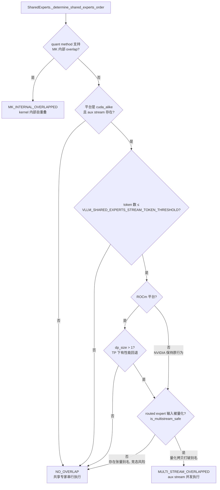
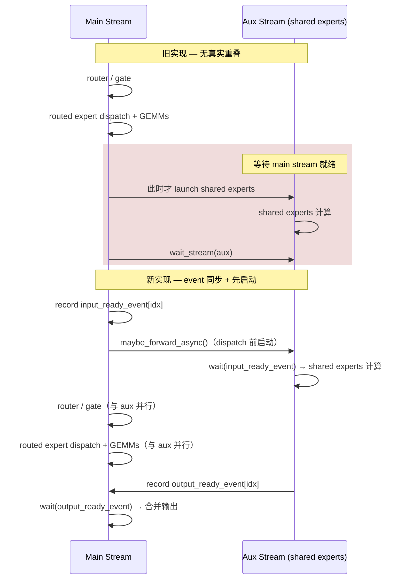
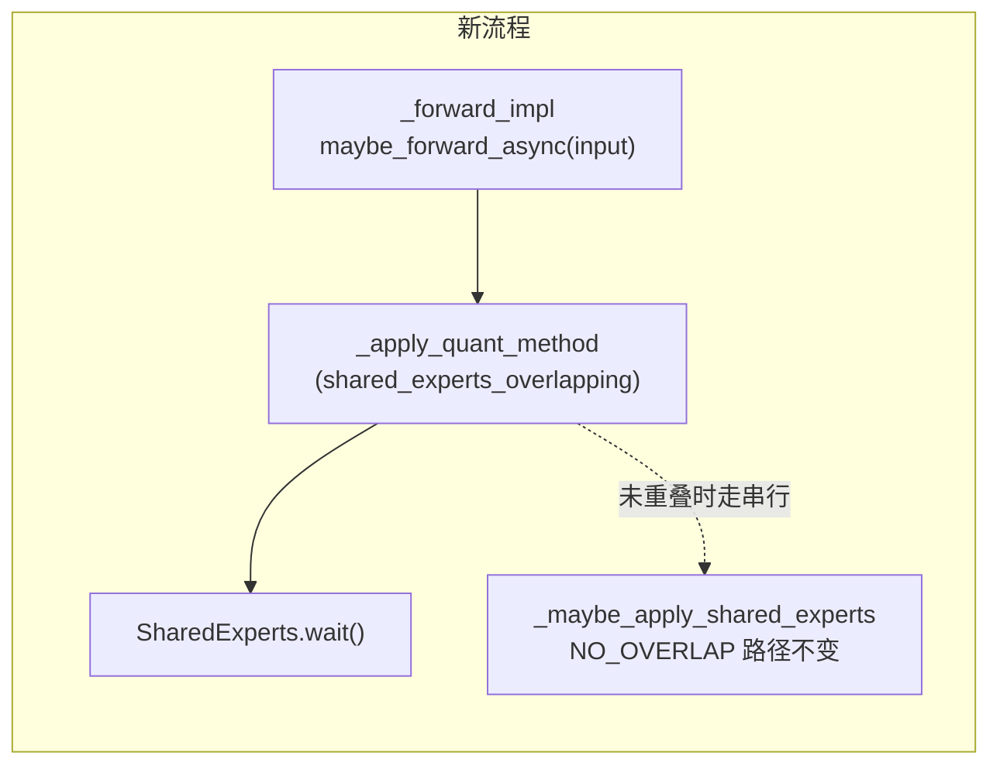

# PR #52033: [Perf][ROCm] Dual-stream decode with hipgraphs

> **作者**: @simondanielsson | **状态**: OPEN | **日期**: 2026-08-12（最近更新 2026-08-24）
> **Branch**: `simondanielsson:feat/dual-stream-decode-rocm` → `vllm-project:main` | **Labels**: `rocm`
> **变更规模**: +70 -57 行，涉及 2 个文件 | **Commits**: 43 | **Assignee**: @shen-shanshan

---

## 1. 总结 (Summary)

本 PR 是先前被 revert 的 PR #48223（ROCm dual-stream decode）的重新提交，在修复了导致精度回退的**张量别名竞态（race condition）**问题后再次开启。核心思路：在 MoE 前向中，将 shared experts 在 auxiliary HIP stream 上**先于 routed expert dispatch 之前启动**，使其与 router/gate 及 routed expert GEMM 真正重叠执行，从而在 ROCm DP 场景下获得约 3–4% 的 TPOT 提升；同时将流同步从 `wait_stream` 改为 **event-based 同步**，使其兼容 hipgraph 捕获。针对上次失败的根因——Qwen3.5 未量化 routed expert 输入、shared experts 与 hidden states 共享同一 buffer 导致的双流竞态——本 PR 新增 `is_multistream_safe` 判定：**当 routed expert 输入未被量化时（仅 ROCm 生效）自动禁用 dual-stream**，从而同时保证 Qwen3.5 的精度与 DeepSeek-V3（fp8 量化输入）的性能收益。

---

## 2. 背景与动机 (Background & Motivation)

### 2.1 历史沿革：被 revert 的 PR #48223

- 原 PR #48223（Fixes #48111）首次为 CUDA-like 平台实现 shared experts 的 dual-stream decode overlap，合并后因 **Qwen3.5 在 DP2EP 配置下 gsm8k 精度显著下降**而 CI 失败，被 PR #52024 revert。
- 本 PR 重新打开该功能，并针对 revert 原因做了根因修复（改动相对 revert 点见 [diff 链接](https://github.com/vllm-project/vllm/pull/52033/changes/b25620205d5529e8e36ca143050770ce31969428..1b7ff2c22beb1fddbebaed5c08ef62367e986528)）。

### 2.2 失败根因：张量别名导致的竞态

- Qwen3.5 的 MoE 中，**hidden states 与 shared experts 输入是同一个 tensor**（别名关系），且整个 MoE 过程中没有任何拷贝。
- 其深层原因：Qwen3.5 **不对 routed experts 的输入做量化**。而 DeepSeek-V3 等模型对 routed expert 输入做 fp8 量化时，"隐式地创建了一份拷贝"，打破了别名，因此双流并发是安全的。
- dual-stream 模式下，shared experts（aux stream）与 routed experts（main stream）并发读写同一 buffer 且无同步 → 数据竞争 → 精度下降。

### 2.3 修复策略

1. **安全判定**：仅当 routed experts 输入被量化（`moe_quant_config.quant_dtype is not None`）时才允许 multi-stream overlap；该检查**只在 ROCm 上生效**，保留 NVIDIA 既有行为。
2. **启动时序重构**：把 shared experts 在 aux stream 上的启动从"routed experts 之后"移到"dispatch 之前"，实现真正的 kernel 级重叠（原作者 trace 显示：旧时序下 shared experts 在 routed experts 完成后才启动，完全串行、无重叠）。
3. **hipgraph 兼容**：用 event 的 `record`/`wait` 替代 stream 级 `wait_stream`，并配合每 DBO ubatch 一对 event 的设计。

### 2.4 性能收益（原 PR 数据，8xMI300）

- 1k/1k 与 8k/1k 场景下 TPOT 相比 nightly 提升约 **+3~4%**（多数并发档位为正，个别档位如 concurrency 16 有噪声性回退）。
- 仅在 DP 场景生效（TP 下实测有性能回退，故 `dp_size > 1` 才开启）。
- 与 `VLLM_ROCM_USE_AITER_FUSION_SHARED_EXPERTS` 互斥；可用 `VLLM_DISABLE_SHARED_EXPERTS_STREAM=1` 关闭。

---

## 3. 代码修改分析 (Code Change Analysis)

### 3.1 修改的模块

| 文件 | 操作 | 说明 |
|------|------|------|
| `vllm/model_executor/layers/fused_moe/runner/moe_runner.py` | 修改 (+29 -18) | 新增 `routed_input_is_quantized` / `is_multistream_safe` 判定并传入 `SharedExperts`；`_forward_impl` 在 dispatch 前调用 `maybe_forward_async()`；`_apply_quant_method` 新增 `shared_experts_overlapping` 参数，仅调用 `wait()`；删除 `_maybe_sync_shared_experts_stream()` |
| `vllm/model_executor/layers/fused_moe/runner/shared_experts.py` | 修改 (+41 -39) | `SharedExperts.__init__` 新增 `is_multistream_safe` 回调；新增 event 对（`_input_ready_event` / `_output_ready_event`，每 DBO ubatch 一对）；新增 `maybe_forward_async()` / `wait()`；删除 `maybe_sync_shared_experts_stream()` / `_run_in_aux_stream()`；`_determine_shared_experts_order` 增加 `is_cuda_alike`、`overlap_is_beneficial`、`_is_multistream_safe` 三重门控 |

### 3.2 架构 / 流程图 (Architecture / Flow Diagram)

#### 3.2.1 是否启用 dual-stream 的判定逻辑

#### 3.2.2 修改前后的执行时序对比

#### 3.2.3 MoERunner 前向调用链变化

### 3.3 关键实现细节 (Key Implementation Details)

- **`is_multistream_safe` 判定**（`moe_runner.py`）：通过 `self.routed_experts.quant_method.moe_quant_config` 与 `quant_dtype` 是否为空来判断 routed expert 输入是否被量化。量化路径会先把输入拷贝进新 buffer（fp8 量化），从而打破与 shared experts 输入的别名；未量化时两者可能是同一 tensor，双流并发会产生竞态。该检查只在 ROCm 生效（`not current_platform.is_rocm() or routed_input_is_quantized()`）。
- **启动时序前移**（`_forward_impl`）：原实现先执行 router/gate 与 routed experts，最后才在 aux stream 上 launch shared experts（`_maybe_apply_shared_experts(MULTI_STREAM_OVERLAPPED)`），trace 显示这导致两者串行、无重叠。新实现改为在 routed expert dispatch **之前**调用 `maybe_forward_async()`，把 shared experts 计算尽早压入 aux stream。
- **异步接口拆分**（`shared_experts.py`）：
  - `maybe_forward_async(input) -> bool`：判定可重叠后在当前流 `record(input_ready_event[idx])`，切到 aux stream 后 `wait` 该 event → 执行 `self._layer(input)` → `record(output_ready_event[idx])`；不可重叠则返回 `False` 走原有串行路径。
  - `wait()`：main stream 等待 `output_ready_event[idx]`，随后合并两个专家输出。
  - `forward()` 中删除 aux stream 分支，只保留串行执行。
- **hipgraph 兼容的 event 同步**：用 `torch.cuda.Event` 的 record/wait 替代 `stream.wait_stream()`（后者在 hipgraph 捕获下有兼容性问题）。event 在 `__init__` 中预分配（图捕获期间不允许创建），并按 DBO ubatch id 维护 `[input_ready, output_ready] × 2` 对，避免两个 DBO ubatch 之间互相覆盖 event。
- **门控条件扩展**（`_determine_shared_experts_order`）：
  - `current_platform.is_cuda()` → `is_cuda_alike()`（放开 ROCm）；
  - 新增 `overlap_is_beneficial`：ROCm 上仅 `dp_size > 1` 时开启（TP 下有回退）；
  - 新增 `self._is_multistream_safe()`；
  - 原有 `VLLM_SHARED_EXPERTS_STREAM_TOKEN_THRESHOLD` 阈值门控保留。

---

## 4. 涉及的技术原理 (Technical Principles)

- **MoE 共享专家的双流重叠**：DeepSeek-V3 类 MoE 由 routed experts（按 router 评分激活的 top-k 专家）与 shared experts（所有 token 都经过）组成，两者输入相同、输出相加，天然无数据依赖，因此可以把 shared experts 的 GEMM 放到独立 stream 上与 routed experts 并发执行，隐藏其延迟。
- **张量别名与多流竞态**：CUDA/HIP 的 stream 语义只保证同一 stream 内有序，跨 stream 需显式同步。若两个 stream 上的 kernel 读写同一块显存且无同步，结果未定义。Qwen3.5 不量化 routed expert 输入，hidden states、shared expert 输入、routed expert 输入是同一 tensor；而 DSv3 的 fp8 量化路径会先将输入拷贝到量化 buffer，天然避免了别名。
- **CUDA/HIP Event 与流同步**：`event.record(stream)` 在该流中打点，`event.wait(stream)` 让另一流等待该点完成——这是标准的跨流生产者-消费者同步原语。相比 `stream.wait_stream()`，event 同步是 graph capture 安全的（cudagraph/hipgraph 支持捕获 event record/wait），因此本 PR 的写法可以在 hipgraph 内回放。
- **Hipgraph（HIP CUDA Graph）**：vLLM 在 decode 阶段用图捕获来消除 kernel 启动开销。图捕获期间所有 GPU 操作被录制为 DAG，回放时按依赖执行。event 预分配 + record/wait 是图内跨流依赖的标准表达方式；而部分 stream 级等待 API 在 HIP 图捕获下不可用或语义有差异，这也是原实现无法直接用于 hipgraph 的原因之一。
- **DBO（Dual Batch Overlap）ubatch**：MoE runner 以 ubatch 粒度并行处理两个 micro-batch 时，`_output_idx` 随 ubatch id 轮转。为每个 ubatch id 维护独立的 event 对，可避免前一个 ubatch 尚未完成的同步点被后一个 ubatch 覆盖。

---

## 5. 评论区讨论亮点 (Discussion Highlights)

- **合并冲突提醒**（mergify bot，08-12 与 08-21 两次）：PR 与 main 存在冲突，`mergeable_state: unstable`，合并前需 rebase。
- **@Fangzhou-Ai**（08-12）：at @shen-shanshan、@jiacao-amd 关注该 PR。
- **@simondanielsson**（08-13）：「Running some tests to make sure there is no regression from the latest changes」——主动验证。
- **@simondanielsson**（08-20）：「I'm looking into what is wrong with Qwen3.5 in more detail before we merge this one」——发现 Qwen3.5 仍有问题，暂缓合并。
- **@simondanielsson**（08-20，关键转折）：找到了安全判定启发式——**routed experts 是否量化其输入**。总结三点：① DP 模式下量化 routed expert 输入时默认开启 multi-stream，确保无竞态；② DSv3 获得真实重叠（无额外拷贝）、Qwen3.5 保证正确性；③ 不新增环境变量、hipgraph 安全。
- **CI 触发**：@tjtanaa `/ci run` → Buildkite #84809（08-20）；作者自己的 `/ci run` 被拒（fork PR 作者无 write 权限，需 reviewer 触发）；@shen-shanshan `/ci run` → Buildkite #85320（08-24，最新 commit `b3ed778`）。
- **claude[bot]** 两次自动 review 均被禁用（fork PR 需 maintainer 手动 `@claude review`）。
- 暂无 inline review comments；请求的 reviewers 为 @mgoin、@pavanimajety、@zyongye，另在描述中 at 了 @dllehr-amd、@AndreasKaratzas 请求 re-review。

---

## 6. 风险与潜在问题 (Risk Analysis)

| 风险 | 严重程度 | 说明 |
|------|---------|------|
| 别名假设依赖量化实现细节 | **High** | `is_multistream_safe` 的判定依据是"量化必产生拷贝"，这是对当前 quant method 实现的隐含假设。若未来某量化路径复用原 buffer（in-place 量化），或不量化但也存在其他拷贝的模型被误判为不安全（仅损失性能，尚安全），该启发式可能失效，需要持续验证。 |
| 平台行为差异 | Medium | 安全判定只在 ROCm 生效（`not is_rocm() → True`），NVIDIA 路径行为不变，这是有意为之；但意味着同样的别名问题在 CUDA 上理论上仍存在，只是从未被观察到。 |
| 高并发档位性能回退 | Low/Medium | 原 PR 数据中 1k/1k @ conc 16（-6.77%）与 8k/1k @ conc 16/128（-3.07%/-3.71%）出现 TPOT 回退，作者解释为噪声（TTFT 波动大），但未给出重复测量；合并后建议在 CI 上持续跟踪。 |
| DP-only 收益边界 | Low | ROCm 上 `dp_size > 1` 才开启，纯 TP 部署（DP1）得不到该优化——这是实测得出的取舍，非缺陷，但用户需知晓收益前提。 |
| 与 aiter FSE 互斥 | Low | 与 `VLLM_ROCM_USE_AITER_FUSION_SHARED_EXPERTS` 互斥，使用 FSE 时本特性不生效；两者需在使用文档/注释中明确，避免用户混淆。 |
| 测试覆盖不足 | Medium | 本 PR 未新增任何自动化测试（单元/集成），验证依赖手动 trace + lm_eval gsm8k（Qwen3.5: flexible-extract 0.8453 / strict 0.8332，与 baseline 相当）。建议至少补充 `SharedExperts` 的 order 判定单测（量化/非量化/ROCm/DP 组合）与 CI 上的多模型 smoke test。 |
| Event 生命周期与 DBO 并发 | Low | 每 ubatch 一对 event 的设计假设最多 2 个 ubatch 在飞；若 DBO 深度调整或非 DBO 路径混用，`_output_idx` 轮转可能错位。`wait()` 无 `maybe_forward_async` 前置断言，误用时会在 main stream 上等待一个未录制的 event（会直接放行，结果正确性依赖调用顺序，属潜在隐患）。 |

---

## 7. 结论 (Conclusion)

该 PR 以一个小而聚焦的改动（2 文件、+70 -57）解决了上次 revert 的根因——通过"routed 输入是否量化"这一启发式在 ROCm 上自动规避张量别名竞态，同时用 event-based 同步实现 hipgraph 兼容的真正双流重叠，设计合理、验证数据充分（DSv3 重叠 trace + Qwen3.5 精度回归 + TPOT 提升）。当前主要待办为解决 merge conflict、通过 Buildkite CI，以及补上自动化测试；整体质量较高，接近可合并状态。
