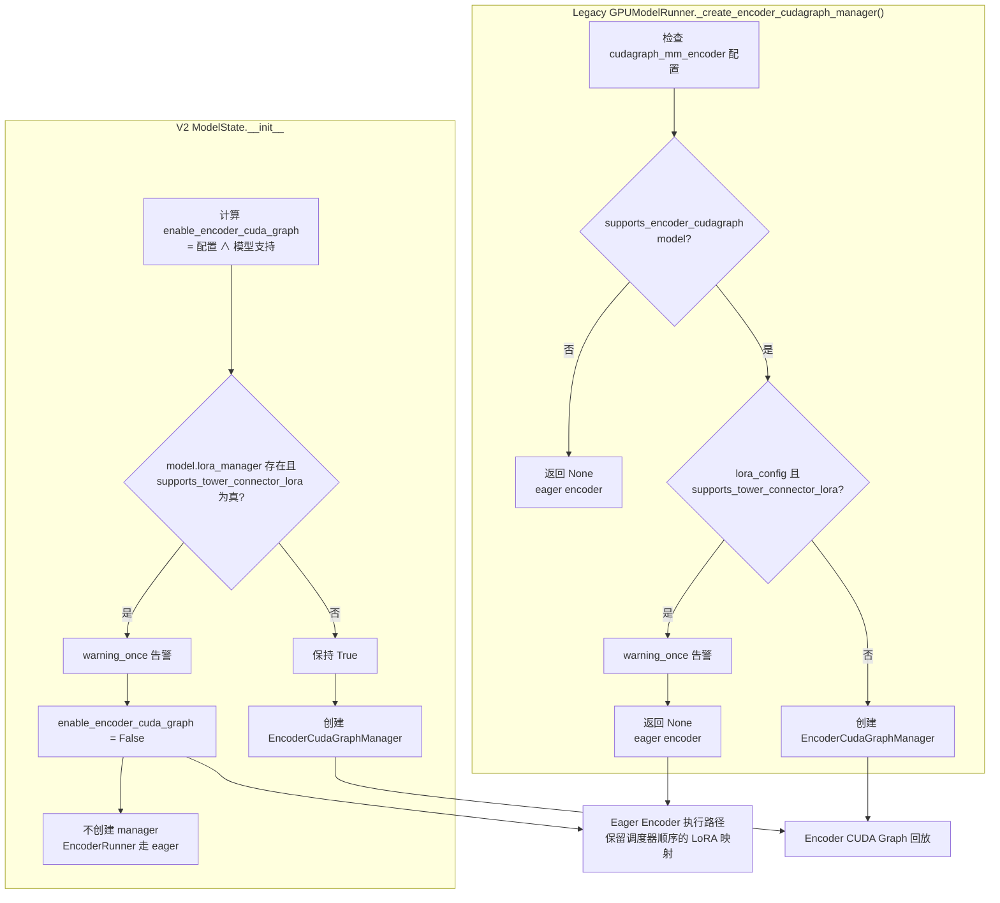
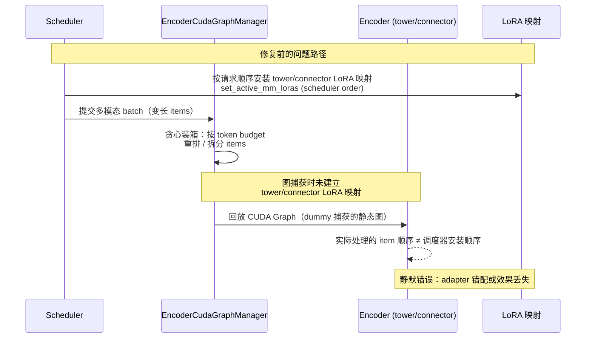

# PR #52376: [Bugfix][LoRA] Disable encoder graphs for tower LoRA

> **作者**: @Gusanidas | **状态**: OPEN | **日期**: 2026-08-14
> **Branch**: `Gusanidas:codex/encoder-cudagraph-tower-lora` → `main` | **Labels**: `bug`, `needs-rebase`, `ci/build`, `qwen`, `nvidia`, `mrv2`
> **变更规模**: +219 -8 行，涉及 7 个文件
> **Assignee**: @shen-shanshan | **Reviewers**: @Harry-Chen, @njhill, @jeejeelee, @yewentao256, @WoosukKwon, @khluu

---

## 1. 总结 (Summary)

本 PR 修复了一个静默正确性 bug：当同时启用 **encoder CUDA Graph**（`cudagraph_mm_encoder`）与 **tower/connector LoRA**（`enable_tower_connector_lora`）时，图回放可能错误地应用 LoRA adapter 状态，或完全丢失 adapter 效果。修复方式是在两条 model runner 路径（legacy `GPUModelRunner` 与 V2 `ModelState`）中，检测到 tower/connector LoRA 支持时**直接禁用 encoder CUDA Graph 管理器**，回退到既有的 eager encoder 执行路径，同时保留纯语言模型 LoRA 场景下的 encoder graph 加速。PR 补充了两个 runner 路径的单元测试，并扩展 Qwen2-VL LoRA 集成测试以在真实 CUDA 环境下验证该 guard 生效。

## 2. 背景与动机 (Background & Motivation)

vLLM 的 LoRA 支持已从纯语言模型扩展到多模态视觉模块：`enable_tower_connector_lora` 允许对 VLM 的 **vision tower**（ViT）和 **connector**（投影层）施加 LoRA adapter。这类 adapter 的激活映射（mapping）由调度器按 batch 内请求顺序安装（`set_active_mm_loras`）。

另一方面，vLLM V1 引入了 encoder CUDA Graph（`cudagraph_mm_encoder`），通过按 token budget 捕获 ViT 前向图来消除 kernel 启动开销（见 PR #35963 的 ViT Full CUDA Graph 特性）。但两者叠加时存在根本性冲突：

1. **图捕获阶段不建立 tower/connector LoRA 映射** —— 捕获时用的是 dummy 输入，捕获的图内没有正确的 adapter 状态安装逻辑；
2. **图回放阶段可能重排/拆分多模态 items** —— encoder graph 回放为了适配 token budget 会进行贪心装箱（bin-packing），可能对变长多模态输入重新排序或拆分，而调度器安装的 LoRA 映射是严格按请求顺序的。

结果是：回放图时 adapter 映射与实际处理的 item 错位，**静默地**应用错误的 adapter 状态或丢失 adapter 效果——没有报错，输出却是错的。这是比崩溃更危险的正确性问题。

本 PR 选择最保守且工程上稳妥的方案：**检测到 tower/connector LoRA 时禁用 encoder CUDA Graph，回退 eager 路径**，而不是尝试在图捕获/回放中加入复杂的 per-graph-batch LoRA 映射支持。

## 3. 代码修改分析 (Code Change Analysis)

### 3.1 修改的模块

| 文件 | 操作 | 说明 |
|------|------|------|
| `vllm/v1/worker/encoder_cudagraph.py` | 修改 | 新增警告常量 `ENCODER_CUDAGRAPH_TOWER_CONNECTOR_LORA_WARNING`，供两条 runner 路径复用 |
| `vllm/v1/worker/gpu_model_runner.py` | 修改 | **legacy V1 路径**：`_create_encoder_cudagraph_manager()` 中检测 `lora_config` + `supports_tower_connector_lora()`，成立则记警告并返回 `None` |
| `vllm/v1/worker/gpu/model_states/interface.py` | 修改 | **V2 路径**：`ModelState.__init__` 中检测 model 挂载的 `lora_manager.supports_tower_connector_lora`，成立则将 `enable_encoder_cuda_graph` 置 `False` |
| `tests/v1/worker/test_gpu_model_runner.py` | 修改 | 新增 legacy 路径 guard 矩阵测试：`unsupported-model` / `language-only` / `tower-connector` 三种组合 |
| `tests/v1/worker/test_encoder_runner.py` | 修改 | 新增 V2 `ModelState` 路径测试，参数化 `None / False / True` 三种 LoRA 支持状态；文件 docstring 扩写 |
| `tests/lora/test_qwenvl.py` | 修改 | Qwen2-VL LoRA 集成测试：开启 encoder CUDA Graph 配置，验证三种 adapter 类型输出正确，且 V2 下无 encoder graph manager 创建 |
| `.buildkite/test_areas/lora.yaml` | 修改 | 将三个运行时文件加入 LoRA CI job 的 `source_file_dependencies`，触发 Buildkite LoRA 测试 |

### 3.2 架构 / 流程图 (Architecture / Flow Diagram)

#### 修复后的 guard 决策流程（两条 runner 路径）

#### Bug 机制（修复前）

### 3.3 关键实现细节

- **统一警告常量**：`ENCODER_CUDAGRAPH_TOWER_CONNECTOR_LORA_WARNING`（"`cudagraph_mm_encoder` is incompatible with `enable_tower_connector_lora`; using eager encoder execution."）定义在 `encoder_cudagraph.py`，两处 guard 通过 `logger.warning_once` 只告警一次，避免刷屏。
- **Legacy 路径**（`gpu_model_runner.py:6756-6765`）：在模型支持检查之后插入 guard——`if self.lora_config and self.lora_manager.supports_tower_connector_lora()`。注意这里 `WorkerLoRAManager.supports_tower_connector_lora` 是**方法**（调用形式），返回 `None` 前先 `warning_once`。
- **V2 路径**（`model_states/interface.py:75-89`）：在 `ModelState.__init__` 计算 `enable_encoder_cuda_graph` 后追加条件，通过 `getattr(model, "lora_manager", None)` 取 model 挂载的 manager，再用 `getattr(lora_manager, "supports_tower_connector_lora", False)` 判定。代码注释特别说明：**model 挂载的 `LoRAModelManager` 将其暴露为 bool 属性，而 V1 的 `WorkerLoRAManager` 同名的是方法**——这是两处 guard 写法不对称的根源。
- **语义差异**：V1 用 `self.lora_config` 判空，V2 用 `lora_manager is not None` 判空，逻辑等价但来源不同（V2 中 manager 直接挂在 model 上）。
- **测试设计**：
  - Legacy 矩阵测试覆盖三种组合 `(model_supports_cudagraph, supports_tower_connector_lora)`：`(False, True)`、`(True, False)`、`(True, True)`，分别断言 manager 不创建/创建及告警行为；
  - V2 测试参数化 `None / False / True`（对应无 LoRA 支持 / 纯语言 LoRA / tower-connector），断言 `has_cudagraph()` 状态；
  - 集成测试在 CUDA 平台强制 `VLLM_USE_V2_MODEL_RUNNER=1`，注入 `ENCODER_CUDAGRAPH_COMPILATION_CONFIG`（`cudagraph_mm_encoder=True`、token budget 2048、每 batch 最多 2 个 vision items），跑完三种 adapter 后通过 `collective_rpc` 向所有 worker 收集 `encoder_runner.has_cudagraph()` 并断言全部为 `False`。

## 4. 涉及的技术原理 (Technical Principles)

- **Tower/Connector LoRA**：`enable_tower_connector_lora` 允许 LoRA adapter 作用于 VLM 的视觉 tower（如 Qwen2-VL 的 ViT）与 connector（多层投影）。与语言模型 LoRA 不同，多模态 LoRA 的激活需要在 encoder 执行前按 batch 内容逐 item 安装（`set_active_mm_loras`），映射关系依赖调度器的请求顺序。
- **Encoder CUDA Graph（`cudagraph_mm_encoder`）**：为消除 ViT 大量小 kernel 的启动开销，vLLM V1 按「token budget」预捕获若干静态图，回放时用贪心装箱把变长多模态 items 打包进预算内。装箱可能改变 item 在 batch 内的相对顺序或将一个 item 拆到多个图批次中。
- **冲突本质**：CUDA Graph 捕获的是静态计算图，图内只能固化捕获时的状态。tower/connector LoRA 的权重是运行时动态安装的，且其正确应用依赖于「item ↔ adapter」的顺序一致性。图回放的重排/拆分打破了这个一致性，而捕获阶段也没有安装有效映射的机制。
- **Eager fallback 的代价**：禁用 encoder graph 后，tower/connector LoRA 场景回到 eager encoder 执行，损失了图带来的 kernel 启动开销优化。这是「正确性优先于性能」的取舍，纯语言 LoRA + encoder graph 的组合不受影响。
- **V1 vs V2 Model Runner（mrv2）**：legacy `GPUModelRunner` 是单体 runner，`_create_encoder_cudagraph_manager()` 集中创建管理器；V2 将模型状态拆分为 `ModelState` 对象（`vllm/v1/worker/gpu/model_states/interface.py`），encoder graph 管理器的创建逻辑分散在各 ModelState 初始化中。因此修复必须同时覆盖两条路径。

## 5. 评论区讨论亮点 (Discussion Highlights)

- **Mergify bot（2026-08-18）**：提示 PR 存在 merge conflict，需要 rebase（对应 `needs-rebase` label，`mergeable: false`、`mergeable_state: dirty`）。截至 2026-08-19 作者已推送新 commit 至分支（`pushed_at: 2026-08-19`），但冲突是否完全解决仍需确认。
- **@linitra24（2026-08-19）**：社区贡献者对该 bug 感兴趣，请求作者分享复现该问题的具体步骤/命令。作者尚未在评论区回复——PR 描述中虽给出了修复原理，但没有给出最小复现脚本。
- **Claude Code review bot**：由于 PR 来自 fork，自动 review 被禁用，仅提示维护者可手动触发 `@claude review`。尚无人工 review 结论。

## 6. 风险与潜在问题 (Risk Analysis)

| 风险 | 严重程度 | 说明 |
|------|---------|------|
| V2 路径 `getattr(lora_manager, "supports_tower_connector_lora", False)` 对方法对象的语义 | Medium | 注释声称 model 挂载的是 `LoRAModelManager`（bool 属性），但若实际挂载的是 `WorkerLoRAManager`（方法），bound method 恒为 truthy，会导致**纯语言 LoRA 场景也被禁用 encoder graph**，造成不必要的性能回退。单元测试只覆盖了 bool 语义，未覆盖方法语义 |
| 性能回退范围 | Medium | 所有 tower/connector LoRA 场景的 encoder 均失去 CUDA Graph 加速（RTX 3090 上集成测试耗时 320s+，eager 路径下 ViT 前向开销更高）。对多图/高分辨率 batch 的 VLM 服务吞吐有可见影响。PR 未提供禁用前后的性能对比数据 |
| `needs-rebase` 未确认解决 | Medium | Mergify 报告 merge conflict（8-18），`mergeable_state: dirty`。若 CI 关键文件（如 `gpu_model_runner.py`）冲突未妥善解决，可能引入语义错误 |
| 两处 guard 逻辑漂移风险 | Low | 同一策略在 V1（方法调用 + `lora_config` 判空）与 V2（属性访问 + `lora_manager` 判空）以不同形式实现，未来新增第三条 runner 路径或重构 LoRA manager 时容易遗漏同步 |
| 缺省行为无用户可见开关 | Low | 用户配置了 `cudagraph_mm_encoder=True` + `enable_tower_connector_lora=True` 时只会收到一条 warning（`warning_once`），无配置校验错误。行为是静默降级，符合设计意图但用户需从日志发现 |
| CI 依赖覆盖 | Low | `.buildkite/test_areas/lora.yaml` 仅更新了 NVIDIA/ROCm LoRA jobs 的 source deps；`tests/v1/worker/` 的 CPU 单测是否在对应 job 中执行（`cpu_test` 标记）需确认 |

## 7. 结论 (Conclusion)

这是一个小而精的正确性修复：改动集中在两处 guard + 共享警告常量，测试覆盖了单测矩阵与真实 CUDA 集成验证（三种 adapter 类型 + 所有 worker 断言无 encoder graph manager），整体质量良好。主要遗留问题是 merge conflict 待 rebase 解决，以及 V2 路径对「bool 属性 vs 方法」的依赖需要 reviewers（尤其 mrv2 相关维护者）确认 `LoRAModelManager` 的实际挂载形态，避免误伤纯语言 LoRA 的 encoder graph 加速。
