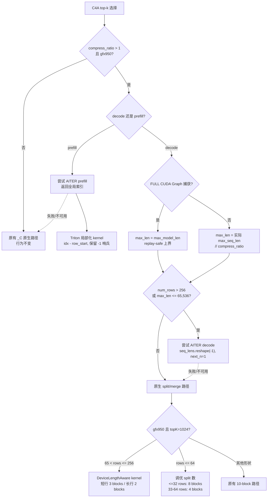
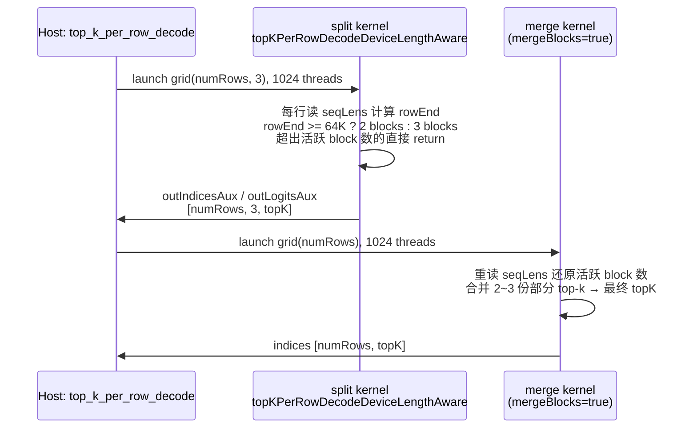

# PR #52882: [ROCm][Perf] Optimize DeepSeek V4 C4A top-k with AITER

> **作者**: @Fangzhou-Ai | **状态**: OPEN | **日期**: 2026-08-19
> **Branch**: `Fangzhou-Ai:rocm-dsv4-c4a-topk` → `vllm-project:main` | **Labels**: `performance`, `rocm`, `deepseek`, `DSv4`
> **变更规模**: +464 -27 行，涉及 5 个文件（3 commits）
> **Tracking issue**: #41820

---

## 1. 总结 (Summary)

本 PR 针对 DeepSeek V4 在 ROCm 平台上的 C4A 稀疏注意力索引器 top-k 选择瓶颈，构建了一套**混合调度**方案：短/中上下文走 AITER（AMD 优化算子库）v0.1.19 的公开 top-k 算子，长上下文在 gfx950 上走**针对 C4A 形状调优的原生 split/merge kernel**，并依据 `num_rows` 与有效列数自动在两条路径间切换。同时正确处理了 AITER prefill 返回全局索引的局部化、MTP 多查询行的精确边界、以及 FULL CUDA Graph 捕获下 kernel 选择必须 replay-safe 这三个正确性问题。实测 eager 模式 10K 上下文几何平均加速 2.85x，端到端 serving 吞吐提升约 +4.95%（TPOT 降低 4.76%）。

---

## 2. 背景与动机 (Background & Motivation)

DeepSeek V4 的 C4A（Compressed Context Attention）稀疏注意力索引器需要为每个 query 从压缩后的上下文中选出 top-k 个 token。生产形状为：FP32 logits、固定分配宽度 `1,048,576 / 4 = 262,144` 列（compress_ratio=4）、`k=1024`。在 ROCm 上，原生的 vLLM `_C` top-k kernel 成为推理瓶颈。

**此前相关工作的问题**（#46172、#50470、#52878 的解码部分）：
- 简单地把 decode 无条件切到 AITER 会在**长上下文**（如 agentX benchmark）下引入回退：AITER v0.1.19 的 decode API **只支持单 block**，长行场景下比原生多 block split 慢。
- AITER v0.1.19 只接受 1-D 请求长度，而 vLLM 提供的是 2-D `(batch, next_n)` 的 MTP 精确边界——直接传入原始 `next_n` 并不等价。
- AITER prefill 返回的是 packed/全局索引，vLLM 消费方需要序列局部索引。

本 PR 的定位是上述 PR 的**更完整替代方案**：AITER 短上下文路径 + 长上下文 gfx950 调优原生回退 + 自动混合调度 + 完整正确性覆盖。对比无条件 AITER 调度，本混合方案在 500K/1M 上下文分别快 1.21x/1.76x。

---

## 3. 代码修改分析 (Code Change Analysis)

### 3.1 修改的模块

| 文件 | 操作 | 说明 |
|------|------|------|
| `csrc/libtorch_stable/sampler.cu` | 修改 | 新增 `topKPerRowDecodeDeviceLengthAware` 设备长度感知 split/merge kernel；在 `top_k_per_row_decode` 长序列分支加入 gfx950 门控的调优 dispatch（+122 -11） |
| `vllm/v1/attention/ops/rocm_aiter_mla_sparse.py` | 修改 | AITER top-k 算子封装（prefill/decode）、Triton 索引局部化 kernel、自动调度策略 `_use_aiter_c4a_decode_topk_auto`、FULL graph replay-safe 上界（+158 -16） |
| `tests/kernels/test_top_k_per_row.py` | 修改 | 新增 8 组 gfx950 长上下文 C4A 参数化测试 + AITER prefill/decode 正确性测试 + 调度策略单测（+180） |
| `vllm/model_executor/layers/sparse_attn_indexer.py` | 修改 | `SparseAttnIndexer` 新增 `compress_ratio` 参数并透传至 `forward_hip` → `rocm_aiter_sparse_attn_indexer`（+3） |
| `vllm/models/deepseek_v4/attention.py` | 修改 | 构造 indexer 时传入 `compress_ratio=self.compress_ratio`（+1） |

### 3.2 架构 / 流程图 (Architecture / Flow Diagram)

#### decode 路径的混合调度决策

#### 原生 DeviceLengthAware 两段式 kernel 启动

关键点：grid 固定为 `(numRows, 3)`，行内活跃 block 数随设备上的实际 seq_len 变化（2 或 3），因此 **FULL CUDA Graph 捕获的 grid/workspace 形状保持不变**，只有 kernel 内部行为自适应——这是 capture-stable 的核心设计。

### 3.3 关键实现细节 (Key Implementation Details)

**C++ 层（`sampler.cu`）**
- `topKPerRowJob` 模板新增 `deviceLengthAware` 参数，并加 `static_assert(!deviceLengthAware || multipleBlocksPerRow != mergeBlocks)` 防止误用。
- 新增 `topKPerRowDecodeDeviceLengthAware` kernel：支持 1-D/2-D `seqLens`（`seqLensIs2D` 标志），按 `next_n` 反推每行的精确 `rowEnd`；`kLongRowThreshold = 64 * 1024` 决定每行用 2 个还是 3 个 split block；split 阶段输出到 `[numRows, 3, topK]` 辅助缓冲，merge 阶段重读 `seqLens` 合并活跃 block 的部分结果。
- `top_k_per_row_decode` 长序列分支新增 gfx950 门控（`strncmp(gcnArchName, "gfx950", 6)`）：
  - `topK==1024 && 64 < numRows <= 256` → DeviceLengthAware 3-block 路径（提前 return）；
  - `topK==1024 && numRows <= 64` → 沿用原 split/merge，但 split block 数从固定的 10 调优为 8（≤32 行）或 4（33–64 行），且 split 线程数固定 1024；
  - 其余情况保持原有 10-block 路径不变（CUDA 后端行为完全不受影响）。

**Python 层（`rocm_aiter_mla_sparse.py`）**
- `_get_aiter_topk_ops()`：`functools.cache` 缓存 `aiter.ops.topk` 的导入结果；AITER 缺失时返回 `None`，调用方安全回退原生路径。
- `_aiter_top_k_per_row_prefill`：调用 AITER prefill 算子后用 Triton kernel `_localize_aiter_prefill_topk_kernel` 把全局索引减去 `row_start` 得到序列局部索引，负数（`-1` 填充哨兵）原样保留。
- `_aiter_top_k_per_row_decode`：`seq_lens.reshape(-1)` 展平 + `next_n=1`，使 AITER 按行独立重建边界，与 vLLM 原生的精确 2-D per-token 边界（`num_speculative_tokens=2,3,4`）保持一致。
- `_use_aiter_c4a_decode_topk_auto(num_rows, max_valid_seq_len)`：仅在 gfx950 上启用；`num_rows > 256` 或 `max_valid_seq_len <= 65_536` 时选 AITER，否则走原生（实测 256/257 行与 64K 列是 AITER/原生的速度交叉点）。
- decode 调度入口：FULL graph 模式下用 `max_model_len` 作为 replay-safe 上界（FULL graph 不按上下文长度 keyed，捕获时必须以最坏情况固定 kernel 选择）；eager/PIECEWISE 模式用实际 `max_seq_len // compress_ratio`。策略命中但 AITER 调用失败时自动落回 `_C` 原生 op。

**`compress_ratio` 透传**
- `SparseAttnIndexer.__init__` / `forward_hip`、`rocm_aiter_sparse_attn_indexer`（及 fake op）新增 `compress_ratio: int = 1` 参数；DeepSeek V4 attention 层传入真实值。默认值 1 保证其他模型行为不变（AITER 路径仅在 `compress_ratio > 1` 且 gfx950 时激活）。

**测试**
- 8 组 gfx950 长上下文参数化测试（eight-splits / four-splits / dynamic short/three/two-splits / 65,535–65,536 边界混合 / max-rows / baseline fallback），覆盖 2-D 与 1-D `seq_lens`。
- AITER prefill 局部化测试（非零 `row_starts`、`-1` 哨兵）；AITER decode MTP 精确边界测试（N=2/3/4）；`_use_aiter_c4a_decode_topk_auto` 策略边界单测。

---

## 4. 涉及的技术原理 (Technical Principles)

### 4.1 C4A 稀疏注意力索引器

DeepSeek V4 使用压缩上下文稀疏注意力：KV 被压缩（compress_ratio=4），每个 query 先与压缩后的 key 计算 indexer 分数（logits），再从中选 top-k 个 token 做精确注意力。logits 是 FP32、固定宽度 262,144 列、`k=1024` 的"宽而矮"矩阵——每行要扫 262K 列选出 1024 个最大值，这决定了 top-k kernel 是整个 indexer 的性能热点。

### 4.2 vLLM 原生 top-k 的直方图/radix 两段式算法

`topKPerRowJob` 采用"half - 11 - 11 - 10 bit"的浮点位迭代：通过直方图按指数位段逐级定位 top-k 区间，再在候选集中精确排序。长序列走 **split + merge 两段式**：split 阶段多个 block 并行处理同一行（`multipleBlocksPerRowConfig` 个 block 各扫一段，各留 top-k 候选），merge 阶段单 block 合并所有部分结果。本 PR 的原生优化本质是**为 gfx950（Wave64）重新调 split block 数/线程数**，并新增"按设备长度决定活跃 block 数"的自适应变体——与 #46012 的 Wave32 LDS 安全修复是两回事。

### 4.3 AITER top-k 的语义差异

AITER（AMD 的 ROCm 模板算子库）v0.1.19 提供 `top_k_per_row_prefill` / `top_k_per_row_decode`：
- **decode API 单 block only**——短行快（省去多 block 协调开销），长行慢（一个 block 扫 262K 列）。
- **prefill 返回 packed/全局索引**（多 block 结果的全局位置），而 vLLM 后续 sparse attention 需要序列局部索引，故需要局部化后处理。
- **只接受 1-D 长度**——vLLM MTP 场景每个请求贡献 `N+1` 行 query、边界各不相同（`(batch, next_n)` 2-D），必须展平后逐行传递。

### 4.4 CUDA Graph 的 capture-stable 约束

FULL CUDA Graph 按（batch 形状）捕获、不按上下文长度 keyed，因此捕获时做出的 kernel 选择在任意上下文长度回放时必须仍然正确：
- Python 层用 `max_model_len` 上界做策略判断（长上下文 → 原生，replay-safe）；
- 原生 kernel 用固定 grid `(numRows, 3)` + 固定 workspace 形状，行内活跃 block 数（2 或 3）随设备长度自适应——既保持捕获稳定，又避免为最坏情况浪费计算。

### 4.5 MTP（多 token 预测）的边界语义

MTP 下每个请求贡献 `N+1` 个 target query 行，第 i 行（`0 <= i < N`）的有效 logits 范围是 `seq_len - N + i + 1`。把 2-D 边界展平传给 AITER（`next_n=1`）等价于原生路径的精确 per-token 边界；若直接传 `next_n=N`，AITER 会自行重建近似边界，导致选出的 token 集合不同（静默影响接受率与输出质量）。

---

## 5. 评论区讨论亮点 (Discussion Highlights)

### 动机澄清：为什么不是无条件切 AITER

作者 @Fangzhou-Ai 在开 PR 后主动 @tjtanaa、@qli88 说明：

> "a simple adoption of aiter topk kernel is introducing regressions under long-context inference tasks, e.g. agentX benchmark, hence I would like to prioritize my comprehensive solutions here, with low-conc aiter path and high-conc optimized native path."

即此前简单采用 AITER 的方案（含 #52878 的解码部分）在长上下文推理任务上出现回退，本 PR 的混合设计正是针对这一点。

### CI 状态说明

作者指出当前 `pre-commit` 全量检查失败与 PR 的五个文件无关——E501/ruff-format 报错位于 `vllm/platforms/cpu.py:184,190`，由 main 上的 #49688 引入；本地对全部改动文件的 hooks 均通过，选择不在这个 ROCm 实质性 PR 中顺带修无关的 CPU 格式问题。

### @claude 自动 review（由 @shen-shanshan 触发）

Claude Code bot 的结论是"未发现 bug"，但明确建议人工 review。其重点分析：
- **静默正确性风险**：top-k 选择错误不会崩溃，而是静默降低注意力质量——高严重性、难检测的失败模式；
- **测试覆盖局限**：新增测试全部 gfx950 门控，其他平台直接 skip，CI 无法执行；
- **验证未完成**：作者自述 final-head serving smoke 与完整 1,319 题 GSM8K 跑分尚未完成；
- **AI 辅助声明**：PR 描述明确说明使用 OpenAI Codex 辅助实现，要求人工逐行 review 后才可标记 ready。

### 当前状态

- 尚无人工 reviewer 的 inline 评论（review_comments: 0），无 Approved review。
- `mergeable_state: unstable`（`rebaseable: false`），合并前需处理与 main 的冲突/CI 状态。

---

## 6. 风险与潜在问题 (Risk Analysis)

| 风险 | 严重程度 | 说明 |
|------|---------|------|
| **静默正确性退化** | High | top-k 索引选错不会崩溃，只会静默降低注意力质量（影响输出与 MTP 接受率）。84-shape 正确性矩阵来自作者本地 harness，未进入 CI。 |
| **gfx950 路径 CI 不可覆盖** | High | 所有新 kernel 路径与新测试均 gfx950 门控（`strncmp(gcnArchName, "gfx950", 6)` + pytest skip），通用 CI 完全跑不到，回归只能靠作者本地复现。 |
| **AITER 版本耦合** | Medium | 依赖 AITER v0.1.19 的 `aiter.ops.topk` 公开 API 与性能特征（单 block decode、多 block prefill）。导入失败会安全回退原生路径（行为正确），但性能收益随版本变化；未来 AITER 升级多 block decode 后 65K 阈值可能过时。 |
| **CUDA Graph 捕获正确性** | Medium | FULL graph 用 `max_model_len` 作为 replay-safe 上界固定 kernel 选择，依赖 `compress_ratio > 1` 时 `max_model_len` 语义与压缩列数的一致性；若未来 max_model_len 含义变化，捕获的 kernel 选择可能静默失配。merge kernel 重读 `seqLens` 还原活跃 block 数，依赖 split/merge 两次 launch 之间设备长度不变（同一 step 内成立，但属隐式约束）。 |
| **硬编码 magic numbers** | Medium | `65_536` 阈值、`256` 行边界、block 数 8/4/3/2、64K 列阈值、gfx950 字符串匹配分散在 C++/Python 两处，调参依据是单卡 gfx950 MI355 的实测数据，其他 ROCm 架构（gfx942 等）完全不激活，维护与迁移成本高。 |
| **验证未完成** | Medium | 作者自述：final-head serving smoke、完整 GSM8K 跑分未完成；同 flag 交替重复的 parent A/B（重建 extension 后）pending。主要性能声明（+4.95%）依赖的对比基线运行配置不同（AITER 运行改了 `--max-model-len` 等 flag），作者已注明这不是单 flag A/B。 |
| **合并状态** | Low | `mergeable_state: unstable`，需 rebase；CI 红由无关的 #49688 pre-commit 问题导致，需等 main 修复或 rerun。 |
| **其他模型影响** | Low | `compress_ratio` 默认 1，AITER 路径仅在 `compress_ratio > 1` 且 gfx950 时激活；CUDA 后端与旧 ROCm 架构行为不变。 |

---

## 7. 结论 (Conclusion)

PR #52882 是一个工程化程度很高的性能 PR：针对 C4A top-k 在"短上下文 AITER 快、长上下文原生快"的实测特征，设计了带正确性适配的混合调度（索引局部化、MTP 精确边界、graph 捕获安全三项都做了专门处理），并附有 84-shape kernel 矩阵、GSM8K 0.970 精度与端到端 +4.95% 吞吐的实测数据。主要风险在于 gfx950 专用路径的 CI 不可覆盖性与作者自述的验证收尾工作（最终 smoke、完整 GSM8K、rebase），在人工 review 确认这三项之前不宜合并。
