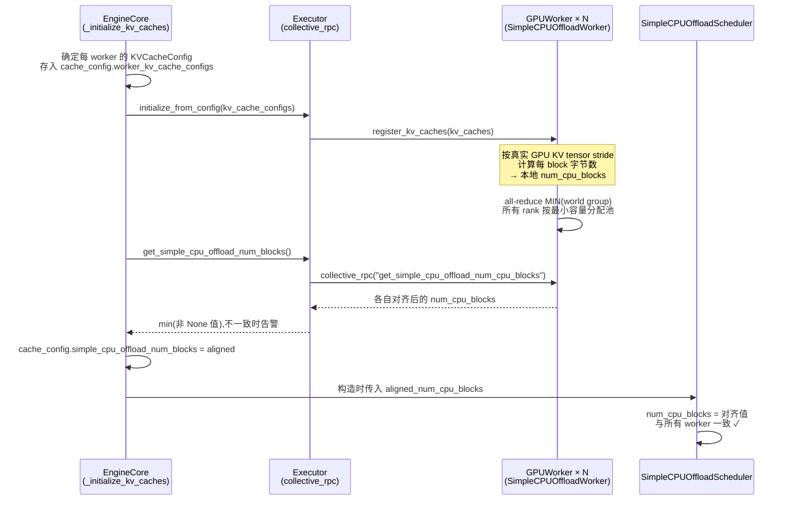
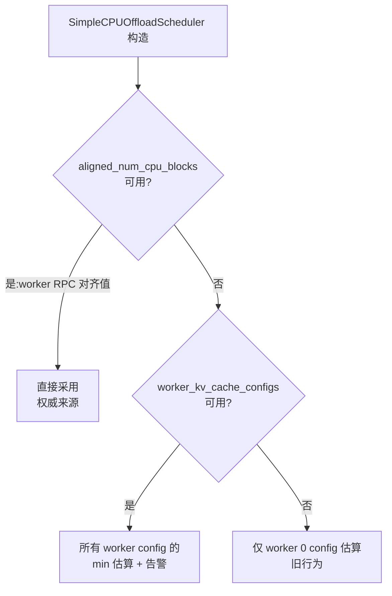

# PR #52921: fix(simple_kv_offload): align CPU offload pool size across PP/spec-decode workers

> **作者**: @charxwu | **状态**: OPEN | **日期**: 2026-08-19(最近更新 2026-08-25)
> **Branch**: `charxwu:fix/simple-cpu-offload-pp-alignment` → `vllm-project:main` | **Labels**: `kv-connector`, `verified`
> **变更规模**: +410 -14 行,涉及 11 个文件(6 个 commit)
> **Reviewers**: xuechendi, NickLucche, njhill, ivanium, orozery, ApostaC, heheda12345(尚无人工 review)

---

## 1. 总结 (Summary)

本 PR 修复 `SimpleCPUOffloadConnector` 中的一个**正确性 bug**:在流水线并行(PP,层数分配不均)或投机解码(draft KV 位于最后一个 PP stage)场景下,调度器与 worker 对 `num_cpu_blocks` 的计算结果不一致,导致调度器可能分配超出某个 worker 实际 CPU/磁盘池容量的 `cpu_block_id`,引发越界 DMA 拷贝(实测 MI355X TP8×PP2 上 `hipMemcpyBatchAsync` SIGSEGV)。核心修复分三层:**worker 侧**基于真实 GPU KV tensor 的 stride 计算每 block 字节数,并通过 **all-reduce MIN** 跨世界组对齐;**engine 侧**在 `initialize_from_config()` 之后、调度器构造之前,通过 collective RPC 收集对齐值;**调度器侧**以 worker 对齐值作为权威池大小(带 config 估算兜底 + 告警)。该修复使上游无需再依赖 InferenceX 的 `patch_kv_offload_block_cap.py` 手工 clamp 方案。

## 2. 背景与动机 (Background & Motivation)

`SimpleCPUOffloadConnector` 是 vLLM 的 KV Cache CPU/磁盘卸载组件,调度器管理一个固定大小的 offload block 池,worker 各自分配 CPU/磁盘缓冲区。原有实现中,**调度器与 worker 各自独立估算 `num_cpu_blocks`**:

- 调度器基于本进程持有的 KVCacheConfig(通常对应 worker 0)按 `num_gpu_blocks * cpu_capacity // gpu_total_bytes` 估算;
- worker 基于自己注册的真实 KV tensor 计算。

在以下两种拓扑下两者会**不一致**:

1. **PP 层数不均**:不同 stage 持有不同层数的 KV cache,每 block 字节数不同。层数多的 rank 每字节容量能容纳的 block 数更少(更"重"),但调度器按较轻 rank(如 PP0)的估算分配 `cpu_block_id`,重的 rank(如 PP1)实际分配不了那么多 block → 越界。
2. **投机解码**:draft 模型的 KV 额外落在最后一个 PP stage,使该 stage 的每 block 字节数大于其他 stage,同理导致越界。

实测数据(PR 描述):

| 场景 | 修复前 | 修复后 |
|------|--------|--------|
| TP4×PP2 手动测试 | PP0=50, PP1=46, scheduler=50 | 全部 **46**(`aligned 50→46`) |
| Kimi-K3 TP8×PP2(MI355X) | PP0=809, PP1=746, scheduler=809 | 全部 **746**(`aligned 809→746`) |

修复前 scheduler 按 809 分配 block id,而 PP1 只分配了 746 个 block 的缓冲区,id 746–808 的 offload 拷贝直接越界。该 PR 取代了 InferenceX 分叉中手工设置 `KV_OFFLOAD_MAX_CPU_BLOCKS` 的 monkey-patch 方案,免去按拓扑手工调参。

## 3. 代码修改分析 (Code Change Analysis)

### 3.1 修改的模块

| 文件 | 操作 | 说明 |
|------|------|------|
| `vllm/v1/simple_kv_offload/sizing.py` | 新增 (+130) | 共享 sizing helpers:基于 stride 的真实字节数计算、本地 block 数、all-reduce MIN 同步、config 估算(min 聚合) |
| `vllm/v1/simple_kv_offload/manager.py` | 修改 (+39 -6) | 调度器新增 `worker_kv_cache_configs` / `aligned_num_cpu_blocks` 参数;对齐值优先,config min 兜底并告警;`_derive_cpu_config` 支持显式 block 数 |
| `vllm/v1/simple_kv_offload/worker.py` | 修改 (+20 -7) | `register_kv_caches` 不再直接算 block 数;`_init_cpu_mode` / `_init_disk_mode` 先算本地值再 all-reduce MIN 同步后分配缓冲区 |
| `vllm/distributed/kv_transfer/kv_connector/v1/simple_cpu_offload_connector.py` | 修改 (+26) | 新增 `_find_simple_cpu_offload_connector` 递归查找(穿透组合 connector);`get_aligned_num_cpu_blocks()`;把两个新参数传给调度器 |
| `vllm/v1/engine/core.py` | 修改 (+6) | `_initialize_kv_caches` 中保存 `worker_kv_cache_configs`,并在 `initialize_from_config()` 后通过 executor RPC 取对齐值写入 `cache_config` |
| `vllm/v1/executor/abstract.py` | 修改 (+17) | 新增 `get_simple_cpu_offload_num_blocks()`:collective RPC + 取 min + 不一致告警 |
| `vllm/v1/worker/gpu_worker.py` | 修改 (+12) | worker 侧 RPC 实现 `get_simple_cpu_offload_num_cpu_blocks()`:查找 connector 并返回对齐后的 block 数 |
| `vllm/config/cache.py` | 修改 (+8) | 新增两个 `init=False` 字段:`worker_kv_cache_configs`(每 worker 的 KVCacheConfig 列表)、`simple_cpu_offload_num_blocks`(worker 对齐值) |
| `tests/v1/simple_kv_offload/test_scheduler.py` | 修改 (+67 -1) | 3 个新测试:最重 worker 决定 block 数、调度器使用 worker configs、对齐值覆盖估算 |
| `tests/v1/simple_kv_offload/test_sizing.py` | 新增 (+48) | GPU 测试:真实 tensor stride 计算的每 block 字节数大于 config 估算(含 padding) |
| `tests/v1/simple_kv_offload/test_worker.py` | 修改 (+37) | 2 个测试:world_size=1 时同步为 no-op;mock `all_reduce` 验证使用 `ReduceOp.MIN` |

### 3.2 架构 / 流程图 (Architecture / Flow Diagram)

#### 启动时的端到端对齐流程

#### 调度器三级 sizing 决策

### 3.3 关键实现细节 (Key Implementation Details)

- **`sizing.py` — 真实字节数计算** (`build_unique_gpu_block_views`):按 `(device, storage.data_ptr())` 去重 KV tensor(同一 backing allocation 只算一次),用 `tensor.stride(0) * element_size()` 计算每 block 字节数,比 config 估算更准确(能捕捉到 padding 和 PP 层数差异)。
- **`sizing.py` — 集体同步** (`sync_num_offload_blocks_across_workers`):`world_size <= 1` 直接返回;否则在 `world_group.cpu_group` 上做 `dist.all_reduce(..., op=ReduceOp.MIN)`,并 log `aligned 809→746` 这类信息。CPU/磁盘两种模式都走此路径。
- **`sizing.py` — config 估算的保守化** (`compute_num_offload_blocks_from_configs`):对所有 worker config 取 **min**(即由最重的 worker 决定),作为 RPC 不可用时的兜底;`gpu_total_bytes` 增加了「tensor size 各不相同 → 视为互不相交分配,取 sum」的 fallback 分支。
- **executor 抽象层** (`abstract.py`):RPC 返回的列表过滤 `None` 后取 min;多个不同值会打 warning——即使 worker 间 all-reduce 失效,engine 侧仍有第二道保险。
- **engine 时序** (`core.py`):对齐值在 `initialize_from_config()`(内部完成 `register_kv_caches()` 与 all-reduce)之后、connector/调度器构造之前写回 `cache_config`,保证调度器构造时一定能读到。
- **`CacheConfig` 新字段** 均为 `init=False` 的运行时字段,不参与配置初始化,仅作为 engine 初始化过程中的数据通道。

## 4. 涉及的技术原理 (Technical Principles)

- **SimpleCPUOffloadConnector**:vLLM V1 的 KV Cache offload 组件,调度器维护 CPU/磁盘 block 池(LRU 淘汰),worker 负责异步批量拷贝(ROCm 上用 `hipMemcpyBatchAsync`)。调度器分配的 `cpu_block_id` 必须对所有参与卸载的 worker 有效——这是本 bug 的约束来源。
- **PP 与每 block 字节数**:不同 PP stage 持有不同数量的 transformer 层,其 KV cache 总字节数不同;而 block 数是按调度粒度划分的。层数多的 stage「每 block 字节数」更大,同样的 CPU 容量能容纳的 block 数更少。旧实现只按 worker 0 的 config 估算,天然覆盖不了这个差异。
- **投机解码与 KV 分布**:draft model 的 KV cache 附加在最后一个 PP stage 上,使其每 block 字节数进一步偏离其他 stage,放大了不一致。
- **All-reduce MIN**:分布式训练/推理中的集体通信原语,让所有 rank 收敛到同一最小值。这里用它保证「每个 worker 分配的池大小一致」,配合 engine 侧 RPC min 保证「调度器与 worker 一致」,两层 min 形成闭环。
- **V1 的 collective RPC**:engine core 通过 executor 向所有 worker 广播方法调用并收集返回值(见 §6 风险 1,该机制对「worker 缺少该方法」不友好)。

## 5. 评论区讨论亮点 (Discussion Highlights)

- **@charxwu (2026-08-21)**:请求 reviewer(@ivanium @orozery)添加 `verified` label 以解锁 CI——因作者合并 PR 数不足 4,`pre-run-check` 被卡;同时主动说明 DCO `Signed-off-by` 尚未补齐。目前 label 已加上。
- **mergify[bot] (2026-08-22)**:提示存在 **merge conflicts**,需 rebase(`mergeable_state: unstable`)。
- **mergify[bot] (2026-08-25 ×2)**:**pre-commit 检查失败**(03:15 与 08:38 各一次),需运行 `pre-commit run --all-files` 修复后推送。
- **claude[bot] review**:因 PR 来自 fork,自动 review 被禁用,需 maintainer 手动触发。
- 尚无任何人工 inline review comment / approval。

## 6. 风险与潜在问题 (Risk Analysis)

| 风险 | 严重程度 | 说明 |
|------|---------|------|
| **非 GPU worker 启动失败** | **High** | `engine/core.py` 在 `_initialize_kv_caches` 中**无条件**调用 `get_simple_cpu_offload_num_blocks()`,而该方法只定义在 `GPUWorker` 上。实测 vLLM 主线 `collective_rpc`(MultiprocExecutor)是逐 worker 直接 `getattr(self.worker, method)` 调用,无 hasattr/NotImplementedError 兜底——TPU 等非 GPU worker 会抛 `AttributeError` 并被包装成 `RuntimeError` 导致引擎启动失败。建议在 `WorkerBase` 定义返回 `None` 的默认实现,或在 executor 端做方法存在性检查。 |
| `gpu_total_bytes` 启发式误判 | Medium | 新逻辑「所有 tensor 的 `size` 相同 → 视为同一 backing allocation,取第一个 size」。若两个**互不相交**的分配恰好 size 相同,会被误判为单一分配,低估 GPU 总字节数 → 高估 `num_cpu_blocks` → 可能重新引入越界 bug。建议改用 offset/size 显式判断。 |
| PR 流程阻塞 | Medium | 当前存在 merge conflicts(需 rebase)、pre-commit 失败(两次)、DCO 签名缺失(作者自述),`mergeable_state: unstable`,短期无法进入 merge queue。 |
| offload 池容量略降 | Low | worker 侧改为按真实 stride 计算(含 padding 时每 block 字节数 > config 估算),`num_cpu_blocks` 可能比旧值小(如 809→746),offload 容量略微下降。这是正确性优先的有意取舍,但对显存紧张场景的用户是行为变化。 |
| 多 worker 同步测试覆盖不足 | Low | `all_reduce` 相关测试是单进程 mock,真实多 worker 同步只在 MI355X 上手动验证过;`test_sizing.py` 需要 GPU。CI 中可能没有覆盖真实分布式路径的自动测试。 |
| 私有属性耦合 | Low | `_find_simple_cpu_offload_connector` 依赖组合 connector 的私有属性 `_connectors`;`CacheConfig.worker_kv_cache_configs` 类型为 `Any`。若上游重构改名,会静默失效(退化为 None → 走兜底告警,尚可接受)。 |

## 7. 结论 (Conclusion)

该 PR 修复了一个真实且严重的正确性 bug(PP/spec-decode 下的越界 DMA 崩溃),三层对齐设计(worker all-reduce MIN → engine RPC min → 调度器权威值)清晰且带兜底,测试与 MI355X 双拓扑实测数据完整。但**对非 GPU worker 的无条件 RPC 调用是 High 风险点**,需在合入前解决(基类默认实现或 executor 端检查);同时需要完成 rebase、pre-commit 修复与 DCO 签名才能进入合入流程。
