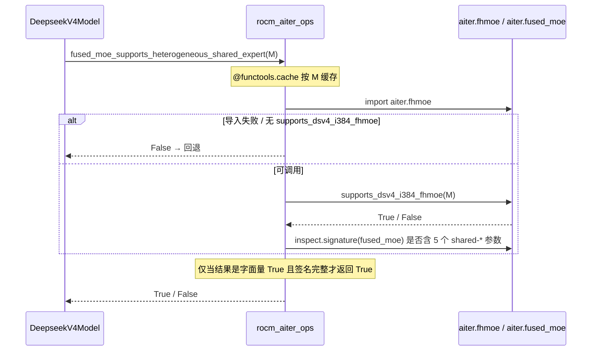

# PR #53161: [ROCm][Perf][DeepSeek V4] Fuse native FP8 shared expert with MXFP4 routed experts

> **作者**: @Fangzhou-Ai | **状态**: OPEN | **日期**: 2026-08-20（最近更新 2026-09-05）
> **Branch**: `Fangzhou-Ai:rocm-dsv4-fhmoe-i384` → `vllm-project:main` | **Labels**: `rocm`, `ready`, `deepseek`, `DSv4`
> **变更规模**: +843 -6 行，涉及 4 个文件
> **Assignee**: @shen-shanshan | **Reviewers**: @tjtanaa, @zyongye, @AndreasKaratzas, @hongxiayang, @dllehr-amd

---

## 1. 总结 (Summary)

本 PR 为 DeepSeek V4 的 ROCm 路径启用 AITER 的**异构融合 MoE（FHMoE）**：将原生 FP8 的 shared expert（每 rank 中间维度 384）与 MXFP4 的 routed experts（每 token 6 个专家）合并进**同一个 kernel 调用**，消除了 shared expert 的独立前向 pass 和 kernel 启动开销。该特性通过 `VLLM_ROCM_USE_AITER_FUSION_SHARED_EXPERTS=1` 显式开启，并设置了约 20 项 fail-closed 门控条件（gfx950 / TP8 / BF16 / noaux_tc / 无 EP、EPLB、offload 等），任何一项不满足即回退到原有分离路径。

实测效果：并发 8 时输出吞吐 **+8.14%**、TPOT **-7.77%**、E2E 延迟 **-7.53%**；decode trace 单步 wall time **-10.73%**、MoE 耗时 **-27.34%**、kernel 启动次数 **-15.57%**。GSM8K 30-shot 严格匹配 0.96740，高于 0.94 验收线。该 PR 替代了同作者已关闭的旧实现 #48728（基于 I384→I512 padding），保留原生 I384 宽度。

**合并阻塞**：依赖 ROCm/aiter#4891 合入并被 vLLM 消费（PR #52826 仅是把 AITER 升到 v0.1.20 的基线）。

## 2. 背景与动机 (Background & Motivation)

DeepSeek V4 在 ROCm gfx950 上的 MoE 结构是"异构"的：

- **routed experts**：384 个专家，每个 token 激活 6 个，使用 **MXFP4**（4-bit 块量化）权重；
- **shared expert**：1 个，使用原生 **FP8 E4M3** 权重，TP8 下每 rank 中间维度 384（总量 3072 / 8）。

在现有实现中，shared expert 与 routed experts 是两次独立的算子调用：先算 shared expert 输出，再算 routed experts 输出，最后相加。这带来两类开销：

1. **额外的 kernel 启动**与中间结果存储往返（decode 阶段尤为明显）；
2. shared expert 的 FP8 GEMM 在低并发（小 M）时利用率低。

AITER 提供的 FHMoE（heterogeneous fused MoE）kernel 可以在**单次 kernel 内**完成 MXFP4 routed + FP8 shared 的混合精度计算。但 AITER 的 FHMoE 配置表（CSV）此前只覆盖较小的 token 范围（旧实现 M=2..8），且旧方案 #48728 需要把 shared expert 从 I384 填充到 I512，与原生权重形状不符、代码已陈旧冲突。

本 PR 的两个核心动机：

- **保持原生 I384**：不恢复 384→512 的权重/激活填充，只对 W2 的 E8M0 scale 描述符做 12→16 列的中性对齐（0x7F 填充）；
- **扩大并收紧 token 覆盖**：依赖 AITER #4891 新增的专用 physical-I384 FHMoE 配置和 `supports_dsv4_i384_fhmoe(max_tokens)` 能力查询，把覆盖范围从 M=2..8 扩展到 **M=1..2048**，同时让未覆盖的 M 安全回退。

## 3. 代码修改分析 (Code Change Analysis)

### 3.1 修改的模块

| 文件 | 操作 | 说明 |
|------|------|------|
| `vllm/models/deepseek_v4/amd/model.py` | 修改 (+381/-5) | 核心改动：门控函数、原生 FP8 shared 权重准备、`RoutedExperts` 子类（fused/fallback 双路径 dispatch）、构造器接线 |
| `vllm/_aiter_ops.py` | 修改 (+107) | AITER 适配层：shared 参数一致性校验、CSV 能力探测（带缓存）、fused_moe 参数透传、新增 `shuffle_scale` 包装 |
| `vllm/model_executor/layers/fused_moe/experts/rocm_aiter_moe.py` | 修改 (+15) | `rocm_aiter_fused_experts` 接受并透传 5 个 shared-* 参数；顺带修正 `swiglu_limit` 为 None 时的传参（0.0） |
| `tests/model_executor/layers/test_fused_shared_expert.py` | 修改 (+340/-1) | 8 组新测试：原生宽度保持、token 策略、AITER 能力探测（含异常路径）、兼容性门控、路由校验、参数校验 |

### 3.2 架构 / 流程图 (Architecture / Flow Diagram)

#### 异构融合的启用与运行时 dispatch

```mermaid
flowchart TD
    A[DeepseekV4Model 初始化] --> B{_heterogeneous_shared_expert_enabled}
    B -->|任一门控不满足| C[传统路径<br/>shared expert 独立模块 + 原有 FSE 逻辑]
    B -->|全部满足| D[每层创建 DeepseekV4HeterogeneousSharedRoutedExperts<br/>持有 shared_expert 的 weakref]
    D --> E[process_weights_after_loading<br/>→ prepare_heterogeneous_shared_expert]
    E --> F[校验 FP8 形状 + E8M0 scale 扩展<br/>→ AITER shuffle 布局<br/>→ 构造 routed-only 量化配置]
    F --> G{forward_modular<br/>M = x.shape[0] 在 AITER CSV 覆盖内?}
    G -->|是| H[AITER fused_moe 单 kernel<br/>MXFP4 routed 6专家 + FP8 shared 1专家]
    G -->|否| I[Fallback<br/>shared_expert 单独前向 +<br/>routed experts 独立 kernel 后相加]
    H --> J[输出]
    I --> J
```

#### 能力探测（fail-closed）



### 3.3 关键实现细节 (Key Implementation Details)

- **门控函数 `_heterogeneous_shared_expert_enabled(vllm_config)`**：两层检查——第一层是环境与并行配置（ROCm + env 变量、gfx950、TP8、DP1、PCP1、无 EP/EPLB、`moe_backend="aiter"`、BF16、无 offload）；第二层是模型与量化契约（`n_routed_experts=384`、`num_experts_per_tok=6`、`n_shared_experts=1`、`hidden_size=7168`、`moe_intermediate_size=3072`、`silu`、`expert_dtype="fp4"`、`topk_method="noaux_tc"`；quant config 名 `deepseek_v4_fp8`、block-128、checkpoint 序列化为 FP8、E8M0 scale、无 ignored layers）。不满足时用 `logger.debug_once` 输出全部原因并返回 False——**fail-closed 且可诊断**。
- **`_prepare_native_fp8_shared_expert()`**：把 checkpoint 中 block-128 粒度的 E8M0 scale（W13: `(6, 56)`、W2: `(56, 3)`）扩展为 FHMoE 期望的 1×32 逐元素粒度（`repeat_interleave(128, dim=0)` × `repeat_interleave(4, dim=1)` → W13: `(768, 224)`、W2: `(7168, 12)`），再将 W2 scale 补齐到 16 列（0x7F 中性值，因为 384/32=12 不是 8 的倍数）。scale 支持 `float8_e8m0fnu`、`uint8`、以及精确 E8M0 的 FP32 三种输入 dtype，形状不匹配直接抛错。
- **`DeepseekV4HeterogeneousSharedRoutedExperts(RoutedExperts)`**：用 `weakref` 持有原生 `DeepseekV4MLP`（避免引用环、不阻止 GC）；构造时校验 AITER 侧确实只 append 了 1 个 shared 槽位且 `shared_expert_id == global_num_experts`；4 个 shared 张量注册为 **non-persistent buffer**（不参与 state_dict 保存，因为它们是权重的派生副本）。`forward_modular` 按 M 分派：fused 路径把共享权重、scale、专家 ID 一并传入 `rocm_aiter_fused_experts`；fallback 路径用 `weakref` 取回 shared 模块单独前向，同时用 `dataclasses.replace` 从 routed 量化配置中剔除 append 槽位的 scale，构造 routed-only 的 `FusedMoEQuantConfig`，再对切片后的权重跑独立 kernel 后相加。
- **`DeepseekV4HeterogeneousMxfp4MoEMethod(Mxfp4MoEMethod)`**：在 `process_weights_after_loading` 尾部触发 shared expert 的准备（确保权重加载完成后再做派生拷贝与 shuffle）。
- **`_probe_dsv4_i384_fhmoe_capability(num_tokens)`**（`_aiter_ops.py`）：探测 AITER 是否满足 DSV4 I384 FHMoE 契约——`aiter.fhmoe.supports_dsv4_i384_fhmoe` 可调用且对给定 M 返回**字面量 `True`**，且 `aiter.fused_moe.fused_moe` 的签名包含全部 5 个 `shared_*` 参数。任何异常（ImportError、OSError、签名检查异常）→ False。外层用 `@if_aiter_supported` + `@functools.cache` 缓存。
- **`_validate_rocm_aiter_fused_moe_shared_expert_args()`**：shared 张量全有或全无、ID 非负且与张量存在性一致，防止半配置状态传入 kernel。
- **Token 范围策略**：选择器用模型可见的 MoE 行数 `M = x.shape[0]`（不是客户端并发数）；AITER 元数据按 2 的幂分桶——实际 `M=1536` 会选中 `token=2048` 的 CSV 行，但 kernel 仍收到 1536 行的张量（**配置选择，不是张量填充**）。覆盖：无投机时 512 序列、MTP2/MTP3 至 512 序列（M=1536/2048）；MTP4 满 512 序列（M=2560）走 fallback；B≤64 时即使 MTP4 也只有 M=320。

## 4. 涉及的技术原理 (Technical Principles)

- **异构融合 MoE（FHMoE）**：传统分离路径中 shared expert（FP8 GEMM）与 routed experts（MXFP4 GEMM）是两次算子调度，各自有 kernel 启动、LDS/寄存器分配和中间结果写回。FHMoE 在一个 kernel 内同时完成两类不同精度/不同形状的 GEMM（shared W1: `[1, 768, 7168]`、W2: `[1, 7168, 384]`；routed 部分按 top-k 路由），并直接累加，省去一次输出回读与相加 pass。AITER 通过 CSV 配置表描述物理 kernel 形状（physical-I384 是 #4891 新增的专用配置）。
- **MXFP4（Microscaling FP4）**：routed 权重按 32 元素块共享一个 E8M0 指数 scale，`weight_block_size=[128, 128]`。与 FP8 shared expert 的精度体系不同，因此"异构"——同一 kernel 内两种量化格式必须由 AITER 显式支持。
- **E8M0 scale 与布局转换**：checkpoint 原生按 128×128 块存 scale；FHMoE 期望 1×32 粒度。`repeat_interleave` 把每个块 scale 广播到块内所有行/列。W2 的 384 列 → 12 个 32 列组，补齐到 16 组（512 位宽对齐），0x7F 在 E8M0 中为中性填充值，kernel 不会读取该列的数据。
- **TP8 下的 shared expert**：总中间维度 3072 在 TP8 下每 rank 384，`intermediate_size_per_partition=384`。旧方案为对齐 AITER 的 I512 配置做了 384→512 权重填充；本 PR 依赖 #4891 的原生 I384 配置，避免填充带来的显存与精度负担。
- **Power-of-two token 分桶**：AITER CSV 以 2 的幂为 token 桶（1, 2, 4, …, 2048），vLLM 端只查询"给定实际 M 是否有覆盖"，不在 vLLM 代码中重复维护范围表——未来给 AITER 加一行 `token=4096` 即可自动使所有 `M<=4096` 生效，能力查询结果已缓存。

## 5. 评论区讨论亮点 (Discussion Highlights)

- **@tjtanaa（AMD 维护者）追问 EP 支持**："is this for TP mode only? How about EP mode? Does it work?" —— 作者明确回复**只测试过 TP**，EP 情况需 @LiuYinfeng01 / @jiacao-amd 补充。门控条件中 `enable_expert_parallel` 会被显式拒绝，因此 EP 用户将静默走回退路径，但 EP 场景从未验证。
- **@tjtanaa 要求完整精度报告**：索要 "Full 30-shot GSM8K" 结果。作者随后贴出：strict exact match **1276/1319 = 0.96740**、flexible extract **1275/1319 = 0.96664**（1319 份文档、无空/错误响应、HTTP 全 200），用 FHMoE 开启的最终 TP8 配置测得——甚至高于 PR 描述中的 5-shot 结果（0.95906）。
- **CodeRabbit 提出 1 条 actionable 意见**：`_prepare_native_fp8_shared_expert` 的宽度应取自 `shared_expert.gate_up_proj.weight.shape[0] // 2` 而非 `self.moe_config.intermediate_size_per_partition`——因为 `select_deepseek_v4_mxfp4_moe_backend` 可能从 `AITER_MXFP4_BF16` 回退到其他 AITER backend，后者会把 384 round 到 512，导致原生 `(768, 7168)` 权重在形状校验处被硬拒绝（模型加载失败）。CodeRabbit 综合风险评级 🟡 Moderate，并提示 docstring 覆盖率 16.98% 低于 80% 阈值。
- CI：作者 9 月 3 日评论 "/ci run"，Buildkite CI #87166 已触发（commit `d594fb4`）。
- Claude Code bot：因 PR 来自 fork，自动 review 被禁用（需 maintainer `@claude review` 手动触发）。

## 6. 风险与潜在问题 (Risk Analysis)

| 风险 | 严重程度 | 说明 |
|------|---------|------|
| 合并依赖未就绪 | High | AITER #4891 未合入前不可 merge；#52826 只是 v0.1.20 基线 bump。若带旧 AITER 合并，能力探测会 fail-closed 走回退，性能承诺不生效 |
| 后端回退时宽度不匹配 | Medium | CodeRabbit 指出的问题：若 MXFP4 backend 选择发生回退导致 `intermediate_size_per_partition` 被 round 到 512，`_prepare_native_fp8_shared_expert` 的形状校验会抛 ValueError，**模型加载硬失败**而非优雅回退（门控只拦配置，不拦 backend round） |
| EP 模式未验证 | Medium | 作者明确只测过 TP；EP 被门控排除但无任何 EP 场景下的测试证据，EP 用户行为依赖既有路径的正确性 |
| 弱引用释放风险 | Low | fallback 路径依赖 `weakref` 取回 shared 模块；若 GC 提前释放会 RuntimeError。实际模型层持有该模块引用，理论上不会释放，但属于隐含不变量 |
| 超范围 M 的性能悬崖 | Medium | M=2049 诊断显示 FHMoE 比分离路径**慢 37.98%**（0.534→0.737 ms），这正是 CSV 停在 2048 的原因；MTP4 满配（M=2560）用户会跌回 fallback。未来加 4096 行前必须先调优 kernel |
| 显存开销 | Low | 模型显存 +0.84 GiB（+0.81%）、峰值激活 +0.30 GiB、KV 容量 -0.60%（-1160 token）、最大并发 20.59x→20.47x。开销来源是 shared 权重的 shuffle 副本 + 1 行 dummy routed，可接受但需知晓 |
| 可维护性 | Medium | 门控硬编码了完整的模型契约（384/6/7168/3072/384…），模型结构或量化配置变化时需同步两处（门控 + 权重准备）；`_get_quant_method` 对非 MXFP4 直接抛错，未来 routed 量化扩展需适配 |
| 能力探测缓存 | Low | `functools.cache` 使能力结果进程内固定，更换 AITER 激活 CSV 需重启服务（作者已在文档中说明，属有意行为） |
| 测试覆盖 | Low | 340 行新增单测覆盖了 token 策略、探测异常路径、门控、路由/参数校验，且 `test_fused_shared_expert.py` 全量 64 passed；但端到端精度/性能数据依赖作者私有 8×gfx950 环境，社区无法复现验证 |

## 7. 结论 (Conclusion)

这是一个实现质量很高的 ROCm 性能优化 PR：fail-closed 设计、详尽且可诊断的门控、与性能/精度/显存/容量证据严格匹配的验证链（最终组合栈 C1–C64 与原型偏差 <0.7%），并有完整单测支撑。当前不可合并的唯一硬性理由是 AITER #4891 依赖；合入前建议优先处理 CodeRabbit 提出的宽度派生问题（改为从 shared 权重形状推导，消除 backend round 导致的加载失败路径），并补充或明确排除 EP 场景。整体上，一旦依赖落地，该 PR 具备直接合入的条件（当前 `mergeable_state: unstable`，尚需与 main 同步）。
