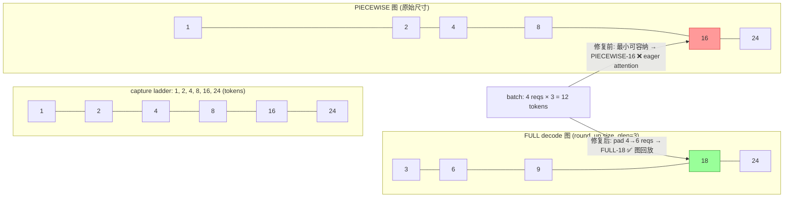
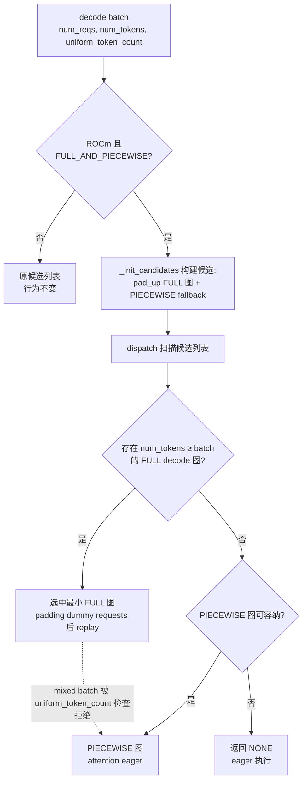

# PR #53407: [Bugfix][MRV2][ROCm] Dispatch uniform decode to a padded FULL cudagraph

> **作者**: @xiaohuguo2023 | **状态**: OPEN | **日期**: 2026-08-22
> **Branch**: `xiaohuguo2023:xiaohuguo/cudagraph-dispatch-pad-uniform-decode-fix` → `vllm-project:main` | **Labels**: `bug`, `rocm`, `nvidia`, `mrv2`, `verified`
> **变更规模**: +272 -4 行，涉及 2 个文件 | **Reviewers**: njhill、yewentao256、WoosukKwon、hongxiayang、shen-shanshan

---

## 1. 总结 (Summary)

本 PR 修复了一个 MRV2 CUDA Graph 调度缺陷：在开启推测解码（speculative decoding）时，`FULL_AND_PIECEWISE` 模式下约**一半的 decode batch 大小**会静默降级为 eager attention 执行（PIECEWISE 图），而不是回放捕获好的 FULL decode CUDA Graph，导致每个 decode step 都在 host 关键路径上付出 metadata 构建 + kernel 启动的开销。修复方式是在 `_init_candidates` 构建候选列表时，将「可以 padding 后容纳当前 batch 的更大 FULL decode 图」排在混合/PIECEWISE fallback 之前，使 `dispatch()` 优先选中带 padding 的 FULL 图。改动仅限候选列表的内容与顺序（`dispatch()` 与 `_is_compatible()` 零改动），不增加任何额外捕获的图，并通过 `current_platform.is_rocm()` 门控。MI355X 端到端实测（Kimi-K3 TP8、num_spec=2、长上下文）ITL p50 下降 71%–82%。

---

## 2. 背景与动机 (Background & Motivation)

在 vLLM V1 的 `FULL_AND_PIECEWISE` decode 模式下，存在两类 CUDA Graph：

- **FULL decode 图**：整个 decode step（含 attention）被捕获，在 `round_up(capture_size, decode_query_len)` 处 stage；
- **PIECEWISE 图**：attention 走 eager 路径，在原始 capture ladder 尺寸处 stage。

**问题**：当 `decode_query_len` 不能整除 capture ladder 时，两组图的 stage 尺寸交错出现空洞（gap）。落在空洞中的 batch，能找到的最小图是 PIECEWISE 图——因为 PIECEWISE descriptor 的 `uniform_token_count=None`，`_is_compatible` 对它「来者不拒」——于是该 batch 每个 decode step 都付出 eager attention 的代价，哪怕存在一张稍大的 FULL decode 图可以通过 padding 几个 dummy request 来服务它。

以 `decode_query_len=3`、capture sizes `[1, 2, 4, 8, 16, 24]` 为例：FULL 图落在 3/6/9/18/24 tokens，PIECEWISE 留在原始尺寸。4 个请求 × 3 tokens = 12 tokens 的 batch，最小能装下的图是 size-16 的 **PIECEWISE**（eager attention），而非可 pad 4→6 reqs 的 size-18 **FULL decode** 图。

**这不是边角情况**。在默认配置（默认 ladder、`max_cudagraph_capture_size=512`、`max_num_seqs=128`、EAGLE/MTP `num_speculative_tokens=2` → `decode_query_len=3`）下：

| | 命中 FULL decode 图 | 降级 eager PIECEWISE |
|---|---|---|
| 修复前 | 64 / 128 | **64 / 128** |
| 修复后 | 128 / 128 | 0 |

受影响的请求数为 4, 5, 9, 10, 12, 13, 17, 18, 20, 21, 25, 26, …（周期性模式）。问题最初在 MI355X 的 profiling trace 中发现。

---

## 3. 代码修改分析 (Code Change Analysis)

### 3.1 修改的模块

| 文件 | 操作 | 说明 |
|------|------|------|
| `vllm/v1/worker/gpu/cudagraph_utils.py` | 修改 (+65 -4) | `_init_candidates` 中新增 pad-up 候选构建：收集 FULL decode 图并按序插入候选列表头部 |
| `tests/v1/cudagraph/test_cudagraph_manager.py` | 修改 (+207 -0) | 6 个新单元测试 + 2 个 helper，覆盖修复回归、ROCm 门控、精确匹配、混合 batch 安全性与 divisor ladder 不变性 |

### 3.2 架构 / 流程图 (Architecture / Flow Diagram)

#### 问题示意：stage 尺寸交错产生的空洞

#### 修复后的 dispatch 决策流程

### 3.3 关键实现细节 (Key Implementation Details)

**核心逻辑（`cudagraph_utils.py` 的 `_init_candidates`）**

- **门控条件** `pad_up_uniform_decode`：`separate_decode_routine and decode_mode == CUDAGraphMode.FULL and current_platform.is_rocm()`。作者明确说明空洞并非平台特有（源于 `round_up(capture_size, decode_query_len)`），但端到端数据只在 MI355X 上验证过，因此先在 ROCm 上启用——这也是当前 review 争议的焦点。
- **候选收集** `decode_full_descs`：从 `descs_by_mode[FULL]` 中筛出 `uniform_token_count is not None` 的 descriptor，按 `num_tokens` 升序排列。
- **候选列表组装**：对每个 `(i, num_active_loras)` staging key，构建 `pad_up` 列表——遍历升序的 FULL decode 图，收集满足 `d.num_tokens >= i` 且 LoRA 数量匹配、且**每个 query length 只取一个**（用 `padded_query_lens` 集合去重）的 descriptor；最终 `self._candidates[key] = pad_up + [d for d in fallback if d not in pad_up]`。
- **每个 query length 只放一个候选**的依据：uniform-decode batch 恒满足 `num_tokens >= num_reqs * query_len`（正常情况取等号；DP token-sync 时可能大于，见下文），而 stage 在 `num_tokens` 的 decode 图恰好容纳 `num_tokens // query_len` 个请求——因此「不小于 batch token 数的最小图」必然有足够请求槽位，更大的同 query length 图永远不可达。默认 ladder 下每个 token 数只挂 2 个候选（而非 43 个）。
- **`dispatch()` 与 `_is_compatible()` 零改动**：安全性完全依赖 `_is_compatible` 对 `uniform_token_count` 的既有检查——mixed batch（`uniform_token_count=None`）会被任何带 `uniform_token_count` 的 descriptor 拒绝，保证 prefill batch 不会误回放 decode-only 图。
- **`varlen_decode=True` 严格 no-op**：该模式下图在每个原始尺寸都捕获，无空洞，且被 filter 排除（`uniform_token_count is None`）。

**测试（`test_cudagraph_manager.py`）**

- 6 个新测试：gap batch 上移到大一档 FULL 图（回归测试）；ROCm 之外保持旧行为（钉住门控）；精确匹配不过度 padding；mixed batch 永不选中 uniform-decode 图（安全性质）；超出 ladder 仍回退 eager（`CUDAGraphMode.NONE`）；参数化 qlen ∈ {1, 2, 8} 验证整除 ladder 时 dispatch 完全不变。
- 测试文件跑在非 ROCm 的 CPU CI runner 上，因此用 `monkeypatch` 打桩 `current_platform.is_rocm`（沿用 `tests/test_config.py` 等处的既有惯用法），门控两侧都有覆盖。

**验证方法（PR 描述中的 Test Plan）**

- **Exhaustive dispatch differential**：对 7 组（capture ladder × max_num_seqs × decode_query_len）配置，枚举全部可达的 `(num_tokens, num_reqs, uniform_token_count)` 三元组（4440 个），对比修复前后 `dispatch()` 决策。可达性计算考虑了 DP 路径下 `sync_cudagraph_and_dp_padding` 传入「跨 rank 同步后的 num_tokens + 本地 num_reqs」导致 `num_tokens > num_reqs * query_len` 的可能。
- **Candidate-list narrowing differential**：105576 个 batch 上，「每 query length 一个候选」与不加限制的版本决策**完全一致（0 差异）**，证明更大的同 query length 图确实不可达。uniform decode batch 命中首个候选耗时 0.11 µs（不变）；仅 mixed/prefill dispatch 从 0.14 → 1.70 µs（相对 prefill step 可忽略）。

---

## 4. 涉及的技术原理 (Technical Principles)

### 4.1 CUDA Graph capture ladder 与 FULL_AND_PIECEWISE 模式

vLLM V1 按 `cudagraph_capture_sizes`（默认 1, 2, 4, 8, 16, 24, 32, …）为不同 batch 尺寸捕获 CUDA Graph。CUDA Graph 将整段 kernel 序列录制为一张图，replay 时一次性提交，消除 CPU 侧逐 kernel 启动与同步开销——decode 阶段对 ITL（inter-token latency）尤其关键。

`FULL_AND_PIECEWISE` 是 MRV2 引入的单独 decode 例程：**FULL** 图捕获完整 decode step（含 attention），回放时零 host 开销；**PIECEWISE** 图仅捕获部分（attention 走 eager），回放时仍需 host 侧构建 attention metadata 并启动 kernel。因此「本应命中 FULL 却落到 PIECEWISE」意味着每个 token 都在 host 关键路径上付出 eager attention 代价。

### 4.2 推测解码与 uniform_token_count

推测解码（EAGLE/MTP）中每个 decode step 一次性处理 `1 + num_speculative_tokens` 个 query token（`decode_query_len=3` 即 num_spec=2），因此 decode batch 的每个请求 token 数**均匀**（`uniform_token_count=query_len`）。FULL decode 图按 `round_up(capture_size, decode_query_len)` stage，使每张图容纳整数个请求的完整 query 组。`BatchExecutionDescriptor.uniform_token_count` 记录该图是为哪种均匀 query 长度捕获的，`_is_compatible` 据此匹配/拒绝 batch。

### 4.3 候选列表与 dispatch 机制

捕获完成后，`_init_candidates` 为每个可能的 `(num_tokens, num_active_loras)` 组合构建候选 descriptor 列表（相邻 capture 尺寸之间复用较大尺寸的图——batch 可以「向上取图」但不可「向下取图」）。`dispatch()` 线性扫描候选列表，返回第一个通过 `_is_compatible` 检查的 descriptor。本 PR 的洞察：**只要把带 padding 的 FULL 图放在 PIECEWISE fallback 之前，dispatch 的选择逻辑无需任何改动**。

### 4.4 Padding 与 DP token 同步

CUDA Graph 的输入 buffer 在捕获时固定形状，batch 小于图容量时用 dummy request 填充（padding），多余槽位不产生有效输出。数据并行（DP）场景下 `sync_cudagraph_and_dp_padding` 会把 `num_tokens` 同步为各 rank 的最大值，但 `num_reqs` 保持本地值，因此可能出现 `num_tokens > num_reqs * query_len`——这正是「最小可容纳 FULL 图必有足够请求槽位」论证中需要单独处理的 case，也是 differential 测试显式枚举它的原因。

### 4.5 每 query length 单候选的最优性论证

uniform-decode batch 的 token 数恒为 query_len 的倍数（DP 同步后只会更大）。stage 在 `num_tokens` 的 FULL decode 图容纳 `num_tokens // query_len` 个请求；若某张图 `num_tokens >= batch_tokens` 且是「最小的」，则其请求容量 `num_tokens // query_len >= batch_reqs` 自动成立（因为 `batch_tokens >= batch_reqs * query_len` 且二者同为 query_len 的倍数关系）。因此 `_is_compatible` 的 num_reqs 检查不可能拒绝它，更大的同 query length 图永不可达——候选列表因此可以大幅瘦身。

---

## 5. 评论区讨论亮点 (Discussion Highlights)

### 核心分歧：ROCm 门控 + 实现复杂度（CHANGES_REQUESTED）

vLLM collaborator **LucasWilkinson** 提交了唯一的实质性 review（CHANGES_REQUESTED）：

> "Thanks for the contribution! I think we should just do this generally (and simplify it) proposed simpler version here: https://github.com/xiaohuguo2023/vllm/pull/1"

并直接向作者 fork 提交了反提案 PR *「Simplify cudagraph candidate construction」*（跟进 #53407），要点：

1. **去掉 ROCm 门控**，将修复推广到所有平台——空洞由 `round_up` 产生，与后端无关，CUDA 上同样存在受影响 batch；
2. **统一按「FULL 候选优先、PIECEWISE fallback 兜底」构建 dispatch 区间**，移除 ROCm 专用候选路径；
3. **删除中间 token/LoRA 候选 map**，直接让 `_is_compatible` 的既有检查处理 uniform decode、mixed batch、请求容量、query length 与 LoRA 匹配；
4. 将原回归 case 钉死为 `[FULL-18, PIECEWISE-16]`。

该反提案 PR 由 LucasWilkinson 本人用 OpenAI Codex 辅助开发（有 AI 协助披露），测试为 8 passed + ruff/mypy 通过 + parent/current 差分。截至报告时（2026-08-23），作者尚未回应这一 review，PR 仍处于 CHANGES_REQUESTED 状态。

### 其他评论

- **claude[bot]**：因 PR 来自 fork，自动 review 被禁用；maintainer 可评论 `@claude review` 触发一次性 review。
- 暂无 issue comments 与 inline review comments（0 / 0）。

---

## 6. 风险与潜在问题 (Risk Analysis)

| 风险 | 严重程度 | 说明 |
|------|---------|------|
| **ROCm 门控使修复范围与问题范围不匹配** | Medium | 作者自己承认空洞「并非平台特有」（源于 `round_up`，任何后端都不影响），CUDA 上推测解码部署同样存在一半 decode batch 走 eager 的问题。门控的理由是「只在 MI355X 上验证过」，但该论据也可以反向支持「应先在通用路径实现、由 CI 验证」。这是当前 review 的核心反对点，若按 maintainer 意见改为通用实现，PR 结构需大幅调整。 |
| **`_init_candidates` 复杂度上升** | Low | 对每个 staging key 都要遍历 `decode_full_descs`（O(candidates × full_graphs)）。但该函数只在捕获后执行一次（启动路径），且作者实测 dispatch 本身开销不变（0.11 µs），非关键路径。反提案则主张连同中间 map 一起删除以简化结构。 |
| **mixed batch 安全性依赖既有 `_is_compatible` 行为** | Medium | pad-up 候选被放在 PIECEWISE 之前，若 `_is_compatible` 对 `uniform_token_count` 的检查有缺陷，prefill batch 可能误回放 decode-only 图产生静默错误。作者用单元测试（`test_mixed_batch_never_selects_a_uniform_decode_graph`）+ 4440 batch 差分中「无 mixed batch 被分配 uniform-decode 图」的安全性质双重钉死，风险已基本被覆盖。 |
| **padding 引入的少量浪费** | Low | 默认配置下平均多 pad 1.27 个请求、最多 5 个。相比 eager attention 每个 step 的 host 开销（E2E 中 ITL p50 从 ~75 ms 降到 ~14–21 ms），可忽略。 |
| **merge 状态** | Low | `mergeable_state: unstable`、`rebaseable: false`，与 main 存在冲突需 rebase；且当前 review 意见若被采纳，改动面会扩大，冲突可能加剧。 |
| **E2E 验证仅有 ROCm 数据** | Low | 性能数字（Kimi-K3 TP8 / MI355X）充分，但无 CUDA 端数据；若门控移除，需补 CUDA 验证。 |

---

## 7. 结论 (Conclusion)

PR #53407 问题定位精准、验证方法严谨（6 个针对性单元测试 + 4440/105576 batch 的 exhaustive 差分 + MI355X 端到端 −71%/−82% ITL），代码改动克制（不触碰 `dispatch()`/`_is_compatible()`，零新增图捕获）。当前主要障碍是设计层面的：maintainer LucasWilkinson 已提交 CHANGES_REQUESTED 并给出「去 ROCm 门控 + 简化候选构建」的反提案，作者需决定是采纳通用化方案还是论证门控的必要性——在分歧解决前，该 PR 暂不具备合入条件。
