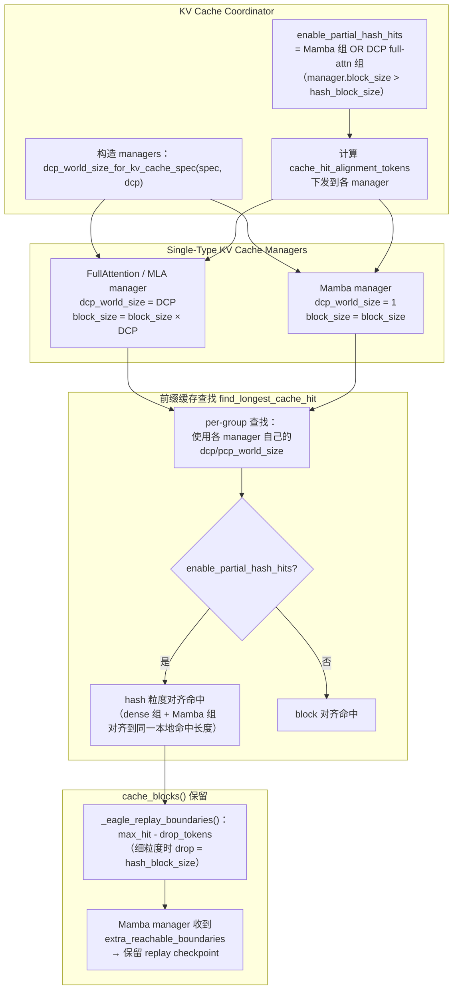
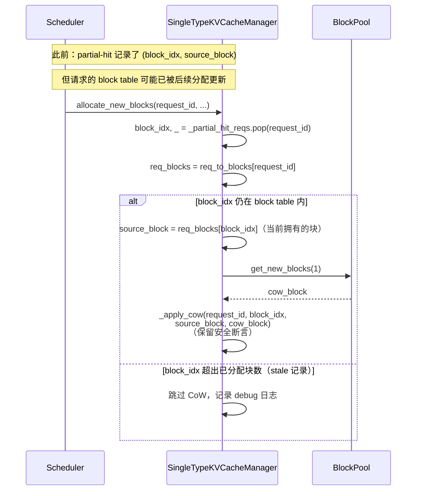

# PR #53598: [ROCm][DSpark][DCP] Serve prefix cache hits under DCP for Kimi-K3

> **作者**: @YukioZzz | **状态**: OPEN | **日期**: 2026-08-24
> **Branch**: `YukioZzz:yichaozhu/k3-draft-cache-fix` → `main` | **Labels**: `bug`, `rocm`, `speculative-decoding`, `deepseek`, `kv-connector`, `nvidia`, `mrv2`, `dflash`, `kimi`, `k3`, `scheduler`, `kv-cache-manager`
> **变更规模**: +476 -70 行，涉及 7 个文件

---

## 1. 总结 (Summary)

本 PR 是 Kimi-K3 DCP（Decode Context Parallelism）拆分中的**核心缓存几何层**：解决在 decode context parallelism 下、混合 KV-cache 布局（full-attention/MLA 层做 DCP 切分、Mamba 层保持复制）时，本地前缀缓存命中无法被正确服务的问题。核心做法是把"每个 cache group 的有效 DCP 大小"下沉到各 `SingleTypeKVCacheManager`——切分层用进程 DCP size、复制层用 1——使调度器与缓存管理器对命中边界的认知一致，并补齐细粒度命中下的 Mamba replay checkpoint 保留与 stale partial-hit 的 CoW 源刷新。该 PR 刻意不包含 #51705 的 DSpark/DCP runtime attention 改动与 #53730 的 Mooncake 外部缓存加固，属于一个更大拆分（#51705 / 本 PR / #53917 / #53730）的中间一环。

---

## 2. 背景与动机 (Background & Motivation)

Kimi-K3 的 KV-cache 布局是**混合（hybrid）**的：full-attention / MLA 层组在 DCP 下被切分到多个 rank（`dcp_world_size > 1`），而 Mamba 层组是复制的（`dcp_world_size = 1`）。此前的实现用**单一全局 block-size 假设**：

- `kv_cache_coordinator.py` 中所有 single-type manager 都拿进程级 `dcp_world_size` 构造，导致 Mamba manager 的 `block_size` 被错误放大 `dcp` 倍；
- `find_longest_cache_hit` 用协调器自己重算的全局 DCP 值查命中，而不是每个 manager 的真实几何。

这使调度器和缓存管理器在"前缀命中从哪开始、到哪结束"上产生分歧，尤其在**细粒度本地命中**（`enable_partial_hash_hits`，hash 粒度 < block 粒度）场景下最为明显：

1. **dense 组命中与 Mamba 状态对齐**：dense 组可以按 hash 粒度对齐命中，但复制的 Mamba 状态必须保留一个 replay checkpoint（卷积状态），让第一个消费者能从对齐后的命中边界恢复计算。
2. **EAGLE 修正边界**：启用 EAGLE 投机解码时，dense 组的命中边界会少掉一个 hash block，对应的 Mamba replay 边界必须显式保留。
3. **partial-hit 的 CoW 隐患**：本地部分命中后，请求会往共享尾块追加写入，必须先做 copy-on-write（CoW）重定向。但 `_partial_hit_reqs` 里记录的 `source_block` 可能已过期（请求的 block table 已被更新），过期元数据会让 CoW 指向一个请求不再拥有的块——这正是本 PR 修复的 stale metadata 正确性 bug。

PR 的 Motivation 还明确列出了 **Non-Goals**：外部/offload 传输行为、SimpleCPU offload 对齐、失败的 KV-load 恢复等都刻意留给后续 PR（#53917、#53730）。

---

## 3. 代码修改分析 (Code Change Analysis)

### 3.1 修改的模块

| 文件 | 操作 | 说明 |
|------|------|------|
| `vllm/v1/core/kv_cache_utils.py` | 修改 | 新增 `dcp_world_size_for_kv_cache_spec()`：FullAttentionSpec（含 MLA）返回进程 DCP size，Mamba/SWA 等复制型 spec 返回 1 |
| `vllm/v1/core/kv_cache_coordinator.py` | 修改 | 按 per-group DCP 几何构造 manager；`block_size`/`dcp_world_size` 改从 manager 读取；`enable_partial_hash_hits` 扩展到 DCP full-attention 组；新增 `_eagle_replay_boundaries()` 并传入 Mamba 保留逻辑；命中查找改用 per-manager 的 DCP/PCP size |
| `vllm/v1/core/single_type_kv_cache_manager.py` | 修改 | 新增 `cache_hit_alignment_tokens` 属性（可由协调器下调至 hash 粒度）；`allocate_new_blocks()` 中 CoW 源从请求**当前** block table 刷新，stale 记录安全跳过；`cache_blocks()` 新增 `extra_reachable_boundaries` 参数 |
| `vllm/v1/core/sched/scheduler.py` | 修改 | `_mamba_block_aligned_split()` 新增 `eagle_replay_boundary` 分块停点：在 EAGLE 细粒度命中时把 Mamba replay 边界物化为 chunk 结束位置 |
| `tests/v1/core/prefix_cache/test_partial_prefix_cache_hits.py` | 修改 | 新增 DCP 细粒度命中、EAGLE replay 保留、stale CoW 等 5 类测试（+251 -47） |
| `tests/v1/core/test_kv_cache_utils.py` | 修改 | 新增 `dcp_world_size_for_kv_cache_spec` 单测（+15） |
| `tests/v1/core/test_prefix_caching.py` | 修改 | 新增 `test_prefix_cache_hit_uses_per_group_dcp_geometry`（+77） |

### 3.2 架构 / 流程图 (Architecture / Flow Diagram)

#### 混合 DCP 几何下的前缀命中对齐

#### stale partial-hit 的 CoW 源刷新

### 3.3 关键实现细节 (Key Implementation Details)

- **`dcp_world_size_for_kv_cache_spec()`（新 helper）**：`dcp_world_size <= 1` 时直接返回 1；对 `UniformTypeKVCacheSpecs` 取其内层 spec；仅 `FullAttentionSpec` 返回进程 DCP size，其余（Mamba、SWA、chunked-local）返回 1。注释明确指出 DSpark 路径上的 draft MLA 组也是 `FullAttentionSpec`/`MLAAttentionSpec`，因此保持进程 DCP size。
- **协调器几何来源修正**：`KVCacheCoordinator.block_size` / `dcp_world_size` 不再由全局值重算，而是直接取 `single_type_managers[0]` 的值（`kv_cache_coordinator.py:509-514`），消除"重算几何"与"manager 实际几何"的漂移。
- **`enable_partial_hash_hits` 扩展**：原条件只看 `has_partial_mamba_group`；新增 `has_dcp_partial_full_attention_group`——当 `dcp_world_size > 1` 且存在 `manager.block_size > hash_block_size` 的 FullAttention 组时也开启细粒度命中（`kv_cache_coordinator.py:635-646`）。开启后仍保留原有的不支持 manager 类型校验断言。
- **`cache_hit_alignment_tokens` 下发**：manager 默认用 `scheduler_block_size` 对齐，协调器在确认所有参与 manager 支持细粒度查找后，把 `_cache_hit_alignment_tokens`（可低至 hash block size）写入每个 manager；`cache_blocks()` 的 `reachable_block_mask` 改用它做对齐（`single_type_kv_cache_manager.py:74-81, 473-478`）。
- **`_eagle_replay_boundaries()`（新方法）**：`max_hit_length = round_down(num_prompt_tokens - 1, cache_hit_alignment_tokens)`；对每个启用 EAGLE 的 FullAttention 组，`drop_tokens = manager.block_size`（细粒度且 block > hash 时为 `hash_block_size`），边界 = `max_hit_length - drop_tokens`（> 0 才保留）。这些边界作为 `extra_reachable_boundaries` 只传给 Mamba manager，确保 Mamba 状态在 EAGLE 修正后的 replay 位置可达。
- **调度器分块停点**：`_mamba_block_aligned_split()` 新增 `eagle_replay_boundary = (tail_boundary - hash_block_size) // block_size * block_size`，作为额外 stop——保证 chunk 结束时正好物化 Mamba replay 状态（`scheduler.py:445-465`）。
- **stale CoW 源刷新**：`allocate_new_blocks()` 不再直接信任 `_partial_hit_reqs` 里记录的 source block，而是取 `req_to_blocks[request_id][block_idx]`（请求当前拥有的块）；若 `block_idx` 已超出 block table 长度则跳过 CoW 并打 debug 日志。`_apply_cow` 内部的安全断言原样保留（`single_type_kv_cache_manager.py:355-373`）。
- **测试覆盖**：`test_dcp_full_attention_enables_partial_hash_hits`、`test_dcp_fine_hit_retention_uses_hash_alignment_for_mamba`（DCP4、7-token prompt 验证 6-token 边界不被 floor 到 8）、`test_dcp_eagle_retention_primes_first_mamba_consumer`（DCP8、hash_block_size 128/1536 两组参数化，验证 chunk 结束位置 `[4608, 6144, 7552, 7621]` 等与消费者命中长度 6144/4608）、`test_stale_partial_hit_record_uses_current_block_for_cow`、`test_stale_partial_hit_record_past_table_is_dropped`、`test_prefix_cache_hit_uses_per_group_dcp_geometry`（DCP8 下 target/draft MLA 均为切分、Mamba 复制，命中 `2 × sharded_block`）。

---

## 4. 涉及的技术原理 (Technical Principles)

- **DCP（Decode Context Parallelism）**：把解码阶段的 KV-cache 沿序列维切分到多个 rank，解决长上下文 decode 的 KV 带宽瓶颈；配合 DSpark（DCP + speculative decoding 的 ROCm 栈）在 AMD 上服务 Kimi-K3 这类超长上下文模型。关键点：切分的是 full-attention/MLA 的 KV，而 Mamba 的循环状态（conv state + SSM state）是逐 token 顺序演化的，无法静态切分，因此必须整份复制到每个 rank。
- **混合 KV-cache 布局与命中对齐**：full-attention 组的"有效 block"在 DCP 下是 `block_size × dcp`，Mamba 组仍是 `block_size`。前缀缓存按 block hash 查找，若统一用全局几何，dense 组与 Mamba 组对"命中多少 token"的答案会不一致，导致跨组 reconcile 后出现空洞或越界。
- **Mamba replay checkpoint**：Mamba 层复用前缀需要从命中边界重新"回放"一段以获得正确的循环状态。对齐命中边界（尤其是 EAGLE 修正后少一个 hash block 的边界）必须在块保留（retention）时显式保留该 checkpoint，否则第一个消费者从错误位置回放、输出错误。
- **Prefix caching 的 CoW（copy-on-write）**：命中前缀的块被多个请求共享，请求要在共享尾块内追加新 token 前必须先复制该块（`_apply_cow`），防止写穿共享块。`_partial_hit_reqs` 中记录的 source block 是命中时刻的快照；若请求的 block table 之后被其他分配路径更新（例如 partial hit 后又有新块分配），旧快照即成为 stale metadata——直接使用会 CoW 错块。
- **EAGLE 投机解码与命中边界**：EAGLE 的 draft 模型在 dense 命中上"多匹配一个块"（drop one block）以保证验证正确性，因此 dense 组的可复用边界比对齐边界少一个 hash block；Mamba 侧必须按同一修正量保留 replay 状态。

---

## 5. 评论区讨论亮点 (Discussion Highlights)

- **审查者 @GirasoleY 要求拆分正交改动（2026-08-26）**：
  1. 指出 `scheduler.py` 中"failed blocks handling"类改动与 prefix cache 修复正交，要求提供实际 runtime 失败或最小复现，并移到独立 PR；
  2. 指出 `vllm/v1/simple_kv_offload/manager.py` 的 CPU offload 相关改动正交，且该改动发生在 coordinator 初始化**之后**，质疑其是否真的产生预期行为。
- **作者 @YukioZzz 的响应（2026-08-27）**：
  - 两处正交改动均已移除，相关行为移到 follow-up PR **#53917** 中验证；
  - **保留 stale partial-hit CoW 刷新**并给出理由：它属于同一条本地 partial-hit 正确性路径——`SingleTypeKVCacheManager.allocate_new_blocks()` 消费 `_partial_hit_reqs` 并调用 `_apply_cow()`，不刷新源块的话 stale 元数据可能让 CoW 指向请求已不拥有的块。
- **Mergify 阻塞**：该 PR head commit 的 sha 与 **#51705** 冲突，Mergify 暂时无法评估合并规则，需等 #51705 合并或关闭后恢复——即本 PR 的合并存在**硬性顺序依赖**。
- PR 描述中的验证数据：集成分支（#51705 + 本 PR）在 DCP8 + DSpark + prefix cache（Mooncake OFF）下 `/health` 与 smoke 通过；GSM8K-50 准确率 98.00%，GSM8K 全量 5-shot 严格匹配 96.66%；投机验证激活，平均接受长度 2.80；prefix-cache cold 0 hits、hot/reuse 达 96768/189492 命中，服务端报告命中率最高 50.6%。定向回归 `-k stale_partial_hit_record` 结果 2 passed, 41 deselected。

---

## 6. 风险与潜在问题 (Risk Analysis)

| 风险 | 严重程度 | 说明 |
|------|---------|------|
| 合并顺序依赖 | High | Mergify 明确提示 head sha 与 #51705 冲突，本 PR 无法先于 #51705 合并；若 #51705 的拆分/审查周期拉长，本 PR 将长期处于 blocked 状态 |
| `enable_partial_hash_hits` 语义扩展的影响面 | Medium | 条件从"仅 Mamba 组"扩展到"DCP full-attention 组"，且 `find_longest_cache_hit` 改走 per-manager DCP/PCP size，理论上影响所有 DCP > 1 的路径（NVIDIA 侧同样使用 DCP，labels 中也有 `nvidia`）；PR 未展示非 ROCm 平台的验证结果 |
| CoW 跳过的安全性 | Medium | `block_idx` 超出 block table 时跳过 CoW 只打 debug 日志。跳过 CoW 意味着"假设该位置不再需要写保护"，若存在路径使 stale 记录指向一个仍在共享的块且 block_idx 恰好落在 table 内（旧块被新块顶替），仍可能写穿共享块；测试覆盖了顶替场景（使用当前块 CoW），但"跳过"分支只有单测兜底 |
| EAGLE replay 边界的数值边界 | Low | `_eagle_replay_boundaries` 基于 `num_prompt_tokens - 1` 计算，prompt 很短时 `max_hit_length` 可能为 0/负，边界集为空（> 0 才加入），行为退化为无额外保留，逻辑上安全但缺少显式短 prompt 测试 |
| 与 #53917/#53730 的接口耦合 | Low | PR 是四段拆分的一环，单独合入 main 后 Kimi-K3 全栈仍不可运行（缺少 #51705 runtime 支持），存在"半成品合入"的可维护性风险；作者已在描述中明确 Non-Goals 降低误用风险 |
| 测试覆盖 | Low | 新增测试集中于几何与 CoW 路径，`scheduler._mamba_block_aligned_split` 的 EAGLE 停点通过 `test_dcp_eagle_retention_primes_first_mamba_consumer` 间接覆盖（chunk ends 断言）；非 ROCm 回归需依赖 CI |

---

## 7. 结论 (Conclusion)

该 PR 目标聚焦、代码组织清晰，用"per-group 几何"这一处核心抽象同时修复了 DCP 混合布局下的命中对齐、EAGLE/Mamba replay 保留和 stale CoW 三组问题，测试覆盖了每条正确性路径，且作者已按审查意见把正交改动拆出。主要阻塞在于与 #51705 的合并顺序依赖；在 #51705 落地并补齐跨平台 CI 验证前，本 PR 处于"就绪但被阻塞"的状态，质量上未见明显正确性硬伤。
