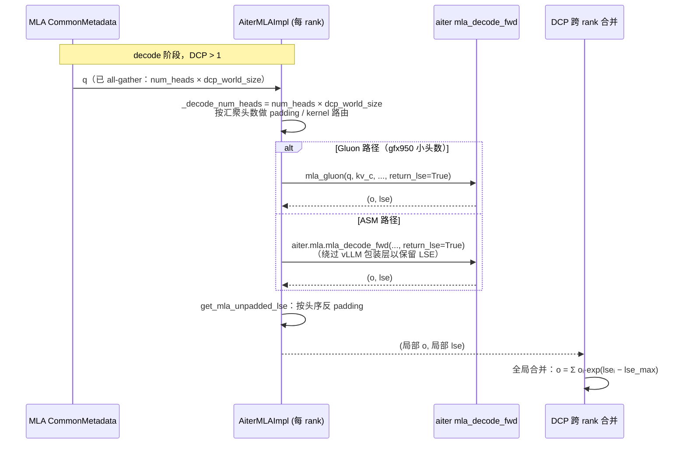
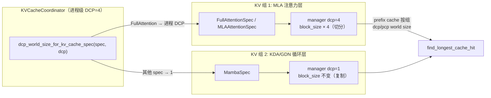

# PR #53664: Add pipeline_parallel support for the kimik3 model

> **作者**: @haic0 | **状态**: OPEN | **日期**: 2026-08-25
> **Branch**: `haic0:add-kimi-k3-pipeline-parallel-support` → `vllm-project:main` | **Labels**: `rocm`, `kimi`, `k3`, `kv-cache-manager`
> **变更规模**: +293 -43 行，涉及 9 个文件

---

## 1. 总结 (Summary)

本 PR 为 Kimi-K3 混合架构模型在 ROCm 平台上补全了 **PP（流水线并行）× DCP（解码上下文并行）** 组合运行所需的运行时能力。核心改动有三条主线：一是让 ROCm AITER MLA decode 后端在 DCP 场景下返回 **LSE（log-sum-exp）** 并以「跨 rank 汇聚后的头数」选择 kernel；二是引入 **按 KV 组独立划分的 DCP 几何**——MLA KV cache 按 DCP 切分、KDA/GDN（Mamba 类循环）状态保持逐 rank 复制；三是补齐 DCP 本地序列长度推导、GDN decode 索引连续性等零散修复，并在注册表测试中为两种 Kimi-K3 架构断言 PP 能力。

该 PR 刻意只携带直接落在 `main` 上的最小非投机 DCP 运行时子集（与 #51705 的核心重叠，但不含 DSpark、投机验证、segmented MLA 和 FULL-cudagraph）。GSM8K 5-shot 在 PP2×TP4×DCP2 上测得 exact_match 0.9545。

---

## 2. 背景与动机 (Background & Motivation)

Kimi-K3 采用混合架构：MLA 注意力层 + KDA/GDN 线性注意力（循环状态）层交替堆叠。在 vLLM 中启用 DCP 时，attention 层的 KV cache 沿序列维度切分到各 rank，每个 rank 只算局部 softmax，最后必须用各 rank 的 LSE 做跨 rank 合并才能还原全局 attention 结果。而 GDN 的循环状态是逐 token 顺序演进的，天然无法切分，必须逐 rank 全量复制。

此前 main 分支存在以下缺口，导致 Kimi-K3 无法以 PP2×TP4×DCP4 部署：

- **AITER MLA decode 不返回 LSE**：vLLM 的 `rocm_aiter_ops.mla_decode_fwd` 自定义算子包装层只暴露原地输出，丢弃了 AITER 原生 kernel 的 LSE 返回值，DCP 合并无数据可用；Gluon（gfx950 专用小头数 kernel）路径同样不返回 LSE。
- **DCP 头数路由错误**：DCP 下 query 头数需要先 all-gather 成 `num_heads × dcp_world_size` 再送进 kernel，但原代码仍按单 rank 头数做 padding 和 kernel 选择（Gluon vs ASM、persistent metadata 判断全部错位）。
- **KV 组几何一刀切**：KVCacheCoordinator 对所有 KV 组统一用进程级 `dcp_world_size`（只有 `FullAttentionSpec` 特判），导致 Mamba/GDN 组被错误地按 DCP 放大 block_size、prefix cache 命中对齐错位。
- **DCP 本地 seq_lens 缺失**：MLA 后端 build 阶段假定 `dcp_local_seq_lens` 一定由上游传入，部分路径未传入时直接崩坏。
- **GDN decode 索引非连续**：`non_spec_state_indices_tensor` 切片后可能非连续，作为 gather 索引传入 kernel 出错。

PR 正文还说明：原生 ROCm 路径要求 AITER 构建的 `mla_decode_fwd` 支持 `return_lse=True`；此前 PP2×TP4×DCP4 已在 8 张 AMD GPU 上用等价运行时补丁集验证过。

---

## 3. 代码修改分析 (Code Change Analysis)

### 3.1 修改的模块

| 文件 | 操作 | 说明 |
|------|------|------|
| `vllm/v1/attention/backends/mla/rocm_aiter_mla.py` | 修改 (+133/-32) | 核心后端改动：DCP 下返回 LSE、按汇聚头数路由、直调 `aiter.mla.mla_decode_fwd` |
| `vllm/v1/core/kv_cache_coordinator.py` | 修改 (+15/-10) | 每个 KV 组独立 DCP 几何；prefix cache 查找按组取 dcp/pcp world size |
| `vllm/v1/core/kv_cache_utils.py` | 修改 (+22) | 新增 `dcp_world_size_for_kv_cache_spec()` 辅助函数 |
| `vllm/model_executor/layers/attention/mla_attention.py` | 修改 (+10) | MLA 后端 build 时若上游未传 DCP 本地 seq_lens 则自行推导 |
| `vllm/model_executor/layers/mamba/gdn/kimi_gdn_linear_attn.py` | 修改 (+1/-1) | decode 卷积索引张量补 `.contiguous()` |
| `tests/v1/core/test_prefix_caching.py` | 修改 (+77) | 验证 prefix cache 命中按组 DCP 几何对齐（MLA 切分、Mamba 复制） |
| `tests/v1/attention/test_rocm_aiter_mla_fp8_decode_routing.py` | 修改 (+18) | LSE 反 padding 头序保持测试；DCP 汇聚头数路由测试 |
| `tests/v1/core/test_kv_cache_utils.py` | 修改 (+15) | `dcp_world_size_for_kv_cache_spec` 单测（full/MLA 切分、Mamba 复制） |
| `tests/models/test_registry.py` | 修改 (+2) | 注册 `KimiLinearForCausalLM`、`KimiK3ForConditionalGeneration` 的 PP 能力断言 |

### 3.2 架构 / 流程图 (Architecture / Flow Diagram)

#### DCP decode 跨 rank 的 LSE 合并流程



#### Kimi-K3 混合架构的按组 DCP 几何



### 3.3 关键实现细节 (Key Implementation Details)

**ROCm AITER MLA 后端（`rocm_aiter_mla.py`）**
- 新增 `_get_aiter_mla_decode()`（`lru_cache`）：直接从 `aiter.mla` 导入原生 `mla_decode_fwd`，绕开丢弃 LSE 的 vLLM custom-op 包装层。
- `AiterMLAImpl.can_return_lse_for_decode = True` 类属性，声明 decode 路径具备 LSE 返回能力。
- `_decode_num_heads = num_heads × dcp_world_size`：metadata padding（`get_actual_mla_num_heads`）、`use_gluon_decode`、`use_persistent_metadata` 全部改用汇聚头数；`forward_mqa` 增加断言 `q.shape[1] == self._decode_num_heads`。
- `use_gluon_decode(num_heads, max_qo_len, kv_cache_dtype, dcp_world_size=1)` 签名扩展：新增 `_gluon_max_heads()`——DCP>1 时通过 `_gluon_mla_max_bh16_heads()`（用 `inspect.getsource` + 正则 `requires nhead <= (\d+)` 探测已安装 AITER 的 bh16 头数上限）放宽 Gluon 选路，DCP=1 时维持 `<16` 的旧行为。
- Gluon 路径：DCP>1 时传 `return_lse=True`，LSE 返回后 `reshape(B, num_q_heads)`。
- ASM 路径：DCP>1 时改调原生 `mla_decode_fwd(..., sm_scale=self.scale, return_lse=True)`，KV buffer 视图 `(-1, 1, 1, head_dim)`；限制 `max_qo_len == 1`（非投机单 token decode），否则 `NotImplementedError`。
- 新增 `get_mla_unpadded_lse()`：与 `get_mla_unpadded_o` 共用抽取出的 `_get_mla_unpadded_heads()` 反 padding 逻辑（`m % n == 0` 时步进取样，否则取前 n 个头），保证 LSE 与输出的头序一致。

**KV cache 协调器（`kv_cache_coordinator.py` + `kv_cache_utils.py`）**
- 新增 `dcp_world_size_for_kv_cache_spec(spec, dcp_world_size)`：`FullAttentionSpec`（含 MLA）返回进程 DCP 大小，其余（Mamba、sliding window 等）返回 1；`UniformTypeKVCacheSpecs` 取内部 spec 判定。
- Coordinator 建组时按 spec 计算每组 `dcp_world_size`；`block_size`/`dcp_world_size` 改从 `single_type_managers[0]` 继承，替代原来「进程 DCP 统一放大」的逻辑。
- `find_longest_cache_hit` / `find_longest_cache_hit_per_group` 改为从对应组 manager 取 `dcp_world_size`、`pcp_world_size`（原先只对 `FullAttentionSpec` 特判 DCP），并新增 pcp 透传。

**MLA 层（`mla_attention.py`）**
- `build()` 中 DCP>1 时断言 `seq_lens` 存在；若 `dcp_local_seq_lens is None`，用 `get_dcp_local_seq_lens()` 按 `cp_kv_cache_interleave_size` 推导本地序列长度。

**GDN 层（`kimi_gdn_linear_attn.py`）**
- `_prefill_conv` 中 `decode_conv_indices` 补 `.contiguous()`，保证作为 GPU gather 索引的连续性。

**测试**
- 注册表：`KimiLinearForCausalLM`、`KimiK3ForConditionalGeneration` 加入 PP 支持断言（`is_pp=True, is_mm=False`）。
- 单测覆盖：LSE 反 padding 头序、DCP 汇聚头数路由（monkeypatch `_gluon_mla_max_bh16_heads`）、`dcp_world_size_for_kv_cache_spec` 分型、prefix cache 按组几何（MLA 组 `block_size = 16×8`、Mamba 组 `16`，命中 `[2, 2, 16]` 块）。

---

## 4. 涉及的技术原理 (Technical Principles)

### 4.1 DCP 与 LSE 合并

解码上下文并行（Decode Context Parallelism）将 KV cache 沿序列维切到 D 个 rank，每个 rank 对同一批 query 只与本地 KV 分片做 attention，得到局部输出 `oᵢ` 和局部 log-sum-exp `lseᵢ`。全局结果的还原公式：

```
lse_max = maxᵢ(lseᵢ)
wᵢ = exp(lseᵢ − lse_max)
o = Σᵢ wᵢ·oᵢ / Σᵢ wᵢ
```

因此 **LSE 是 DCP 正确性的硬依赖**：没有它就无法做跨 rank 数值稳定合并。这也是本 PR 必须让 AITER decode kernel 返回 LSE、并绕过 vLLM 包装层直调 `aiter.mla.mla_decode_fwd` 的根本原因。

### 4.2 MLA 与 AITER 头数 padding

MLA 将 KV 压缩为 `kv_c`（共享潜在向量）+ `k_pe`（每头位置向量），Kimi-K3 的头数很小（如 8），而 AITER ASM kernel 要求头数 ≥ `_AITER_MIN_MLA_HEADS`（16）且为特定倍数。原逻辑按 `num_heads` 做 tile padding；DCP 下 query 头数先被 all-gather 放大 D 倍，因此 padding 与 kernel 路由都必须以 **汇聚后的头数** 为基准，否则会出现头数不匹配的 kernel 崩溃或静默错误。gfx950 的 Gluon 小头数 kernel 有 `bh16` 系列 regime，其头数上限随 AITER 版本变化，PR 用源码探测（`inspect.getsource` + 正则）而非硬编码来适配。

### 4.3 混合架构下「切分」与「复制」并存

Kimi-K3 同时含 MLA（可切分）与 GDN/KDA（循环状态，必须复制）。DCP 只对 attention 的 KV 有意义，而 Mamba 类状态每 rank 各持全量。若 coordinator 对所有 KV 组统一乘 DCP，Mamba 组的 block_size 会被错误放大，prefix cache 哈希对齐（`hash_block_size`）随之错位。`dcp_world_size_for_kv_cache_spec` 把「哪个组切分、哪个组复制」的决定权收敛到 KV spec 类型上，是这类混合模型在 DCP 下正确运行的前提。

### 4.4 Pipeline Parallel（PP）

PP 将模型层切分到多个 rank 上按阶段流水执行。Kimi-K3 的两种架构（`KimiLinearForCausalLM`、`KimiK3ForConditionalGeneration`）此前未在注册表中断言 PP 能力；本 PR 将其加入 `test_registry.py` 的参数化断言（`is_pp=True`），与模型实现中的 PP 支持对齐。DCP 与 PP 正交：DCP 在单层/单阶段的 attention 内做 KV 切分，PP 在层间做阶段切分，可组合为 PP2×TP4×DCP4。

---

## 5. 评论区讨论亮点 (Discussion Highlights)

PR 目前（2026-08-25）尚无人工评论或 inline review：

- **claude[bot] 自动 review**：仅留下一则说明——由于 PR 来自 fork 仓库，自动 review 默认关闭，需维护者评论 `@claude review` 触发一次性审查。
- **Reviewer 名单**：16 位被请求审查，包括 `WoosukKwon`、`DarkLight1337`、`njhill`、`LucasWilkinson`、`tdoublep`、`robertgshaw2-redhat`、`ywang96` 等（多来自 CODEOWNERS 自动分配），尚未有 Approved 状态。
- **与 #51705 的关系**：PR 正文主动声明这是 #51705 大 PR 的「最小非投机子集」，刻意排除 DSpark、投机验证、segmented MLA 与 FULL-cudagraph，以降低审查面、加快合入。拆分策略本身是值得注意的工程取舍——代价是两个 PR 后续 rebase 时需处理重叠代码。

---

## 6. 风险与潜在问题 (Risk Analysis)

| 风险 | 严重程度 | 说明 |
|------|---------|------|
| **AITER 版本探测脆弱** | Medium | `_gluon_mla_max_bh16_heads()` 依赖 `inspect.getsource` 从 AITER 源码正则匹配 `requires nhead <= N`。AITER 上游改文案/重命名/编译为 C 扩展时探测失败，静默回退到 16 头保守值，可能导致 DCP 下 Gluon 选路退化为 ASM 或直接不可用。无版本下限断言。 |
| **绕过 vLLM custom-op 包装层** | Medium | DCP 路径直调 `aiter.mla.mla_decode_fwd`，参数签名（`sm_scale`、`return_lse`、`mla_kwargs` 展开）与 vLLM 维护的 `rocm_aiter_ops` 包装层脱钩。AITER 上游改签名时，非 DCP 路径由包装层适配、DCP 路径会直接崩，两条路径行为可能分叉。 |
| **LSE 依赖新 AITER 构建** | Medium | `return_lse=True` 若无 LSE 返回仅在运行时 assert 失败（报错信息明确但不可降级）。旧 AITER 环境跑 DCP 直接崩溃而非回退，文档/依赖声明需跟进。 |
| **DCP 仅支持单 token decode** | High（对投机场景） | `max_qo_len != 1` 时抛 `NotImplementedError`。Kimi-K3 的 DSpark 投机验证路径因此不可用——PR 正文已声明排除，但用户若在 DCP 下开启投机解码会运行时崩溃，需在配置层提前拦截而非报错。 |
| **按组 DCP 几何影响 prefix cache** | Medium | `block_size` 与 `hash_block_size` 对齐逻辑从进程级改为组级，`KVCacheCoordinator` 首组 `assert hash_block_size == block_size` 只在首组为 MLA 时成立；若未来首组变为 Mamba（`dcp=1`）而 `scheduler_block_size` 仍按进程 DCP 放大，断言触发方向可能反直觉。测试覆盖了 MLA 首组场景，反向组合未覆盖。 |
| **PP 断言 vs 实际验证** | Low | 注册表测试断言 PP 能力为静态 `True`，但 E2E 的 PP2 验证仅在 PR 正文提及（此前等价补丁集验证过），CI 中没有 Kimi-K3 PP 的 GPU 测试；ROCm AITER 路由测试在隔离镜像中因无 GPU 被跳过（Test plan 中明示）。 |
| **`.contiguous()` 引入隐式拷贝** | Low | GDN decode 索引切片大概率本来就是连续的，`.contiguous()` 为 no-op；若确实非连续则引入一次小拷贝，对 decode 路径性能影响可忽略，但语义上掩盖了上游切片方式的不确定性。 |

---

## 7. 结论 (Conclusion)

PR #53664 是 Kimi-K3 在 ROCm 上支持 PP×DCP 组合部署的关键使能补丁：LSE 回传、按汇聚头数路由、按组 KV 几何三处改动都直击 DCP 正确性的要害，测试与实现配套完整（注册表 PP 断言 + 三组几何/路由单测 + GSM8K 0.9545 端到端精度）。主要遗留风险集中在 AITER 版本耦合（源码探测 + 直调原生 kernel + `return_lse` 硬依赖）与投机解码暂不支持，建议后续在配置层拦截 DCP+投机组合、并为 AITER 增加版本下限检查；整体而言该 PR 结构清晰、审查面已刻意收敛，具备合入条件。
