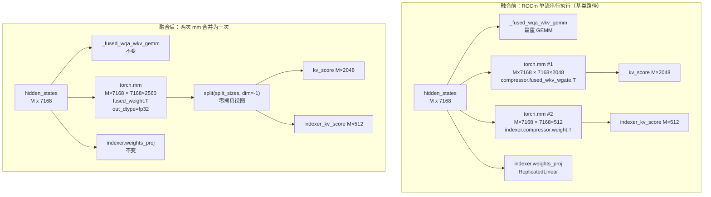
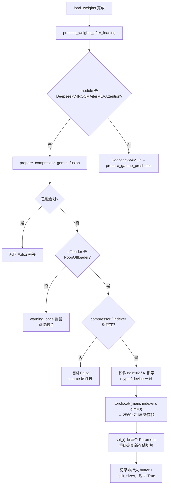
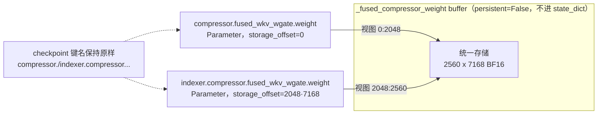

# PR #53838: [ROCm][DSV4][Perf] Fuse DeepSeek V4 C4 compressor GEMMs

> **作者**: @Fangzhou-Ai | **状态**: OPEN | **日期**: 2026-08-26
> **Branch**: `Fangzhou-Ai:afz/rocm-dsv4-compressor-gemm-fusion` → `vllm-project:main` | **Labels**: `performance`, `rocm`, `deepseek`, `DSv4`
> **变更规模**: +221 -0 行，涉及 3 个文件（2 个 commit）
> **Assignee**: @shen-shanshan | **Reviewers**: tjtanaa, zyongye, AndreasKaratzas, hongxiayang, dllehr-amd

---

## 1. 总结 (Summary)

本 PR 针对 ROCm 平台上 DeepSeek V4 C4 目标层中「主压缩器投影」（compressor）与「索引压缩器投影」（indexer compressor）两个串行执行的 GEMM 进行**权重拼接式融合**：在权重加载完成后将 `[2048, 7168]` 与 `[512, 7168]` 两个 BF16 权重沿 N 维一次性拼接为 `[2560, 7168]`，把两次 FP32 输出的 `torch.mm` 调用合并为一次 `[M, 7168] x [7168, 2560]` GEMM，并通过 `split()` 零拷贝视图将结果返回给原有消费方。实测 gfx950 上 decode 形状（M=4）该区域 eager 加速 **1.44x**、graph-replay 加速 **1.52x**；DeepSeek-V4-Pro TP8 端到端服务吞吐提升约 **+2.2%~2.9%**，TPOT 下降约 **2.2%~2.8%**，GSM8K 精度无回归。

---

## 2. 背景与动机 (Background & Motivation)

DeepSeek V4 采用 C4（Cross-layer Cross-token KV Cache Compression）架构。在 C4 **目标层**中，attention 的输入投影阶段除了最重的 `fused_wqa_wkv` GEMM 外，还需要执行：

1. **compressor 投影**：`torch.mm(hidden_states, compressor.fused_wkv_wgate.weight.T)` → `[M, 2048]`（本层 KV 压缩分数）；
2. **indexer compressor 投影**：`torch.mm(hidden_states, indexer.compressor.fused_wkv_wgate.weight.T)` → `[M, 512]`（索引器选择分数）；
3. **indexer weights 投影**：`indexer.weights_proj(hidden_states)`（ReplicatedLinear）。

两者（1、2）共享完全相同的输入 `hidden_states` 和相同的 K 维（7168），仅 N 维不同（2048 vs 512）。

**关键平台差异**：在 CUDA 路径上，基类 `DeepseekV4Attention._run_parallel_input_projections` 通过 `execute_in_parallel` 把三个轻量 GEMM 调度到**辅助 HIP stream** 上与主 GEMM 并行执行；而在 ROCm 路径上 `aux_stream_list` 为 `None`，`execute_in_parallel` 退化为**严格串行**执行。于是 decode 阶段（M 很小，如 M=4）这两个 GEMM 完全受 kernel 启动开销主导，特别是 N=512 的 indexer GEMM 单独启动一次利用率极低。

本 PR 的思路不是引入多流调度（如 #51794 的辅助 stream 方案），而是**在数据层面把两个 GEMM 合成一个**：权重拼接 + 单次 `torch.mm` + 输出 `split` 零拷贝切分，不改动任何 stream/graph 调度逻辑。作者声明该方案不与 #51794（辅助 HIP stream）、#53182（ROCm profiler runtime）重复。

**融合的适用条件**：
- 仅 ROCm 路径（`amd/` 目录下的模块）；
- 仅同时拥有 compressor 和 indexer 的 C4 目标层（source 层无 indexer，自动跳过）；
- **禁用 weight offloading 时**（offloader 会重绑定子参数，破坏打包存储的别名关系）。

---

## 3. 代码修改分析 (Code Change Analysis)

### 3.1 修改的模块

| 文件 | 操作 | 说明 |
|------|------|------|
| `vllm/models/deepseek_v4/amd/rocm.py` | 修改 (+73) | 核心实现：新增 `prepare_compressor_gemm_fusion()` 权重拼接方法，并覆写 `_run_parallel_input_projections()` 走融合路径 |
| `vllm/models/deepseek_v4/amd/model.py` | 修改 (+7) | 在 `process_weights_after_loading()` 中对每个 attention 层调用融合准备，统计并打印融合层数 |
| `tests/models/test_deepseek_v4_rocm_compressor_gemm_fusion.py` | 新增 (+141) | 3 个 CPU-only 单元测试：存储别名关系、offloading 跳过、单次 mm 调用行为 |

### 3.2 架构 / 流程图 (Architecture / Flow Diagram)

#### 融合前后执行流对比

#### 加载阶段：权重拼接与存储别名

#### 存储别名关系（零拷贝的关键）

### 3.3 关键实现细节 (Key Implementation Details)

**`prepare_compressor_gemm_fusion()`（rocm.py）**
- 幂等：`_fused_compressor_weight is not None` 时直接返回 `False`。
- **offloading 守卫**：`isinstance(get_offloader(), NoopOffloader)` 不满足时 `logger.warning_once` 并跳过——因为 offloader 可能重新绑定参数数据，破坏打包存储的别名关系。
- **形状校验**：两个权重必须都是 2D 矩阵、K 维（shape[1]）相等、dtype 与 device 一致，否则抛 `ValueError`（fail-fast，而非静默降级）。
- **拼接与重绑定**：`torch.cat((main_weight, indexer_weight), dim=0)` 生成新连续存储；在 `torch.no_grad()` 下用 `main_weight.set_(fused_weight[:main_size])` 和 `indexer_weight.set_(fused_weight[main_size:])` 把两个 `Parameter` 的数据重绑定到新存储的切片。原独立存储随引用消失自动释放，**不保留重复权重**。
- 融合张量存入 `register_buffer("_fused_compressor_weight", None, persistent=False)`——非持久 buffer 不进入 state_dict，checkpoint 键名（`compressor.fused_wkv_wgate.weight` 等）与 Parameter 身份完全保留。

**`_run_parallel_input_projections()` 覆写（rocm.py）**
- 未融合时（`fused_weight is None or split_sizes is None`）完整回退到 `super()`，行为零变化。
- 融合路径：`qr_kv` 仍走 ROCm 特有的 `_fused_wqa_wkv_gemm`（aiter bpreshuffle 路径不变）；`fused_scores = torch.mm(hidden_states, fused_weight.T, out_dtype=torch.float32)` 一次算出两个投影；`fused_scores.split(split_sizes, dim=-1)` 得到零拷贝的 `kv_score` 与 `indexer_kv_score` 视图。
- `indexer.weights_proj(hidden_states)` 是 ReplicatedLinear，不属于 mm 类 GEMM，保持原样单独执行。

**`process_weights_after_loading()`（model.py）**
- 遍历所有模块，对每个 `DeepseekV4ROCMAiterMLAAttention` 先 `prepare_compressor_gemm_fusion()` 再 `prepare_attn_preshuffle()`（二者不重叠：preshuffle 只处理 `fused_wqa_wkv` 和 `wo_b`，不触碰 compressor 权重）。
- 累计融合成功的层数并输出一条 info 日志，便于线上确认融合是否生效。

**测试（CPU-only，3 个用例）**
- 用 `__new__` + 手动装配的方式构造最小 attention 实例，避免 GPU/配置依赖。
- 用例 1 验证：split_sizes 正确、拼接内容正确、两个 Parameter 与 fused buffer **共享同一 storage**（data_ptr 相等）、`storage_offset` 正确、state_dict 不含 `_fused_compressor_weight` 且键名/值不变、二次调用幂等（data_ptr 不变）。
- 用例 2 验证：monkeypatch `get_offloader` 为非 NoopOffloader 时融合被跳过、两个权重保持独立存储。
- 用例 3 验证：融合路径只调用**一次** `torch.mm`，且 shape 为 `(3, 3)`、`out_dtype=torch.float32`、返回四元组各值正确。

---

## 4. 涉及的技术原理 (Technical Principles)

### 4.1 DeepSeek V4 的 C4 架构与压缩器投影

C4（Cross-layer Cross-token KV Cache Compression）为 DeepSeek V4 的核心稀疏注意力机制：每 L 层设置一个「目标层」，其 KV 通过压缩器（compressor）投影到低秩表示，同时用「索引器」（indexer）预测哪些历史 KV 值得加载。目标层因此需要两个共享输入、共享 K 维的线性投影——主压缩投影（N=2048）与索引压缩投影（N=512）。本 PR 正是利用这一结构特点做权重级融合；纯 source 层（无 indexer）自动不参与。

### 4.2 GEMM 融合：沿 N 维拼接权重

两个 GEMM `Y1 = X·W1ᵀ`（N=2048）与 `Y2 = X·W2ᵀ`（N=512）可等价替换为 `[Y1 | Y2] = X·[W1; W2]ᵀ`（N=2560）。收益来自两方面：

- **减少 kernel 启动次数**：decode 阶段 M 很小（如 M=4），每次 GEMM 都由启动开销主导，两次变一次直接省掉一次 launch；
- **提升 N 维效率**：N=512 的 GEMM 对 GPU 的 wave/块利用率极低，合并成 N=2560 后单次 kernel 的计算密度更高。

实测 gfx950 decode 形状（M=4, K=7168, N=2048+512）：eager `42.04 → 29.16 us`（1.442x），graph-replay `37.16 → 24.44 us`（1.520x）。

### 4.3 存储别名与 `Parameter.set_()`（零拷贝重绑定）

`torch.cat` 生成一份新连续存储后，PR 用 `param.set_(view)` 把原 `Parameter` 对象的数据指针**原地重定向**到新存储的切片上。与 `replace_parameter`（替换 Parameter 对象）不同，`set_` 保留了 Parameter 身份、模块树中的注册位置和 state_dict 键名，因此 checkpoint 兼容性天然成立；同时原独立存储引用计数归零后被回收，不产生持久的内存翻倍。两个 Parameter 与 buffer 三方共享同一 storage，互为视图。代价是这一别名关系是**隐式约定**：任何后续对参数数据的整体替换（offloading 重绑定、`.to()` 设备/精度迁移、未来可能的动态权重更新）都会静默破坏别名，这正是 PR 用 `NoopOffloader` 检查与 fail-fast 校验来收窄风险面的原因。

### 4.4 ROCm 上的串行执行与 CUDA 的辅助流对比

基类的 `execute_in_parallel(aux_fns, aux_streams, ...)` 在 CUDA 路径把三个轻量 GEMM 放到辅助 HIP stream 与主 GEMM 重叠执行（受 `VLLM_MULTI_STREAM_GEMM_TOKEN_THRESHOLD` 门控）；ROCm 上 `aux_stream_list is None`，退化为串行。本 PR 不引入多流（保持现有 stream/图调度不变），而是通过数据融合消除串行链上的一个环节，与 #51794 的辅助 stream 方案正交。

### 4.5 与 CUDA Graph 的兼容性

融合发生在 `process_weights_after_loading`（权重加载完成后、图捕获之前），捕获时 buffer 地址已固定，单次 `torch.mm` 直接进入 FULL_AND_PIECEWISE 图。graph-replay 下收益（1.52x）高于 eager（1.44x），说明融合后该区域更少受图外 eager 断点影响。`split()` 是纯元数据操作，不产生拷贝，图捕获无碍。

---

## 5. 评论区讨论亮点 (Discussion Highlights)

PR 创建仅数小时（2026-08-26 05:28 UTC），**尚无 issue comments 与 inline review comments**，讨论尚未展开。目前可注意到的信息：

- **claude[bot] 自动 review**：唯一一条 review 活动，指出该 PR 来自 fork，自动 review 被禁用，需 maintainer 评论 `@claude review` 才能触发一次性审查。
- **评审组织**：PR 已指派给 @shen-shanshan，并请求了 5 位 reviewer（tjtanaa、zyongye、AndreasKaratzas、hongxiayang、dllehr-amd），多为 AMD/ROCm 相关维护者，评审尚未给出结论。
- **AI 辅助披露**：作者在 PR 描述中披露使用 OpenAI Codex 辅助调研、实现、测试与起草，并声明逐行审查过所有改动。

---

## 6. 风险与潜在问题 (Risk Analysis)

| 风险 | 严重程度 | 说明 |
|------|---------|------|
| **存储别名的隐式脆弱性** | High | 两个 Parameter 通过 `set_` 与 buffer 三方共享 storage 是隐式约定。任何后续对参数数据的整体替换（未来 DSV4 支持 LoRA、动态量化、权重热更新，或对已融合模块调用 `.to(dtype/device)`）都会静默破坏别名——参数与 buffer 分叉成两份数据，而计算路径读取的是 buffer，产生「权重改了但推理没变」的静默错误。当前生命周期内（load → fuse → capture → serve）安全，但这是需要后续维护者持续知晓的隐性不变量。 |
| **fail-fast 校验的兼容性** | Medium | 形状/dtype/device 不一致时直接 `raise ValueError` 会导致模型加载失败。对 DSV4 官方权重这是不可能路径，但若未来出现变体（不同层 compressor 维度不一致的自定义模型），加载将硬失败而非降级回基类路径。更稳妥的做法可能是 warning + 返回 False 降级。 |
| **数值一致性** | Low | 融合后 N=2560 的单次 GEMM 与两次独立 GEMM 的 kernel 分块策略不同，结果存在微小差异。作者在 gfx950 decode 形状下验证 `rtol=atol=1e-4`、最大绝对差 `6.1e-05`，GSM8K 精度无回归（0.9606），风险可控；但 prefill 大 M 形状未单独报告数值对比。 |
| **权重加载期瞬时内存** | Low | `torch.cat` 在拼接瞬间产生约 37 MB/层（2560×7168×2B）的临时副本，原存储随后释放，无持久翻倍。对整模型体量可忽略。 |
| **测试覆盖** | Low | 3 个单元测试为 CPU-only、mock 驱动，覆盖了别名关系、offloading 守卫与单次 mm 行为，但端到端 GPU 正确性依赖作者本地验证（gfx950 基准 + TP8 服务 + GSM8K），CI 中无对应 GPU 用例，未来回归主要靠人工发现。 |
| **收益依赖 decode 形状** | Low | 融合收益集中在 kernel 启动主导的小 M 场景；prefill 大 M 下两次 mm 本来已接近带宽饱和，合并收益有限（PR 未报告 prefill 数据，但不会变差）。 |
| **CI 状态未定** | Low | `mergeable_state: "unstable"`，来自 fork 的 PR 需 maintainer 批准触发 CI；需等待 CI 全绿后才能合入。 |

---

## 7. 结论 (Conclusion)

PR #53838 是一个思路清晰、侵入面小、收益扎实的 ROCm 性能优化：通过权重拼接把 C4 目标层的两个串行压缩器 GEMM 合为一个，在不动 stream/图调度的前提下获得 decode 区域 1.44–1.52x 加速与端到端约 2–3% 的吞吐提升，且 checkpoint 兼容性、幂等性与 offloading 守卫都处理得干净利落。主要关注点是 `set_` 存储别名这一隐式不变量的长期可维护性（建议在代码注释或后续讨论中明确约束），以及形状校验采用 fail-fast 而非降级的兼容性取舍；待 CI 通过且评审确认后，具备合入条件。
