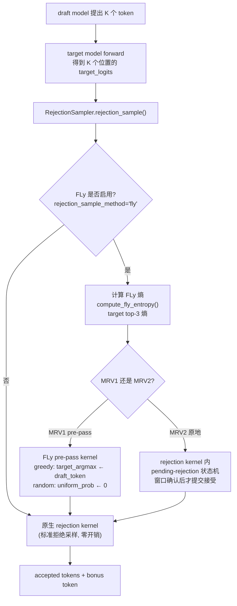
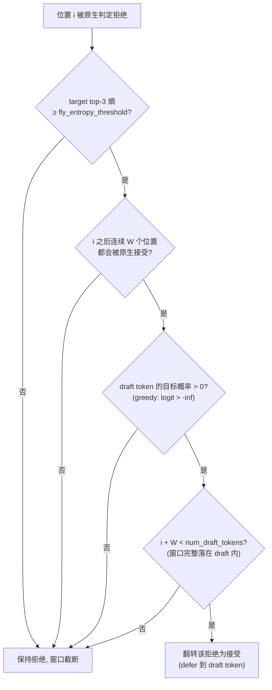

# PR #53987: [Spec Decode][ROCm] Add FLy: Entropy-Gated Deferred Verification for Draft-Model Speculative Decoding

> **作者**: @eecspan (AMD) | **状态**: OPEN | **日期**: 2026-08-27
> **Branch**: `AMD-AGI:feat/fly-verifier` → `vllm-project:main` | **Labels**: `documentation`, `rocm`, `speculative-decoding`, `mrv2`, `verified`
> **变更规模**: +846 -23 行，涉及 13 个文件

---

## 1. 总结 (Summary)

本 PR 为 vLLM 引入 **FLy**（arXiv:2511.22972，ICLR 2026 录用）——一种基于熵门控延迟验证（entropy-gated deferred verification）的投机解码验证策略。核心思想：当目标模型在某个位置"拒绝"了 draft token、但该位置熵很高（目标模型本身也不确定）且后续 W 个 token 都能被原生接受时，FLy 将该次拒绝改为接受，避免单一模糊位置截断整段已验证的 draft。实现上 FLy 完全不重写采样逻辑，而是以 pre-pass kernel 的形式改写原生 rejection kernel 的输入（greedy 路径改写 target_argmax，random 路径将 uniform sample 置 0），原生内核不变。在 AMD MI355X 的 40 个模型-数据集配置上，FLy 相比标准投机解码提速 **1.067x–1.938x**（典型 ~1.23x），质量保留率最低 97.9%。

---

## 2. 背景与动机 (Background & Motivation)

标准 rejection sampling（Leviathan et al. 2023）在第一个被拒绝的 draft token 处立即停止，导致后续已被目标模型验证过的 token 全部丢弃。FLy 论文观察到：当拒绝发生在目标模型高熵（真正"拿不准"）的位置、且其后的接受决策全部一致时，这个孤立拒绝通常不值得整体截断。

**具体痛点**：
- 单个模糊位置的拒绝使整段 draft 白算，`tau`（每轮平均接受 token 数）偏低，尤其在 draft/target 差距较大的场景（如 405B 目标 + 8B draft）。
- 已有相关工作（DSpark #47808、D-Cut #47131）只调整"验证多少个 token"（验证预算），不改变"接受/拒绝判定本身"；FLy 与其互补而非竞争。
- 类似命名的 DFly（#50246）是 drafting 方法而非验证策略，作者确认截至提交时无其他 PR 修改 `rejection_sampler.py` 中的判定逻辑。

**技术思路**：在原生接受判定之前插入一个 pre-pass，仅在满足四个门控条件时把单个拒绝翻转成接受——(1) 目标 top-3 熵 ≥ 阈值（目标确实不确定）；(2) 后续 `fly_window_size` 个位置都会被原生接受（draft 已重新同步，延迟是局部的）；(3) draft token 的目标概率非零；(4) 剩余 draft 长度足够容纳完整窗口。

---

## 3. 代码修改分析 (Code Change Analysis)

### 3.1 修改的模块

| 文件 | 操作 | 说明 |
|------|------|------|
| `vllm/v1/spec_decode/fly.py` | 新增 (+191) | 核心实现：`compute_fly_entropy()` 熵计算 + 两个 Triton pre-pass kernel（greedy/random 延迟验证） |
| `vllm/v1/sample/rejection_sampler.py` | 修改 (+65) | V1 CPU/GPU 共享入口 `rejection_sample()`：接入 FLy pre-pass、复用单次 softmax |
| `vllm/v1/worker/gpu/spec_decode/rejection_sampler.py` | 修改 (+7) | V1 GPU worker：解析 `rejection_sample_method="fly"`，传递 window/阈值参数 |
| `vllm/v1/worker/gpu/spec_decode/rejection_sampler_utils.py` | 修改 (+79) | **MRV2 支持**：`_rejection_kernel` 内实现 pending-rejection 状态机（原地延迟，非 pre-pass 改写） |
| `vllm/config/speculative.py` | 修改 (+39) | 新增 `fly_window_size`、`fly_entropy_threshold` 配置字段 + `_verify_args` 校验（含 lossy 警告） |
| `vllm/envs.py` | 修改 (+3) | 新增环境变量 `VLLM_FLY_ENTROPY_TOP_K`（熵门控取 top-k 的概率数，默认 3） |
| `vllm/v1/spec_decode/llm_base_proposer.py` | 修改 (+1) | probabilistic draft probs 收集条件加入 `"fly"` |
| `vllm/v1/worker/gpu_model_runner.py` | 修改 (+1) | dummy sampler run 的 draft_probs 条件同步加入 `"fly"` |
| `docs/features/speculative_decoding/fly.md` | 新增 (+48) | FLy 使用文档（含 warning：有损方法） |
| `docs/features/speculative_decoding/README.md` | 修改 (+10) | 修正过时的 `rejection_sample_method` 文档行（drive-by fix） |
| `tests/v1/sample/test_rejection_sampler.py` | 修改 (+182) | 新增 FLy 单测（6 个） |
| `tests/v1/spec_decode/test_rejection_sampler_utils.py` | 修改 (+163) | MRV2 rejection kernel 的 FLy 路径测试 |
| `tests/test_config.py` | 修改 (+57) | 配置校验测试（10 个） |

### 3.2 架构 / 流程图 (Architecture / Flow Diagram)

#### 整体接入位置：FLy 只动验证阶段

#### FLy 的门控决策逻辑（单次拒绝的翻转条件）

### 3.3 关键实现细节 (Key Implementation Details)

- **MRV1 路径（pre-pass 改写输入）**：`apply_fly_greedy_acceptance_kernel` / `apply_fly_random_acceptance_kernel` 两个 Triton kernel 在原生 kernel 之前运行。greedy 路径将 `target_argmax[i]` 覆写为 `draft_token_ids[i]`（使原生相等测试通过）；random 路径将 `uniform_probs[i]` 置 0（使原生 `p/q >= u` 测试在 p、q 均大于 0 时通过）。原生 kernel 完全未修改，per-position 记账与验收指标天然保持正确。
- **MRV2 路径（kernel 内状态机）**：`_rejection_kernel` 新增 `pending_rejection` 状态——遇到可延迟的拒绝时不立即提交，进入 pending 态；随后仅当连续 `FLY_WINDOW_SIZE` 个位置全部原生接受时才一次性提交整段接受（`accepted_length = i + 1`），否则回退到拒绝位置输出 `rejected_argmax`。greedy 路径需额外在末尾 store 被拒 argmax 作为 bonus token。
- **熵计算**：`compute_fly_entropy()` 取 top-k（默认 3，可由 `VLLM_FLY_ENTROPY_TOP_K` 调整）处理后概率计算熵。作者最初为避免物化全量 softmax 而直接从 logits 计算，但基准测试显示**先 softmax 一次并复用反而快 1.17x–1.23x**（熵最大误差仅 1.86e-8），最终采用复用 softmax 方案。
- **配置校验**（`SpeculativeConfig._verify_args`）：FLy 要求 `num_speculative_tokens >= 2`、`fly_window_size < num_speculative_tokens`（默认 `min(6, n-1)`，动态推导）；拒绝 `extract_hidden_states` 组合；与 `synthetic` 拒绝采样不兼容；启用时打印 `warning_once` 提示"有损方法可能降低输出质量"。支持 heterogeneous vocab（token-level intersection），但与 `use_local_argmax_reduction` 互斥。
- **V2 兼容性**（评审要求后补）：`rejection_sampler_utils.py` 中 `rejection_sample()` 在 `fly_window_size > 0` 时对 `target_logits[:, :vocab_size]` 以 `from_logits=True` 计算熵，并将其传入 kernel；FLy 与 block verification / synthetic mode 互斥（assert）。
- **draft_probs 传递链**：`llm_base_proposer.py` 与 `gpu_model_runner.py` 的 probabilistic draft probs 条件从 `== "standard"` 扩展为 `in ("standard", "fly")`，保证 probabilistic drafting 下 FLy random 路径能拿到 q 分布。

---

## 4. 涉及的技术原理 (Technical Principles)

- **投机解码拒绝采样（Speculative Decoding / Rejection Sampling）**：draft 模型先便宜地提议 K 个 token，target 模型一次前向并行验证。greedy 验证时逐个比较 `target_argmax == draft_token`；随机验证时按 `p(x)/q(x) >= u`（u ~ Uniform(0,1)）概率接受。第一个被拒位置之后全部丢弃，并在其位置用 target 分布补采一个 bonus token。标准 SD 严格保持 target 分布。
- **FLy 的熵门控延迟验证**：FLy 是有损（lossy）近似策略——它不严格保持 target 分布，而是用"延迟"换取吞吐。直觉是：高熵位置 target 自身各候选概率接近，选择 draft token 与 target 自选带来的分布偏差小；且当后续窗口全部原生接受时，说明该位置是一次"孤立分歧"，截断成本远高于接受成本。熵在 temperature/top-k/top-p **之后**计算，反映实际采样分布。
- **`tau`（每轮平均接受 token 数）**：`tau = 1 + accepted_draft_tokens / verification_rounds`，是投机解码吞吐的直接决定量。FLy 的机制性收益体现在所有配置中 `tau` 均上升（1.03x–1.83x），从而在 target 前向成本不变的前提下直接提升输出吞吐。
- **ROCm 兼容性**：全部改动为纯 Python + Triton kernel，JIT 编译在 ROCm 与 CUDA 上均无需重建。AMD MI355X (gfx950) 评测使用 torch.compile + HIP graph。

---

## 5. 评论区讨论亮点 (Discussion Highlights)

评审人 **@benchislett**（vLLM maintainer，核心评审）提出两轮意见，总体态度正面：

1. **"MRV1 support is insufficient"（核心诉求）**：要求必须支持 ModelRunnerV2（默认 runner），MRV1 可选。作者随后在 `rejection_sampler_utils.py` 的 V2 `_rejection_kernel` 中实现了 pending-rejection 状态机，并用 Qwen3.5-9B + MTP (K=4) 在 B300 上初测 ~1.15x 端到端加速、GSM8K 精度 104/128 vs 103/128 相当。
2. **评测强度质疑**：认为 Llama 3.1 70B 过旧、GSM8k/HumanEval 等基准过于简单，要求至少包含一个较新模型（DSV4 / GLM5.3 / Kimi K3 / Qwen3.8 之一）+ 前沿基准（TerminalBench、SWEBench-Pro、有区分度的 HLE）+ 至少一次 MTP 运行。作者答复"将尽快更新"（截至快照尚未在 PR body 中体现新模型评测）。
3. **熵 top-k 可配置性**：`benchislett` 建议把熵的 top-k 做成全局 `VLLM_` 环境变量 → 已落实为 `VLLM_FLY_ENTROPY_TOP_K`。
4. **lossy 警告**：建议在配置时打印 `warning_once` 提示 FLy 是有损方法 → 已落实。
5. **CodeRabbit 静态审查**（两轮）提出两个 Minor 问题，均已修复：`fly_window_size` 固定默认 6 会在 `num_speculative_tokens <= 6` 时校验失败 → 改为动态推导 `min(6, n-1)`；heterogeneous vocab 组合被过度拒绝 → 解除限制并补兼容性测试。
6. 其他小项：移除 `@torch.inference_mode()` 装饰（vLLM 全局已处于 inference mode）、文档位置调整、删除价值不大的 config 测试、质疑"熵从 logits 直接算是否更省"（作者用基准数据回应软max复用更快）。

作者在 2026-09-04 的 commit `355ff75` 集中回应了大部分反馈：简化并文档化实现、复用单次 softmax、熵 top-k 可配置、窗口默认动态推导、新增 lossy 警告、放开 heterogeneous vocab。PR 当前存在 merge conflict 需 rebase。

---

## 6. 风险与潜在问题 (Risk Analysis)

| 风险 | 严重程度 | 说明 |
|------|---------|------|
| 有损方法改变输出分布（用户预期之外） | Medium | FLy 不保持 target 分布，opt-in 且有 warning_once 提示；但 29 个有比例的质量配置中最低保留率 97.9%，3 个低正确数配置（AIME/HLE）FLy 低于 T 和 SD（如 R1-70B AIME24: 20/20/17），对超低正确率基准的单题波动敏感 |
| MRV2 状态机正确性 | Medium | `_rejection_kernel` 新增 pending-rejection 分支显著增加了核心 kernel 复杂度（greedy/random/synthetic/block 多路交织）；MTP 初测仅 1 个配置，MRV2 下 FLy 尚未经过与 MRV1 同规模的系统评测 |
| 评测代表性不足（评审意见） | Medium | 主评测目标模型均为 2 年以上的 Llama 3.1 / Qwen3-235B 等，缺少新模型 + 前沿基准 + MTP 主评测；作者承诺补测但截至快照未落地 |
| 性能开销（FLy 未启用时的零开销保证） | Low | 关闭时 `fly_window_size = 0` / `None`，`FLY_WINDOW_SIZE=0` 为 constexpr 分支，熵不计算、kernel 不启动；启用时多一次 top-3 熵计算（topk 开销小） |
| 与 V2 默认路径的兼容边界 | Low | `draft_model` standalone 提案仍仅 MRV1；V2 下需要 MTP/EAGLE/DFlash 等 hidden-state proposer；配置校验已在入口处拦截非法组合 |
| 与 `use_local_argmax_reduction` 互斥 | Low | 新增校验会在两者同开时报错，行为明确但可能对少数用户造成配置迁移成本 |
| 文档/测试覆盖 | Low | 单测覆盖 greedy/random 延迟路径、熵门控、窗口边界、配置校验（6+10 个新用例），81 个原有 rejection-sampler 测试全部通过 |

---

## 7. 结论 (Conclusion)

这是一个集成干净、算法优雅、收益显著的 ROCm 投机解码优化 PR：以"改写输入而非重写判定"的思路将改动压缩到验证阶段，并在评审推动下补齐了 MRV2 支持和 lossy 警告。当前主要悬念是评测强度（新模型/前沿基准/MTP 主评测）与 MRV2 状态机的更大规模验证，作者已承诺跟进；从代码质量与机制性证据（所有配置 tau 与接受率均上升）看，合并前景良好。

---
*报告生成时间: 2026-09-09 | 数据快照: PR #53987 @ 2026-09-05*
