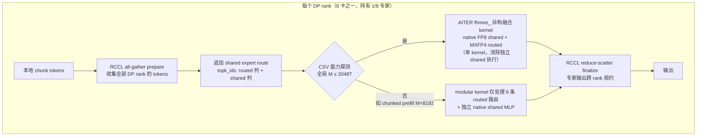
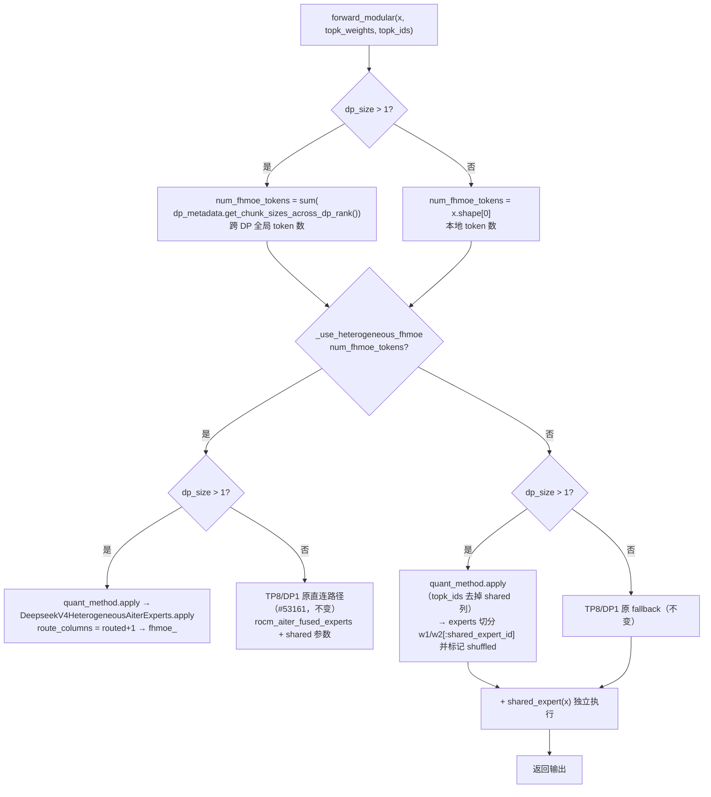
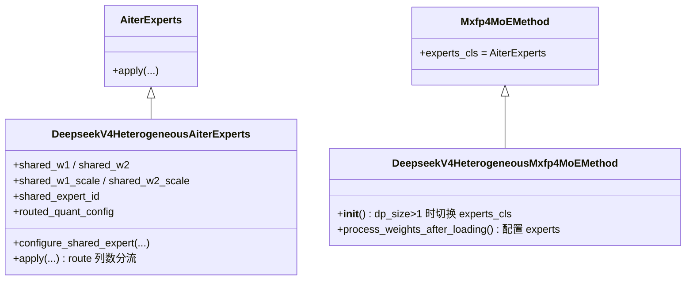

# PR #54134: [ROCm][DeepSeek V4] Enable FHMoE with DP8 over RCCL

> **作者**: @LiuYinfeng01 (AMD, yinfeliu@amd.com) | **状态**: OPEN | **创建**: 2026-08-28（最近更新 2026-09-11）
> **Branch**: `LiuYinfeng01:rocm-dsv4-dp8-fhmoe` → `vllm-project:main` | **Labels**: `rocm`, `deepseek`, `nvidia`, `DSv4`
> **变更规模**: +515 -26 行，涉及 3 个文件 | **Assignee**: @shen-shanshan
> **Reviewers**: tjtanaa, zyongye, AndreasKaratzas, hongxiayang, dllehr-amd（均已请求，暂无人工 review）

---

## 1. 总结 (Summary)

本 PR 将 DeepSeek V4 的异构融合 MoE 路径（FHMoE：native FP8 shared expert + MXFP4 routed experts 融合进单一 kernel）从 **TP8/DP1** 扩展到 **TP1/DP8**，在保持 vLLM 现有分布式流水线（RCCL all-gather prepare → 本地异构 kernel → RCCL reduce-scatter finalize）的前提下：将 native FP8 shared-expert 权重与 E8M0 scale 按展平的 DP rank 切分；让 #53161 引入的异构 kernel 运行在 **modular expert 边界**（`quant_method.apply` → 新的 `DeepseekV4HeterogeneousAiterExperts`）内部；TP8/DP1 的原有直连路径保持不变。解码场景 A/B 实测 **TPOT 中位数 -8.39%、输出吞吐 +8.06%、TTFT -8.87%**，GSM8K 精度与关闭 FHMoE 的基线达到 parity（差异在噪声范围内）。PR 当前被 assign 给 @shen-shanshan 审查。

---

## 2. 背景与动机 (Background & Motivation)

DeepSeek V4 在 ROCm 上的 MoE 结构是**异构量化**的：shared expert 使用 native FP8（E4M3 权重 + E8M0 block-128 scale），routed experts 使用 MXFP4。#53161（已合并）首次在 vLLM 中集成了 AITER 的 `fhmoe_` 异构融合 kernel，但只支持 **TP8/DP1** 拓扑，且走的是绕过 modular dispatch/combine 的直连路径。

**为什么要 TP1/DP8**：在单机 8 卡 MI355X 上，TP1/DP8 意味着 MoE 专家层按 DP 维切分——每张卡只持有 1/8 的专家权重（显著降低单卡显存占用），输入 token 通过 RCCL all-gather 广播到所有 rank、各 rank 计算自己的专家分片、再用 reduce-scatter 规约输出。对 DeepSeek V4 这种超大 MoE 模型（384 个 routed experts），DP8 是更契合解码阶段（compute 轻、通信占比可控）的部署拓扑。

**为什么必须走 modular 路径**：作者在 PR 描述中明确提到，早先的「直连 kernel DP 原型」因为绕过了 modular dispatch/combine 而被否决——它无法通过 GSM8K 正确性验证。因此本 PR 的核心工程决策是：把异构 kernel 挂进标准的 modular expert 边界（`experts_cls` 机制），复用 vLLM 既有的 DP 通信与路由框架，而不是再写一条直连路径。

---

## 3. 代码修改分析 (Code Change Analysis)

### 3.1 修改的模块

| 文件 | 操作 | 说明 |
|------|------|------|
| `vllm/models/deepseek_v4/amd/model.py` | 修改 (+127/-26) | 兼容性门控放宽到 TP×DP=8；`_prepare_native_fp8_shared_expert` 增加 DP 分片；新增 `_shared_expert_shard_rank_and_size` 辅助函数；`DeepseekV4HeterogeneousMxfp4MoEMethod` 在 DP 下切换 experts 类并配置 shared 权重；`forward_modular` 增加 DP 分支（用全局 token 数做 CSV 探测决策，走 modular apply） |
| `vllm/model_executor/layers/fused_moe/experts/rocm_aiter_moe.py` | 修改 (+134) | 新增 `DeepseekV4HeterogeneousAiterExperts(AiterExperts)`：持有 shared-expert 权重/scale/ID，`apply()` 根据 route 列数选择「shared+routed 融合」或「仅 routed 回退」路径并调用 `rocm_aiter_fused_experts` |
| `tests/model_executor/layers/test_fused_shared_expert.py` | 修改 (+254) | 新增 4 组测试：shard rank/size 选择、DP 分片后权重重构（含 scale 字节级校验）、modular kernel 路径选择（monkeypatch）、experts 权重选择；兼容性门控测试新增 TP1 与 DP8 用例 |

### 3.2 架构 / 流程图 (Architecture / Flow Diagram)

#### DP8 运行时数据流

#### forward_modular 决策流程（模型层核心改动）

#### 新增/修改的类关系

### 3.3 关键实现细节 (Key Implementation Details)

**兼容性门控（`_heterogeneous_shared_expert_enabled`）**
- 原条件 `tp_size == 8 && dp_size == 1` 改为 `tp_size * dp_size == 8`，并显式拒绝 `tp > 1 && dp > 1` 的组合并行（如 TP2/DP4）。允许的组合仍只有 TP8/DP1 与 TP1/DP8 两种。

**shared-expert 权重分片（`_prepare_native_fp8_shared_expert` + `_shared_expert_shard_rank_and_size`）**
- 新增 `shard_rank`/`shard_size` 参数：对 W13（`2*intermediate × hidden`）、W2（`hidden × intermediate`）按 intermediate 维切片，scale 按 block-128 行对齐切片。
- `_shared_expert_shard_rank_and_size(tp_rank, tp_size, dp_size)` 返回 `(tp_rank, tp_size) if dp_size > 1 else (0, 1)`：DP 模式下 `moe_parallel_config` 中的 tp_rank/tp_size 是**跨 DP 展平**后的值（`flatten_tp_across_dp_and_pcp`，TP1/DP8 时即 dp_rank/8），需要额外切片；TP8/DP1 下线性层权重在加载时已被 TP 切分，不能再切——这正是 CodeRabbit 抓到的 bug 的修复方式（见第 5 节）。
- 切分后的权重仍经 `rocm_aiter_ops.shuffle_weight_a16w4` 转成 AITER 布局，E8M0 scale 仍展开为 FHMoE 的 1×32 布局（填充 `0x7F`）。

**DP 下的 modular 接线（`DeepseekV4HeterogeneousMxfp4MoEMethod`）**
- `__init__` 中当 `moe.dp_size > 1` 时将 `experts_cls` 切换为 `DeepseekV4HeterogeneousAiterExperts`，使 modular kernel 实例化该 experts 类。
- `process_weights_after_loading` 在 DP 下校验 modular kernel 与 experts 类型后，调用 `experts.configure_shared_expert(...)` 注入分片后的 shared 权重、scale、`shared_expert_id` 与 routed-only 的量化配置。

**Experts 层 route 列数分流（`DeepseekV4HeterogeneousAiterExperts.apply`）**
- `route_columns == experts_per_token + 1`（shared route 已追加）→ 使用完整 `quant_config`，把 shared 权重/scale/ID 传给 `rocm_aiter_fused_experts`，kernel 内部走 `fhmoe_` 融合路径。
- `route_columns == experts_per_token`（纯 routed 回退）→ 使用 `routed_quant_config`，把 `w1/w2` 切到 `[:shared_expert_id]` 并置 `is_shuffled=True`（AITER 要求的权重布局标记）。
- 其他列数直接 `ValueError`，防御性校验。

**forward_modular 的 DP 分支**
- DP 下用 `get_forward_context().dp_metadata.get_chunk_sizes_across_dp_rank()` 的**总和**作为 CSV 探测的 M——因为 all-gather 后每个 rank 都要处理全部 token，能力探测必须看全局 M 而非本地 chunk 大小。
- 融合路径与回退路径在 DP 下都改走 `quant_method.apply`（modular 边界），TP8/DP1 保留 #53161 的直连调用不变。

---

## 4. 涉及的技术原理 (Technical Principles)

### 4.1 FHMoE（Fused Heterogeneous MoE）

DeepSeek V4 的 MoE 层由 1 个 shared expert（native FP8 E4M3 + E8M0 block scale）和 384 个 routed experts（MXFP4）组成。传统实现里 shared expert 是独立的一次 MLP 计算；AITER 的 `fhmoe_` kernel 把「routed experts + shared expert」融合成**单个 kernel**：shared expert 被当作一条额外的 route（`shared_expert_id`，权重恒为 1）拼进 topk 路由，一次 kernel 启动内完成全部专家计算。收益直接来自消除独立 shared-expert 执行——解码 A/B 中 TPOT -8.4% 主要来源于此。

### 4.2 DP 专家并行 + RCCL AG/RS（无 all-to-all 的 EP）

TP1/DP8 下每个 rank 持有 1/8 的专家权重（沿 intermediate/专家维切分），tokens 则分属各 rank。执行流程：
1. **all-gather prepare**：每个 rank 把自己的 tokens 广播给所有 rank，此后每个 rank 拥有全部 tokens；
2. **本地计算**：各 rank 用自己的专家分片处理全部 tokens（`topk_ids` 只含本地持有的专家）；
3. **reduce-scatter finalize**：对本地专家输出按 token 做跨 rank 规约，还原每个 rank 自己的输出 chunk。

相比 all-to-all dispatch/combine 的 EP，AG/RS 实现简单、RCCL 原生支持，缺点是每个 rank 都要算一遍全部 tokens（计算量 ×DP）。对 decode 这种通信/计算比适中的场景是可接受的。`moe_parallel_config` 中的 tp rank/size 在 DP 下会被**展平**（`flatten_tp_across_dp_and_pcp`），专家权重按展平 rank 分片。

### 4.3 E8M0 scale 与 1×32 布局展开

DeepSeek V4 的 native FP8 使用 E8M0（8 位纯指数、无尾数）作为 block-128 的 scale，一个 scale 字节作用于 128 个权重。而 FHMoE kernel 期望 scale 是 1×32 布局（每个 scale 作用于 32 个权重、4 列并列）。`_prepare_native_fp8_shared_expert` 将 block-128 scale 按行 repeat 128 次、按列 repeat 4 次展开，宽度不足处填 `0x7F`（E8M0 的 NaN 哨兵值，表示该列不参与计算）。DP 分片必须**先按 128 对齐切片再展开**，测试中对 scale 字节做了逐字节重构校验。

### 4.4 Modular MoE 边界与 CSV 能力探测

vLLM V1 的 MoE 层通过 `quant_method.apply` → `moe_kernel.fused_experts`（`experts_cls` 决定实例类型）的 modular 边界统一处理 dispatch/combine。DP 路径复用了这条边界，这是本 PR 与之前被否决的直连原型的关键区别。`fhmoe_` 的启用由 CSV 能力探测 `fused_moe_supports_heterogeneous_shared_expert`（AITER 侧 `supports_dsv4_i384_fhmoe`）决定：**M ≤ 2048 返回 True，M ≥ 4096 返回 False**——因此 decode 批次走融合路径，chunked prefill（8192 tokens）合法地回退到「modular routed + 独立 shared MLP」。

---

## 5. 评论区讨论亮点 (Discussion Highlights)

### CodeRabbit 抓到的 Critical 正确性 bug（已修复）

CodeRabbit 在 `prepare_heterogeneous_shared_expert` 处指出：最初版本**无条件**用 `moe_parallel_config.tp_rank/tp_size` 做分片，会破坏 TP8/DP1——该拓扑下 `DeepseekV4MLP` 的 `MergedColumnParallelLinear` 在加载时已经把 shared-expert 权重 TP 切分过（W13 实际是 768 宽而非 6144），再按 tp_size=8 切一次会直接触发 `Unexpected shared W13 shape` 报错。

作者在 commits f7f060d…97f0fbe 中修复：新增 `_shared_expert_shard_rank_and_size` 辅助函数，`dp_size == 1` 时返回 `(0, 1)`（不额外切片），并配了参数化回归测试 `(3, 8, 1, (0, 1))` / `(3, 8, 8, (3, 8))` 锁定两种拓扑的行为。

### CodeRabbit 的维护性建议（未处理）

- **Trivial**：`DeepseekV4HeterogeneousAiterExperts.apply` 末尾的 output 绑定块（`set_`/`copy_` 判断）与基类 `AiterExperts.apply` 完全重复，建议抽取为 `_bind_output` 静态辅助方法。作者未采纳（保持最小改动）。
- **Warning**：Docstring 覆盖率 4.55%，低于 80% 阈值（涉及 diff 内 22 个函数）；其余 4 项 pre-merge 检查（标题、描述、链接 issue、越界变更）通过。

### 合并状态

- Mergify bot 两次（08-28、09-07）提示存在 **merge conflicts**，`mergeable_state: unstable`、`rebaseable: false`，需要 rebase。
- Claude bot 因 PR 来自 fork，自动 review 被禁用。
- 已请求 5 位 reviewer（含 AMD 侧 dllehr-amd、hongxiayang），截至数据抓取时**尚无人工 review 意见或 approval**。

### PR 描述中的「重测」章节（透明度亮点）

PR 描述后半部分追加了在旧 `DeepSeek-V4-Pro` checkpoint 上的重测：GSM8K 两臂 0.9674 vs 0.9666（差距 0.08pp），而 ON 臂自身两次运行的方差达 0.37pp，结论明确写为**精度 parity 而非可测回归**；同时诚实说明 decode 吞吐与 E2E 表格**未**在该 checkpoint 上复测——首次尝试发现单臂内 67–70% 的运行间波动（共享前缀缓存预热效应）会淹没效应量。重测通过 `VLLM_DSV4_FHMOE` 本地 patch 开关实现（仅用于 A/B，不含在 PR 代码中），并用门控计数器证明了各臂实际执行的路径（ON 臂 77% 走融合、23% 为大 prefill 回退）。

---

## 6. 风险与潜在问题 (Risk Analysis)

| 风险 | 严重程度 | 说明 |
|------|---------|------|
| **外部依赖未就绪** | High | 依赖 ROCm/aiter#4891（physical-I384 FHMoE 配置与能力契约），vLLM 必须消费包含该依赖的 AITER 版本后才能合并。当前 PR 无法独立合入，merge blocker。 |
| **merge conflicts 待解决** | Medium | `rebaseable: false`，主分支演进快（`rocm_aiter_moe.py`、`model.py` 均为活跃文件），越晚 rebase 冲突越大。 |
| **性能数据可复现性存疑** | Medium | 作者自述在第二个 checkpoint 上 decode A/B 出现 67–70% 单臂波动；主表格的 -8.39% TPOT 依赖特定配置（`max-num-batched-tokens=384`、`FULL_DECODE_ONLY` 图、预热丢弃），效应量稳健性未经多 checkpoint 验证。E2E 8K/1K 仅为 +0.74% 的 smoke 结果。 |
| **精度一致性依赖数值方差论证** | Medium | GSM8K 差异 0.23pp（第一个 checkpoint）/ 0.08pp（第二个），靠「运行间方差 0.37pp」论证 parity——论证合理但属事后解释，无 bitwise/容差级数值对比测试。 |
| **DP 路径的 fallback 权重切片耦合** | Medium | DP 回退依赖两层配合：`forward_modular` 传 `topk_ids[:, :-1]`，experts 层按 `shared_expert_id` 切 `w1/w2` 并标记 `is_shuffled`。逻辑分散在两处，若未来 shared_expert_id 语义变化（如 EPLB 场景）可能静默出错；有 monkeypatch 测试覆盖但无 GPU 验证。 |
| **assert 依赖框架不变量** | Low | `forward_modular` 用 `assert dp_metadata is not None` / `assert sizes is not None`，`python -O` 下会被剥离；依赖 DP 模式框架必然注入 dp_metadata 的不变量，风险低但风格上不推荐。 |
| **M 阈值边界行为未定义** | Low | CSV 探测仅在 M ≤ 2048 与 M ≥ 4096 区间有明确结论，2049–4095 之间的行为未在 PR 中说明，属 AITER 侧契约问题。 |
| **测试覆盖与 CI** | Medium | 新增测试全部是 CPU monkeypatch 测试（71 个测试通过，但其中大部分是既有测试）；FHMoE DP 路径的正确性验证完全依赖手工 GSM8K 跑测，CI 无 GPU 覆盖，未来回归只能靠人工发现。 |
| **docstring 覆盖率告警** | Low | 4.55% vs 80% 阈值，CodeRabbit pre-merge 检查给出 warning；不影响功能，但可能被 maintainer 要求补齐。 |

---

## 7. 结论 (Conclusion)

PR #54134 是一个范围克制、架构选择正确的 ROCm 优化 PR：通过把异构 kernel 挂进 modular expert 边界（而非再造直连路径），成功把 FHMoE 从 TP8/DP1 推广到 TP1/DP8，并保留了原拓扑行为不变（辅以参数化回归测试锁定）。解码场景 ~8% 的吞吐提升与 GSM8K parity 的论证完整、数据呈现透明（包括承认复现失败的章节）。当前主要阻塞是外部 AITER 依赖的消费与 merge conflicts 的 rebase，且尚无人工 reviewer 表态；这两项解决后，代码本身的质量与测试密度已具备合入条件。
