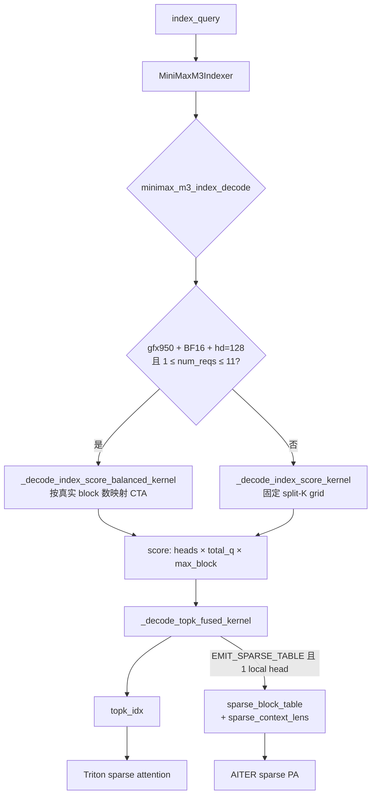
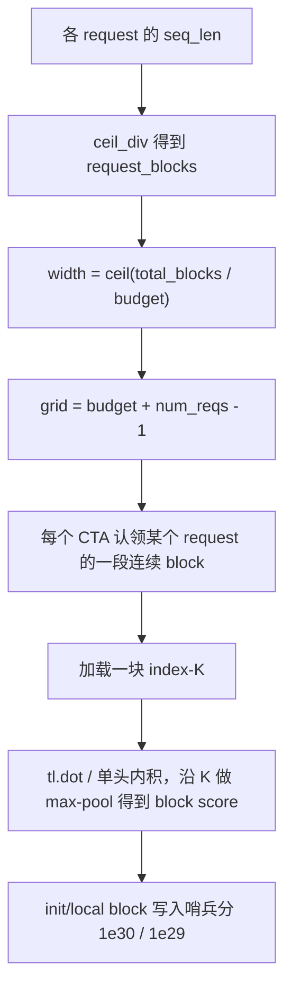
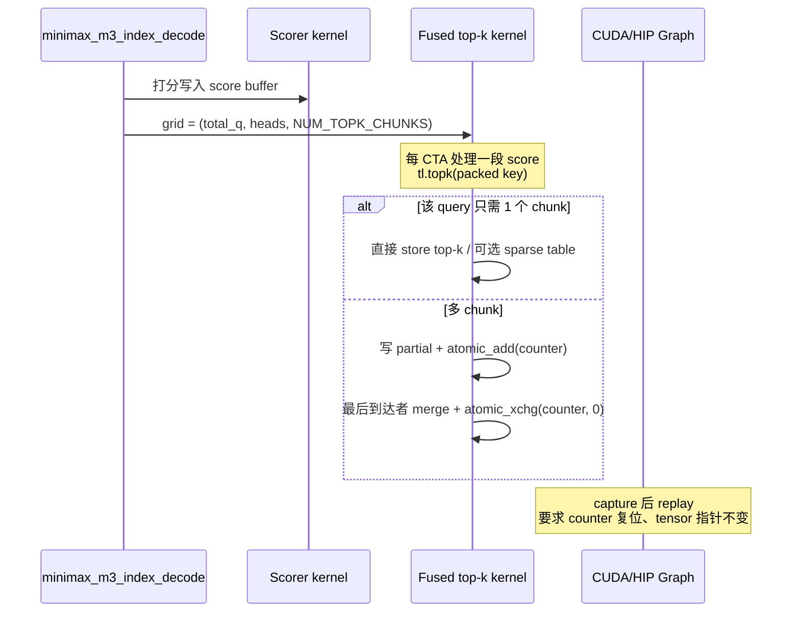

# PR #54682: [ROCm][Perf] Optimize MiniMax-M3 decode indexer and top-k

> **Author**: @Fangzhou-Ai | **State**: OPEN | **Date**: 2026-09-01
> **Branch**: fork PR → `main` | **Labels**: `rocm`, `minimax`
> **Changes**: +1877 -327 lines across 6 files
> **Assignee**: @shen-shanshan
> **Reviewers**: @tlrmchlsmth, @mgoin, @tjtanaa, @zyongye, @yewentao256, @WoosukKwon, @hongxiayang, @dllehr-amd, @AndreasKaratzas
> **Tracking**: 解决 [#54681](https://github.com/vllm-project/vllm/issues/54681)

---

## 1. 总结 (Summary)

本 PR 优化 MiniMax-M3 在 ROCm（主要是 gfx950）上 **decode 路径的 index scorer 与 top-k selector**。每层稀疏注意力仍会重新计算 index score 和 top-k，不改 `index_topk_freq`，也不引入新的 AITER kernel。

核心做法有三块：

1. **按真实 block 工作量映射 scorer CTA**，并把同一块 index-K tile 在 decode query tile 上复用。
2. **融合 top-k、page-16 sparse table 构建、sparse context length 写出**，用 packed key 保证「分数降序、下标升序」的全序。
3. **保持 CUDA Graph 可回放**：固定 grid、完成计数器复位、图输入指针稳定；不满足 gfx950 / BF16 / head_dim=128 / 请求数等契约时回退旧路径。

作者给出的 gfx950 内核 A/B 显示，完整 `minimax_m3_index_decode` 图回放中位延迟在多种 TP 等价布局下提升约 **3%–70%**；既有 TP4 serving ITL 约 **10%–14%**。GSM8K 与基线聚合对齐，但不宣称逐样本等价。

---

## 2. 背景与动机 (Background & Motivation)

MiniMax-M3 的稀疏注意力依赖 indexer：对 paged index-K cache 打分，选出 top-k 个 128-token sparse block，再交给 block-sparse attention。agentic decode 场景下 **每一层都要重算**，因此 scorer/selector 的 launch 开销和负载不均衡会直接打进 ITL。

既有 ROCm 路径的痛点：

- Scorer 用固定 `(num_reqs, num_kv_chunks)` 切分，按形状常量分配 CTA，而不是按各 request 真实 block 数分区，短请求会空转、长请求会拖尾。
- Selector 是 **partial top-k + merge** 两阶段 bitonic 排序，中间 buffer 大、kernel 启动两次。
- Spec decode（多 query 行、多 local index head）时，每个 K block 会被重复加载。
- AITER sparse PA 还要再跑一遍 sparse table 构建，decode 路径上是额外 kernel。

相关工作路径不同，因此不算重复：

| PR | 差异 |
|----|------|
| #52664 | 合格 FP8 scoring/top-k 走 AITER；本 PR 是 vLLM 自有 Triton、BF16 index cache |
| #53448 | 优化 prefill 与可选 FP8 index 存储，BF16 decode 未改 |
| #49229 | 只调固定 grid 常量；本 PR 按真实工作量分区并复用 K tile |
| #53833 / #54535 | 预处理/cache 插入融合，走新的 AITER op |

完整对照记录在 #54681。

---

## 3. 代码修改分析 (Code Change Analysis)

### 3.1 修改的模块

| 文件 | 操作 | 说明 |
|------|------|------|
| `vllm/models/minimax_m3/amd/ops/index_topk.py` | 修改 | 新增 balanced scorer、fused top-k、dispatch 策略；删除旧 partial/merge 两阶段 selector |
| `vllm/models/minimax_m3/amd/ops/sparse_pa.py` | 修改 | 抽出 `_write_sparse_block_table_row_from_values`；公开 alloc/stride；decode AITER 可接收预构建 table |
| `vllm/models/minimax_m3/common/indexer.py` | 修改 | ROCm 上注册 `topk_completion_counter`；透传 fused sparse-table 参数 |
| `vllm/models/minimax_m3/amd/model.py` | 修改 | AITER sparse PA decode 时预分配 table，并在 indexer 中融合写出 |
| `vllm/models/minimax_m3/amd/sparse_attention_msa.py` | 修改 | `forward` 增加 `decode_sparse_table`，跳过二次 table 构建 |
| `tests/kernels/attention/test_minimax_m3.py` | 修改 | 覆盖映射完备性、bitwise 打分、图回放、launch policy、全序与 fused table |

### 3.2 架构 / 流程图 (Architecture / Flow Diagram)

#### Decode indexer 数据流

#### Balanced scorer 工作映射

#### Fused top-k 与 Graph 同步

### 3.3 关键实现细节 (Key Implementation Details)

**Scorer 资格与预算（`_decode_score_program_budget`）**

- 仅 gfx950 + `head_dim=128` + query/cache 均为 BF16 才走 balanced kernel。
- `num_reqs ∈ [1, 8]`：budget = 1024；`[9, 11]`：budget = 768；其余回退旧 kernel。
- Grid 为 `(budget + num_reqs - 1,)`：预留余量保证每个 request 至少能分到 program，同时总 CTA 数对 CUDA Graph 仍是形状常量。

**K tile 在 query tile 上复用**

- `BLOCK_SIZE_HQ = num_idx_heads * BLOCK_SIZE_Q`，一次加载 K 后对整块 head×query 做 `tl.dot`（单元素时退化为向量乘加）。
- `BLOCK_SIZE_Q` 仍由 **configured** `max_decode_query_len` 的 2 次幂决定，避免 qlen=1 与 spec-decode 之间反复编译。
- 因此 local index head 为 1/2/4、runtime/max query length 组合共用同一条优化路径，没有 TP 或 qlen 的 opt-in 开关。

**Packed 全序（`_decode_topk_key`）**

- NaN → `-1e30`，`-0` 归一成 `+0`。
- IEEE 位翻转后放进 64-bit key 的高位，低 16 位用 `0xFFFF - (index+1)` 做 **同分时更小 block id 优先**。
- 选择结果因此与 `torch.topk` 在同一 key 上的结果可逐位对齐。

**Selector 策略（`_decode_topk_launch_policy`）**

- gfx950 且 `topk==16` 且 `max_block ≤ 16×512`：固定 16 chunks，`SINGLE_TILE_GUARANTEED=True`，`ADAPTIVE_FINAL_MERGE=True`（容量内一次 `tl.topk`，按 2/4/8/16 宽度做最终 merge）。
- 否则退回按 `64 / (total_q * heads)` 算出的 pow2 chunk 数，关闭 fast specialization。
- 每个 query 只激活 `ceil(num_blocks / 512)` 个 chunk；空闲 CTA 早退。多 chunk 用 GPU-scope `atomic_add` 汇合，完成后 `atomic_xchg(..., 0)`，保证 Graph replay 时 counter 干净。

**Fused AITER sparse table**

- 可选参数必须成套出现：`attention_block_table`、`sparse_block_table_out`、`sparse_context_lens_out`、`block_page_stride`。
- **仅 1 个 local index head**：table 没有 head 维，AITER sparse PA 也要求 `num_kv_heads==1`。多头 Triton sparse attention 仍可用 generalized scorer/selector 的 `topk_idx`。
- `amd/model.py` 在 decode + AITER 时预分配 table，indexer 写出后 `MiniMaxM3SparseAiterPAImpl.forward` 直接喂给 `minimax_m3_sparse_attn_decode_aiter`，避免第二次 table kernel。

**CUDA Graph 契约**

- `MiniMaxM3Indexer` 在 ROCm 且存在 `topk_indices_buffer` 时注册同形状的 `topk_completion_counter`。
- 测试检查 bitwise 打分、top-k 全序、counter 归零、以及 replay 前后 `data_ptr()` 不变。

---

## 4. 涉及的技术原理 (Technical Principles)

### 4.1 MiniMax-M3 Lightning Indexer

Indexer 不对全部 KV 做注意力，而是用独立的 index query 与共享 index-K 对每个 128-token block 打 `max` 分，选出 top-16 个 block。init/local 窗口用极大哨兵分强制入选。vLLM 把 KV page size 钉成 128，因此 **一个 sparse block = 一页**。

### 4.2 工作量均衡 vs 形状固定 Grid

CUDA Graph 要求 launch grid 在 capture 后不变，所以不能按「当前最长序列」动态改 CTA 数。本 PR 用 **固定 program budget**，在 kernel 内根据 `seq_lens` 把 CTA 映射到真实 block 区间：grid 对 Graph 是常量，实际工作却跟着各 request 的 block 数走，减轻固定 split-K 的空转。

### 4.3 Spec decode 下的 K 复用

MTP / spec decode 会让每个 request 带多行 query（以及 TP 变小时更多 local index head）。旧路径容易按 (request, chunk) 或按 token 重复读同一页 K。新路径一次加载 K tile，对整个 head×query tile 做 GEMM 式点积再沿 K 做 max，降低 cache 带宽压力。

### 4.4 融合 Selector 与原子汇合

把 partial top-k、merge、sparse table 写成一个 kernel，减少全局内存往返和 launch。多 CTA 协作时用 GPU-scope atomics 选「最后到达者」做 merge，并在写出后清零 counter——这是 Graph replay 正确性的关键：capture 时 counter 从 0 开始，每次 replay 也必须回到 0。

### 4.5 AITER Sparse PA 的 page-16 表

AITER 后端要的不是逻辑 block id，而是每个被选中的 128-token block 对应的 **16 个物理 page id**（以及该 query 的 attended context length）。把这段写出融进 selector，可以砍掉 decode 上一次独立 table kernel；合同仍然受单 head 限制。

---

## 5. 评论区讨论亮点 (Discussion Highlights)

### 推理评测请求

**@liuzijing2014** 要求补 reasoning 类 e2e 精度评估。作者回复结果发在 **#54845**（同系列 ROCm perf：gfx950 low-M FP32 router GEMM），本 PR 正文只保留 GSM8K。

### 同步是否需要显式 `synchronize`

**@AndreasKaratzas** 认为其余多为 NIT，并提问：kernel launch 之后是否必须在 Python 里显式同步，还是 runtime 会隐式完成。测试里在 fused 路径后调用了 `torch.accelerator.synchronize()`，主要是为了在 host 侧断言前保证 device 写回可见，而不是 HIP 编程模型本身缺少隐式依赖。CUDA/HIP 对**同一 stream 上后续 kernel** 有隐式序，但对 **host 读 tensor / 跨 stream** 仍需要同步。

### Claude / fork 审查

PR 来自 fork，Claude Code Review 默认关闭，需 maintainer `@claude review`。目前未见核心成员 Approved。时间线上作者已 `ready_for_review`，但仍有两张未勾选的 accountability 清单：

- 人类提交者尚未声明已逐行审完并能端到端维护；
- rebase 后的 warmed serving A/B 尚未复测（现有 ITL 数字来自 rebase 前的 `5678bb1a68` vs `1dc464d426`）。

### 与其它 MiniMax-M3 ROCm PR 的边界

作者反复强调：不改 AITER、不用 `index_topk_freq`、不抢 #52664 的 FP8 AITER 路径。审查时应确认不会和那些 PR 在 `minimax_m3_index_decode` 签名或 sparse table 所有权上打架。

---

## 6. 风险与潜在问题 (Risk Analysis)

| 风险 | 严重程度 | 说明 |
|------|---------|------|
| **原子汇合与 Graph replay** | High | 多 chunk 依赖 `atomic_add`/`atomic_xchg`。若某 CTA 早退条件与 `active_chunks` 不一致，counter 可能卡死或 replay 时非零，导致漏 merge 或死等。测试覆盖了 reset 与 pointer 稳定性，但仍高度依赖「每次 launch 前 counter 为 0、不可重叠调用」的文档契约。 |
| **Serving 数字未在 rebase 后复测** | Medium | 作者明文：ITL / GSM8K 未在新启用的 TP 与 query-length 布局上重跑；serving 数字来自 rebase 前 commit，且每个并发只有一对 conditioned A/B。 |
| **精度：GSM8K 非逐样本等价** | Medium | 两次 candidate 分别为 1247/1252 vs baseline 1244 等待，McNemar p=0.4638 / 0.8804；同 commit 两次 session 有 53 题评分变化。Packed 全序消除了部分同分歧义，但仍可能改变并列分数下的 block 选择。Reasoning bench 不在本 PR。 |
| **资格函数漏覆盖** | Medium | balanced scorer 在 `num_reqs>11`、非 gfx950、非 BF16 时静默回退。若生产 batch 经常 >11，优化收益消失；若资格判断与测试假设不一致，可能走错 kernel。 |
| **Fused table 单头合同** | Low | 多头 + AITER 会 `ValueError`。当前 AITER 路径本就要求 1 KV head，但调用方若误传 fused kwargs 会直接炸。 |
| **Triton 复杂度 / 可维护性** | Medium | 单文件内 fused kernel 很长，`ADAPTIVE_FINAL_MERGE` 对 2/4/8/16 几乎复制同一 merge 调用。AI 辅助实现 + 未勾选人工审阅，后续调试成本高。 |
| **与 #52664 等并行 PR 冲突** | Medium | 同时改 `index_topk.py` / indexer 入口。FP8 AITER 路径与本 BF16 Triton 路径需保持互斥清晰。 |
| **测试跳过** | Low | GPU 测试 `skipif(not ROCm)`，CI 在非 ROCm runner 上只跑 CPU 侧 policy/coverage 测试。 |

---

## 7. 结论 (Conclusion)

PR #54682 是一次目标明确的 ROCm decode 热路径优化：用 **真实 block 映射 + K tile 复用** 改善 scorer，用 **融合 top-k / sparse table + 确定性全序** 改善 selector，并认真处理了 CUDA Graph 的 counter 与指针约束。内核微基准和既有 TP4 ITL 看起来有实质收益，测试对 bitwise 打分与图回放也比较厚。

合入前更需要盯住三件事：rebase 后 serving A/B 复测、reasoning/GSM8K 的统计口径是否够、以及 fused kernel 的原子同步在多 chunk / 多 head / spec-decode 下是否无静默错误。当前是 **open + 已请求审查**，尚无 maintainer 批准；作者自己的「人工审完 / rebase 后 serving 复测」清单也还未勾完。
