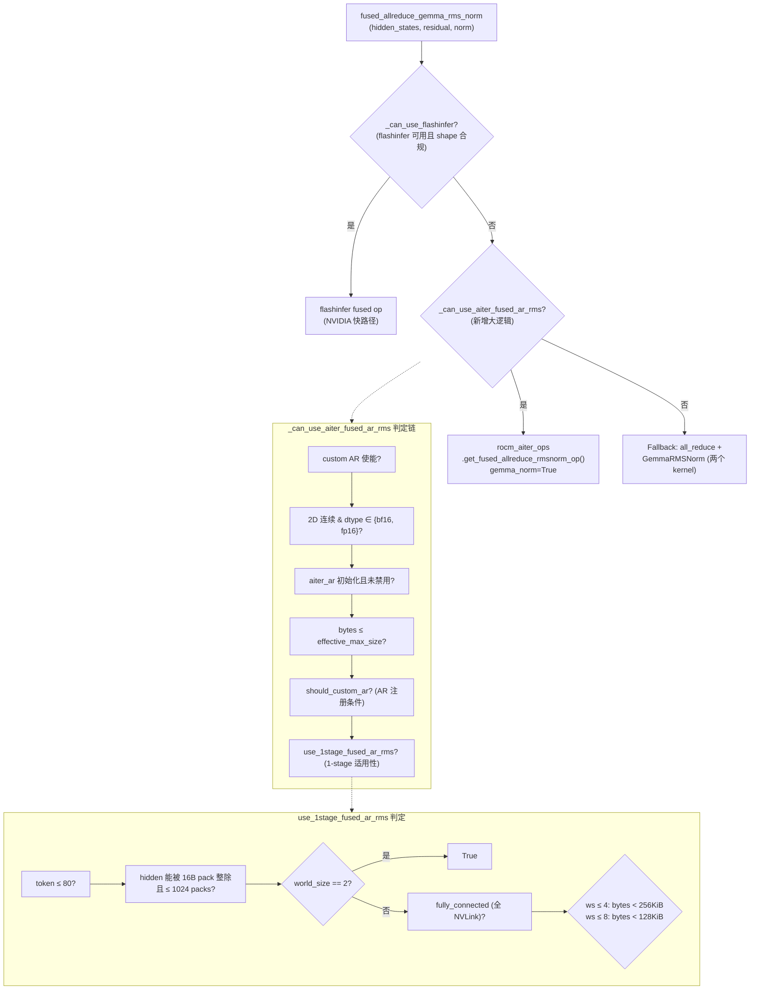
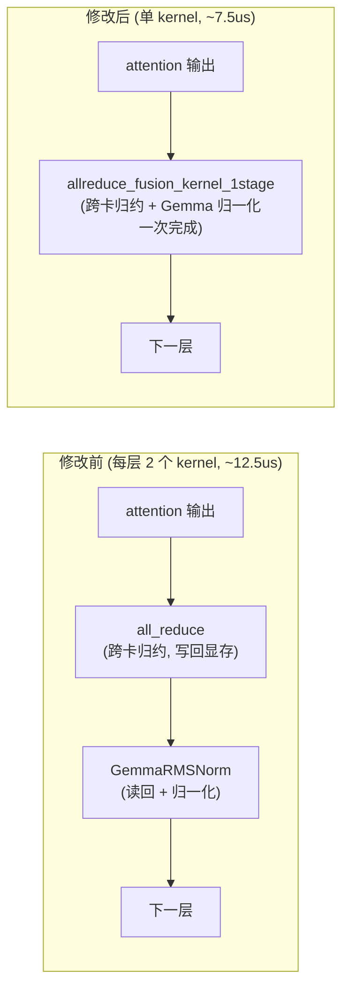

# PR #54787: [ROCm][Perf][M3] Fused allreduce+GemmaRMSNorm fast path

> **作者**: @benenzhu | **状态**: OPEN | **日期**: 2026-09-01
> **Branch**: `benenzhu:m3/01-fused-ar-gemma-rmsnorm-aiter` → `vllm-project:main` | **Labels**: `rocm`, `verified`
> **变更规模**: +71 -23 行，涉及 3 个文件

---

## 1. 总结 (Summary)

本 PR 为 vLLM 的 `fused_allreduce_gemma_rms_norm` 辅助函数在 ROCm 上新增 AITER 融合快路径。此前该函数只有 flashinfer 快路径，ROCm 上始终退化为 `all_reduce` + `GemmaRMSNorm` 两个独立 kernel（每层 2 次 kernel 启动）。本 PR 将 AITER 已有的 `rocm_aiter_fused_allreduce_rmsnorm` custom op 接入该辅助函数（镜像 flashinfer 分支），并通过新增的 `use_1stage_fused_ar_rms()` 谓词将快路径严格限制在 AITER 单阶段（1-stage）kernel 适用范围内——因为评论区实测发现两阶段（2-stage）融合 kernel 反而比显式 `all_reduce` + norm 更慢。MiniMax-M3-MXFP4 在 MI355X x4 TP4 上 decode 每层由 ~12.5us 降至 ~7.5us，conc=1 时 TPOT 降低 1.7%。

---

## 2. 背景与动机 (Background & Motivation)

在 TP（Tensor Parallel）场景下，Gemma 系列模型（如 MiniMax-M3）每个 decoder layer 的 post-attention 位置都需要做一次跨卡 all-reduce，再执行 GemmaRMSNorm。二者拆开执行意味着：

- **两次 kernel 启动**：`all_reduce` 一次 + `GemmaRMSNorm` 一次；
- **一次多余的显存往返**：all-reduce 结果写回全局显存，norm kernel 再读回来。

vLLM 已有 `fused_allreduce_gemma_rms_norm` 辅助层（`vllm/model_executor/layers/fused_allreduce_gemma_rms_norm.py`），将 all-reduce 与 norm 融合为单 kernel，但此前仅支持 flashinfer（NVIDIA 路径）。ROCm 上该函数永远走到 fallback：

```python
# Fallback: explicit all-reduce + GemmaRMSNorm (matches the unfused model).
reduced = tensor_model_parallel_all_reduce(hidden_states)
return norm(reduced, residual)
```

而 AITER（AMD 的 ROCm 算子库）早已提供了 `rocm_aiter_fused_allreduce_rmsnorm` custom op，其单阶段 kernel 可一次完成跨卡归约 + 本地归一化，且已支持 `gemma_norm` 语义。本 PR 即把这颗现成的算子接入 vLLM 的调度层，让 ROCm + AITER 开启时走融合快路径，属于 MiniMax-M3（M3）ROCm 性能优化系列（`[M3]`）的第一项。

---

## 3. 代码修改分析 (Code Change Analysis)

### 3.1 修改的模块

| 文件 | 操作 | 说明 |
|------|------|------|
| `vllm/model_executor/layers/fused_allreduce_gemma_rms_norm.py` | 修改 (+33) | 新增 `_can_use_aiter_fused_ar_rms()` 谓词；在 flashinfer 分支之后、fallback 之前插入 AITER 融合快路径 |
| `vllm/distributed/device_communicators/aiter_custom_all_reduce.py` | 修改 (+34) | 在 `AiterCustomAllreduce` 上新增 `use_1stage_fused_ar_rms()` 方法，封装 AITER 单阶段 kernel 的适用性判断 |
| `vllm/_aiter_ops.py` | 修改 (+4 -23) | `_rocm_aiter_fused_allreduce_rmsnorm_impl` 中的 1-stage 判定逻辑移除（下沉到新方法），新增 `gemma_norm` 参数透传给 `custom_fused_ar_rms` |

### 3.2 架构 / 流程图 (Architecture / Flow Diagram)

#### 调度决策流程



#### 单层 decode 前后对比（kernel 序列）



### 3.3 关键实现细节 (Key Implementation Details)

**调度层（`fused_allreduce_gemma_rms_norm.py`）**
- 新增 `_can_use_aiter_fused_ar_rms(hidden_states)`，判定链依次为：custom all-reduce 全局使能 → 输入是 2D 连续张量且 dtype 在支持列表 → `aiter_ar` 已初始化且未禁用 → 总字节数 ≤ `effective_max_size()` → `should_custom_ar()`（AR 是否对当前 shape 注册）→ `use_1stage_fused_ar_rms()`（1-stage 适用性）。
- 调度顺序为 flashinfer → AITER → fallback，与既有结构一致，ROCm 上 flashinfer 判定自然为 False 而落入新分支。
- 调用 custom op 时传入 `gemma_norm=True`，要求 AITER kernel 按 Gemma 语义执行（residual 先加再归一化、权重为 `1 + w`）。

**通信层（`aiter_custom_all_reduce.py`）**
- `use_1stage_fused_ar_rms()` 镜像 AITER `fused_allreduce_rmsnorm` launcher 的契约（`csrc/include/custom_all_reduce.cuh`）：16 字节 pack 对齐、每行 ≤ 1024 packs、≤ 80 tokens、按 TP 规模和拓扑的字节上限（ws≤4：<256KiB；ws≤8：<128KiB；非全 NVLink 或 ws>8：不适用；ws==2：无字节限制）。
- docstring 明确说明：1-stage 之外融合 op 会退到 2-stage（跨设备 reduce-scatter + 本地 norm），实测慢于显式 `all_reduce` + norm，因此「能 fallback 的调用方都应要求 1-stage」。
- 判定只依赖 shape/dtype/TP 规模/拓扑，**capture-static**，CUDA/HIP Graph 安全（捕获期与回放期判定结果一致）。

**算子绑定层（`_aiter_ops.py`）**
- 原先 inline 在 `_rocm_aiter_fused_allreduce_rmsnorm_impl` 里的 1-stage 判定逻辑删除，改调 `aiter_ar.use_1stage_fused_ar_rms(input_)`，消除重复并让判定在 vLLM 调度层可复用（同一 op 也被 attention 路径和 #47270 的 FFN 路径调用）。
- `_impl` 与 `_fake` 两个版本同步新增 `gemma_norm: bool = False` 参数。

---

## 4. 涉及的技术原理 (Technical Principles)

### 4.1 TP 下的 all-reduce 与融合 norm

Tensor 并行中，attention/FFN 输出的部分结果分布在多张卡上，归一化前必须做跨卡 all-reduce。常规实现是两个 kernel：all-reduce 把和写回显存，norm kernel 再读回。**融合 kernel** 在归约完成的同时就地做归一化，省掉一次 kernel 启动和一次显存往返——decode 场景下每层都发生，累积开销可观（本 PR 实测每层省 ~5us）。

### 4.2 AITER custom allreduce 的 1-stage 与 2-stage

AITER 的 `fused_allreduce_rmsnorm` 有两种执行模式：
- **1-stage**：单 kernel 直接从 peer rank 的缓冲区读取（pull 语义），边归约边归一化，无中间落盘。要求小数据量（受限于可以直接读 peer 缓冲区的场景）。
- **2-stage**：第一阶段 cross-device reduce-scatter 到各 rank 的 tmp slice，第二阶段本地 norm。对大输入适用，但两次 kernel + 中间写读，反而比显式 `all_reduce` + norm 慢（评论区实测慢 4.6%~8.2%）。

这正是本 PR 必须 gate 在 1-stage 范围内的原因。

### 4.3 GemmaRMSNorm 与标准 RMSNorm 的差异

Gemma 系列（Gemma/Gemma2/MiniMax-M3）的 RMSNorm 与标准实现不同：先把 residual 加到 hidden 上再做归一化，且权重按 `1 + w` 使用。AITER 的 fused op 需要 `gemma_norm` 标志切换这一语义，否则输出与参考实现不一致。TP4 校验显示 residual 输出全尺寸 bit-exact，norm 输出在 decode 尺寸（1、4 tokens）bit-exact，大尺寸存在 ≤2.7e-3 的相对误差（bf16 归约重结合顺序差异），符合预期。

### 4.4 CUDA/HIP Graph capture 安全

decode 路径整体被捕获为 CUDA/HIP Graph，捕获期间的分支必须与回放期一致。`use_1stage_fused_ar_rms` 只依赖 shape/dtype/TP/拓扑（全部是捕获期固定量），因此谓词在 Graph 内是静态的，不会导致「捕获时走快路径、回放时走慢路径」的地址错乱。

---

## 5. 评论区讨论亮点 (Discussion Highlights)

### 核心发现：1-stage / 2-stage 边界处的性能交叉（crossover）

**Fangzhou-Ai（vLLM Collaborator）** 在 TP4 上做了严格的 rank-max kernel A/B（200 次 warmup、500 采样、8 个轮换指针 HIP graph、按 rank 取 max 中位数），发现融合路径在越过 1-stage 边界后**反而变慢**：

| M | 模式 | 显式 AR + norm | fused | 差异 |
|---:|:---:|---:|---:|---:|
| 1–16 | 1-stage | 22.6–23.7 us | 19.3–21.9 us | **-2.8% ~ -15.4%** |
| 32–256 | 2-stage | 24.3–53.5 us | 25.4–57.9 us | **+4.6% ~ +8.2%** |

并提出方案：把 1-stage 谓词上移到 `AiterCustomAllreduce`、在 vLLM 调度层 gate，避免「融合 op 内部再退 2-stage」。

### 作者复现与认同

**benenzhu** 在 MI355X TP4 上用 MiniMax-M3 真实 hidden size（H=6144）复现了同样的交叉点（1-stage 覆盖到 M≈21，之后融合路径慢 1–2us），并坦诚指出 `conc=16`（MTP=3 时实际 M=64，处于 2-stage 区间）的原始数据可能含测量误差。最终采纳 Fangzhou-Ai 的建议，实现了 `use_1stage_fused_ar_rms()` gate。

### 2-stage 慢的根因分析（衍生到 aiter fork）

**benenzhu** 进一步在 `benenzhu/aiter#1` 中定位了 2-stage 慢的原因：
1. 2-stage 融合 kernel 第一阶段是「push」语义（各 rank 写对端 tmp slice），而 plain `custom_all_reduce` 2-stage 是「pull」语义（保持本地 slice 只读对端）；改为 pull 后 M=32/64 与 custom_all_reduce 持平，M=256 的差距从 3.8us 缩到 1.2us。
2. 剩余 ~1.1us（与 M 无关的常数项）来自 aiter 的 stage-2 `local_device_load_rmsnorm` 比 vLLM 的 triton norm kernel 慢 ~1.1us，根因尚未查明。

结论：「gating is really needed」——从根因层面印证了本 PR 只放行 1-stage 的设计。

### 测试补充要求

**Fangzhou-Ai** 要求补充 `conc=64` 的 benchmark；作者同意并会追加 `conc=64` 与 `conc=32` 两组测试（截至目前 PR 描述中仍只有 conc=1 / conc=16 数据，测试数据待更新）。

---

## 6. 风险与潜在问题 (Risk Analysis)

| 风险 | 严重程度 | 说明 |
|------|---------|------|
| **2-stage 性能回退** | High | 融合 op 在 1-stage 边界之外慢 4.6%~8.2%。已通过 `use_1stage_fused_ar_rms` gate 规避（当前代码只放行 1-stage），但该 gate 依赖 AITER launcher 契约的镜像实现，若 AITER 侧契约变化（如字节上限调整）而 vLLM 未同步，可能出现谓词漂移。 |
| **gemma_norm 语义依赖 AITER 版本** | Medium | 快路径要求 AITER kernel 支持 `gemma_norm=True`（residual 先加、权重 `1+w`）。老版本 AITER 若忽略该参数，输出将与参考实现不一致。需要确认 AITER 版本门槛并在可用性判断中体现（当前代码未做版本检查）。 |
| **数值精度差异** | Low | TP4 校验显示 16/128/1024 token 时 norm 输出 relerr ≤ 2.7e-3（bf16 归约重结合顺序），decode 尺寸 bit-exact。gsm8k 从 0.9704 降至 0.9644（strict 0.9697→0.9644），降幅约 0.5~0.6pp，略超 stderr（±0.005）但幅度很小，需关注是否与 EAGLE3 真实 rejection sampling 的波动有关。 |
| **PR 描述中的性能数据部分失效** | Medium | 作者已承认 conc=16 数据（MTP=3 → 实际 M=64）处于 2-stage 区间、可能含测量误差；加上 gate 后该场景实际走 fallback，表中 -2.9% TPOT 改善的归因需要更新（评论中承诺补 conc=32/64 数据）。 |
| **无自动化回归测试** | Medium | 本 PR 未新增任何测试文件；TP4 parity 与 kernel 测试均为本地手动运行（gfx950/MI355X 硬件 CI 无法覆盖）。`_can_use_aiter_fused_ar_rms` 判定链与 `use_1stage_fused_ar_rms` 的边界条件（80 tokens、1024 packs、256/128KiB 上限）没有单测保护。 |
| **对其他调用方的影响** | Low | `_rocm_aiter_fused_allreduce_rmsnorm_impl` 的判定逻辑被下沉为共享方法，同一 custom op 的 attention 路径调用方也随之获得 gate 收益（作者与 reviewer 均认为这是修复而非风险），但逻辑移动本身需要确认两处调用行为一致（改动前 inline 判定与新版方法逐条件等价——diff 显示条件顺序略有重排，token 检查被提前，语义等价）。 |
| **mergeable_state: unstable** | Low | PR 当前 `mergeable: true` 但状态为 unstable（CI 检查未全绿），合入前需等待 ROCm CI 通过。 |

---

## 7. 结论 (Conclusion)

PR #54787 是一个设计收敛良好、收益明确的 ROCm decode 性能优化：通过复用 AITER 已有的 fused allreduce+norm 算子并严格 gate 在 1-stage 适用范围内，每层 decode 节省 ~5us（~40% 于该算子对），且经过 reviewer 实测驱动的迭代（1/2-stage 交叉点的发现与 gating 修正）后，正确性与性能边界都有数据支撑。剩余事项主要是更新 conc=32/64 的 benchmark 数据、确认 AITER 版本门槛，以及等待 ROCm CI 全绿后合入。
