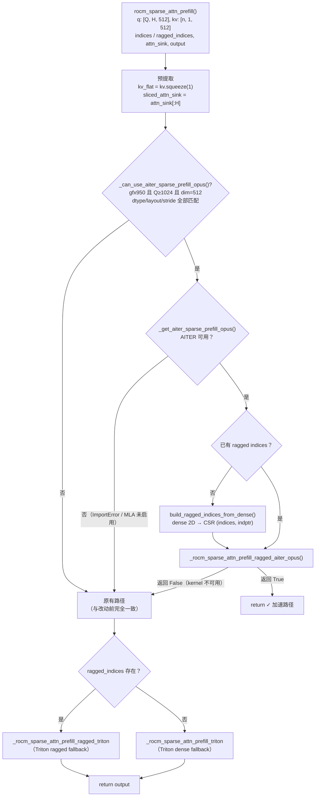
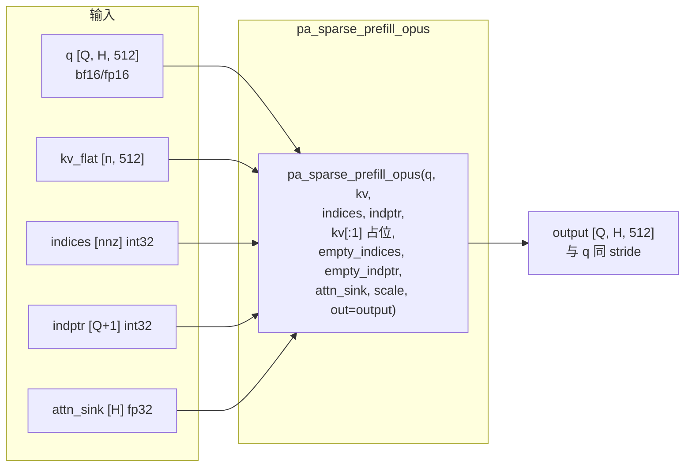

# PR #54855: [ROCm][Perf] Route large DSV4 sparse prefill to AITER OPUS

> **作者**: @jiacao-amd | **状态**: OPEN | **日期**: 2026-09-02
> **Branch**: `jiacao-amd:codex/dsv4-sparse-prefill-opus` → `vllm-project:main` | **Labels**: `rocm`, `verified`, `DSv4`
> **变更规模**: +321 -4 行，涉及 2 个文件

---

## 1. 总结 (Summary)

本 PR 在 ROCm 平台上将 **gfx950 (MI355X)** 上符合条件的大规模 DeepSeek-V4 sparse-MLA prefill 请求路由到 AITER 的 `pa_sparse_prefill_opus` kernel，同时完整保留现有 Triton 实现（ragged / dense 两条路径）作为 fallback。核心逻辑是一个细粒度的资格检查函数 `_can_use_aiter_sparse_prefill_opus`（≥1024 queries、head_dim=512、bf16/fp16、layout/stride 匹配等），加上一个失败即回退的 kernel 调用封装。实测 MI355X 8 卡 TP8 上 8k/1k 端到端吞吐提升 +0.30% ~ +8.40%（并发 1 时最高），gsm8k 准确率与基线一致（0.9606）。

---

## 2. 背景与动机 (Background & Motivation)

DeepSeek-V4 采用 **sparse attention（稀疏注意力）+ MLA** 架构：每个 query 只关注由 indexer 选出的 top-k 个 KV 位置（外加 attention sink 项）。在 vLLM V1 的 ROCm 路径中，sparse prefill 目前由两个 Triton kernel 实现：

- `_rocm_sparse_attn_prefill_ragged_triton` — 处理 CSR/ragged 索引表示
- `_rocm_sparse_attn_prefill_triton` — 处理 dense 2D 索引表示

Triton kernel 通用性虽好，但在 **长 prompt（8k 输入）的大 prefill** 场景下并非最优。AMD 的 AITER 库针对 gfx950 提供了高度优化的 `pa_sparse_prefill_opus` kernel（OPUS 为 AITER 面向 MI355X 的 paged-attention sparse prefill kernel 系列），其在大 query 数下相比 Triton 有明显性能优势。

**关键约束**：OPUS kernel 并非在所有场景下都快于 Triton，且对输入 shape / layout / dtype 有严格要求。因此本 PR 的思路不是"替换"，而是**加一层条件路由**：只有请求规模足够大、且输入布局完全符合 OPUS 要求时才走新 kernel，否则一律回退到原有 Triton 路径。这与 PR 描述中的定位一致——"internal, existing-flag-gated kernel dispatch optimization"，无需文档更新。

**性能数据**（8k 输入 / 1k 输出，MI355X 8 卡 TP8，DeepSeek-V4-Pro FP4，同节点 A/B）：

| 最大并发 | 基线 tok/s | OPUS tok/s | 增益 |
|---:|---:|---:|---:|
| 1 | 797.73 | 864.70 | **+8.40%** |
| 2 | 1461.54 | 1465.97 | +0.30% |
| 4 | 2529.05 | 2567.99 | +1.54% |
| 8 | 4021.02 | 4098.47 | +1.93% |
| 16 | 6546.88 | 6714.14 | +2.55% |
| 32 | 8941.46 | 9282.17 | +3.81% |
| 48 | 10320.19 | 10832.06 | +4.96% |

---

## 3. 代码修改分析 (Code Change Analysis)

### 3.1 修改的模块

| 文件 | 操作 | 说明 |
|------|------|------|
| `vllm/v1/attention/ops/rocm_aiter_mla_sparse.py` | 修改 (+112/-4) | 新增 OPUS kernel 加载器、资格检查函数、kernel 调用封装；在 `rocm_sparse_attn_prefill` 入口加入条件路由，并顺带重构了 `kv_flat` / `sliced_attn_sink` 的提取 |
| `tests/kernels/attention/test_rocm_triton_attn_dsv4.py` | 修改 (+209) | 新增 5 个测试：资格检查参数化测试、layout 拒绝测试、路由 monkeypatch 测试、Triton fallback 测试、gfx950 真实 kernel 正确性测试 |

### 3.2 架构 / 流程图 (Architecture / Flow Diagram)

#### `rocm_sparse_attn_prefill` 路由决策流程

#### OPUS kernel 调用数据布局

### 3.3 关键实现细节 (Key Implementation Details)

**Kernel 加载器（`_get_aiter_sparse_prefill_opus`）**
- 与已有的 `_get_aiter_topk_ops` 同款模式：`@functools.cache` + 延迟 import。
- 先检查 `rocm_aiter_ops.is_mla_enabled()`，再 `try/except ImportError` 导入 `aiter.ops.pa_sparse_prefill_opus` —— AITER 版本过旧或环境缺失时静默返回 `None`，路由自然落到 Triton。
- 加载成功后用 `logger.info_once` 打印标记日志（PR 测试计划中用它确认"OPUS 路由标记只出现在优化版日志中"）。

**资格检查（`_can_use_aiter_sparse_prefill_opus`）**
- 平台门控：`on_gfx950`（默认取模块级常量 `_ON_GFX950`，测试时可注入覆盖）。
- 规模门控：`q.shape[0] >= _GFX950_AITER_SPARSE_PREFILL_OPUS_MIN_QUERIES`（= **1024**）。
- 形状门控：`q` 为 3D、`kv` 为 2D（即已 squeeze）、`output.shape == q.shape`、`q.shape[-1] == 512`（DSv4 MLA head_dim）、`kv.shape[-1] == q.shape[-1]`。
- dtype 门控：q/kv/output 同 dtype 且为 bf16 或 fp16；`attn_sink` 必须为 fp32 且形状恰为 `(q.shape[1],)`（每 head 一个 sink 标量）。
- layout 门控：device 一致、`q.stride(-1) == 1`、`kv.stride(-1) == 1`、`output.stride() == q.stride()`（保证 OPUS 可以原地按预期布局写 output）。

**OPUS 调用封装（`_rocm_sparse_attn_prefill_ragged_aiter_opus`）**
- 返回 `bool`：kernel 获取失败返回 `False`（触发 fallback），成功执行返回 `True`。
- 通过 `_as_int32_contiguous_1d` 将 indices / indptr 统一为 int32 连续一维张量（OPUS 的硬性要求，CSR 格式）。
- 调用时第 5 个参数传 `kv[:1]`、第 6/7 个传 `empty_indices` / `empty_indptr`（全零 indptr）——占位 AITER OPUS 接口中未使用的 chunk 参数（推测为 chunked/sparse 分块的预留槽位）。

**入口路由（`rocm_sparse_attn_prefill`）**
- 重构：`kv.squeeze(1)` 与 `attn_sink[: q.shape[1]]` 的提取提前到函数开头，三条路径（OPUS / ragged Triton / dense Triton）复用同一份 `kv_flat` 与 `sliced_attn_sink`，消除重复代码。
- 新增 OPUS 快速路径：资格检查 + kernel 可用性都满足时，若调用方只传了 dense `indices`，先 `build_ragged_indices_from_dense()` 转成 CSR（`topk_length` 缺省时用 `(indices_2d >= 0).sum()` 计算每行有效数量）；成功后直接 `return`。
- 原 Triton ragged / dense 两条分支完全保留，逻辑与改动前等价（仅换用预提取变量）。

**测试（`test_rocm_triton_attn_dsv4.py`）**
- `test_aiter_sparse_prefill_opus_selection`：参数化验证阈值边界（1023 → False，1024 → True）与平台门控（非 gfx950 → False）。
- `test_aiter_sparse_prefill_opus_selection_rejects_incompatible_layouts`：验证非连续 output（transpose 视图）、截断 kv、截断 attn_sink 均被拒绝。
- `test_sparse_attn_prefill_aiter_opus_routing`：monkeypatch 掉全部 Triton kernel（一旦被调用即 `pytest.fail`），验证路由命中 OPUS 且传入参数正确（indices/indptr 为 int32、第 5 个参数为空、第 6 个参数全零）。
- `test_sparse_attn_prefill_preserves_dense_triton_fallback`：kernel 加载器返回 `None` 时验证回退到 dense Triton。
- `test_sparse_attn_prefill_ragged_aiter_opus`：`@requires_gfx950` 真实 kernel 正确性测试，`importorskip("aiter.ops.pa_sparse_prefill_opus")`，与 CPU 参考实现对比（atol=rtol=2e-2，与既有 Triton 测试同容差）。

---

## 4. 涉及的技术原理 (Technical Principles)

### 4.1 DeepSeek-V4 稀疏注意力（Sparse Attention + MLA）

DeepSeek-V4 的注意力不是 full attention：由轻量 indexer 为每个 query 动态选出 top-k 个相关 KV 位置，注意力只在选中位置（+ attention sink）上计算。`indices`（选中的 KV 下标）与 `topk_length`（每 query 实际选中的数量）是该结构的核心输入。MLA（Multi-head Latent Attention）则把 KV 压缩为共享的 latent 向量，ROCm 路径上 sparse prefill 的 `head_dim=512`（nope + rope 维度合计）正是本 PR 资格检查中 `q.shape[-1] == 512` 的由来。

### 4.2 Dense 与 Ragged（CSR）索引表示

- **Dense 表示**：`indices` 为 2D 张量 `[Q, max_topk]`，每行一个 query 的 top-k 下标，无效位置用 `-1` 填充 —— 简单但存在大量无效 slot。
- **Ragged / CSR 表示**：`indices` 为一维 `[nnz]`（所有 query 的有效下标拼接），`indptr` 为 `[Q+1]` 标记每个 query 的起止。内存紧凑，是高性能 kernel 的常见输入格式。
- 本 PR 的 OPUS 路径只接受 CSR 格式，dense 输入时需先经 `build_ragged_indices_from_dense` 转换（转换本身有少量 kernel 开销，但被 OPUS 在大 query 数下的收益覆盖）。

### 4.3 AITER OPUS kernel 与 gfx950

AITER（AMD Inference Tools / Everything for ROCm）是 AMD 面向 Instinct GPU 的算子加速库，提供 CK/自研汇编级的 attention、量化、top-k 等 kernel。`pa_sparse_prefill_opus` 是其中面向 **gfx950（MI355X）** 的 paged sparse attention prefill kernel（OPUS 是 AITER 针对 MI355X 的 kernel 系列名）。这类手写 kernel 针对大 query 数做了访存/调度优化，因此阈值设为 1024 queries：小 prefill 下 Triton 足够好（且 OPUS 可能不占优），大 prefill 下 OPUS 优势明显（实测并发 1 时 +8.4%）。

### 4.4 Attention Sink

`attn_sink` 是 DeepSeek 稀疏注意力系列中的一个额外可学习偏置项：每个 head 一个 fp32 标量，作为对"无需选中任何 KV 也能输出"（sink 位置）的注意力权重。kernel 接口要求其形状为 `[num_heads]`、fp32、与 q 同 device，这也是资格检查的一部分。

### 4.5 条件路由 + 静默降级的设计哲学

vLLM ROCm 路径的常见模式：**高门槛资格检查 + kernel 可用性双重判定 + 失败静默回退**。任何条件不满足（平台、规模、layout、dtype、AITER 缺失/版本不符）都落回经过充分验证的 Triton 路径，保证正确性不受新 kernel 引入风险的影响；新 kernel 的收益只在大 prefill 场景兑现。

---

## 5. 评论区讨论亮点 (Discussion Highlights)

截至抓取时（2026-09-09），**尚无人类 reviewer 的实质性 review**，评论区仅有两类机器人消息：

### Mergify 机器人

1. **merge conflicts（09-03）**：提示 PR 存在合并冲突，要求 rebase。
2. **pre-commit 失败（09-08）**：`pre-commit run --all-files` 未通过，要求修复后重新推送。

### claude[bot]

- 因 PR 来自 fork，自动化 review 默认禁用；提示 maintainer 可评论 `@claude review` 触发一次性审查。

### 观察

- 请求的 reviewer（@tjtanaa、@AndreasKaratzas，均为 ROCm/AMD 相关活跃 reviewer）尚未给出意见。
- PR 测试计划中最后一项 "Run the targeted OPUS correctness test on gfx950 before marking the PR ready" 仍未勾选，作者明确表示这是 ready 前的待办。
- 当前 `mergeable_state: unstable`，合入前需先 rebase 并解决 pre-commit 问题。

---

## 6. 风险与潜在问题 (Risk Analysis)

| 风险 | 严重程度 | 说明 |
|------|---------|------|
| **gfx950 正确性测试尚未跑完** | Medium | PR 测试计划自述 targeted OPUS correctness test 未在真实硬件上执行（`@requires_gfx950` 测试在 CI 上会跳过）。monkeypatch 测试只验证路由行为，不验证 kernel 数值。gsm8k 结果（0.9606 与基线一致）提供了一定端到端信心，但正式的 kernel 级正确性验证仍是待办。 |
| **OPUS 接口参数语义依赖 AITER 版本** | Medium | 调用中 `kv[:1]`、`empty_indices`、`empty_indptr` 三个占位参数依赖 AITER 当前接口语义（chunk 相关预留槽位）。AITER 升级若改变接口约定，可能导致静默数值错误而非报错。加载器只有 ImportError 兜底，没有版本检查。 |
| **1024 queries 阈值是单一硬编码启发式** | Medium | 阈值基于当前 8k/1k 基准场景选定。并发 2 时增益仅 +0.30%，说明阈值附近收益梯度平缓；不同 batch 组合、不同 top-k、不同 seq len 下最优阈值可能不同。硬编码常量无配置入口，后续调优需改代码。 |
| **dense → ragged 转换的额外开销** | Low | 走 OPUS 路径但调用方只提供 dense indices 时，需先 `build_ragged_indices_from_dense`。转换本身占 kernel 时间，对刚好跨过 1024 阈值的请求可能抵消部分收益（但总体仍在资格检查确认的大 query 场景，影响有限）。 |
| **layout 门控过于严格导致机会性漏判** | Low | `output.stride() == q.stride()`、`kv.ndim == 2` 等检查保守但安全——不满足只会走 fallback，不会出错。代价是部分本可加速的非标准布局请求错过 OPUS，属"宁可漏判不可误判"的合理取舍。 |
| **merge conflicts + pre-commit 失败** | Low | 当前无法直接合入，需 rebase 与格式修复；与 #35963 的教训类似，冲突拖延越久成本越高。 |
| **`logger.info_once` 日志为进程级缓存** | Low | 路由标记日志只在首次成功加载时打印一次，后续进程内无法观察路由状态变化；对生产排障略有不便，但属 vLLM 既有惯例。 |

---

## 7. 结论 (Conclusion)

PR #54855 是一个范围收敛、设计克制的 ROCm 性能优化：以"高门槛资格检查 + 双保险可用性判定 + 静默回退"的方式将大 DSv4 sparse prefill 路由到 AITER OPUS kernel，在 MI355X 上带来最多 +8.4% 的端到端吞吐提升且不牺牲任何现有路径的正确性保障。主要待办是完成 gfx950 上的 kernel 正确性测试、修复 pre-commit 与 merge conflicts；在人类 reviewer 给出意见前，该 PR 尚处于"自测通过、待审"阶段，整体质量与风险控制均属上乘。
