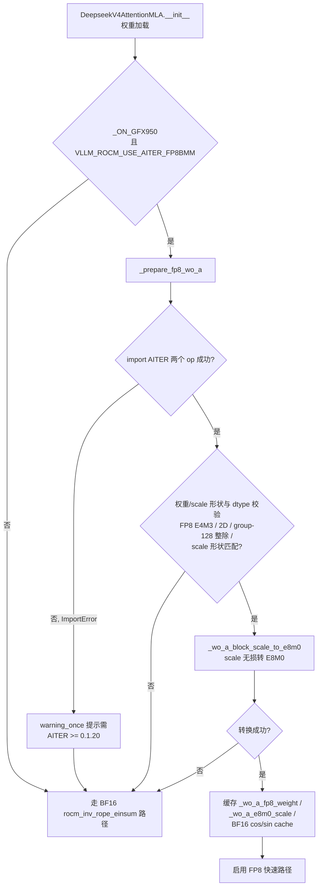
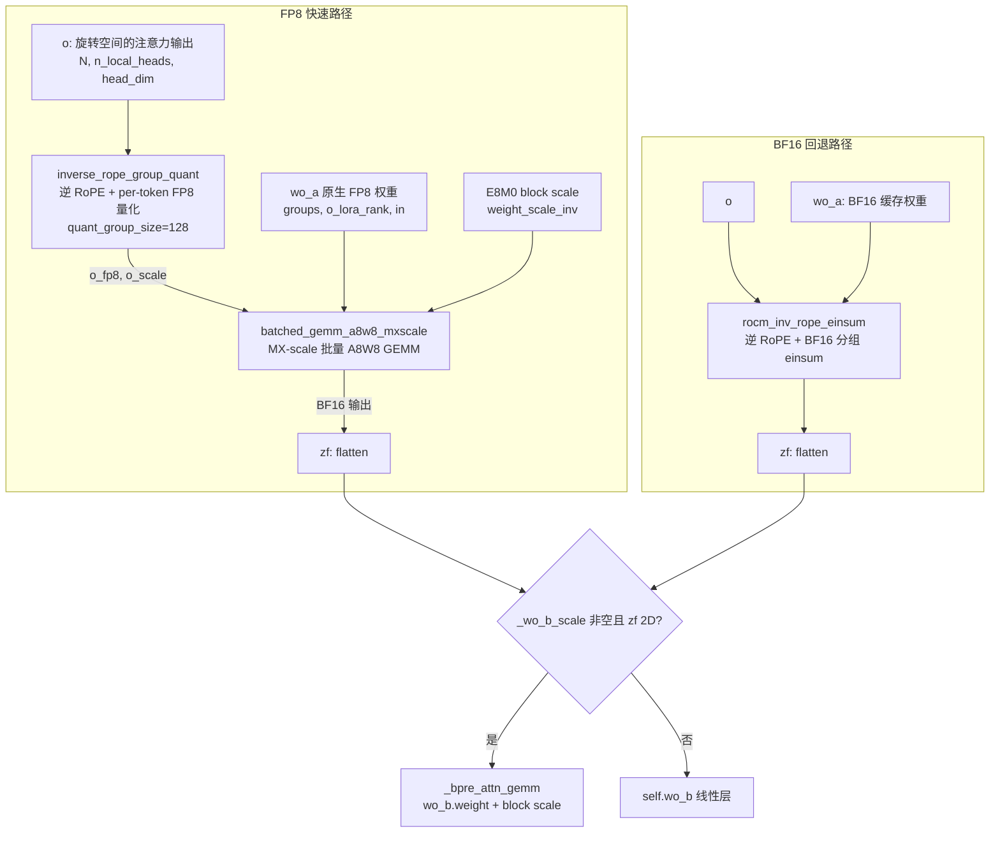

# PR #54894: [ROCm][DSV4][Perf] Use FP8 WO_A output projection

> **作者**: @LiuYinfeng01 | **状态**: OPEN | **日期**: 2026-09-02（最近更新 2026-09-12）
> **Branch**: `LiuYinfeng01:rocm-dsv4-fp8-woa-mxscale` → `vllm-project:main` | **Labels**: `rocm`, `deepseek`, `verified`, `DSv4`
> **变更规模**: +163 -11 行，涉及 2 个文件 | **Assignee**: @shen-shanshan
> **Mergeable**: `unstable`（CI 状态未全绿） | **依赖**: AITER >= 0.1.20（#52826）

---

## 1. 总结 (Summary)

本 PR 将 ROCm 后端 DeepSeek V4（gfx950 / MI355X）的注意力输出投影 `wo_a` 从 **BF16 分组 einsum 路径**替换为 **FP8 MX-scale 快速路径**：用 AITER 的 `inverse_rope_group_quant`（逆 RoPE + per-token E8M0 分组量化融合 kernel）和 `batched_gemm_a8w8_mxscale`（MX-scale 批量 A8W8 GEMM）替代原有的 `rocm_inv_rope_einsum` BF16 路径，直接消费 checkpoint 原生 FP8 `wo_a` 权重。所有不支持的权重/scale 布局、非 gfx950 设备及旧版 AITER 均保留原有 BF16 回退路径。实测 8×MI355X 上 100K-token prefill 的 TTFT 降低 7.35%、输入吞吐提升 7.93%（TP1/PP8）；TP1/PP8 并发 prefill 吞吐提升约 6.1~6.8%，TP8/PP1 提升约 0.4~3.2%；GSM8K 全量 1319 题精度 0.9651，不低于 BF16 基线。

---

## 2. 背景与动机 (Background & Motivation)

DeepSeek V4（DSv4）采用稀疏 MLA（sparse Multi-head Latent Attention）架构。在 vLLM 的 ROCm 实现中，注意力输出 `o` 保存在**旋转后（post-RoPE）空间**，输出投影被分解为低秩两级：`wo_a`（按 group 的下投影，每 group 输出 `o_lora_rank` 维）→ `wo_b`。由于 `o` 处于旋转空间，做 `wo_a` 投影前必须先执行**逆 RoPE**。

现有路径（相关 PR #45103）将逆 RoPE 与 BF16 分组 einsum 融合为 `rocm_inv_rope_einsum`，并把 `wo_a` 权重缓存为 BF16。该路径存在两个性能瓶颈：

1. **BF16 内存流量翻倍**：checkpoint 原生以 FP8 E4M3 存储 `wo_a` 权重（配合 `weight_scale_inv` block scale），BF16 路径需要先转换权重、再以 2 字节/元素做 GEMM，而 FP8 GEMM 内存流量减半，MI355X 上 AITER 的 FP8 kernel 也远快于 BF16；
2. **多一次显存往返**：BF16 路径必须先物化逆 RoPE 后的 BF16 激活，再做 GEMM；理想做法是把逆 RoPE 直接融合进量化 kernel，一次写出 FP8 激活 + per-token scale。

本 PR 的思路：用 AITER >= 0.1.20 新增的 `inverse_rope_group_quant`（融合逆 RoPE + per-token 128 分组 FP8 量化）配合 `batched_gemm_a8w8_mxscale`（消费 FP8 激活 + 原生 FP8 权重 + E8M0 block scale 的 MX 格式批量 GEMM），同时保留 `rocm_inv_rope_einsum` 作为完整回退。

---

## 3. 代码修改分析 (Code Change Analysis)

### 3.1 修改的模块

| 文件 | 操作 | 说明 |
|------|------|------|
| `vllm/models/deepseek_v4/amd/rocm.py` | 修改 (+119 -11) | 新增 `_wo_a_block_scale_to_e8m0()` 转换函数、`_prepare_fp8_wo_a()` 能力探测与权重准备、`_o_proj()` FP8/BF16 双分支；`__init__` 新增 4 个缓存字段 |
| `tests/models/test_deepseek_v4_rocm_wo_a.py` | 新增 (+44) | `_wo_a_block_scale_to_e8m0` 的 CPU 单元测试：正常转换、编码 scale 透传、非法 scale 拒绝 |

### 3.2 架构 / 流程图

#### FP8 快速路径启用决策（权重加载阶段）

#### `_o_proj` 运行时双分支数据流

### 3.3 关键实现细节 (Key Implementation Details)

**`_wo_a_block_scale_to_e8m0(scale)`（rocm.py，新增）**
- `float8_e8m0fnu` 输入 → `view(torch.uint8)` 取原始指数字节；`uint8` 输入 → 直接透传；
- 其他浮点类型 → 仅接受**严格正 2 的幂**值（有限、>0、`round(log2(x))` 精确还原），编码为 bias-127 的 E8M0 指数字节（如 0.5/1/2/4 → 126/127/128/129）；
- 任何不满足条件（含非浮点类型）返回 `None`，调用方静默回退 BF16——保证**无损**转换，绝不牺牲精度换速度。

**`_prepare_fp8_wo_a()`（rocm.py，新增）**
- 双重门槛：`_ON_GFX950 and envs.VLLM_ROCM_USE_AITER_FP8BMM`（复用现有 gate，不新增环境变量）；
- 能力探测：`try: import aiter.ops.batched_gemm_op_a8w8 / inverse_rope_group_quant`，`ImportError` 时 `warning_once` 提示需要 AITER >= 0.1.20 后返回（`del` 掉探测引用，仅探测不持有）；
- 布局校验：权重必须为 `float8_e4m3fn`/`float8_e4m3fnuz` 2D，`out_features == groups * o_lora_rank`，`o_lora_rank` 与 `in_features` 均为 128 的倍数，scale 形状为 `(out//128, in//128)`；
- 缓存准备：权重 view 为 `(groups, out_per_group, in_features)` 3D 供批量 GEMM；scale view 为 `(groups, out//128, in//128)`；cos/sin cache 复用 `rotary_emb.cos_sin_cache_bf16`（缺失时一次性转 BF16）并 `chunk(2, dim=-1)` 后 `contiguous()`。

**`_o_proj()` 分支（rocm.py）**
- 以 `self._wo_a_fp8_weight is not None` 为开关；FP8 分支内 import 两个 AITER op（Python import 有 sys.modules 缓存，开销可忽略）；
- `inverse_rope_group_quant`：输入 `o.view(N, n_local_heads, head_dim)`、`positions.to(int64)`、缓存好的 cos/sin、`num_groups=n_local_groups`、`quant_group_size=128`，返回量化激活 `o_fp8` 与 per-token scale `o_scale`；
- `batched_gemm_a8w8_mxscale(o_fp8, weight, o_scale, e8m0_scale, dtype=o.dtype)` 输出直接 `flatten(1)` 进入 wo_b 阶段，与 BF16 路径共用后续 wo_b 逻辑（`_bpre_attn_gemm` 或普通线性层）。

**测试（新文件）**
- `test_wo_a_block_scale_to_e8m0_from_float`：验证 0.5/1/2/4 → 126/127/128/129 的 bias-127 编码及连续性；
- `test_wo_a_block_scale_to_e8m0_preserves_encoded_scales`：`float8_e8m0fnu` view 为 uint8 后应原样保留（125/127/131）；
- `test_wo_a_block_scale_to_e8m0_rejects_invalid_scales`：参数化拒绝 0.0、负数、非 2 的幂（0.75）、inf、int32。

---

## 4. 涉及的技术原理 (Technical Principles)

### 4.1 DeepSeek V4 稀疏 MLA 与旋转空间输出投影

DSv4 注意力输出 `o` 按 head 组织并保持 RoPE 旋转后的形式（方便与 KV 共享旋转表示）。输出投影为两级低秩结构：`wo_a` 将每个 group 的拼接 head 输出降维到 `o_lora_rank`，`wo_b` 再升维回模型维度。对旋转空间中的 `o` 直接做线性投影没有意义，必须先逆 RoPE（用 `-position` 旋转或利用 cos/sin 的对称性），这正是原有 `rocm_inv_rope_einsum` 与新的 `inverse_rope_group_quant` 都融合了逆 RoPE 的原因。

### 4.2 E8M0 与 OCP MX (Microscaling) 格式

E8M0 是 OCP MX 规范的 8-bit **纯指数**格式：无符号位、无尾数，bias 127，表示值 `2^(e-127)`，范围约 `2^-127 ~ 2^128`，专用于 block scale。MX 格式 GEMM 中，激活按 per-token/group 量化、权重按 per-128 block 量化，scale 全部用 E8M0 存储——DSv4 checkpoint 的 `weight_scale_inv` 正是这种布局。由于 E8M0 只能表示 2 的幂，`_wo_a_block_scale_to_e8m0` 对非 2 的幂 FP32 scale 选择**拒绝并回退**，而非近似取整，保证数值无损。

### 4.3 为什么 FP8 路径更快

- **内存带宽减半**：FP8 GEMM 的权重与激活均 1 字节/元素，对比 BF16 的 2 字节；MI355X 的 A8W8 矩阵单元吞吐显著高于 BF16；
- **kernel 融合**：`inverse_rope_group_quant` 把逆 RoPE、FP8 量化、scale 计算融合为一个 kernel，中间结果不再物化 BF16 旋转激活，省去一次完整的显存写读往返；
- **批量 GEMM 与调优 kernel**：`batched_gemm_a8w8_mxscale` 按 group 批量执行小 GEMM，避免逐 group 的 Python 循环与 kernel 启动开销。

### 4.4 AITER 与 gfx950

AITER（ROCm/aiter）是 AMD 开源的 ROCm 高性能算子库，vLLM ROCm 后端大量依赖其 GEMM/量化 kernel。gfx950 即 MI355X GPU。本 PR 复用已有环境变量 `VLLM_ROCM_USE_AITER_FP8BMM` 作为统一 gate，避免新开关；依赖 AITER >= 0.1.20（由 #52826 引入版本升级），旧版本下 import 探测失败自动回退 BF16，`main` 分支保持安全。

---

## 5. 评论区讨论亮点 (Discussion Highlights)

### 精度诉求：要求全量 GSM8K 1319 题测试

**Fangzhou-Ai（Collaborator）** 在 PR 提交当天（09-02）即提出：

> "please do a full 1319 gsm8k test, current result seems to be lower than the baseline. We expect the full test score near 0.96"

当时 PR 描述中只有 100 题 gate（93/100）和 1319 题 95.22% 的结果，reviewer 认为低于基线、要求跑全量并期望接近 0.96。

**作者的响应（09-11）**：在**旧版 `DeepSeek-V4-Pro` checkpoint** 上重测全量 1319 题（greedy 5-shot）：

| Path | flexible-extract | strict-match |
|---|---:|---:|
| BF16 `wo_a` | 0.9621 ± 0.0053 | 0.9629 ± 0.0052 |
| FP8 `wo_a` | **0.9651 ± 0.0051** | **0.9651 ± 0.0051** |

FP8 路径达到 0.9651，超过 0.96 门槛，且比同拓扑 BF16 基线高 +0.30pp；两次运行均 0 个非法响应。作者同时把 PR 描述扩展出完整的「旧 checkpoint 重测」章节（两个 checkpoint 数据并排、互不混用），包括 TP8/PP1 +1.29% 均值、TP1/PP8 +6.09% 均值、100K prefill TTFT -2.89%、GSM8K 全量数据，回应相当扎实。

### 其他

- **claude[bot] review**：fork PR 自动 review 被禁用，需 maintainer 手动 `@claude review` 触发一次性审查；
- 请求的 reviewer（@tjtanaa、@zyongye、@AndreasKaratzas、@hongxiayang、@dllehr-amd）均尚未给出 approve/change 意见，暂无人工 review 结论。

---

## 6. 风险与潜在问题 (Risk Analysis)

| 风险 | 严重程度 | 说明 |
|------|---------|------|
| **依赖 #52826 未合入前不可用** | Medium | 快速路径需要 AITER >= 0.1.20（MX-scale 批量 GEMM 由 #52826 引入）。#52826 未合入时本 PR 在 main 上只会走回退路径，性能收益为零。需确认依赖先合入或同步合入。 |
| **FP8 量化精度损失** | Low | 激活量化引入误差，但 GSM8K 全量实测 FP8 (0.9651) 不低于 BF16 (0.9621)，且 scale 转换严格无损（非 2 的幂直接回退），精度风险已用数据消除。 |
| **静默回退的可观测性** | Medium | 除 AITER import 失败会 `warning_once` 外，权重/scale 形状或数值校验失败均**静默**回退 BF16，用户无法感知「为什么没吃到 FP8 优化」。建议至少加一条 debug 级日志说明回退原因。 |
| **复用共享 gate 的语义耦合** | Low | 复用 `VLLM_ROCM_USE_AITER_FP8BMM`，用户为关闭其他 FP8 路径而设 0 时会一并关掉本路径，反之亦然。无正确性问题，但开关粒度较粗。 |
| **CI / 合并状态** | Medium | `mergeable_state: unstable`、`rebaseable: false`，说明 CI 状态未全绿或与 main 存在 rebase 障碍，合入前需要处理。 |
| **测试覆盖局限** | Low | 新增单测为纯 CPU 逻辑测试（scale 转换），快速路径本身的端到端正确性依赖 MI355X 手工验证（PR 描述中的 benchmark/GSM8K），CI 环境无法覆盖 gfx950 专用路径，长期回归风险存在。 |
| **AITER 版本探测仅有 import 检查** | Low | 探测只验证 op 可 import，不校验其签名/行为与预期一致（如未来 AITER 变更接口），届时会在 `_o_proj` 运行时才报错而非回退。当前依赖 pin 由 #52826 保证，风险可控。 |
| **cos/sin cache 的一次性转换开销** | Low | 当 `rotary_emb` 无 `cos_sin_cache_bf16` 属性时，会在权重加载阶段把完整 `cos_sin_cache` 转为 BF16，带来一次性显存与时间开销（量级取决于 max position），但只在快速路径启用时发生一次。 |

---

## 7. 结论 (Conclusion)

PR #54894 是一个设计保守、验证充分的高质量性能优化：严格的能力探测 + 多层校验 + 无损 scale 转换保证任何异常配置都安全回退到既有 BF16 路径，实测数据覆盖两个 checkpoint、两种拓扑（TP8/PP1 与 TP1/PP8）、A/B 同镜像对照，精度不降反升。主要待办是 #52826 依赖的落地、CI 状态的修复（unstable）以及人工 reviewer 的 approve；在依赖满足后预计可顺利合入，成为 DSv4 在 MI355X 上 prefill 性能的重要增益。
