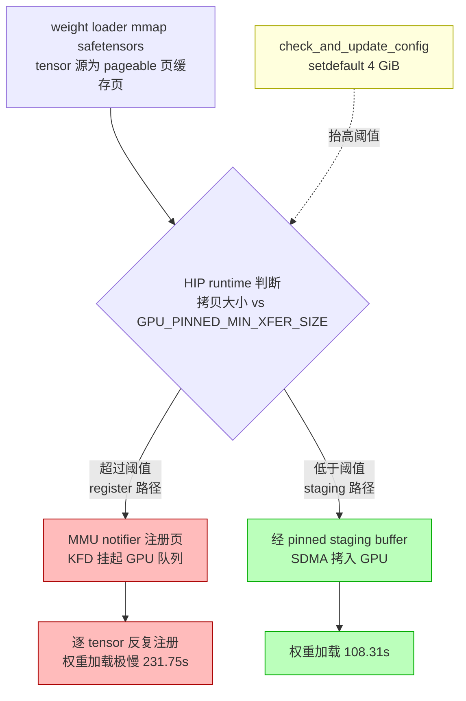
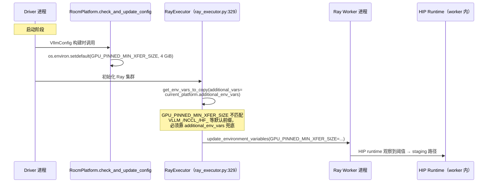

# PR #56343: [ROCm] Stage large pageable H2D copies instead of registering them

> **作者**: @JohnQinAMD | **状态**: OPEN | **日期**: 2026-09-10
> **Branch**: `JohnQinAMD:pr/rocm-stage-pageable-h2d` → `vllm-project:main` | **Labels**: `rocm`, `verified`
> **变更规模**: +9 -0 行，涉及 1 个文件

---

## 1. 总结 (Summary)

本 PR 通过在 `RocmPlatform.check_and_update_config()` 中将 HIP runtime 环境变量 `GPU_PINNED_MIN_XFER_SIZE` 默认设置为 4 GiB，使 vLLM 权重加载时的大块 H2D 拷贝走「staging（暂存缓冲）」路径而不是「register（页注册）」路径，避免每次注册触发 KFD MMU notifier 挂起 GPU 队列。实测 4x MI355X + TP4 + DeepSeek-V4.1-Flash 冷启动权重加载从 **231.75 s 降至 108.31 s**（约 2.1x 加速），与手动导出该环境变量的对照组（85.64 s）行为一致。改动共 9 行，仅涉及 `vllm/platforms/rocm.py`，并通过 `additional_env_vars` 机制将该环境变量透传给 Ray worker。

---

## 2. 背景与动机 (Background & Motivation)

vLLM 的权重加载器通过 `mmap` 读取 safetensors 文件，因此每个 tensor 的 H2D 拷贝源都是 file-backed page（文件页缓存中的页面）。在 ROCm 上，HIP runtime 对 pageable 内存的 H2D 拷贝有两条路径：

- **Staging 路径**：先把数据拷到一块固定的 pinned staging buffer（SDMA 友好），再拷入 GPU。开销小，适合一次性拷贝。
- **Register 路径**：超过 `GPU_PINNED_MIN_XFER_SIZE` 阈值后，HIP runtime 会把源内存页通过 MMU notifier 注册给 GPU（KFD userptr 机制），随后直接 DMA。注册本身有 per-page 开销。

**具体痛点**：
- 每个大 tensor 的拷贝都会触发一次注册，而每次注册的 MMU notifier 会让 KFD 挂起进程的 GPU 队列——没有报错、没有警告，只有"慢得离谱"的加载器。
- DeepSeek-V4.1-Flash checkpoint 达 475 GiB（4 个 loader worker 打满 80/128 核，`/proc/diskstats` 显示全程 0 MB/s 读盘——完全是页缓存命中，瓶颈不在 I/O，而在注册开销）。
- `GPU_PINNED_MIN_XFER_SIZE` 是 HIP runtime 的标志而非 vLLM 标志，但 vLLM 此前从未设置它，用户只能手动 `export`。

PR 的修复思路很简单：把阈值抬高到 4 GiB，让权重级别的拷贝永远走 staging 路径；用 `setdefault` 保证用户显式导出的值仍然生效。

---

## 3. 代码修改分析 (Code Change Analysis)

### 3.1 修改的模块

| 文件 | 操作 | 说明 |
|------|------|------|
| `vllm/platforms/rocm.py` | 修改 | `RocmPlatform` 新增 `additional_env_vars` 声明（+3 行）；`check_and_update_config()` 中 `setdefault` 设置 `GPU_PINNED_MIN_XFER_SIZE`（+6 行） |

完整 diff：

```diff
@@ -504,6 +504,9 @@ class RocmPlatform(Platform):
     dist_backend: str = "nccl"
     # rocm shares the same device control env var as CUDA
     device_control_env_var: str = "CUDA_VISIBLE_DEVICES"
+    # Set in check_and_update_config, so it exists only on the driver; Ray
+    # workers are separate processes and copy env vars by allowlist.
+    additional_env_vars: list[str] = ["GPU_PINNED_MIN_XFER_SIZE"]
     ray_noset_device_env_vars: list[str] = [
         "RAY_EXPERIMENTAL_NOSET_HIP_VISIBLE_DEVICES",
         "RAY_EXPERIMENTAL_NOSET_CUDA_VISIBLE_DEVICES",
@@ -915,6 +918,12 @@ def check_and_update_config(cls, vllm_config: "VllmConfig") -> None:
         compilation_config = vllm_config.compilation_config
         parallel_config = vllm_config.parallel_config
 
+        # Keep mmap'd weight pages on the HIP staging path: above this
+        # threshold the HIP runtime registers the pageable source with the GPU
+        # instead of staging it, and each registration's MMU notifier makes KFD
+        # suspend our queues. The value is in KB, so this is 4 GiB.
+        os.environ.setdefault("GPU_PINNED_MIN_XFER_SIZE", str(4 * 1024 * 1024))
+
         if (
             parallel_config.prefill_context_parallel_size > 1
             and parallel_config.data_parallel_size > 1
```

### 3.2 架构 / 流程图 (Architecture / Flow Diagram)

#### H2D 拷贝路径选择与修复点



#### 环境变量传播路径（driver → Ray workers）



### 3.3 关键实现细节 (Key Implementation Details)

- **`additional_env_vars` 声明**（`rocm.py:507`）：`GPU_PINNED_MIN_XFER_SIZE` 只设置在 driver 进程；Ray worker 是独立进程，环境变量按 allowlist 拷贝（`vllm/ray/ray_env.py` 的 `get_env_vars_to_copy` + `vllm/v1/executor/ray_executor.py:329` 传入 `additional_vars=set(current_platform.additional_env_vars)`）。该变量不匹配 `DEFAULT_ENV_VAR_PREFIXES`（`VLLM_`、`FLASH_ATTENTION_`、`LMCACHE_`、`NCCL_`、`UCX_`、`HF_`、`HUGGING_FACE_`）中的任何前缀，因此不声明的话 Ray 部署下每个 worker 都会保留慢路径。
- **`setdefault` 语义**：用户/运维显式 `export GPU_PINNED_MIN_XFER_SIZE` 的值优先生效，vLLM 只提供默认值。
- **数值单位**：该变量单位为 KB，`4 * 1024 * 1024` 即 4 GiB 阈值。若误读为字节（4 MiB），对 multi-GiB 的权重 tensor 行为不变，无法解释实测数据——PR 描述中专门澄清了这一点。
- **放置位置**：设在 `check_and_update_config` 中，保证早于 HIP runtime 初始化被观察到（对照组实测 85.64 s 验证了时序正确性）。

---

## 4. 涉及的技术原理 (Technical Principles)

### 4.1 HIP Runtime 的 H2D 拷贝双路径

对 pageable（非 pinned）宿主内存的 H2D 拷贝，HIP runtime 有两种实现：

- **Staging**：通过一块预先 pin 住的暂存 buffer 中转（`GPU_MAX_H2D_PINNED_MEM_SIZE` 控制其大小），由 SDMA 引擎完成 device 侧搬运。拷贝是一次性的，无注册开销。
- **Pinning/Register**：当拷贝大小超过 `GPU_PINNED_MIN_XFER_SIZE` 时，runtime 将源页注册（pin）到 GPU 地址空间后直接 DMA。对**同一块内存的多次拷贝**更有利（注册成本可摊销），但对权重加载这种**一次性大拷贝**是纯开销。

### 4.2 KFD 的 MMU Notifier 与队列挂起

当 HIP runtime 注册 file-backed 页时，内核驱动 KFD 会安装 MMU notifier：一旦 OS 要回收/迁移这些页，notifier 回调需要同步更新 GPU 的 IOMMU 映射，这期间必须挂起进程的 GPU 队列保证一致性。权重加载时每个大 tensor 各注册一次 → notifier 反复触发 → GPU 队列频繁挂起/恢复，且整个过程没有任何报错或警告，表现为"静默地慢"。

### 4.3 vLLM 权重加载的 mmap 路径

vLLM 的 weight loader 通过 `mmap` 读 safetensors，tensor 数据直接来自页缓存中的 file-backed page。由于 checkpoint 远小于 RAM（475 GiB vs 2632 GiB），整个文件全程命中页缓存（`/proc/diskstats` 0 MB/s 读盘），瓶颈完全在注册路径而非 I/O。

### 4.4 环境变量传播的 allowlist 机制

Ray 部署下，driver 与 worker 是不同进程。vLLM 通过 `get_env_vars_to_copy()` 决定哪些环境变量从 driver 拷给 worker：注册过的 vLLM 变量 + 匹配前缀白名单（`VLLM_`、`NCCL_` 等）+ 平台声明的 `additional_env_vars`。`GPU_PINNED_MIN_XFER_SIZE` 不属于前两类，所以必须在 `RocmPlatform.additional_env_vars` 中显式声明。

---

## 5. 评论区讨论亮点 (Discussion Highlights)

- 尚无任何 issue comment 或 inline review comment，也没有人工 review。
- 唯一一条 review 来自 `claude[bot]`：提示该 PR 来自 fork，自动化 review 被禁用，可由 maintainer 评论 `@claude review` 触发一次性审查。
- 已请求 reviewer：`@tjtanaa`、`@shen-shanshan`、`@dllehr-amd`，均尚未表态。
- PR 描述本身质量很高：包含三组对照测量（unpatched / patched / 手动 export 对照）、排除了 I/O 因素（页缓存 + diskstats）、澄清了单位（KB）与 `setdefault` 语义，并说明 Ray 传播路径经过代码阅读验证（未实际跑 Ray 部署）。

---

## 6. 风险与潜在问题 (Risk Analysis)

| 风险 | 严重程度 | 说明 |
|------|---------|------|
| **全局副作用：影响所有 H2D 拷贝** | Medium | `GPU_PINNED_MIN_XFER_SIZE` 是进程级全局标志，影响的不止权重加载，还包括运行期所有大于 4 GiB 的 pageable H2D 拷贝（如 CPU offload 场景）。对一次性拷贝 staging 更快，但若存在"同一块大宿主内存反复拷贝"的工作负载（如 KV cache 的 host↔device 交换），register 路径本可摊销注册成本，此改动会让其退化。vLLM 主流服务场景下此类负载罕见，但未做针对性评估。 |
| **硬编码 4 GiB 魔数** | Low | 4 GiB 基于"权重 tensor 均小于 4 GiB"的假设。极端配置下（如单卡加载超大 MoE 全量权重、无 TP 切分的超大 tensor）可能出现超过 4 GiB 的单次拷贝重新落入 register 路径，修复静默失效。当前主流模型 + TP 切分下不构成实际风险，但缺少注释之外的防御（如断言或日志）。 |
| **对 HIP runtime 初始化时序的隐式依赖** | Low | 修复依赖 `check_and_update_config` 早于 HIP runtime 读取该变量。作者用对照组（手动 export，85.64 s）验证了当前时序正确，但若未来重构导致 config 检查后移，修复会静默失效且无任何 CI 信号。 |
| **无自动化测试** | Medium | 纯环境变量行为 + 性能修复，难以在 CI 中构造单元测试或性能回归测试；`verified` label 表示仅跑 pre-commit。合入后若 HIP runtime 行为变化（如阈值语义改变），没有测试会报警。 |
| **Ray 传播路径未实测** | Low | 作者坦承 `additional_env_vars` 传播路径是"读代码验证"的，未实际跑 Ray 部署。`ray_executor.py:329` 的调用点已在本地源码确认存在，风险低，但建议合入前在 Ray 环境冒烟验证一次 worker 日志中的加载耗时。 |
| **CI 状态 unstable** | Low | `mergeable_state: unstable`，PR 来自 fork（CI 默认不触发），提交于 2026-09-10、至今未合入，需关注 pre-commit/CI 结果与 rebase 需求。 |

---

## 7. 结论 (Conclusion)

PR #56343 是一个小而精的 ROCm 性能修复：9 行代码将 DeepSeek-V4.1-Flash 级别大模型的权重加载时间砍半（231.75 s → 108.31 s），根因分析扎实（KFD MMU notifier 挂起队列）、测量严谨（三组对照 + I/O 排除 + 单位澄清）、Ray 传播考虑周全。主要待办是获得 reviewer 认可（含 @shen-shanshan）、确认 CI 状态，以及留意该全局阈值对非权重加载路径的潜在影响——整体质量高，修复方向与 HIP runtime 的语义吻合，属于低风险、高收益的合入候选。
