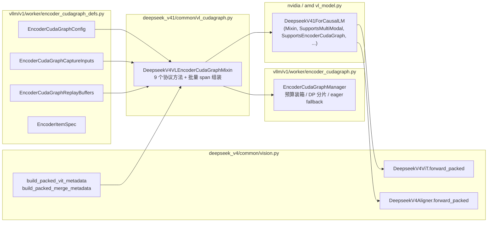

# PR #56625: [DSV4.1] Add encoder cuda graph support for deepseek-v4.1-flash

> **作者**: @Isotr0py | **状态**: OPEN | **创建日期**: 2026-09-12
> **Branch**: `deepseek-v4-ecg` → `main` | **Labels**: `rocm`, `ready`, `multi-modality`, `deepseek`, `nvidia`, `DSv4`, `DSv4.1`
> **变更规模**: +588 -63 行，涉及 5 个文件（1 新增 4 修改），7 个 commits

---

## 1. 总结 (Summary)

本 PR 为 DeepSeek-V4.1-Flash 的视觉编码器（ViT + Aligner）引入 **Encoder CUDA Graph** 支持，通过实现 `SupportsEncoderCudaGraph` 协议，将每张图片的 eager 编码开销（Python 循环、逐 kernel 启动、RoPE/cu_seqlens 的 host 端计算）从请求关键路径中移除。核心设计是把一批图片打包成**一次 varlen 前向**：ViT block 通过 `cu_seqlens` 实现逐图注意力隔离，Aligner 的空间合并（spatial merge）改为对预计算索引的 gather+mask。在 4×GB200 (TP=4) 上实测 VisionArena-Chat 端到端吞吐提升 **2.60x**，P99 TTFT 降低 **4.67x**。

---

## 2. 背景与动机 (Background & Motivation)

vLLM V1 的 `SupportsEncoderCudaGraph` 协议与 `EncoderCudaGraphManager`（此前由 PR #35963 引入，首个实现为 Qwen3-VL）提供了模型无关的 ViT CUDA Graph 基础设施。DeepSeek-V4.1 是继 Qwen3-VL 之后接入该协议的第二个模型，但其视觉塔结构差异显著：

- **ViT 使用 varlen 打包 + RoPE**：Qwen3-VL 用 M-RoPE，而 DSV4.1 的 ViT attention 原本是"每图一次 dense 调用"（无 `cu_seqlens`），需要为其补齐 varlen 前向路径；
- **Aligner 空间合并**：eager 路径用 `F.pad` + `F.unfold` 做 `r×r` 下采样合并，其中包含运行时形状依赖的操作，无法直接捕获进 CUDA Graph，需要改写成纯张量（gather+mask）形式；
- **Span 组装**：`IMAGE_START / IMAGE_NEW_LINE / IMAGE_END` 三个可学习分隔向量与 aligner 输出行的交错拼装是 host 端逻辑，需留在 eager 但在 graph 路径中批量完成。

另外，eager 编码器按图串行执行，会与 decode 迭代交错并抢占（preempt）decode kernel，这是 TPOT 也显著改善的原因。

---

## 3. 代码修改分析 (Code Change Analysis)

### 3.1 修改的模块

| 文件 | 操作 | 说明 |
|------|------|------|
| `vllm/models/deepseek_v41/common/vl_cudagraph.py` | 新增 (+385) | `DeepseekV4VLEncoderCudaGraphMixin`：实现 `SupportsEncoderCudaGraph` 协议的 9 个方法 |
| `vllm/models/deepseek_v4/common/vision.py` | 修改 (+156 -7) | ViT/Aligner 新增 `forward_packed` varlen 路径；新增 `build_packed_vit_metadata` / `build_packed_merge_metadata`；attention 支持 `cu_seqlens`/`max_seqlen` 参数 |
| `vllm/models/deepseek_v41/nvidia/vl_model.py` | 修改 (+12 -28) | 组合 Mixin + `SupportsEncoderCudaGraph`，删除迁移到 Mixin 的 `_encode_image`/`_build_image_span` |
| `vllm/models/deepseek_v41/amd/vl_model.py` | 修改 (+12 -28) | 同 NVIDIA 侧，ROCm 路径共享同一 Mixin |
| `tests/models/multimodal/generation/test_vit_cudagraph.py` | 修改 (+23) | 新增 `deepseek_v41` 端到端测试配置（dummy 权重，token budget 1024） |

### 3.2 架构 / 流程图 (Architecture / Flow Diagram)

#### 整体模块关系

#### 捕获与回放流程

```mermaid
flowchart TD
    subgraph capture["启动阶段：capture_model()"]
        C1[Manager 按 token budget 发起 capture] --> C2[Mixin.prepare_encoder_cudagraph_capture_inputs]
        C2 --> C3["构造 dummy grids: r x r*per_item_out<br/>全零 patches + 预计算 cu_seqlens/cos/sin/merge 元数据"]
        C3 --> C4["注册 cu_seqlens data_ptr → pad_totals<br/>供回放时 padding 逻辑使用"]
        C4 --> C5[torch.cuda.CUDAGraph 捕获<br/>vision.forward_packed + aligner.forward_packed]
    end

    subgraph replay["推理阶段：_execute_mm_encoder()"]
        R1[Manager 贪心装箱：按 output tokens 分组选择 budget] --> R2[Mixin.prepare_encoder_cudagraph_replay_buffers]
        R2 --> R3["构建真实元数据（不 padding）"]
        R3 --> R4["copy_ 进捕获时 buffer<br/>pad_cu_seqlens 追加尾部 padding 序列"]
        R4 --> R5[graph.replay]
        R5 --> R6[Mixin.postprocess_encoder_output<br/>批量 span 组装（masked fill 分隔向量）]
    end

    E[超 budget / 不支持场景] --> F[encoder_eager_forward 逐图 eager 回退]
```

### 3.3 关键实现细节 (Key Implementation Details)

**协议实现层（`vl_cudagraph.py` — `DeepseekV4VLEncoderCudaGraphMixin`）**

- `get_encoder_cudagraph_config()`：声明 `modalities=["image"]`，7 个 buffer key（`patches`、`vit_cos`、`vit_sin`、`cu_seqlens`、`max_seqlen`、`merge_idx`、`merge_mask`），并为 `cu_seqlens` 注册 `padding_logics`。两条硬性校验：
  - **动态 FP8 量化不兼容**：`mm_encoder_attn_dtype == "fp8"` 且未提供静态 scale 文件时直接报错——amax 历史是 host 端状态，无法被捕获进图；
  - **FlashInfer ViT attention 不支持**：仅允许 `FLASH_ATTN` 后端。
- `pad_cu_seqlens`：varlen attention 要求 `cu_seqlens[-1]` 等于实际传入的行数，而捕获时 buffer 按满 token budget 分配；回放时真实 batch 较小，因此补**一条尾部 padding 序列**覆盖未填满的行——向 FlashAttn 声明少于 buffer 容量的行数是未定义行为（会返回 NaN）。padding 总量通过捕获时注册的 `data_ptr → pad_totals` 字典查询，若 Manager 未复用捕获时 buffer 则报 `RuntimeError`。
- `prepare_encoder_cudagraph_capture_inputs()`：dummy 图（grids）取 `[[r, r × per_item_out]] × max_batch_size`，其中 `per_item_out = ceil(token_budget / max_batch_size)`，保证单图占满全部 budget 时 patch 数也装得下；`cu_seqlens` buffer 额外预留 2 个槽位供回放 padding 使用；`max_seqlen_override=total_patches` 在捕获期烘焙最坏值。
- `postprocess_encoder_output()`：span 组装（IMAGE_START/NEW_LINE/END 分隔向量 + aligner 行）留在 graph 外，但通过**一次 masked fill 按角色批量完成**所有 item 的组装，且每份输出切片为**新分配内存**，避免后续 replay 覆盖结果。

**视觉塔层（`vision.py`）**

- `DeepseekV4ViT.forward_packed()`：纯张量 varlen 前向（patch_embed → blocks → norm），无 host 读取，可安全捕获；attention 层新增可选 `cu_seqlens`/`max_seqlen` 参数，`None` 时保持原 dense 单图行为。
- `build_packed_vit_metadata()`：逐图计算 RoPE 表并 concat、构建 `cu_seqlens`；`max_seqlen` 保持 host 端 CPU tensor——注意 attention wrapper 在 **host 读 `max_seqlen`**，捕获时读到的值会固化为图常量，因此捕获期必须传 `max_seqlen_override` 烘焙最坏情况（回放时的真实值被图常量覆盖，因 padding 序列补齐行数，最坏值语义仍正确）。
- `build_packed_merge_metadata()`：为每个 aligner 输出行预计算 `r×r` 源 patch 行的 gather 索引与有效 mask；越界位置用 clamp 后的合法索引 + mask 0，**精确复现 eager 的 `F.pad` + `F.unfold` 零填充语义**（unfold 行是 channel-major，故 gather 结果先 transpose 再展平）。
- `get_vision_cos_sin` 拆分为 `_compute_vision_cos_sin`（未缓存）+ `lru_cache` 包装：捕获期 dummy grid 使用未缓存版本，避免把一次性 dummy 表挤进缓存淘汰真实条目。

**模型入口层（`nvidia/vl_model.py`、`amd/vl_model.py`）**

- 类签名改为 `nn.Module, DeepseekV4VLEncoderCudaGraphMixin, SupportsMultiModal, SupportsEncoderCudaGraph, SupportsPP, SupportsEagle3`；`_encode_image`/`_build_image_span` 从两个后端文件中删除（各 -28 行），迁移至共享 Mixin，NVIDIA/ROCm 零重复。

**测试层（`test_vit_cudagraph.py`）**

- 新增 `deepseek_v41` 配置：dummy 权重（`vision_n_layers=1` 裁剪 ViT 深度）、`attention_backend=FLASHMLA_SPARSE_DSV41`、`encoder_cudagraph_token_budgets=[1024]`，验证 graph 捕获/回放与 eager 输出一致性。

---

## 4. 涉及的技术原理 (Technical Principles)

### 4.1 Encoder CUDA Graph 基础设施（PR #35963 遗产）

vLLM V1 的 `EncoderCudaGraphManager` 提供模型无关的框架：按 token budget 预捕获多张图、运行时贪心装箱（greedy bin-packing）将图片按 output token 数升序打包、DP 分片、超预算自动 eager fallback。模型侧只需实现 `SupportsEncoderCudaGraph` 协议 9 个方法。本 PR 是该协议在 Qwen3-VL 之后的第二个落地实现。

### 4.2 Varlen 打包与 cu_seqlens Padding 约束

多图打包进一次前向时，ViT attention 必须按图隔离：FlashAttn 的 varlen 模式依赖 `cu_seqlens` 划分序列，且**要求 `cu_seqlens[-1]` 严格等于实际参与计算的行数**——声明更多行会导致越界读（实测返回 NaN）。CUDA Graph 的 buffer 尺寸在捕获期固定，因此小 batch 回放时必须追加一条 padding 序列把行数"补满"，而非简单地在尾部填零。

### 4.3 CUDA Graph 捕获的三个经典约束在本 PR 中的体现

1. **地址不可变**：replay 只能 `copy_`/`zero_` 进捕获时 buffer，不能重新分配——`postprocess_encoder_output` 为此将每份结果切片为新张量；
2. **无 host 侧控制流**：`max_seqlen` 被 attention wrapper 在 host 读取，捕获期读到的值固化为图常量，故捕获时必须烘焙最坏值（`max_seqlen_override`）；
3. **无 host 侧状态依赖**：FP8 动态量化的 amax 历史维护在 host，无法捕获——这是配置层拒绝动态 FP8 的根本原因。

### 4.4 Aligner 空间合并的 gather+mask 等价变换

eager 合并路径 `F.pad(0)` → `F.unfold(r×r)` → reshape 依赖运行时形状，且 zero padding 引入的分支逻辑不适合捕获。等价变换：预计算每个输出行的源行索引（越界处 clamp 到合法索引）与有效 mask，`gather → 乘 mask → view → permute → reshape` 即精确复现 eager 语义（含边界零填充）。

### 4.5 性能收益来源

除逐 kernel 启动开销消除外，批量打包使多图共享一次 ViT 前向；更重要的是 eager 编码器逐图串行执行时会与 decode 迭代**交错并抢占** GPU 流，graph 化后编码整体前移，decode 的 TPOT 也随之改善（实测 114.2 → 38.3 ms）。

---

## 5. 评论区讨论亮点 (Discussion Highlights)

本 PR 暂无人工 code review（0 条 review comment，7 位 reviewer 被请求但尚未响应），评论区主要是 CI 状态与流程性反馈：

- **Merge conflicts 反复出现**：mergify bot 于 2026-09-12、09-14、09-16 三次提示需要 rebase；09-17 最新状态已无冲突（`mergeable: true`）。
- **Pre-commit 失败循环**：09-17 当天连续 3 次 pre-commit 检查失败（bot 提示运行 `pre-commit run --all-files`），作者多轮修复后触发最新 CI #89537。
- **CI 落后 main**：中间两次 `/ci run --allow-stale` 时 PR 落后 upstream 5 个 commit，bot 警告 CI 配置可能过期，建议 rebase 后重跑。
- **ROCm label 补加**：@ChuanLi1101 指出 PR 修改了 `amd/vl_model.py` 但未打 `rocm` label，会导致 ROCm 评审/CI 被跳过；现已补上 `rocm` label。这是唯一一条实质性审查意见，反映 vLLM 社区对 AMD 路径变更的 CI 门禁流程。

---

## 6. 风险与潜在问题 (Risk Analysis)

| 风险 | 严重程度 | 说明 |
|------|---------|------|
| **padding 逻辑依赖 buffer 地址注册机制** | Medium | `pad_cu_seqlens` 通过 `_encoder_cg_pad_totals` 字典（`data_ptr → total`）查找 padding 总量，若 Manager 未复用捕获时 buffer（地址变化）将抛 `RuntimeError`。这是与 Manager 内部实现的隐性耦合，Manager 侧行为变化可能导致所有依赖此 mixin 的模型在运行时崩溃。 |
| **`max_seqlen` 图常量语义脆弱** | Medium | 捕获期烘焙最坏值后，回放期真实 `max_seqlen` 被忽略。当前正确性依赖"padding 序列恰好补满行数"这一不变式；若未来 flash attention 内核改为从 device 读 `max_seqlen` 或行数语义变化，静默错误风险高（注释已预警 NaN 行为，但无运行时防护）。 |
| **merge gather 索引的正确性风险** | Medium | `build_packed_merge_metadata` 的索引/mask 与 eager `F.unfold` 的等价性依赖"unfold 行 channel-major → transpose 后展平"这一细节；边界 clamp+mask 的等价性只在测试的少数 grid 组合上验证，非常规分辨率（非整除 `r`、1×1 极小图）需端到端覆盖。 |
| **测试覆盖有限** | Medium | 仅一个 e2e 测试配置（dummy 权重、`vision_n_layers=1`、budget=[1024]），真实权重下不同分辨率/grid 组合、多图打包边界（恰好满 budget、超 budget fallback）、DP 分片场景均未覆盖；且测试未标注 `core_model` mark，CI 门禁执行情况存疑。 |
| **注意力后端限制** | Low | FlashInfer ViT 后端被硬性拒绝，仅支持 `FLASH_ATTN`。用户在开启 `cudagraph_mm_encoder` 且默认配置 FlashInfer 时会遇到显式报错（体验尚可），但限制了后端选择自由度。 |
| **Padding 计算浪费** | Low | 小 batch 回放时尾部 padding 序列占满剩余行数，其 attention 计算为纯浪费；budget 范围自动推断为 [64, 32768]（实测捕获 9 档），与 Qwen3-VL 一样依赖 manager 的贪心装箱 + 多图打包摊薄浪费，单图请求时浪费最明显。 |
| **ROCm 路径未实测** | Low | `amd/vl_model.py` 与 NVIDIA 侧共享 Mixin 代码但 PR 的 benchmark 与测试均在 NVIDIA (GB200) 上完成；ROCm 的 FlashAttn varlen 行为未经验证，仅靠 `rocm` label 触发 CI 门禁。 |

---

## 7. 结论 (Conclusion)

PR #56625 是 Encoder CUDA Graph 基础设施在 DeepSeek-V4.1 上的高质量第二个落地：代码结构干净（Mixin 零后端重复、`forward_packed` 与 eager 路径并存互不干扰），性能收益显著（吞吐 2.60x、P99 TTFT 4.67x），且对 CUDA Graph 的经典约束（地址稳定性、host 读取图常量化、动态 FP8 不兼容）处理得细致周到。主要待办是解决 pre-commit 与 rebase 遗留问题、获得 7 位待审 reviewer 中核心成员（DarkLight1337、ywang96 等）的认可，并建议补充多分辨率/DP 场景的端到端测试后再合入。
