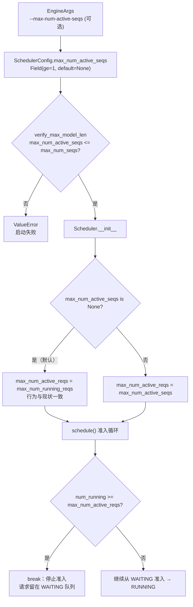

# PR #56758: [Scheduler] Add --max-num-active-seqs to cap RUNNING admission

> **作者**: @ChuanLi1101 | **状态**: OPEN | **日期**: 2026-09-14
> **Branch**: `ChuanLi1101:chuanli/max-num-active-seqs` → `vllm-project:main` | **Labels**: `rocm`, `scheduler`
> **变更规模**: +51 -1 行，涉及 5 个文件
> **Assignee**: @shen-shanshan | **Reviewers**: @Fangzhou-Ai, @shen-shanshan, @dllehr-amd

---

## 1. 总结 (Summary)

本 PR 为 vLLM V1 调度器新增可选的 `--max-num-active-seqs` 准入上限，将「模型执行容量」（per-request 缓冲区大小、CUDA Graph 捕获规模，由 `max_num_seqs` 决定）与「调度准入上限」（允许进入 RUNNING 状态的请求数）解耦。部署方可以在保持较大的 runner/graph 容量（避免重新捕获图和缩小静态缓冲区）的同时，将 decode 阶段的活跃请求数限制在更小的值。默认 `None` 时行为与现状完全一致（上限 = `max_num_seqs`）。

---

## 2. 背景与动机 (Background & Motivation)

当前 `max_num_seqs` 承担两个职责：

1. **执行容量**：决定 model runner 的 per-request 缓冲区大小、KV cache 预算与 CUDA Graph 捕获的 batch 档位；
2. **准入上限**：限制调度器从 WAITING 准入到 RUNNING 的请求数量。

这两个职责耦合带来的问题：如果想减小 decode batch（例如为了降低延迟、控制显存带宽竞争），只能调小 `max_num_seqs`，但这会触发 CUDA Graph 重新捕获（尤其在 ROCm 上 hipGraph 捕获非常耗时）并缩小静态缓冲区，成本高昂。

本 PR 通过引入独立的上限参数解决这一耦合。同时作者在描述中明确区分了它与 `--max-num-queued-reqs` 的差异：后者在 API server 层跨 DP rank 生效，超限返回 HTTP 503 拒绝请求；本参数只在单个 engine 内部限制 WAITING → RUNNING 的准入，请求会留在 WAITING 队列排队而非被拒绝。

PR 带有 `rocm` 标签、AMD reviewer（@dllehr-amd），assignee 为 ROCm 生态开发者，推测动机主要来自 ROCm 部署场景（小 decode batch 需求 + 图捕获成本高）。

---

## 3. 代码修改分析 (Code Change Analysis)

### 3.1 修改的模块

| 文件 | 操作 | 说明 |
|------|------|------|
| `vllm/config/scheduler.py` | 修改 | 新增 `SchedulerConfig.max_num_active_seqs` 字段（`int \| None`，`ge=1`，默认 `None`）；`verify_max_model_len()` 中新增校验：必须 `<= max_num_seqs`，否则抛 `ValueError` |
| `vllm/engine/arg_utils.py` | 修改 | `EngineArgs` 新增字段；注册 `--max-num-active-seqs` CLI 参数（scheduler group）；`create_engine_config()` 中传入 `SchedulerConfig` |
| `vllm/v1/core/sched/scheduler.py` | 修改 | `__init__` 中新增 `self.max_num_active_reqs`（未设置时回退为 `max_num_running_reqs`）；`schedule()` 准入循环的 break 条件由 `max_num_running_reqs` 改为 `max_num_active_reqs` |
| `tests/v1/core/test_scheduler.py` | 修改 | 新增 `test_max_num_active_seqs_caps_admission` 单元测试 |
| `tests/v1/core/utils.py` | 修改 | `create_scheduler()` 测试工具支持传入 `max_num_active_seqs` |

### 3.2 架构 / 流程图 (Architecture / Flow Diagram)

#### 配置流转与准入决策



#### 两个上限的分工

```mermaid
graph LR
    subgraph 执行容量（不变）
        MR["Model Runner 缓冲区"]
        CG["CUDA Graph 捕获档位<br/>1..max_num_seqs"]
        KV["KV cache 预算"]
    end
    subgraph 调度准入（新上限）
        ADM["max_num_active_reqs<br/>= max_num_active_seqs"]
        RUN["RUNNING 请求数上限"]
    end
    MNS["max_num_seqs"] --> MR
    MNS --> CG
    MNS --> KV
    ADM --> RUN
    style ADM fill:#f9f,stroke:#333
```

### 3.3 关键实现细节 (Key Implementation Details)

- **配置字段**（`vllm/config/scheduler.py`）：`max_num_active_seqs: int | None = Field(default=None, ge=1)`，pydantic 保证 ≥1；与 `max_num_seqs` 的大小关系在 `verify_max_model_len()` 中校验，越界直接抛 `ValueError` 拒绝启动。
- **调度器字段**（`vllm/v1/core/sched/scheduler.py:126-132`）：新增 `self.max_num_active_reqs`，`None` 时回退为 `max_num_running_reqs`，保证向后兼容。注释明确区分了「准入上限」与「model-runner slot 数」两个概念。
- **运行时唯一行为变更点**（`scheduler.py:872`）：准入循环的 break 条件从 `num_running >= self.max_num_running_reqs` 改为 `num_running >= self.max_num_active_reqs`。这是全部运行时改动（+8 -1），改动面极小。
- **计数口径不变**：`num_running = len(self.running) + self.num_waiting_for_streaming_input` —— 暂停的流式会话（WAITING_FOR_STREAMING_REQ）虽不在 `running` 中但仍占 model-runner slot，继续计入上限。
- **无抢占语义**：调低上限后不抢占已在 RUNNING 的请求，随请求完成自然收敛到新上限。
- **测试**：单测验证 `max_num_seqs=16, max_num_active_seqs=3` 时，10 个请求只有 3 个被准入，剩余 7 个留在 WAITING，且 `scheduler.max_num_running_reqs == 16`（执行容量不受影响）。

---

## 4. 涉及的技术原理 (Technical Principles)

### 4.1 vLLM V1 调度器的准入（Admission）机制

V1 调度器每个 step 从 WAITING 队列选取请求准入 RUNNING，准入上限由 `max_num_running_reqs`（即 `max_num_seqs`）控制。`max_num_seqs` 同时是 model runner 分配的 request slot 数——两者共享一个值正是本 PR 要解耦的问题根源。

### 4.2 CUDA Graph 捕获与 batch size 的关系

vLLM 在**每次引擎启动时**都会按 `cudagraph_capture_sizes` 捕获 CUDA Graph（档位由 `max_num_seqs` 派生：`[1, 2, 4] + range(8, 256, 8) + ...`，`max_num_seqs=128` 约 50 张图，`=16` 约 7 张）。注意：捕获在每次启动都发生，本 PR **并不能省去启动时的捕获时间**——改 `max_num_active_seqs` 重启同样重新捕获全套图。解耦的真正收益在于：调准入上限时捕获的图集内容与 buffer/KV 布局完全不变，各轮实验执行环境一致、可做干净的性能对比；而调 `max_num_seqs` 每轮实验都会改变捕获档位与静态缓冲区，性能对比被环境差异污染，且容量被永久缩小。另外注意 cap 生效期间 RUNNING 无法超过 cap，大容量只是"改 flag 即可释放"的储备，并非自动可用的突发余量。

### 4.3 与 `max_num_queued_reqs` 的区别

- `max_num_queued_reqs`：在 API server 层、跨 DP rank 生效，限制排队长度，超限**拒绝**请求（HTTP 503），由 `ApiServer` 执行。
- `max_num_active_seqs`：在单个 engine 内部调度器生效，只限制 WAITING → RUNNING 的**准入时机**，不拒绝请求，请求继续排队。

两者面向不同的部署诉求：前者是过载保护，后者是「小 decode batch + 大排队容量」的吞吐/延迟调优。

### 4.4 WAITING_FOR_STREAMING_REQ 的 slot 占用

V1 对「等待额外输入」的流式请求会暂停其执行但保留 model-runner slot（如聊天中间态等待下一段输入）。因此准入计数必须加上 `num_waiting_for_streaming_input`，否则会超分配 slot。本 PR 保留了这一既有口径。

---

## 5. 评论区讨论亮点 (Discussion Highlights)

- **@Fangzhou-Ai（COLLABORATOR）**：`Thanks @ChuanLi1101 LGTM! cc @shen-shanshan` —— 已给出 LGTM，并将球转给 assignee（@shen-shanshan）继续推进。
- **claude[bot]**：因 PR 来自 fork，自动 review 被禁用；维护者可评论 `@claude review` 触发一次性 review。
- 目前无行内 review comments，尚未出现设计争议或修改请求。

---

## 6. 风险与潜在问题 (Risk Analysis)

| 风险 | 严重程度 | 说明 |
|------|---------|------|
| **准入路径覆盖不全** | Medium | 仅主准入循环（`schedule()` 内的 while 循环）被 cap 约束。V1 调度器存在 connector 等旁路准入路径（如 HiSparseConnector 自行调度请求），这些路径是否绕过 `max_num_active_reqs` 未验证，可能导致实际 RUNNING 数超过上限。 |
| **流式会话饥饿** | Low | `num_waiting_for_streaming_input` 计入 cap。若 cap 设得很小且存在较多暂停的流式会话，可能占满名额导致新请求长期无法准入。这是既有语义的延续，但小 cap 下更容易触发，文档中应提示。 |
| **校验覆盖路径** | Low | `max_num_active_seqs > max_num_seqs` 的校验放在 `verify_max_model_len()` 中，若存在绕过该方法的构造路径（直接构造 `SchedulerConfig` 的第三方代码），非法值会静默通过。主路径（`create_engine_config`）安全。 |
| **与其他上限的交互** | Low | decode 阶段 token 上限 `max_num_scheduled_tokens` 与请求数上限并存，两者叠加的效果（如 chunked prefill 场景下两个 cap 的优先级）未单独测试。 |
| **文档缺失** | Low | 未同步更新 serving 相关文档中 `max_num_seqs` 的说明，用户可能混淆两个参数的语义差异。 |

---

## 7. 结论 (Conclusion)

PR #56758 是一个小而聚焦的调度器增强：以 +51 -1 行的改动解耦了「执行容量」与「准入上限」，默认行为完全向后兼容，配置校验与单元测试齐全，已获一位 collaborator 的 LGTM。主要待确认点是 connector 等旁路准入路径是否受 cap 约束，以及是否补充文档说明；整体质量良好，具备合入条件。
