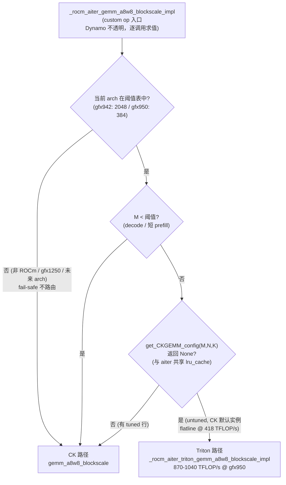
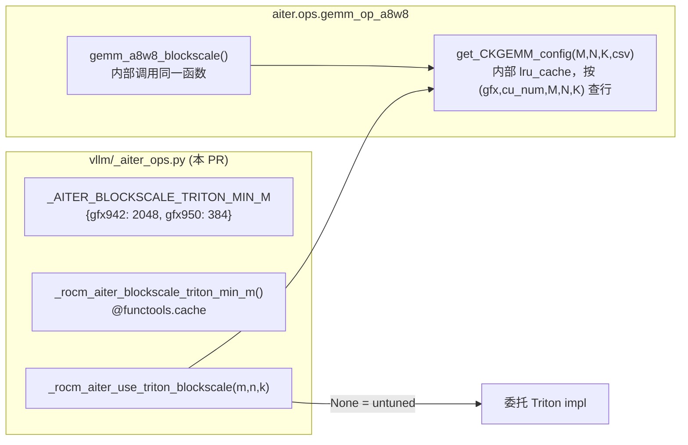

# PR #56812: [ROCm][Perf] Route untuned fp8 block-scale GEMMs to AITER Triton at large M

> **作者**: @ZhengGong-amd | **状态**: OPEN | **创建**: 2026-09-14 | **更新**: 2026-09-16
> **Branch**: `ZhengGong-amd:aiter-blockscale-triton-route` → `vllm-project:main` | **Labels**: `rocm`, `verified`
> **变更规模**: +44 -0 行，涉及 1 个文件（`vllm/_aiter_ops.py`）
> **Assignee**: @shen-shanshan | **Reviewers**: @tjtanaa, @AndreasKaratzas, @simondanielsson, @Fangzhou-Ai（参与讨论）

---

## 1. 总结 (Summary)

本 PR 解决 ROCm 平台上 aiter 的 fp8 block-scale GEMM（`gemm_a8w8_blockscale`）在**未调优 shape 上性能塌陷**的问题：当 `(M, N, K)` 不在 aiter 的 CK tuned 配置表中时，aiter 会在所有 M 值上跑同一个默认 CK 实例，在 prefill 尺寸下只能达到 418 TFLOP/s（gfx950），而 aiter 自带的 Triton block-scale kernel 可达 870–1040 TFLOP/s。PR 在 custom op 内部加入路由谓词，将「大 M + 无 tuned 配置」的调用委托给 Triton kernel。实测 Qwen3-14B-FP8 端到端吞吐 **+74%**（13.1k → 22.8–24.0k tok/s）。

**2026-09-16 重构**（回应 review 意见）：谓词从「`(N,K)` 级 CSV 成员判断」改为**直接调用 aiter 内部的 `get_CKGEMM_config(M, N, K)`**（与其共享 lru_cache，命中即免费且永不分歧），阈值从单一 384 改为 **per-arch 表 `{"gfx942": 2048, "gfx950": 384}`**（表中缺席的架构一律不路由）。同时作者将同一方案移植到 aiter 侧（**ROCm/aiter#5586**），本 PR 可能被其取代。

---

## 2. 背景与动机 (Background & Motivation)

aiter 的 `gemm_a8w8_blockscale` 从以 `(gfx, cu_num, M, N, K)` 为键的 CSV 表中选择 CK 实例。当 shape 缺失时，**它不搜索、也不做启发式回退**——在任意 M 下都跑同一个默认实例（无 `kernelName`、无 `splitK`），该实例无法在 prefill 尺寸的 M 下填满 MFMA 流水线。

这并非边角情况：gfx950/`cu_num=256` 上，**Qwen3-14B-FP8 的全部四个线性层 shape 都没有 tuned 行**：

| 层 | shape (N×K) | 状态 |
|----|------------|------|
| qkv | 7168 × 5120 | 未 tuned |
| o | 5120 × 5120 | 未 tuned |
| gate_up | 34816 × 5120 | 未 tuned |
| down | 5120 × 17408 | 未 tuned |

作者统计本地 27 个 fp8 checkpoint（`weight_block_size [128,128]`）在 TP ∈ {1,2,4,8} 下产生 **115 个 distinct (N,K)，其中 88 个在 gfx950/256 无 tuned 行**；补齐需要 ~3000 行 CSV 且**每种卡都要单独跑一遍 tuner**（gfx942/304 的 51 个 (N,K) 与 gfx950 的 69 个互不包含）。因此「补 config」解决不了普遍问题——本 PR 是**通用回退**：shape 一旦被 tune，谓词自动失效，两者互补而非竞争。

**实测数据**（作者微基准）：CK 默认实例在 M ≥ 512 后平坦化在 418 TFLOP/s；aiter 的 Triton kernel（按 M 分桶选配置）达 870–1040 TFLOP/s；但 decode 尺寸的 M 下 Triton 更慢，因此必须**逐调用**选择。

路由分支放在 custom op 内部而非调用方，是因为调用方会被 Dynamo 一次性 trace——分支若在调用方，会在 trace 时按当时看到的 shape 被冻结；custom op 对 Dynamo 不透明，每次调用重新求值。

---

## 3. 代码修改分析 (Code Change Analysis)

### 3.1 修改的模块

| 文件 | 操作 | 说明 |
|------|------|------|
| `vllm/_aiter_ops.py` | 修改 (+44) | 新增 per-arch 阈值表 `_AITER_BLOCKSCALE_TRITON_MIN_M`、`_rocm_aiter_blockscale_triton_min_m()`（缓存查询当前 arch 阈值）、路由谓词 `_rocm_aiter_use_triton_blockscale()`；在 `_rocm_aiter_gemm_a8w8_blockscale_impl` 中按谓词委托给 Triton impl |

> 注：初版（09-14）曾新增 `rocm_aiter_ops.is_blockscale_tuned()` 静态方法（复用 `_load_gemm_tuned_configs` 读 CSV），重构后已**整体移除**。

### 3.2 路由流程图

### 3.3 关键实现细节

**per-arch 阈值表（重构后核心）**
- `_AITER_BLOCKSCALE_TRITON_MIN_M = {"gfx942": 2048, "gfx950": 384}`——**表中缺席的架构一律不路由**（gfx1250/RDNA4 及未来架构 fail-safe 走 CK），满足 simondanielsson 提出的「gfx 特定阈值 / 仅 gfx950 生效」两个选项的组合。
- `_rocm_aiter_blockscale_triton_min_m()` 用 `@functools.cache` 缓存；非 ROCm 返回 `None`。

**谓词直接复用 aiter 的内部查询（重构后核心）**
- 谓词调用 `aiter.ops.gemm_op_a8w8.get_CKGEMM_config(m, n, k, csv)`，把返回 `None` 视为 untuned。该函数**正是 `gemm_a8w8_blockscale` 内部做的那次 `lru_cache` 查询**——vllm 侧的调用是 cache hit，零成本且**不可能与 aiter 实际行为分歧**。
- 判断粒度从 `(N,K)` 升级为 **`(M,N,K)` 精确匹配**：作者指出 gfx950 上 69 个 tuned (N,K) 中，2 个在任意大 M 都无行、13 个仅部分覆盖——旧代理会把这些 shape 留在降级路径上。
- 不再依赖 `_load_gemm_tuned_configs`：无 pandas、无 CSV 路径读取、无 (gfx,cu_num) 过滤——与 #55001 的重构范围不再重叠，也回应了 tjtanaa 对 CSV 读取性能的担忧。

**性能开销剖析（作者实测，回应 tjtanaa）**
- 旧版自读 CSV：39 ms 一次性（`functools.cache`），59 ns/cache hit；谓词 decode M 0.033 µs（M 短路，不查表）/ prefill M 0.205 µs = 所守护 1467 µs GEMM 的 **0.014%**。重构后 vllm 侧已无 CSV 读取。

**gfx942 阈值选择（作者双阈值对比实测，2× MI325X）**

| 配置 | 阈值 384 | 阈值 2048 |
|---|---|---|
| Qwen3-14B-FP8, 长 prefill | +11.7 % | **+14.1 %** |
| Qwen3.5-122B-A10B-FP8, 长 prefill | +4.9 % | **+7.9 %** |
| Qwen3-14B-FP8, 短 prefill | +6.2 % | 持平 |
| Qwen3.5-122B-A10B-FP8, 短 prefill | **−1.1 %** | 持平 |

2048 在两个长 prefill 配置上高 2.4–3.0 个百分点，并消除了 MoE 模型短 prefill 上可复现的 −1.1% 回归；代价是放弃 14B 短 prefill 的 +6.2%（M 达不到 2048，完全不路由）。作者认为该取舍正确：短 prefill 收益只出现在一个模型、在另一个模型为负，说明 384 抢走了本应属于 CK 的中 M 区间。方法学：3 对/配置、丢弃含 JIT 的首对、交替 arm 顺序，并设**零臂**（阈值 10⁹，可证明不路由）验证 harness 无偏（≤0.05%）。
- 作者同时指出交叉点**非单调**（aiter Triton 分桶所致，如 5120×17408 的 Triton/CK 比值 1.73→1.36→0.98→1.27→1.02→0.90→1.14），「存在一个阈值使所有 shape 都安全」无解；1024 是下一个候选（约 25 分钟测量）。

**CUDA Graph**：`cudagraph_capture_sizes` 覆盖到 512 及以上，`FULL_AND_PIECEWISE` 模式下 Triton kernel 被捕获进 graph；FULL 捕获无错误，数字均来自该配置。

---

## 4. 涉及的技术原理 (Technical Principles)

### 4.1 FP8 Block-scale 量化 GEMM

Block-scale FP8 量化中，权重和激活按块（如 128×128）共享 scale（`As`/`Bs`），GEMM 计算 `A_fp8 × B_fp8` 后按块 rescale 回 bf16。decode 时 M = batch（瘦高型），prefill 时 M = batch × tokens（胖型），最优 kernel 配置差异巨大，这正是需要逐调用路由的原因。

### 4.2 aiter 的 CK Tuned 表与 MFMA 流水线

aiter 为 block-scale GEMM 维护 `(gfx, cu_num, M, N, K)` 键的 CSV tuned 表（`get_CKGEMM_config` 精确查行，仅带 gl∈{0,1} 的 M padding 回退）。gfx950 的 MFMA 指令依赖足够的 M 填满流水线；默认 CK 实例没有针对大 M 的 splitK 配置，prefill 尺寸下利用率极低。aiter 的 Triton 实现按 M 分桶选择 `BLOCK_SIZE_M`，大 M 下接近硬件峰值，但存在糟糕的 `BLOCK_SIZE_M=256` 分桶（M∈(128,256] 比 CK 慢 1.3–4.8 倍）——这就是阈值必须设在 384 而非 256 的原因。

### 4.3 torch Custom Op 与 Dynamo 的交互

`torch.library` 注册的 custom op 对 Dynamo 不透明——trace 时不内联其 Python 实现。因此在 op 内做基于运行时 shape 的分支，可以在同一个编译图里实现「decode 走 CK、prefill 走 Triton」的动态调度；分支若放在被 trace 的调用方，会被固化成 trace 时 shape 对应的固定路径。

### 4.4 gfx94x 的 e4m3fnuz 与 per-arch 阈值

MI300/MI325（gfx942）的 FP8 是 `e4m3fnuz` 变体，与 gfx950 的 `e4m3` 不同；且 gfx942 上 CK 默认实例并不平坦（250–300 TFLOP/s vs gfx950 的 418），Triton 上限 ~330，收益天花板 ~1.15× vs gfx950 的 2.35×。因此同一阈值不能跨 arch 使用——重构后的 per-arch 表正是把 gfx950 实测的 384 与 gfx942 实测的 2048 分开编码。

### 4.5 CUDA Graph 捕获

captured 尺寸（≤512）下每个 batch size 一张图，分支在捕获时解析一次、M 每图固定，replay 一致性有保证；>512 的 piecewise prefill 走 eager，谓词逐调用生效。作者确认 FULL 捕获无错误。

---

## 5. 评论区讨论亮点 (Discussion Highlights)

### 作者自证：对 NVIDIA 零影响（四条独立防线）

1. `AiterFp8BlockScaledMMKernel` 只出现在 block-scale 注册表的 `PlatformEnum.ROCM` 条目；
2. `is_supported()` 在非 ROCm 下返回 false；
3. `register_ops_once()` 非 ROCm 直接返回，op 根本不注册；
4. 谓词自身短路 `is_rocm()`。

### @Fangzhou-Ai：能否把改动放进 aiter 的 config 而不是 vLLM？

作者回应：补 config 修复已知 shape 是对的，但覆盖不了普遍情况——27 个本地 fp8 checkpoint × TP∈{1,2,4,8} 产生 115 个 (N,K)，88 个 untuned，补齐需 ~3000 行且每卡一跑。本 PR 是通用回退，shape 一旦被 tune 谓词自动失效，两者互补。

### @simondanielsson 澄清意图 → 作者移植到 aiter（ROCm/aiter#5586）

simondanielsson 澄清 Fangzhou-Ai 的意思是**把启发式回退放进 aiter 的 `gemm_a8w8_blockscale` 内部**，vLLM 继续盲调即可。作者照做：同样的谓词与两个阈值放进 aiter 的 entry point，**本 PR 的 diff 在 aiter PR 合并后可以整体消失**。移植过程发现一个关键事实：**非 preshuffle 入口的 `libtype` dispatch 只接受 `ck`/`cktile`（否则 assert）**——只有 `gemm_a8w8_blockscale_bpreshuffle` 支持 `libtype == "triton"`。也就是说「补 config 把 shape 指向 Triton」在这条路径上**从来就不可用**，回退必须是一个代码路径而非数据。作者在 aiter 侧重测（vLLM 双 arm 均用 pristine upstream）：**+78.5% 中位数**（vs 本 PR 的 +74.0%），dispatch 边界在 M=384 精确、两 kernel 一致到 ≤1 bf16 ULP、baseline 三次运行稳定在 0.02%。

### @tjtanaa：关注 CSV 读取性能

作者给出剖析数据：旧版 39 ms 一次性 / 59 ns per hit / 谓词占 GEMM 的 0.014%；重构后 vllm 侧已无 CSV 读取（复用 aiter 的 lru_cache）。

### 当前状态

- 作者明确表示：**本 PR 保留作为 fallback，若 maintainer 不愿等 aiter 发版可随时关闭**，happy either way。
- simondanielsson：倾向于只留 aiter PR，等其他人表态。
- 代码已重构（+44），但 **PR 描述仍是初版内容**（仍写 `is_blockscale_tuned()`、「M >= 384 且 (N,K) 无 tuned 配置」、「gfx942 未测试」）——与当前代码不符；作者已声明行为变化后正在重跑 e2e 数据，Test Result 表格预期会更新。

---

## 6. 风险与潜在问题 (Risk Analysis)

| 风险 | 严重程度 | 说明 |
|------|---------|------|
| **PR 描述与代码脱节** | Medium | 代码已重构（per-arch 阈值 + `get_CKGEMM_config`），但 PR body 仍描述旧设计（`is_blockscale_tuned()`、(N,K) 判断、单一 384 阈值、「gfx942 未测试」）。作者已声明正在重跑 e2e，若合入时描述未同步，会误导后续读者。 |
| **阈值仍是启发式，交叉点非单调** | Low/Medium | 作者明确指出 gfx942 上 Triton/CK 比值随 M 非单调（aiter Triton 分桶所致），任何单一阈值都无法保证所有 shape 安全。2048 是「净收益最大」的工程取舍而非严格最优；1024 尚未测。若未来出现新 shape/新分桶，阈值可能再次错配。 |
| **双重维护（vLLm PR vs aiter PR）** | Medium | 同一谓词现在存在于两个仓库（本 PR 与 ROCm/aiter#5586）。若 aiter PR 先合并而 vLLm 侧忘记关闭本 PR，会出现**双路由**（vllm 谓词 + aiter 内部回退同时存在）——虽结果一致但逻辑冗余、维护负担翻倍。作者已表态可随时关闭本 PR，但需要 maintainer 决策。 |
| **依赖 aiter 内部 API `get_CKGEMM_config`** | Low | 相比初版（pandas 读 CSV + (gfx,cu_num) 过滤），现在复用的是 aiter 内部函数而非数据文件——若 aiter 重构该函数签名/语义，vllm 侧会静默拿到不同结果。但这恰好也是 aiter 自身 `gemm_a8w8_blockscale` 的查询路径，两者同生共死；且 simondanielsson 认可的 #55001 重构方向一致。 |
| **无自动化测试** | Medium | PR 仍无任何单元/集成测试；vLLM CI 无 gfx950/gfx942 硬件，回归防护为零。作者以 micro + e2e + control + 零臂实验替代，说服力强但不可持续防护。 |
| **精度微小漂移引发贪心解码分叉** | Low | 两 kernel 输出最大绝对差 1.9e-6（bf16），足以翻转接近打平的 argmax。gsm8k 指标在噪声范围内（flexible 0.8484→0.8423，strict 0.8863→0.8870）。 |
| **e2e 数字待重跑** | Low | 当前 body 里的 +74% e2e 数据来自初版实现；重构改变了路由粒度（(N,K)→(M,N,K)）与 gfx942 阈值，作者正在重跑。在数字更新前，引用 gfx942 相关数字应以重构后测量（+14.1%/+7.9% 等）为准。 |

---

## 7. 结论 (Conclusion)

PR #56812 经过一轮高质量 review 迭代后已显著成熟：从「(N,K) CSV 判断 + 单一阈值」重构为「复用 aiter 内部 `get_CKGEMM_config` 精确 (M,N,K) 查询 + per-arch 阈值表」，解决了 M 维度覆盖、gfx942 错配、CSV 性能三个实质问题，并主动把方案移植到 aiter 侧（ROCm/aiter#5586，实测 +78.5%）。当前的主要悬念是**归属决策**——maintainer 需要在「vLLM 侧回退（本 PR）」与「aiter 侧回退（#5586）」之间二选一（作者倾向后者、simondanielsson 亦倾向后者）；无论哪种选择，合入前都应同步 PR 描述、更新重构后的 e2e 数字。
