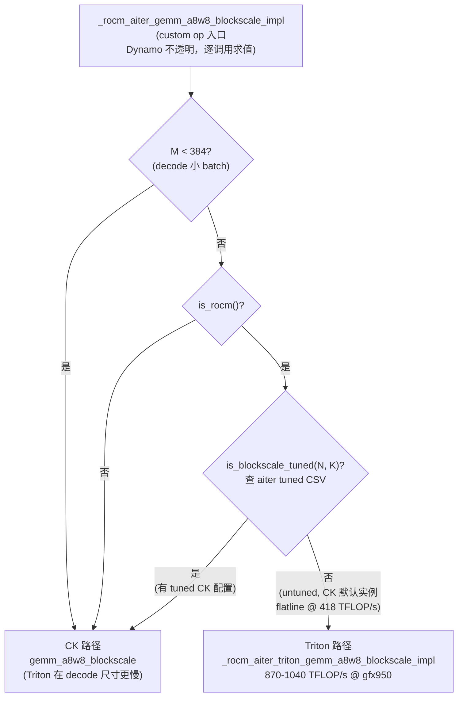
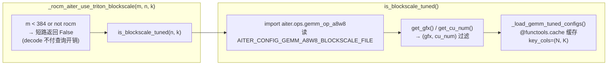

# PR #56812: [ROCm][Perf] Route untuned fp8 block-scale GEMMs to AITER Triton at large M

> **作者**: @ZhengGong-amd | **状态**: OPEN | **日期**: 2026-09-14
> **Branch**: `ZhengGong-amd:aiter-blockscale-triton-route` → `vllm-project:main` | **Labels**: `rocm`, `verified`
> **变更规模**: +32 -0 行，涉及 1 个文件（`vllm/_aiter_ops.py`）
> **Assignee**: @shen-shanshan | **Reviewers**: @tjtanaa, @AndreasKaratzas

---

## 1. 总结 (Summary)

本 PR 解决了 ROCm 平台上 aiter 的 fp8 block-scale GEMM（`gemm_a8w8_blockscale`）在**未调优 shape 上性能塌陷**的问题：当 `(N, K)` 不在 aiter 的 CK tuned 配置表中时，aiter 会在所有 M 值上跑同一个默认 CK 实例，在 prefill 尺寸下只能达到 418 TFLOP/s（gfx950），而 aiter 自带的 Triton block-scale kernel 可达 870–1040 TFLOP/s。PR 在 custom op 内部加入路由谓词 `_rocm_aiter_use_triton_blockscale()`：当 `M >= 384` 且 `(N, K)` 无 tuned 配置时改走 Triton kernel，decode 尺寸（M < 384）仍走 CK。实测 Qwen3-14B-FP8 端到端吞吐 **+74%**（13.1k → 22.8–24.0k tok/s），微基准中位数 +54.2%，且对已 tuned 的模型（如 Qwen3-Next-80B-A3B）是可证明的 no-op。

---

## 2. 背景与动机 (Background & Motivation)

aiter 的 `gemm_a8w8_blockscale` 从一张以 `(gfx, cu_num, M, N, K)` 为键的 CSV 表中选择 CK 实例。当某个 shape 不在表中时，**它不会搜索、也不做启发式回退**——`gemm_op_a8w8.py` 在任意 M 下都跑同一个默认实例（无 `kernelName`、无 `splitK`），该实例无法在 prefill 尺寸的 M 下填满 MFMA 流水线。

这并非边角情况。在 gfx950 / `cu_num=256` 上，aiter 自带的 tuned 表中 **Qwen3-14B-FP8 的全部四个线性层 shape 都没有条目**：

| 层 | shape (N×K) | 状态 |
|----|------------|------|
| qkv | 7168 × 5120 | 未 tuned |
| o | 5120 × 5120 | 未 tuned |
| gate_up | 34816 × 5120 | 未 tuned |
| down | 5120 × 17408 | 未 tuned |

这意味着该模型的每个 block-scale GEMM 都走了降级路径，aiter 每次启动都会打印 `not found tuned config ... will use default config!` 的警告。

**实测数据**（作者微基准）：
- CK 默认实例在 M ≥ 512 后**平坦化在 418 TFLOP/s**；
- aiter 的 Triton block-scale kernel（按 M 分桶选配置）可达 **870–1040 TFLOP/s**；
- 但在 decode 尺寸的 M 下 Triton 反而更慢，因此必须**逐调用**做选择，不能一刀切。

路由分支放在 custom op 内部而非调用方，是因为调用方会被 Dynamo 一次性 trace——分支若在调用方，会在 trace 时按当时看到的 shape 被冻结，无法在运行期按 M 动态切换；而 custom op 对 Dynamo 是不透明的，每次调用都会重新求值。

---

## 3. 代码修改分析 (Code Change Analysis)

### 3.1 修改的模块

| 文件 | 操作 | 说明 |
|------|------|------|
| `vllm/_aiter_ops.py` | 修改 (+32) | 新增 `_rocm_aiter_use_triton_blockscale()` 路由谓词；在 `_rocm_aiter_gemm_a8w8_blockscale_impl` 中按条件委托给 Triton impl；在 `rocm_aiter_ops` 类中新增 `is_blockscale_tuned()` 静态方法 |

### 3.2 路由流程图

### 3.3 关键实现细节

**路由谓词（`_aiter_ops.py:861-866`）**
- 常量 `_AITER_BLOCKSCALE_TRITON_MIN_M = 384`。
- 谓词逻辑：`m < 384` 或非 ROCm 平台直接返回 `False`；否则返回 `not is_blockscale_tuned(n, k)`——即**只有"大 M + 未 tuned"才路由到 Triton**。

**custom op 内的委托（`_aiter_ops.py:879-884`）**
- 在 `_rocm_aiter_gemm_a8w8_blockscale_impl` 内部调用 `_rocm_aiter_triton_gemm_a8w8_blockscale_impl(A, B, As, Bs, output_dtype=output_dtype)`。
- 代码注释明确说明分支必须在 op 内：Dynamo 会 trace 调用方，分支在调用方会在 trace 时冻结在第一个看到的 shape 上。

**阈值为何是 384 而不是 256**
- aiter 的通用 Triton 配置有一个糟糕的 `BLOCK_SIZE_M=256` 分桶，覆盖 M ∈ (128, 256]，该区间 Triton 比 CK 慢 1.3–4.8 倍；M 更大时回到 `BLOCK_SIZE_M=64`。
- 作者对两个 impl 头对头实测，四个 shape 的交叉点都落在 (256, 320]，因此取 384 = 悬崖 + 余量。

**`is_blockscale_tuned()`（`_aiter_ops.py:3312-3325`）**
- 是已有 `is_blockscale_bpreshuffle_tuned()` 的「非 preshuffle」姊妹方法，复用 `_load_gemm_tuned_configs()` 及 `(gfx, cu_num)` 过滤，因此判断是**按卡**（per-card）而非按架构——同一架构下不同 CU 数的卡 tuned 表不同。
- loader 有 `@functools.cache`，且 `M < 384` 在它之前短路，decode 路径完全不为查询付费。

**影响面收敛**
- 只有 aiter tuned 表中缺失的 shape 才会改变行为；aiter 自带 per-model tuned CSV（`ds_v3`、`qwen3_235b`、`qwen3_next_80b_a3b`、`qwen3_vl_*`、`dsv4` 等）覆盖的模型是惰性的。
- RDNA4/gfx1250 上 `use_triton` 已为 true，调用方直接走 Triton op，不会进入 CK impl；非 ROCm 平台 `register_ops_once()` 根本不注册该 op。

---

## 4. 涉及的技术原理 (Technical Principles)

### 4.1 FP8 Block-scale 量化 GEMM

Block-scale（或 per-block）FP8 量化中，权重和激活按块（如 128×128）共享一个 scale（`As`/`Bs`），GEMM 计算 `A_fp8 × B_fp8` 后按块 rescale 回 bf16。相比 per-tensor scale，block-scale 精度更高，是 Qwen3 系 FP8 模型的默认量化方式。这类 GEMM 的形状在 decode 时是「瘦高」型（M = batch × 1 token），在 prefill 时是「胖」型（M = batch × 数百到数千 token），两者的最优 kernel 配置差异巨大。

### 4.2 aiter 的 CK Tuned 表与 MFMA 流水线

aiter（AMD 的 ROCm 推理 kernel 库）为 block-scale GEMM 维护一张 CSV tuned 表，键为 `(gfx, cu_num, M, N, K)`，值为 Composable Kernel (CK) 实例参数（`kernelName`、`splitK` 等）。gfx950 的 MFMA（Matrix Fused Multiply-Accumulate）指令依赖足够的 M 来填满流水线；默认 CK 实例没有针对大 M 的 splitK 配置，导致 prefill 尺寸下计算单元利用率极低（418 TFLOP/s 的平坦线）。aiter 的 Triton 实现按 M 分桶选择 `BLOCK_SIZE_M`，在大 M 下能接近硬件峰值。

### 4.3 torch Custom Op 与 Dynamo 的交互

`torch.library` 注册的 custom op 对 `torch.compile`/Dynamo 是不透明的——trace 时不会内联其 Python 实现。因此在 custom op 内部做基于运行时 shape 的分支，可以在同一个编译图里实现「decode 走 CK、prefill 走 Triton」的动态调度；若分支放在调用方（被 trace 的模型代码里），Dynamo 会把它固化成 trace 时看到的 shape 所对应的固定路径。这正是本 PR 把分支放进 `_rocm_aiter_gemm_a8w8_blockscale_impl` 的原因。

### 4.4 gfx94x 的 e4m3fnuz 差异

MI300/MI325（gfx942）的 FP8 是 `e4m3fnuz` 变体（无 inf/nan，有限值域），与 gfx950 的 `e4m3` 不同。vLLM 中 `is_fp8_fnuz()` 为 true 的平台上，现有的 `is_triton_gemm_w8a8_tuned()` 白名单只放行 gfx950/RDNA4，block-scale 一直走 CK。本 PR 的谓词不检查 fnuz，因此会在 gfx94x 上「新增」把 e4m3fnuz 送入 Triton kernel 的行为——这是作者明确列出的未决问题。

### 4.5 CUDA Graph 捕获

`cudagraph_capture_sizes` 可达 512 且包含阈值以上的尺寸，在默认 `FULL_AND_PIECEWISE` 模式下 Triton kernel 会被捕获进 graph 而非只在 piecewise prefill 路径上 eager 执行。作者确认 FULL 捕获无错误，且上述端到端数字均来自该配置。

---

## 5. 评论区讨论亮点 (Discussion Highlights)

### 作者自证：对 NVIDIA 零影响（四条独立防线）

针对「是否会影响 CUDA 平台」的隐忧，作者给出证明而非测量：

1. **后端候选**：`AiterFp8BlockScaledMMKernel` 只出现在 block-scale 注册表的 `PlatformEnum.ROCM` 条目中；
2. **is_supported 拒绝**：CUDA 上 `is_linear_enabled()` / `is_rdna_linear_enabled()` 均为 false；
3. **op 不存在**：`register_ops_once()` 在非 ROCm 上直接返回，`torch.ops.vllm.rocm_aiter_gemm_a8w8_blockscale` 根本不会被注册；
4. **谓词短路**：`_rocm_aiter_use_triton_blockscale` 自身也检查 `is_rocm()`。

### 作者补测：MI325X (gfx942) 的性能与阈值错配

作者在 2× MI325X 上补测了此前未测的 gfx942：

- **精度无影响**：GSM8K 5-shot strict 0.8650 → 0.8628（标准误 ±0.94 分）；op 层面两 kernel 最大 |Δ| 3.1e-5。
- **吞吐净收益**：Qwen3-14B-FP8 **+11.7%**（10493 → 11718 tok/s），Qwen3.5-122B-A10B-FP8 **+4.3%**（11855 → 12379 tok/s）。
- **但 384 阈值是 gfx950 校准的**：gfx942 上 CK 默认实例并不平坦（250–300 TFLOP/s，对比 gfx950 的 418），Triton 上限约 330，收益上限只有 ~1.15×；且实测 10 个 shape 中有 6 个在 M ∈ [384, 1024) 区间 **Triton 反而更慢**（小 N 或大 K 的 shape 要到 M=2048–4096 才反超）。
- 作者给出的三个选项：① 保持现状（净赢，e2e 已证）；② 加 `not current_platform.is_fp8_fnuz()` 把范围锁回 gfx950（放弃 +11.7%/+4.3%）；③ gfx942 用 ~2048 的 per-arch 阈值（保留大 M 收益、避开亏损区间）。
- 另有一个关键事实：tuned 集合是 **per-card** 的——gfx942/304 有 51 个 tuned (N,K)，gfx950/256 有 69 个，且互不包含（Qwen3-14B 的 qkv/o 在 gfx942 tuned、在 gfx950 untuned）。

### Reviewer @simondanielsson 的三条意见

整体评价 "Nice work!"，但提出：

1. **建议等 #55001 合并后改用 aiter utils**：`is_blockscale_tuned()` 直接 import aiter 内部模块并读 CSV，而 PR #55001 正在把这类逻辑收敛进 aiter 官方 utils；
2. **阈值策略**：倾向于「gfx 特定阈值」或「仅对 gfx950 回退到 Triton」（即 384 阈值不应无条件应用到 gfx94x）；
3. **微基准范围**：建议进一步微基准以确定哪些 shape 走 Triton 真正有利（当前只对四个 Qwen3-14B shape 做了 head-to-head）。

---

## 6. 风险与潜在问题 (Risk Analysis)

| 风险 | 严重程度 | 说明 |
|------|---------|------|
| **gfx942 阈值错配导致短 prefill 回归** | Medium | 384 阈值是 gfx950 校准的。gfx942 实测 10 个 shape 中 6 个在 M ∈ [384, 1024) 输给 CK（小 N / 大 K 的 shape 要到 M=2048–4096 才反超）。短 prefill 负载下该区间占比高，可能净回归。作者提供了三个修复选项（保持 / 锁 gfx950 / per-arch 阈值 ~2048），待 reviewer 定夺。 |
| **依赖 aiter 内部 API 的脆弱性** | Medium | `is_blockscale_tuned()` 直接 `import aiter.ops.gemm_op_a8w8` 并访问 `AITER_CONFIGS.AITER_CONFIG_GEMM_A8W8_BLOCKSCALE_FILE`、`get_gfx()`、`get_cu_num()`。aiter 版本升级若改动这些内部符号会导致 ImportError/AttributeError。simondanielsson 已建议等 #55001 合并后改用 aiter 官方 utils。 |
| **Triton kernel 首次 JIT 编译** | Low | Triton kernel 首次使用需 JIT 编译（作者微基准用 200 次迭代 warmup 吸收）。生产环境中首次 prefill 会有一次性延迟尖峰；作者确认 CUDA graph FULL 捕获正常，但捕获前的 eager warmup 路径是否必然触发编译未在文中明确。 |
| **无自动化测试** | Medium | PR 未添加任何单元/集成测试（+32 行纯实现代码）。vLLM CI 无 gfx950 硬件，回归防护为零；`is_blockscale_tuned()` 的 CSV 读取逻辑（含 `@functools.cache`）在 CI 上无法被执行。作者以精心设计的 micro + e2e + control 实验替代，说服力强但不可持续防护。 |
| **精度微小漂移引发贪心解码分叉** | Low | 两 kernel 输出最大绝对差 1.9e-6（bf16），足以翻转接近打平的 argmax，导致部分 prompt 的 greedy 输出与旧路径不同。gsm8k 指标在噪声范围内（flexible 0.8484→0.8423，strict 0.8863→0.8870），作者明确说明文本 diff 不是正确的测试方式。对追求 bit-exact 复现的用户是行为变化。 |
| **per-call 谓词开销** | Low | 谓词在每次 GEMM 调用时求值。decode（M<384）路径被短路，不付 CSV 查询成本；prefill 路径首次查询后有 `@functools.cache`，后续为字典查找。开销相对 GEMM 本身可忽略。 |

---

## 7. 结论 (Conclusion)

这是一个小而精准的性能 PR：32 行代码 + 非常扎实的实测证据链（微基准对照组、e2e 三组交叉配对、可证明 no-op 的 control 模型、噪声地板标定、精度验证），在 gfx950 上为 Qwen3-14B-FP8 带来 **+74%** 的端到端吞吐提升，且影响面被严格收敛到「untuned shape + 大 M」。合入前需要解决两个开放问题：gfx942 上 384 阈值是否错配（作者已给出数据和三个选项），以及是否等待 #55001 合并后改用 aiter 官方 utils 以降低内部 API 依赖风险。
