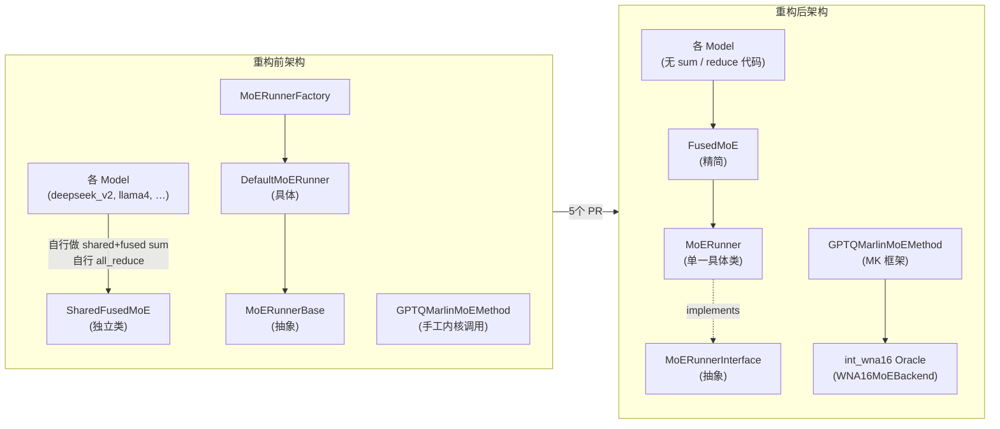
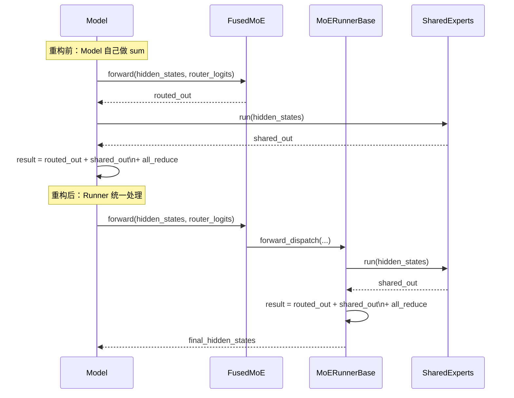
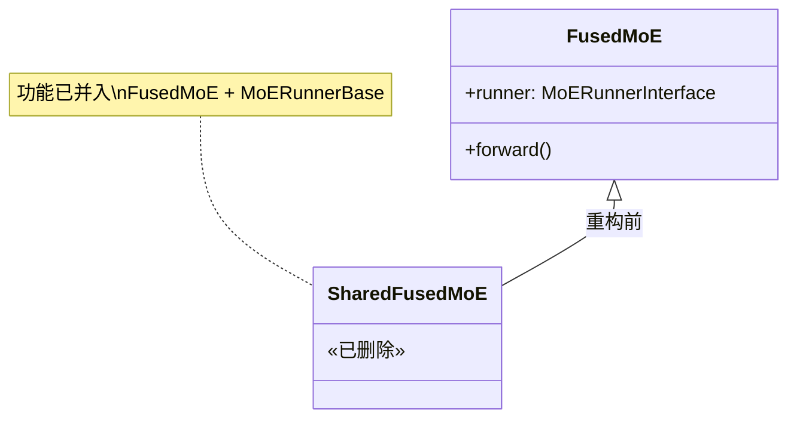
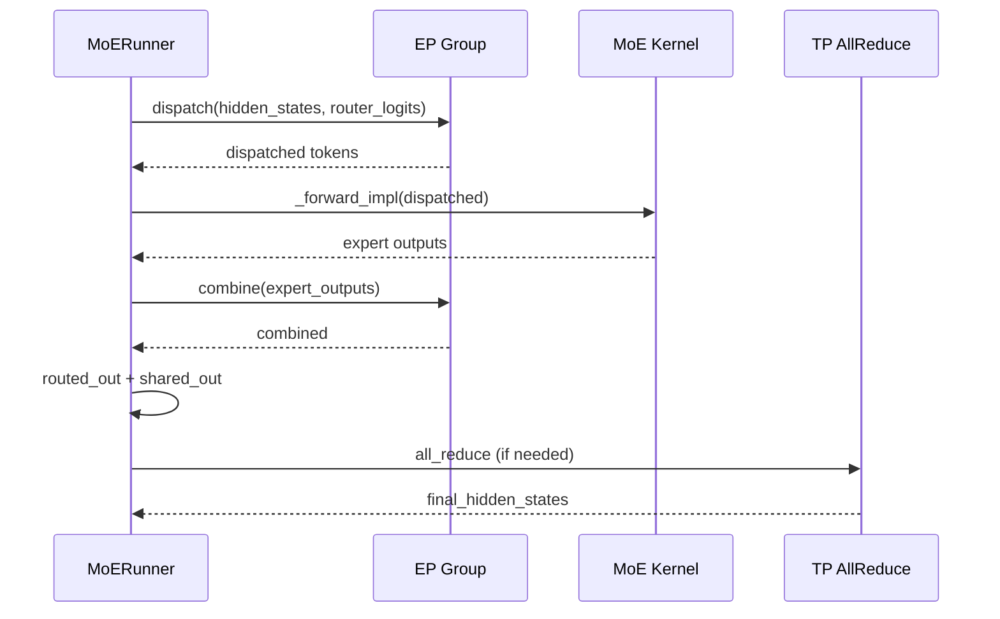

# vLLM MoE Refactor 系列 PR 综合报告

> **涉及 PR**：#35949 · #35782 · #40560 · #40671
> **作者**：@bnellnm（主要）、@jikunshang（#37990）
> **状态**：全部 MERGED
> **总变更量**：+1996 -2003 行，涉及约 120+ 文件

---

## 1. 总结 (Summary)

本系列五个 PR 共同构成 vLLM MoE（Mixture of Experts）模块的一次系统性重构。其核心目标是将**分散在各 Model 文件中的 MoE 输出聚合逻辑**、**冗余的中间类**、以及**手工管理的量化内核调用**，统一收归到 MoE 基础设施层（Runner / Oracle），从而降低各模型实现的重复代码，并为后续用单一 `MoERunner` 完全替代 `FusedMoE` 类做铺垫。

---

## 2. 各 PR 逻辑演进脉络 (Evolution Story)



| PR | 核心动作 | 净删减 |
|----|---------|--------|
| #35949 | 将 shared/fused 输出求和与 TP all_reduce 从 ~30 个 model 文件移入 `MoERunnerBase` | -377 行 |
| #35782 | 删除 `SharedFusedMoE` 类，更新全部 model import | -29 行 |
| #40560 | 合并 `MoERunnerBase` + `DefaultMoERunner` + `MoERunnerFactory` → 单一 `MoERunner` | -106 行 |
| #40671 | 将 `FusedMoE.make_expert_params_mapping` 改为模块级函数，铺垫删 `FusedMoE` 类 | +156 行（大量 import 更新） |

---

## 3. PR #35949 详细分析

### 3.1 修改目标

将 **shared expert 输出** 与 **routed expert 输出** 的求和逻辑，以及最终的张量并行（TP）`all_reduce`，从散布于约 30 个 Model 文件的 `forward()` 方法中，集中移入 `MoERunnerBase`。

### 3.2 修改的模块

| 文件 | 变化 |
|------|------|
| `runner/moe_runner_base.py` | +175 -86：新增 `_unpack()`、`routed_output_transform`、`routed_scaling_factor`，统一 reduce 逻辑 |
| `runner/moe_runner.py` | +1 -12：删除 `must_reduce_shared_expert_outputs` 等已移走的抽象方法 |
| `runner/shared_experts.py` | +0 -18：删除 `_maybe_reduce_shared_out` 方法 |
| `fused_moe/layer.py` | +28 -32：移除 `reduce_results` 参数，新增 `routed_output_transform` / `apply_routed_scale_to_output` |
| `fused_moe/shared_fused_moe.py` | +2 -6：`forward()` 返回值从 `tuple` 简化为单 `Tensor` |
| 约 38 个 model 文件 | 删除各自的 `hidden_states + shared_expert_output` 求和与 `all_reduce` 代码 |

### 3.3 关键实现



- 新增 `_unpack()` 工具函数，将 `tuple | Tensor` 拆分为 `(shared_out, routed_out)`
- `apply_routed_scale_to_output=True` 时，`routed_scaling_factor` 不再作用于 topk_weights，而作用于最终输出（避免 FP16 数值溢出问题）
- 删除了 `reduce_results: bool` 这一容易被误用的参数

### 3.4 GSM8K 正确性验证

在 16 个 MoE 模型上通过了 GSM8K eval，多数模型分数持平或小幅提升，无明显退化。

---

## 4. PR #35782 详细分析

### 4.1 修改目标

删除 `SharedFusedMoE` 类——在 #35949 完成后该类已无存在必要。

### 4.2 修改的模块

| 文件 | 变化 |
|------|------|
| `fused_moe/shared_fused_moe.py` | 删除全部 25 行实现代码 |
| `fused_moe/__init__.py` | 移除 `SharedFusedMoE` 导出 |
| 约 27 个 model 文件 | `from ...shared_fused_moe import SharedFusedMoE` → `from ...layer import FusedMoE` |
| `distributed/elastic_ep/elastic_execute.py` | 适配新接口 |
| `distributed/device_communicators/base_device_communicator.py` | 移除 `must_reduce_shared_expert_outputs` 相关调用 |
| `vllm/utils/__init__.py` | 新增 13 行工具函数（辅助 import 迁移） |

### 4.3 类继承关系变化



---

## 5. PR #40560 详细分析

### 5.1 修改目标

在分块 MoE Runner（ChunkingMoERunner）被删除后，`MoERunnerBase`（抽象）与 `DefaultMoERunner`（具体唯一实现）的分层已无意义，将二者合并为单一 `MoERunner`。

### 5.2 文件变化

| 文件 | 变化 |
|------|------|
| `runner/moe_runner.py` | +679 -18：吸收了所有 `MoERunnerBase` + `DefaultMoERunner` 逻辑 |
| `runner/moe_runner_interface.py` | 新建 44 行：提取出纯抽象接口 `MoERunnerInterface` |
| `runner/moe_runner_base.py` | 删除（639 行全删） |
| `runner/default_moe_runner.py` | 删除（128 行全删） |
| `runner/moe_runner_factory.py` | 删除（47 行全删） |
| `fused_moe/layer.py` | `self.runner = create_moe_runner(...)` → `self.runner = MoERunner(...)` |

### 5.3 新架构

```mermaid
classDiagram
    class MoERunnerInterface {
        <<abstract>>
        +forward(hidden_states, router_logits) Tensor
        +is_internal_router() bool
        +shared_experts SharedExperts
        +_replace_quant_method(quant_method)
    }
    class MoERunner {
        +moe_config
        +router
        +quant_method
        +forward()
        +_forward_dispatch()
        +_forward_impl()
        -_maybe_dispatch()
        -_maybe_combine()
    }
    MoERunnerInterface <|-- MoERunner : implements
    FusedMoE --> MoERunner : runner: MoERunnerInterface
```

- 命名来自 @robertgshaw2-redhat 建议：具体实现叫 `MoERunner`，接口叫 `MoERunnerInterface`
- 工厂函数 `create_moe_runner()` 被彻底移除，改为 `FusedMoE.__init__` 中直接实例化 `MoERunner`

---

## 7. PR #40671 详细分析

### 7.1 修改目标

将 `FusedMoE.make_expert_params_mapping()`（类方法）重命名为模块级函数 `fused_moe_make_expert_params_mapping()`，为后续**删除 `FusedMoE` 类**做铺垫。

### 7.2 修改范围

| 文件 | 变化 |
|------|------|
| `fused_moe/layer.py` | +19：新增 `fused_moe_make_expert_params_mapping()` 模块级包装函数 |
| `fused_moe/__init__.py` | +2：导出新函数 |
| 约 50 个 model 文件 | `FusedMoE.make_expert_params_mapping(...)` → `fused_moe_make_expert_params_mapping(...)` |

### 7.3 改动模式

```python
# 重构前（类方法调用）
FusedMoE.make_expert_params_mapping(
    ckpt_gate_proj_name="gate_proj",
    ckpt_down_proj_name="down_proj",
    ckpt_up_proj_name="up_proj",
    num_experts=self.num_experts,
)

# 重构后（模块级函数）
from vllm.model_executor.layers.fused_moe import fused_moe_make_expert_params_mapping
fused_moe_make_expert_params_mapping(
    ckpt_gate_proj_name="gate_proj",
    ckpt_down_proj_name="down_proj",
    ckpt_up_proj_name="up_proj",
    num_experts=self.num_experts,
)
```

---

## 8. 涉及的技术原理 (Technical Principles)

### 8.1 MoE 并行执行模式

vLLM 中 MoE 层需同时处理 **Tensor Parallel（TP）** 和 **Expert Parallel（EP）** 两种并行维度。`SharedExperts`（类 MLP 结构，不经过 router）和 `Routed Experts`（经过 Top-K router 分派的专家）的输出需最终求和；TP 场景下还需跨 rank 做 `all_reduce`。重构前这些操作由各 Model 实现，容易出现遗漏或重复。

### 8.2 MoERunner 的 dispatch/combine 机制



- `do_naive_dispatch_combine`：DP/EP 下当内核不支持 `internal_mk` 时走朴素分发合并路径
- PCP（Pipeline Communication Protocol）场景独立处理 `AgRsAll2All`

### 8.3 routed_scaling_factor 的溢出保护

部分 FP16 模型（如 DeepSeek 系列）的 `routed_scaling_factor > 1`，若在 topk_weights 处乘以该系数，中间激活值可能超出 FP16 范围。`apply_routed_scale_to_output=True` 将该系数推迟到最终输出处应用，规避溢出。

---

## 9. 评论区讨论亮点 (Discussion Highlights)

### PR #35949 – 输出求和移入 Runner

- **@robertgshaw2-redhat** 对 `must_reduce_shared_expert_output()` 的语义提出质疑：该函数在 `MoERunnerBase` 和 `RowParallelLinear` 中均有使用，含义不一致，容易写出逻辑反转的代码（如 `if not must_reduce: all_reduce()`）
- 讨论了 `apply_scale_to_output` 的命名，最终采用更明确的 `apply_routed_scale_to_output`
- @robertgshaw2-redhat 指出 GLM-4 的 `routed_scaling_factor=1.8` 如果没有显式 opt-in，会被静默忽略，建议将默认值设为 `1.0` 而非 `False`

### PR #40560 – 合并 Runner 层次

- @robertgshaw2-redhat 建议具体实现类不要叫 `DefaultMoERunner`，改为 `MoERunner`，接口叫 `MoERunnerInterface`；最终被采纳
- `gemini-code-assist` 机器人标记了三处高优先级 BUG：`_replace_quant_method` 未更新 `_fused_output_is_reduced`、FP16 无 shared experts 时 `routed_scaling_factor` 被忽略、TP 激活时 `shared_output is None` 触发断言

---

## 10. 风险与潜在问题 (Risk Analysis)

| 风险 | 严重程度 | 说明 |
|------|---------|------|
| `routed_scaling_factor` 静默失效 | 高 | 若新增支持 `routed_scaling_factor` 的 Model 未显式传入 `apply_routed_scale_to_output=True`，系数将被忽略（已知 GLM-4 曾遗漏） |
| FP16 + 无 shared experts + TP 组合 | 高 | PR #40560 中 `gemini` 标记：`fused_output_is_reduced=True` 且 `shared_output is None` 时触发断言崩溃 |
| `make_expert_params_mapping` 默认参数缺失 | 中 | PR #40671 中 `gemini` 指出新的模块级函数缺少 `ckpt_up_proj_name` 和 `num_experts` 的默认值，约 10 个 model 仅传 3 个参数调用会报 `TypeError` |
| 大范围 import 变更带来 merge 冲突 | 中 | 多个 PR 同时修改约 30-50 个 model 文件的 import，期间多次触发 merge conflict（已由 mergify 提示） |
| `ChunkingMoERunner` 删除后向兼容 | 低 | #40560 的前提是 ChunkingMoERunner 已被删除；若其他 fork 或插件依赖该类，需手动迁移至 `MoERunner` |

---

## 11. 结论 (Conclusion)

这 4 个 PR 构成一次结构清晰、目标明确的 MoE 重构：通过将输出求和与 TP reduce 上移到 Runner、合并冗余的类层次，显著减少了跨 Model 文件的重复代码，并为未来彻底用 `MoERunner` 替代 `FusedMoE` 打下了基础。整体代码质量提升明显，但需持续关注 `routed_scaling_factor` 在新模型中的正确传递。
