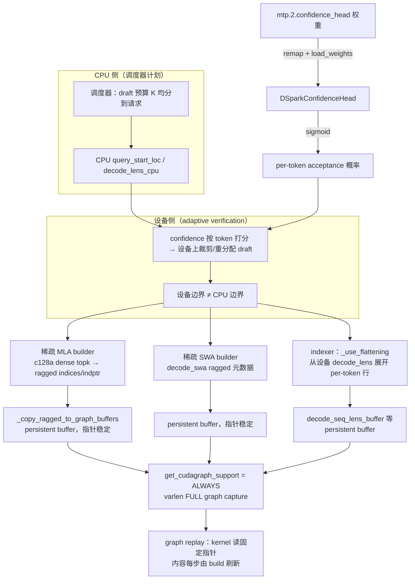
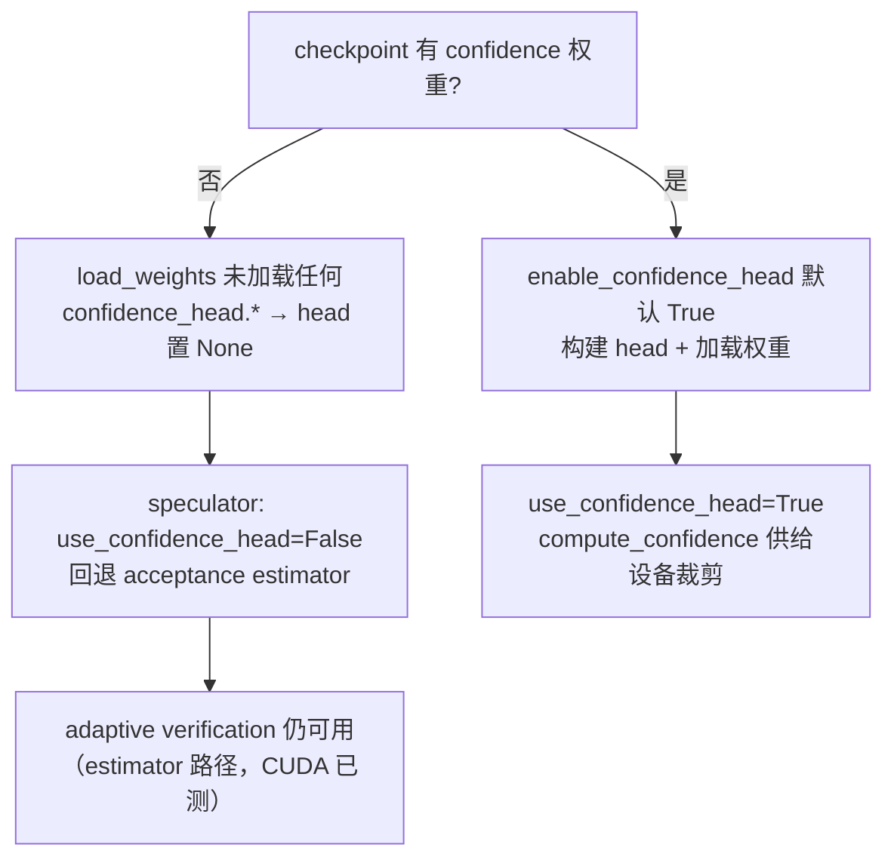

# PR #52362: [ROCm][DSv4] Enable DSpark adaptive verification

> **Author**: @tuukkjs | **State**: OPEN | **Date**: 2026-09-21（最近更新）
> **Branch**: `feature/dspark-confidence-rocm` → `main` | **Labels**: rocm, ready, deepseek, DSv4, dflash
> **Changes**: +725 -7 across 6 files | **ROCm 相关性**: 完全相关
> **CI**: GitHub checks 全绿（pre-commit / pre-run-check / Summary / Meta / Check format / DCO）；Buildkite AMD CI 已多次触发（最新 #90162），结果未公开可见；`mergeable: clean`
> 本报告分两部分：§1–6 为 PR 详细总结，§7–8 为 ROCm review 意见，§9 为可粘贴的英文评论。

---

## 1. 总结 (Summary)

本 PR 在 ROCm 上为 DeepSeek-V4 的 DSpark 推测解码启用 **confidence 调度的 adaptive verification**：新增 AMD 侧 confidence head 的构建、推理与 checkpoint 权重重映射（含无 confidence head checkpoint 的安全回退），并在启用 adaptive verification 时把 ROCm DSv4 稀疏 MLA / 稀疏 SWA 元数据构建器声明为支持 varlen FULL CUDA graph（`AttentionCGSupport.ALWAYS`），同时把共享 indexer 的 per-token flattening 能力扩展到 ROCm DSv4 路径（由设备侧 decode 边界推导 request 归属）。改动本身不触及任何 kernel 数学：persistent buffer、ragged 元数据构建等基础设施已在 main 上（#52795 等）就位，本 PR 主要翻转能力开关并接通 confidence head。

## 2. 背景与动机 (Background & Motivation)

adaptive verification 会在设备上按 confidence 把固定的 draft 预算（K≤7）在请求间重新分配：高置信请求提前结束验证，省下的 token 额度给其他请求。这意味着 **CPU 侧的请求边界（`query_start_loc_cpu` / `decode_lens_cpu`）与设备侧最终边界不再一致**——任何依赖 CPU 边界规划元数据的后端都会算错。CUDA 侧（sm90/sm100 + DeepGemm）已有 flattening 支持；ROCm 侧此前缺三样东西：

1. AMD DSv4 DSpark 模型没有 confidence head（权重被 `_remap_dspark_name` 直接丢弃，且 `model.model.confidence_head` 属性不存在，speculator 的 `load_draft_model` 会读到不存在的属性）；
2. 稀疏 MLA / SWA 构建器的 `get_cudagraph_support` 只报 `UNIFORM_BATCH`，而 adaptive verification 的运行时检查（`adaptive_verification.py`）要求所有 target attention builder 报 `ALWAYS`，否则直接 `ValueError`；
3. 共享 indexer 的 `_use_flattening` 只对 CUDA 生效，ROCm 上 device/CPU 边界不一致的 batch 无法构建 indexer 元数据。

PR 的验证规模很大：8x MI350X SPEED-Bench 吞吐（TP8、并发 4–256）、8x MI355X ShareGPT 三臂吞吐表（no-spec / fixed K=7 / adaptive K≤7）、1319 样本 GSM8K 5-shot 三臂质量门（adaptive 0.9492 vs no-spec 0.9484，在一个标准误内）。作者 @tuukkjs 与 @larryli2-amd（MI350X 验证）共同完成。

## 3. 代码修改分析 (Code Change Analysis)

### 3.1 修改的模块

| 模块 | 文件 | 改动 |
|------|------|------|
| 模型（AMD DSpark） | `vllm/models/deepseek_v4/amd/dspark.py` (+28/-5) | 构建 `DSparkConfidenceHead`；`compute_confidence()` = sigmoid；`load_weights` 追踪 confidence 权重、缺失时回退置 `None`；`_remap_dspark_name` 支持 `mtp.2.confidence_head.*` → `model.confidence_head.*` |
| 元数据构建器（ROCm） | `vllm/models/deepseek_v4/amd/rocm.py` (+31) | MLA 稀疏 / SWA 稀疏两个 builder 的 `get_cudagraph_support`：adaptive 开启时返回 `ALWAYS`，否则回落父类（`UNIFORM_BATCH`） |
| 共享 indexer | `vllm/v1/attention/backends/mla/indexer.py` (+28/-1) | `DeepseekV4IndexerBackend` 在 ROCm 上支持 device/CPU query-lens mismatch；`DeepseekV41IndexerBackend` 显式不继承；新增 `_rocm_supports_flattened_device_query_lens()`（ROCm + DSv4 arch 门控）并接入 `_use_flattening` |
| 测试 | `tests/kernels/attention/test_rocm_triton_attn_dsv4.py` (+259/-1) | 新增 gfx950 GPU 测试：捕获真实 CUDA graph → 设备侧重分配 → 断言 persistent buffer 指针不变且 replay 结果正确 |
| 测试 | `tests/models/test_deepseek_v4_dspark_rocm.py`（新，+130） | 6 个 CPU 测试：confidence head 的 remap / 缺失回退 / 加载 / sigmoid / 无 head 报错 |
| 测试 | `tests/v1/attention/test_deepseek_v4_rocm_adaptive.py`（新，+249） | 策略测试：ALWAYS 声明、flattening 仅限 DSv4、单请求 uniform 路径保留、设备 lens 驱动的 buffer 重分配与 replay |

### 3.2 架构 / 流程图





### 3.3 关键实现细节

- **`get_cudagraph_support` override（rocm.py:448–461 / 529–541）**：只读 `speculative_config.enable_adaptive_verification`，adaptive 开启即 `ALWAYS`；关闭时回落父类 `UNIFORM_BATCH`（测试显式断言两种取值）。声明依赖的不变式是：全部 per-token 元数据由设备边界构建并拷贝进 persistent buffer，FULL graph 捕获的是 buffer 地址，replay 前每步 `build()` 刷新内容。
- **`build_for_cudagraph_capture`**：`metadata.for_cudagraph_capture = _ON_GFX950`（既有逻辑，未改动）——gfx950 上捕获路径走 sync-free split selector。
- **`compute_confidence`（dspark.py:368–377）**：`torch.sigmoid(confidence_head(head_hidden, markov_embed))`，接口与 `qwen3_dspark` / DSv4.1 AMD / DSv4 NVIDIA 的 sibling 实现一致；无 head 时抛带明确信息的 `RuntimeError`（比 sibling 的裸 `assert` 更清晰，且该路径在 speculator 的 `use_confidence_head` 门控下生产环境不可达）。
- **权重回退链（dspark.py:493–494）**：`load_weights` 遍历结束后若构建了 head 却一个 confidence 权重都没加载 → `self.model.confidence_head = None`；`_remap_dspark_name` 仅在 head 存在时才映射 confidence 权重（否则照旧丢弃）。speculator 侧 `use_confidence_head = enable_adaptive and model.model.confidence_head is not None`，缺失时回退 acceptance estimator。
- **indexer 能力收敛（indexer.py:239–246 / 265–269 / 820–826 / 846–855）**：`DeepseekV4IndexerBackend` 在 ROCm 上返回支持 mismatch；`DeepseekV41IndexerBackend` 显式回落到 V32 基类实现（保持 False），把能力严格限定在 DSv4；`_rocm_supports_flattened_device_query_lens` 同时要求 `is_rocm()` 与 `"DeepseekV4ForCausalLM" in architectures`——回应了 maintainer 评论"scope it to DSv4"。

## 4. 涉及的技术原理 (Technical Principles)

- **DSpark + adaptive verification**：DSpark 是 DeepSeek-V4 的 MTP 风格 draft 模型（复用 target 层激活 + Markov/confidence 双 head）。固定预算推测在低并发时浪费 draft 槽位；adaptive verification 用 per-token acceptance 概率（confidence head 输出经 sigmoid）在设备上把预算重新分配给最需要的请求，从而在高并发下提升吞吐。
- **device/CPU query-lens mismatch**：vLLM v1 的 `AttentionBackend.supports_device_cpu_query_lens_mismatch()`（基类默认 `not is_ssm()` = True，SSM 类显式 opt out）声明后端能否容忍"设备侧 `query_start_loc` 与 CPU 侧不一致"的 batch。只有 adaptive verification 会产生这种 batch；运行时检查在 `maybe_create_adaptive_verification_manager`（adaptive_verification.py:471）对所有 target attention group 逐后端核对，不支持的硬接线模型直接 `ValueError`。本 PR 之前，DSv4 的 indexer（V32 基类只认 CUDA sm90/sm100 + DeepGemm）会在 ROCm 上被该检查拦下。
- **varlen FULL CUDA graph 与 persistent buffer 纪律**：`UNIFORM_BATCH` 只允许等长 batch 的图捕获；`ALWAYS` 允许变长 FULL 图。FULL 图捕获的是 kernel 参数中的 buffer 地址，因此任何 capture 后可能变化的数据都必须落在**地址稳定**的 persistent buffer 里、内容每步刷新——这就是 `_copy_ragged_to_graph_buffers` 与 indexer 的 `decode_seq_lens_buffer` 等既有机制的用途。本 PR 的核心正确性声明（replay 安全）由新 gfx950 测试直接验证：重分配后 buffer 指针不变（显式断言 data_ptr 相等）、replay 输出与参考实现一致。
- **稀疏 MLA / SWA ragged 元数据（DSv4 C128A）**：DSv4 的稀疏 MLA 走 compress_ratio=128 的 C128A topk 路径，dense topk indices 由设备侧 kernel 产出后压成 CSR 风格 ragged（indices + indptr）供 aiter decode kernel 消费；SWA 同理。元数据构建发生在 capture 之外，因此图内无 Python 控制流（无 B3 类风险）。

## 5. 评论区讨论亮点 (Discussion Highlights)

1. **@ChuanLi1101（maintainer，5 点实质意见）**：
   - `_rocm_supports_flattened_device_query_lens()` 只是 `is_rocm()`，要求 scope 到 DSv4 → **已处理**：现要求 `"DeepseekV4ForCausalLM" in architectures`，且 V4.1 indexer 显式 opt out。
   - 性能数字需要 V2 + breakable CUDA graphs → 作者回应：V2 是功能性要求（V1 在配置期就因 dspark 不支持而报 `Value error`），breakable graphs 是性能要求；随后在 2026-09-20 用标准 ROCm nightly + V2 + breakable `FULL_AND_PIECEWISE` 全量重验。
   - MI355 上 adaptive 在 c4–c32 比 fixed K=7 慢 5–8% → 作者复测确认可复现（偏差 <1.05%），并做了因果 ablation：adaptive manager/重分配 -2.23%，varlen graph 等其他项分摊其余；c64 起反超。
   - 测试是 CPU mock、无 AMD CI job → 作者补了真实 gfx950 GPU graph-replay 测试（本 PR 的 `test_dsv4_adaptive_mla_swa_metadata_graph_replay`）——但见 §7 发现 ⚠️1：该测试仍无 CI 队列覆盖。
   - MI350 用私有 AITER wheel、nightly 需 `AITER_USE_CK_MOE_SORTING=1` → 作者改用标准 nightly + stock AITER 重验，PR body 已更新。
2. **@dllehr-amd**：APPROVED（"Looks good on my end"）。
3. **@mergify**：曾两次提示 merge conflict（08-21、09-20），当前 `mergeable_state: clean`，已解决。
4. **@claude[bot]**：fork PR 自动 review 未启用，需 maintainer 手动触发。

## 6. 风险与潜在问题 (Risk Analysis)

| 风险 | 严重程度 | 说明 |
|------|---------|------|
| 正确性 | 低 | 核心机制（persistent buffer、设备边界元数据）为 main 既有基础设施，本 PR 只翻转开关；gfx950 GPU replay 测试 + 三臂 GSM8K（1319 样本，分数差在一个标准误内）直接验证正确性 |
| 正确性 | 中 | gfx942 组合未验证：ALWAYS 声明与 flattening 均未按 arch 收敛，见 §7 ⚠️【兼容性】 |
| 性能 | 中 | 低并发（c4–c32）adaptive 比 fixed K=7 慢 4.7–8.3%，作者已确认并给出 ablation；MI350X 结果仅有截图无数值，见 §7 ⚠️【性能证据】 |
| 兼容性 | 低 | 无 confidence head 的 checkpoint 走回退链（head→None→`use_confidence_head=False`→acceptance estimator），与 CUDA 既有路径一致，且有 CPU 测试覆盖 |
| 测试覆盖 | 中 | gfx950 GPU 回归测试在 AMD CI 全部队列中被 `requires_gfx950` 跳过；`tests/models/test_deepseek_v4_dspark_rocm.py` 不在任何显式 CI 列表，见 §7 ⚠️【测试】 |
| 可维护性 | 低 | confidence-head 代码与 DSv4.1 AMD / DSv4 NVIDIA sibling 逐行对齐（孪生检查通过）；`compute_confidence` 用带消息的 `RuntimeError` 替代 sibling 的裸 assert，是更清晰的偏离 |

---

## 7. Review 意见 (Findings)

| 意见类型 | 数量 |
|---------|------|
| 🔴 必须修复 | 0 |
| ⚠️ 建议修复 | 3 |
| 📝 建议/备注 | 2 |

**⚠️【测试】gfx950 graph-replay 回归测试在 AMD CI 中无任何队列覆盖** `[已验证]`

- **问题**: 新测试 `test_dsv4_adaptive_mla_swa_metadata_graph_replay`（tests/kernels/attention/test_rocm_triton_attn_dsv4.py:1205 起，带 `@requires_gfx950` = skipif）只被 AMD CI "(MI300) Attention Kernels Shard" job 收集（.buildkite/test-amd.yaml:1769–1775，`agent_pool: mi300_1`，gfx942），在该队列上必然被跳过；main 上不存在任何跑 `kernels/attention` 的 MI355 测试 job（MI355 队列只有 benchmark/compile/distributed）。PR 也未改动任何 .buildkite 配置。另一个新文件 `tests/models/test_deepseek_v4_dspark_rocm.py` 不在任何显式 CI 文件列表中（`tests/v1/attention/test_deepseek_v4_rocm_adaptive.py` 有覆盖，test-amd.yaml:2858/4671 的 v1/attention shard job 会收集）。
- **影响**: 本 PR 最核心的正确性声明——ALWAYS + varlen FULL graph 捕获后设备侧重分配仍 replay 安全——只有作者手工验证防线，未来任何回归（如 persistent buffer 纪律被破坏、`_copy_ragged_to_graph_buffers` 语义变化）都不会被 CI 发现。这与 maintainer 评论"无 AMD CI job"的关切部分对应（作者补了测试但未接入 CI）。
- **行动**: 建议作者在 AMD CI 增加跑 `tests/kernels/attention/test_rocm_triton_attn_dsv4.py` 的 MI355 队列（或给现有 kernels/attention job 增加 gfx950 mirror），并把 `test_deepseek_v4_dspark_rocm.py` 加入显式 CI 文件列表。

**⚠️【性能证据】MI350X SPEED-Bench 验证只有截图、无任何数值** `[已验证]`

- **问题**: PR body 的 MI350X 段落引用两张图片，正文只有定性描述（"comparable performance at low concurrency and higher throughput at high concurrency"），没有像 MI355 段落那样的数值表。特别是低并发下 adaptive 相对 fixed K=7 的损失幅度（MI355 上为 -4.7% ~ -8.3%）在 MI350X 上未量化。
- **影响**: 截图不可检索、不可复算，maintainer 无法从文本判断 MI350X 上的退化幅度与 crossover 点；数字溯源规则下该段声明只能视为 `[unverified]`。
- **行动**: 建议作者补充与 MI355 段相同格式的 MI350X 数值表（含 adaptive vs fixed、adaptive vs no-spec 两列），把截图留作附录。

**⚠️【兼容性】ALWAYS 声明与 flattening 均未按 arch 收敛到已验证的 gfx950 范围** `[推测]`

- **问题**: `get_cudagraph_support` override（vllm/models/deepseek_v4/amd/rocm.py:448–461、529–541）与 `_rocm_supports_flattened_device_query_lens`（indexer.py:820–826）只按 `is_rocm()` 门控，不检查 gfx950；而同文件/同路径的关键行为是按 arch 分叉的：`for_cudagraph_capture = _ON_GFX950`（rocm.py:510）、ops 模块中 `adaptive_splits = _ON_GFX950 and ...`（rocm_aiter_mla_sparse.py:3455）。全部验证（MI350X / MI355X）都在 gfx950 上。
- **影响**: 若 DeepSeek-V4 能在 gfx942（MI300）上服务，adaptive verification 将以完全未验证的组合运行（ALWAYS varlen FULL 图 + `for_cudagraph_capture=False` + 无 adaptive_splits 选择器路径）；若 DSv4 ROCm 实际上 gfx950-only，则该声明对 gfx942 是误导性的死开关。两种情况都值得收敛。
- **行动**: 建议作者将 ALWAYS 声明（或至少 flattening 门控）加 `_ON_GFX950` 条件以匹配验证范围，或在注释/PR 描述中明确"DSv4 ROCm adaptive verification 仅支持 gfx950"。

**📝【设计】`DeepseekV4IndexerBackend.supports_device_cpu_query_lens_mismatch` 在 ROCm 上无条件返回 True** `[已验证]`

- **问题**: indexer.py:239–246 的 override 只查 `current_platform.is_rocm()`，不检查 adaptive verification 是否开启、也不检查 arch/model。当前两个调用点（backend.py:344 的 selector 分支、adaptive_verification.py:471 的运行时检查）都被 adaptive 门控，所以今天没有行为差异——但在非 adaptive 场景下"device/CPU query lens 可以不一致"这一能力声明并不成立（ROCm 非 adaptive 路径仍由 CPU 边界驱动元数据）。
- **影响**: 暂无运行时影响；但能力声明与实际路径不一致，未来任何新的（非 adaptive 门控的）调用点会静默误用该声明。
- **行动**: 建议作者把条件收敛为 `current_platform.is_rocm() and <adaptive verification 开启且为 DSv4 arch>`，与 `_use_flattening` 的实际激活条件保持一致。

**📝【注释/文档】model_runner.py:631 的注释与本 PR 依赖的回退链不符** `[已验证]`

- **问题**: main 上 `vllm/v1/worker/gpu/model_runner.py:631` 注释称 "The speculator clears the flag at load time when the checkpoint has no confidence head"——但我在 main 全树 grep 不到任何 load-time 清除 `speculator.enable_adaptive_verification` 的代码（只有 `use_confidence_head=False` 的降级，以及 warmup.py 里对 rejection_sampler 的临时清除）。本 PR 的"无 confidence head checkpoint 安全回退"正是依赖这条链：head→None 后 adaptive manager 仍会以 `enable_adaptive_verification=True` 创建，走 acceptance-estimator 路径。
- **影响**: 行为上可能仍是正确的（estimator 路径在 CUDA 上已被验证），但注释与代码不符会误导后续维护者对该回退语义的理解。这是 pre-existing 问题，不在本 PR diff 内。
- **行动**: 建议 review 时追问：无 confidence head + adaptive 开启时，manager 走 estimator 路径是否为设计意图？若是，顺带修正该注释（可另开 PR）。

## 8. 结论 (Verdict)

⚠️ **NEEDS WORK**（无阻断项；@dllehr-amd 已 approve）

核心设计经交叉验证成立：persistent buffer + 设备边界元数据是 main 既有基础设施，本 PR 只是翻转 capability 开关并接通 confidence head；`supports_device_cpu_query_lens_mismatch` 的两个消费点均被 adaptive 门控，V4.1 显式 opt out，能力范围收敛正确；confidence-head 代码与三个 sibling 实现逐行对齐（孪生检查通过），gfx950 graph-replay 测试与三臂 GSM8K 门直接验证了正确性主张。三个 ⚠️ 均非正确性阻断：gfx950 测试未接入 CI（覆盖缺口）、MI350X 数字只有截图、ALWAYS 声明未按 arch 收敛——建议作者在合并前处理或明确回应。

## 9. 英文 Review 评论 (Copy-Paste English Comments)

**C1** `tests/kernels/attention/test_rocm_triton_attn_dsv4.py:1205-1207` — ⚠️ comment

```text
This is the key regression test for the ALWAYS cudagraph declaration — real CUDA graph capture, device-side reallocation, and replay correctness. However, it is decorated with @requires_gfx950, and the only AMD CI job that collects tests/kernels/attention is the "(MI300) Attention Kernels Shard" job (agent_pool mi300_1, gfx942), where it is skipped. As far as I can tell, no MI355 queue runs this file, and this PR does not touch any .buildkite config — so the core replay-safety claim is currently only covered by manual validation.

Could you add an MI355 CI job (or a gfx950 mirror for the kernels/attention job) that runs tests/kernels/attention/test_rocm_triton_attn_dsv4.py, and also add tests/models/test_deepseek_v4_dspark_rocm.py to an explicit CI file list? Otherwise future regressions in the persistent-buffer discipline will go unnoticed.
```

**C2** `vllm/models/deepseek_v4/amd/rocm.py:448-461` — ⚠️ comment

```text
This override returns AttentionCGSupport.ALWAYS on any ROCm architecture when adaptive verification is enabled, but the surrounding machinery is gfx950-gated: metadata.for_cudagraph_capture is set to _ON_GFX950 in build_for_cudagraph_capture, and the adaptive-splits selector in rocm_aiter_mla_sparse.py is also gated on _ON_GFX950. All validation in this PR is on MI350X/MI355X (gfx950).

If DeepSeek-V4 can be served on gfx942 (MI300), this enables a completely unvalidated combination there (ALWAYS varlen FULL graphs with for_cudagraph_capture=False and no adaptive splits). If DSv4 ROCm is effectively gfx950-only, the declaration is misleading for gfx942. Consider gating the ALWAYS return to gfx950 (matching _ON_GFX950 usage in this file), or stating explicitly that adaptive verification for DSv4 ROCm is gfx950-only.
```

**C3** `vllm/v1/attention/backends/mla/indexer.py:239-246` — 📝 comment

```text
On ROCm this now returns True unconditionally — without checking whether adaptive verification is enabled or whether the model is DeepSeek-V4. Today both consumers (the selector's use_adaptive_verification branch and the adaptive-verification manager check) are adaptive-gated, so there is no behavioral difference. But the capability claim "device/CPU query lens can disagree" is only actually true on the flattened adaptive path; on the non-adaptive ROCm path metadata is still CPU-boundary-driven.

Consider gating this to match the actual activation condition in _use_flattening (ROCm + adaptive verification + DeepseekV4ForCausalLM arch), so future non-adaptive-gated callers cannot silently misuse the capability declaration.
```
