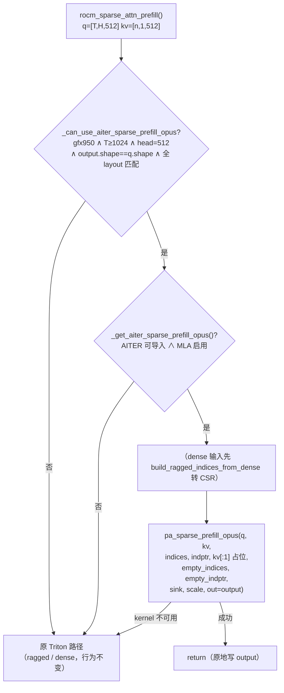

# PR #54855: [ROCm][Perf] Route large DSV4 sparse prefill to AITER OPUS

> **Author**: @jiacao-amd | **State**: OPEN | **Date**: 2026-09-02
> **Branch**: `jiacao-amd:codex/dsv4-sparse-prefill-opus` → `vllm-project:main` | **Labels**: `rocm`, `verified`, `DSv4`
> **Changes**: +321 -4 lines across 2 files | **ROCm 相关性**: 完全相关

## 1. 动机 (Motivation)

DeepSeek-V4 稀疏 MLA 的 prefill 目前在 ROCm 上由两个 Triton kernel 承担（ragged CSR 与 dense 2D 索引两条路径）。AITER 库为 gfx950（MI355X）提供了手工优化的 `pa_sparse_prefill_opus` kernel，在长 prompt 大 prefill 场景下明显快于 Triton。本 PR 不改动任何现有路径，而是在 `rocm_sparse_attn_prefill` 入口加一层条件路由：仅当请求规模足够大（≥1024 queries）、head_dim=512、dtype/layout/stride 全部匹配且 AITER 可用时走 OPUS，否则静默回退到原 Triton 路径。作者实测 MI355X 8 卡 TP8、DeepSeek-V4-Pro FP4、8k/1k 工作负载下端到端吞吐提升 +0.30% ~ +8.40%（并发 1 时最高），gsm8k 准确率与基线一致（0.9606）。

## 2. 代码改动总结 (Change Summary)

| 模块 | 改动 |
|------|------|
| `vllm/v1/attention/ops/rocm_aiter_mla_sparse.py` (+112/-4) | 新增 `_get_aiter_sparse_prefill_opus()`（cached 加载器，ImportError 静默降级）、`_can_use_aiter_sparse_prefill_opus()`（资格检查：gfx950、Q≥1024、head 512、bf16/fp16、stride/device 匹配、attn_sink 为 [H] fp32）、`_rocm_sparse_attn_prefill_ragged_aiter_opus()`（kernel 调用封装，返回 bool）；入口 `rocm_sparse_attn_prefill` 增加 OPUS 快速路径（dense 输入先转 CSR），并提前提取 `kv_flat`/`sliced_attn_sink` 供三条路径复用 |
| `tests/kernels/attention/test_rocm_triton_attn_dsv4.py` (+209) | 5 个新测试：阈值边界参数化（1023/1024 × gfx950 门控）、layout 拒绝、路由命中（monkeypatch 验证 int32 转换与空占位参数）、Triton 回退保持、gfx950 真实 kernel 数值正确性（atol/rtol 2e-2） |

核心路由决策：

## 3. Review 意见 (Findings)

| 意见类型 | 🔴 必须修复 | ⚠️ 建议修复 | 📝 建议/备注 |
|---|:---:|:---:|:---:|
| 数量 | 1 | 2 | 3 |

---

**🔴【测试】gfx950 真实 kernel 正确性测试从未运行，且 CI 仅跑了 pre-commit** `[已验证]`

- **问题**: PR 测试计划中最后一项 "Run the targeted OPUS correctness test on gfx950" 仍未勾选，作者自己也将其列为 ready 前提。`test_sparse_attn_prefill_ragged_aiter_opus` 带 `@requires_gfx950`，在当前所有 CI 队列上都会被跳过；同时 PR 挂着 `verified` 标签（"Run pre-commit for new contributors without triggering other tests"），check-runs 里只有 pre-commit / DCO / Summary 等，**连硬件无关的路由 monkeypatch 测试都没有在任何 CI 上跑过**，更没有任何 AMD 硬件队列。
- **影响**: 触发输入非常具体——gfx950 上 rope-free 的 DSv4 bf16/fp16 prefill、单 batch ≥1024 queries 时，生产路径会走一个**从未与参考实现比对过数值**的 kernel。gsm8k 0.9606 是间接证据，不能替代 kernel 级数值验证。aiter 占位参数（`kv[:1]`、empty indptr）的语义一旦与假设不符，将是静默数值错误而非报错。
- **行动**: 作者应当在其 MI355X 节点跑通 `test_sparse_attn_prefill_ragged_aiter_opus`（PR 自己列出的 ready 条件）并贴出结果，或请 maintainer 移除 `verified` 标签触发完整 CI（含 AMD 队列）。

**⚠️【兼容性】新 aiter 符号无上游 PR 链接与最低版本要求** `[已验证]`

- **问题**: `from aiter.ops.pa_sparse_prefill_opus import pa_sparse_prefill_opus` 是本 PR 新引入的 aiter 接口（已在 ROCm/aiter main 核实该符号存在，签名与调用一致），但 PR 描述未链接 aiter 侧引入该 op 的 PR，也未注明最低 aiter 版本。`try/except ImportError` 只兜住"符号不存在"，兜不住"符号存在但语义/签名漂移"。
- **影响**: 调用中第 5~7 个位置参数（`kv[:1]`、`empty_indices`、`empty_indptr`）依赖 aiter 的"两区域（paged prefix + flat extend）共享 softmax 累加器"接口语义——真实数据放在 prefix 区域、extend 区域留空。aiter 升级若改变该语义，vLLM 侧会静默得到错误结果。
- **行动**: 建议作者在 PR 描述中链接 aiter 侧 PR、注明最低版本，并用一行注释说明占位参数与两区域语义的对应关系。

**⚠️【性能】1024 queries 阈值无调优依据** `[已验证]`

- **问题**: `_GFX950_AITER_SPARSE_PREFILL_OPUS_MIN_QUERIES = 1024` 是硬编码阈值，PR 的 benchmark 表按并发（1~48）给出，**没有任何按 query 数扫描的数据**证明 1024 是 OPUS 反超 Triton 的临界点。
- **影响**: 阈值设置过低会让本应由 Triton 处理的请求付出 kernel 切换成本；过高则漏掉可加速的请求。并发 2 时增益仅 +0.30%，说明阈值附近的收益梯度平缓，选点敏感。
- **行动**: 建议作者补充 query 数维度的微基准数据或注明阈值的来源（如 aiter 侧推荐值）。

**📝【可维护性】OPUS 封装缺少 Triton 封装同款的输入形状断言** `[已验证]`

- **问题**: `_rocm_sparse_attn_prefill_ragged_triton`（line 2616）断言 `indptr.numel() == num_queries + 1` 且逐项检查 indices/indptr 的 ndim，而新的 `_rocm_sparse_attn_prefill_ragged_aiter_opus` 只做 int32/contiguous 转换，不做形状断言。
- **影响**: 当前生产数据（`attn_metadata.paged_kv_indices` 与 `build_ragged_indices_from_dense`）均由可信来源保证形状，风险低；但兄弟封装防御不一致，未来调用方误传时 OPUS 会直接 OOB 读而非报错。
- **行动**: 建议作者补上与 Triton 封装一致的 `indptr.numel() == q.shape[0] + 1` 断言。

**📝【设计/文档】实际生效范围比 PR 标题窄：仅 rope-free 配置** `[已验证]`

- **问题**: 唯一生产调用方 `backends/mla/rocm_aiter_mla_sparse.py:857` 分配 `output = torch.empty([T, H, self.kv_lora_rank])`，而 gate 要求 `output.shape == q.shape`（q 最后一维 = kv_lora_rank + qk_rope_head_dim）。因此 gate 通过 ⟺ `qk_rope_head_dim == 0`；对带 rope 的 DSv4 变体（如 kv_lora_rank=448 + rope=64，即 dsv4 测试文件所用几何），output 宽 448 ≠ 512，gate 必然拒绝——这是**安全的**（OPUS 的 `out` 契约是 [T,H,D=512]，直接写 448 宽缓冲会越界），但意味着这类配置永远享受不到该优化。同时 `_use_rocm_sparse_triton` 的 dispatch 本来就只对 `head_size == kv_lora_rank`（rope-free BF16）路径启用 Triton，与 gate 恰好自洽。
- **影响**: 无正确性风险；但 PR 描述 "Route eligible large DSV4 sparse prefill" 未说明这一范围限制，后续维护者可能误以为 rope 配置也走 OPUS。
- **行动**: 建议作者在 PR 描述中注明适用配置（gfx950 + rope-free + head 512 + 带 attn_sink）。

**📝【性能】benchmark 数字可追溯性不足** `[已验证]`

- **问题**: PR 的吞吐表附了完整环境（硬件、容器 `vllm/vllm-openai-rocm:nightly`、模型、TP8 拓扑、8k/1k 随机负载、10 req/slot、同节点 A/B），方法论可信，但没有附 benchmark 脚本/命令或 aiter 版本，数字无法独立复现。
- **影响**: 数字本身合理（非整、非夸张），但按"数字溯源"标准只能标 `[unverified]`。
- **行动**: 建议作者附上 benchmark 命令与 aiter commit/版本号。

## 4. 现有讨论 (Existing Discussion)

- **mergify（09-03）**: 提示存在 merge conflicts，要求 rebase；当前 head（1a190ae，09-09 推送）API 显示 `mergeable: true`，但 `mergeable_state` 仍为 `unstable`。
- **mergify（09-08）**: pre-commit 失败；作者已在 09-09 的推送中修复（head 的 pre-commit check 已绿）。
- **claude[bot]（09-02）**: fork PR 自动化 review 默认禁用，提示 maintainer 可评论 `@claude review` 触发一次性审查。
- 尚无人类 reviewer 的实质性意见；请求的 reviewer（@tjtanaa、@AndreasKaratzas）均为 ROCm 相关活跃维护者，选择恰当。

## 5. 结论 (Verdict)

🔴 **BLOCK** — 路由逻辑本身经交叉验证（aiter 符号存在且签名一致、gate 与生产调用方契约自洽、无 cudagraph/多流/越界风险、单元测试质量高），唯一且明确的阻断项是：**gfx950 上的 kernel 级数值正确性验证尚未完成**（PR 自述的 ready 前提），且 `verified` 标签导致连硬件无关的功能测试都未在 CI 运行。合入前必须跑通 `test_sparse_attn_prefill_ragged_aiter_opus` 并给出结果；其余 ⚠️/📝 项（aiter 版本链接、阈值依据、生效范围说明）建议一并补全。另注：分支名 `codex/...` 与 AI 辅助编码签名一致，建议 maintainer 审查时对 dispatch 边界与测试断言保持更高关注（本 PR 的测试覆盖恰好做得较扎实）。
