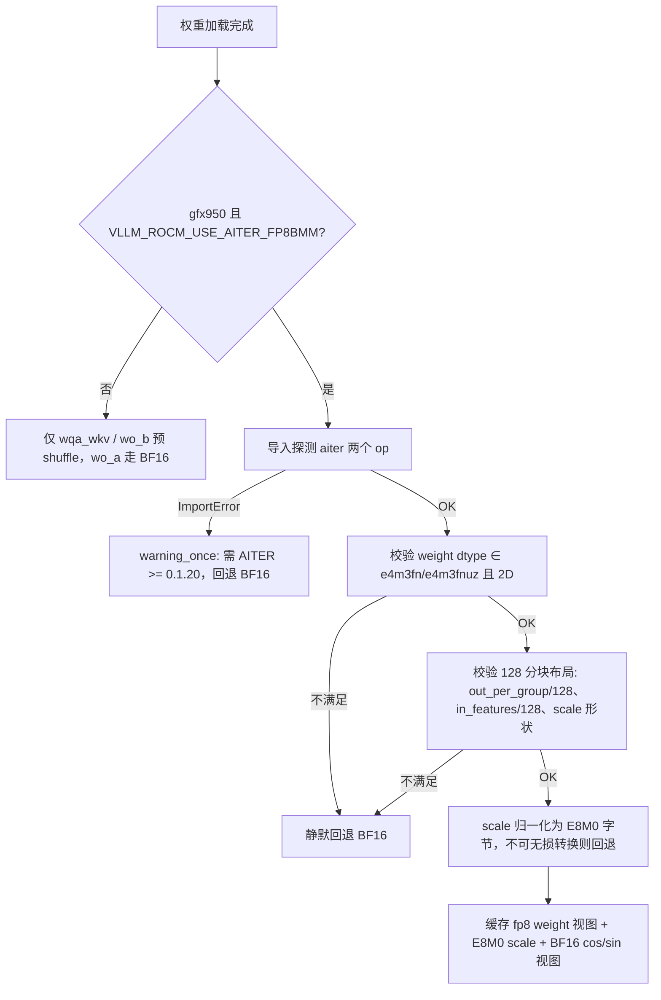
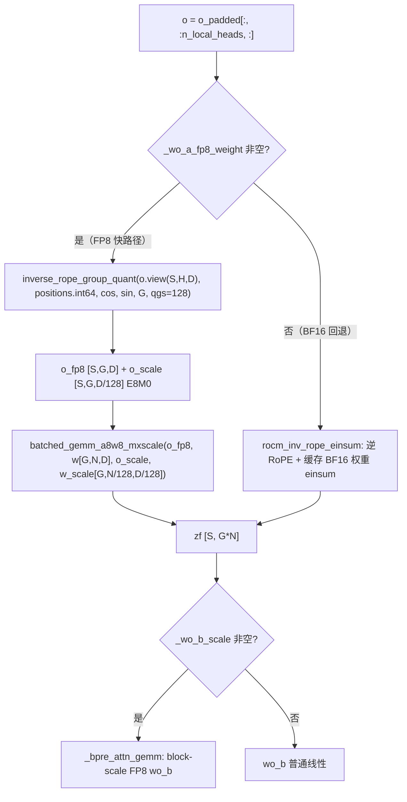

# PR #54894: [ROCm][DSV4][Perf] Use FP8 WO_A output projection

> **Author**: @LiuYinfeng01 | **State**: OPEN | **Date**: 2026-09-02 (updated 2026-09-19) | **Labels**: rocm, deepseek, verified, DSv4
> **Branch**: `rocm-dsv4-fp8-woa-mxscale` → `main` | **Changes**: +185 -11 across 2 files
> **ROCm 相关性**: 完全相关（DSV4 AMD 模型文件 + aiter FP8 算子，gfx950 专属路径）
> 本报告分两部分：§1–6 为 PR 详细总结，§7–8 为 ROCm review 意见。

---

## 1. 总结 (Summary)

本 PR 将 ROCm 上 DeepSeek V4 的 BF16 `wo_a` 输出投影路径（inverse RoPE + 分组 einsum）替换为 gfx950 上的 FP8 快路径：用 AITER 的 `inverse_rope_group_quant`（融合 inverse RoPE 与 per-token E8M0 分组量化）生成量化激活，再用 `batched_gemm_a8w8_mxscale` 与 checkpoint 原生 FP8 权重做 MX-scale 分组 GEMM。BF16 路径完整保留为回退；权重/scale 布局不满足 128 分块要求、AITER 版本过旧或非 gfx950 设备均自动回退。实测 8×MI355X：TP1/PP8 下 100K prefill TTFT **-7.35%**、输入吞吐 **+7.93%**；decode TPOT **-1.85%~-3.39%**；GSM8K 全量精度与 BF16 参考持平（甚至略高）。

## 2. 背景与动机 (Background & Motivation)

DSV4 的 attention 输出投影采用 MLA 式分组低秩结构：`o [S, n_local_heads, head_dim]` 先做 inverse RoPE（把 RoPE 分量反旋回可压缩表示），再按 `n_local_groups` 分组经 `wo_a`（每组 `o_lora_rank` 维）投影，最后过 `wo_b` 回到 hidden_size。此前 ROCm 路径（#45103 引入）把 FP8 权重反量化成 BF16 缓存后走 `torch.einsum` 分组 GEMM——每步一次大 K 的 BF16 GEMM，HBM 流量是 FP8 的两倍。checkpoint 本身以 FP8 存储 `wo_a`（每 128×128 block 一个 E8M0 scale），BF16 einsum 等于白白付了低精度存储的成本却吃 BF16 的带宽。

AITER ≥ 0.1.20（经 #52826 合入 main，bump 至 0.1.21.post1）新增了 MX-scale 分组 GEMM 与融合 quant 算子，使「权重保持 FP8 + 激活一次性融合量化」成为可能。本 PR 的价值：消除 BF16 分组 einsum、免去每步权重反量化，且完整保留回退路径，风险可控。

## 3. 代码修改分析 (Code Change Analysis)

### 3.1 修改的模块

| 模块 | 改动 |
|------|------|
| `vllm/models/deepseek_v4/amd/rocm.py` (+141 -11) | 核心：新增 `_wo_a_block_scale_to_e8m0()` 转换函数；`_prepare_fp8_wo_a()` 加载期校验并缓存 FP8 权重/E8M0 scale/cos-sin 缓存；`_o_proj()` 增加 FP8 快路径分支 |
| `tests/models/test_deepseek_v4_rocm_wo_a.py`（新增 +44） | 单测：E8M0 转换函数的正例/保留字节/非法输入拒绝 |

### 3.2 架构 / 流程图

加载期决策（`process_weights_after_loading` → `prepare_attn_preshuffle`）：



前向执行（`_o_proj`）：



### 3.3 关键实现细节

- **`_wo_a_block_scale_to_e8m0()`**（rocm.py:45）：把 checkpoint scale 归一化为 OCP UE8M0 原始字节。`float8_e8m0fnu`/`uint8` 直接按字节透传（`view(torch.uint8)`，避免数值转换）；浮点输入仅在**恰好是 2 的幂**时无损编码（`round(log2)` 后 `exp2` 还原比对），拒绝 0/负/非有限/越界（byte>254）。与 vLLM 生态 `_upcast_e8m0_to_fp32`（fp8_utils.py:1073，`byte << 23` 直写 fp32 指数字段）互为逆运算，字节约定一致。
- **`_prepare_fp8_wo_a()`**（rocm.py:614）：加载期执行。try/except ImportError 探测 aiter op 可用性（唯一有日志的回退分支）；校验 weight 2D、dtype ∈ {e4m3fn, e4m3fnuz}、`out_features == groups*out_per_group`、`out_per_group % 128 == 0`、`in_features % 128 == 0`、scale 形状 `(out/128, in/128)`；成功后缓存 3D 权重视图（无拷贝，不双份 pin）与 cos/sin BF16 缓存（优先复用 `cos_sin_cache_bf16` buffer，否则加载期一次性转换副本）。
- **`_o_proj()` 快路径**（rocm.py:823-849）：`inverse_rope_group_quant` 输出 `o_fp8 [S,G,D]` + row 布局 `o_scale [S,G,D/128]`；`batched_gemm_a8w8_mxscale` 消费 `w_scale [G,N/128,D/128]`，输出 `[S,G,N]` 展平后与 BF16 路径汇合进入同一 `wo_b` 尾部——两条路径的 `zf` 形状与下游处理完全一致（无孪生分歧）。
- **门控**：复用现有 `VLLM_ROCM_USE_AITER_FP8BMM`（envs.py:148，语义就是 "Controls FP8 batched matrix multiply"，默认 True），叠加 `_ON_GFX950`（platforms/rocm.py:216 模块级常量）——无新 env var，符合 HK 要求。

## 4. 涉及的技术原理 (Technical Principles)

- **DSV4 输出投影与 inverse RoPE**：注意力输出 `o` 的头维 768 中仅前 128 维（`qk_rope_head_dim`）带 RoPE。wo_a 做低秩分组投影前需要把 RoPE 分量**反旋**（inverse GPT-J RoPE），否则旋转后的分量无法被静态权重有效压缩。BF16 参考路径把这一步做成 Triton kernel（`_fused_inverse_rope_gptj`），本 PR 则把它与量化融合成一次 pass。
- **OCP MX E8M0 scale（UE8M0）**：无符号 8-bit 纯指数格式，bias 127，字节 b 表示 `2^(b-127)`，0xFF 保留为 NaN——这是 OCP Microscaling Formats (MX) v1.0 §5.4.1 的厂商中立编码，vLLM 的 `_upcast_e8m0_to_fp32` 与其互逆。注意与 HIP 文档 "1 sign + 7 exp" 的表面描述不同：vLLM/DSV4 生态实际按无符号指数使用（`fp8_utils.py` 注释明确 "exponent-only UE8M0 scales (e.g. DeepSeek-V4)"）。
- **MX-scale 分组 GEMM**：区别于经典 per-tensor FP8（单 scale），本路径采用「per-token × 128 组激活 scale + per-128×128 block 权重 scale」的 MX 约定；gfx950 有对应的 `V_MFMA_SCALE_F32_16x16x128_F8` 硬件路径，aiter 侧按 (g, m, n, k) 查调优表 dispatch 到 OPUS kernel（未命中则走默认 config）。
- **为什么更快**：快路径把「BF16 分组 einsum（2× 字节流量）+ 每步权重反量化」替换为「一次融合 quant+inverse-RoPE pass + 8-bit GEMM」；权重始终保持 checkpoint 原生 FP8，加载期还省去了 BF16 缓存副本。TP1/PP8 下 wo_a GEMM 的 N 维为 96×512（TP8 下仅 12×512），GEMM 占比更大，故 TP1/PP8 收益（+6~7%）显著高于 TP8/PP1（+0.5~1.9%）——与实测拓扑趋势吻合。

## 5. 评论区讨论亮点 (Discussion Highlights)

- **@Fangzhou-Ai**：初版 100 题 GSM8K 分数看似低于 baseline，要求跑全量 1319 题。作者补了全量结果（0813 checkpoint：FP8 94.92% vs BF16 93.93%，0/1 invalid；老 `DeepSeek-V4-Pro` checkpoint 复测：双路径均 94.7688%、0 invalid）——已解决。
- **@shen-shanshan（reviewer，3 条）**：① 整体 "Overall LGTM, left some minor suggestions"，并要求补充 **TPOT** 而非仅 TTFT/吞吐——作者在老 checkpoint 上补测了 4 档并发的 decode TPOT 表（TPOT -1.85%~-3.39%、输出吞吐 +1.89%~+3.23%）——已解决；② 行内评论（line 63）要求解释 E8M0 转换规则依据——作者回复了 HIP low_fp_types 文档链接 + 数据流 ASCII 图，并在 docstring 中补充了 OCP MX spec §5.4.1 引用——已解决；③ 行内评论（line 654）"We should add some info about the failure reason, instead of directly return them"——作者在该线程的回复内容为 decode 性能表，**当前 head 代码中 `_prepare_fp8_wo_a` 的各校验失败分支仍为静默 return，未加任何失败原因日志**——未解决（见 §7 第一条 finding）。
- 作者方法论透明度高：PR 描述完整记录了 vLLM commit、ROCm nightly digest、AITER commit、FlyDSL 版本、镜像 ID、A/B 门控方式，明确标注两次测量基于不同 checkpoint（0813 vs 老 DeepSeek-V4-Pro）、冷启动 run 剔除规则，以及 AI 辅助（Cursor）声明。

## 6. 风险与潜在问题 (Risk Analysis)

| 风险 | 严重程度 | 说明 |
|------|---------|------|
| 快路径回退完全静默，诊断困难 | Medium | 见 §7 ⚠️【可维护性】；含 reviewer 未解决的 line 654 评论 |
| 快路径无自动化测试覆盖 | Medium | 见 §7 ⚠️【测试】；单测仅覆盖 E8M0 转换函数，主路径依赖手工验证 |
| rope 维度隐式依赖 aiter 算子内部假设 | Low | 见 §7 ⚠️【设计】；DSV4 族固定 128，暂无实际触发 |
| ModelOpt MXFP8 命名变体的 checkpoint 静默走回退 | Low | 见 §7 📝【兼容性】；仅性能损失，无正确性问题 |
| e4m3fn（非 fnuz）dtype 被门控接受但仅 fnuz 实测 | Low | 见 §7 📝【兼容性】；建议确认算子边界行为 |
| AITER ≥ 0.1.20 依赖 | Low | #52826 已合入 main（0.1.21.post1）；ImportError 探测 + warning 兜底，无硬依赖 |
| 性能数据可复现性 | Low | 溯源信息完整（镜像 digest/commit SHA/门控/run 次数），数字均可在 PR 表格中复算 |

---

## 7. Review 意见 (Findings)

| 类型 | 🔴 | ⚠️ | 📝 |
|------|----|----|----|
| 可维护性 | — | 1 | — |
| 测试 | — | 1 | 1 |
| 设计 | — | 1 | — |
| 兼容性 | — | — | 2 |

> 已核对：aiter 两个算子在 ROCm/aiter 主仓库真实存在（`aiter/ops/inverse_rope_group_quant.py`、`aiter/ops/batched_gemm_op_a8w8.py`），签名/布局与调用点完全匹配（row 布局 `x_scale [S,G,K/128]`、`w_scale [G,N/128,K/128]`、输出 `[M,G,N]`）；`cos_sin_cache_bf16` 在 rotary_embedding/base.py 存在；`_ON_GFX950` 在 platforms/rocm.py 存在；E8M0 字节约定与 `_upcast_e8m0_to_fp32` 互逆；`o` 切片后仍连续（AMD 类 `get_padded_num_q_heads` 不做 padding）；cos/sin 缓存两路来源（专用 buffer / 加载期自建副本）均不会被 forward 期的 cache 改写污染。未发现幻觉符号或 dispatch 错误。

---

**⚠️【可维护性】`_prepare_fp8_wo_a` 的校验失败回退完全静默，无失败原因日志** `[已验证]`

- **问题**: rocm.py:630-654 中，weight/scale 缺失、dtype 非 FP8、128 分块布局不满足、E8M0 转换失败四类回退均为裸 `return`，仅 ImportError 分支有 `warning_once` 日志。这正是 reviewer 在 line 654 的未解决评论（"We should add some info about the failure reason, instead of directly return them"），当前 head 仍未处理。
- **影响**: 用户在 gfx950 上开启 `VLLM_ROCM_USE_AITER_FP8BMM=1` 却静默走 BF16 时（如 checkpoint 换格式、量化配置变化），无法区分「op 缺失」「dtype 不支持」还是「布局校验失败」，性能回退只能靠读代码排查；A/B 测试时也会误以为快路径已生效（本 PR 自己也依赖服务日志里的 module 名来确认路径，而不是程序自身的诊断输出）。
- **行动**: 作者应当为每个回退分支加一次性诊断日志（`logger.debug`/`warning_once`，注明具体失败原因：dtype、形状、scale 转换），或在加载完成后 `logger.info` 汇总启用的路径。

**⚠️【测试】快路径本身无任何自动化覆盖** `[已验证]`

- **问题**: 新增单测仅覆盖 `_wo_a_block_scale_to_e8m0` 转换函数；`_prepare_fp8_wo_a` 的布局校验、cos/sin 缓存准备、两个 aiter op 的调用组合完全没有测试。PR head 提交上没有任何 CI check run（fork PR 无自动 CI，仅 CodeRabbit/docs 两个 skipped status），正确性完全依赖作者在 8×MI355X 上的手工验证（GSM8K、prefill、decode 各表，质量高但不可回归）。
- **影响**: 上游后续改动（如 aiter bump、DSV4 布局调整、`_o_proj` 重构）破坏快路径时，没有任何 CI 信号，AMD 用户会先于测试发现；且 `weight_scale_inv` 探测、128 分块校验等纯 Python 逻辑本可低成本 mock 单测。
- **行动**: 建议作者为 `_prepare_fp8_wo_a` 的校验/缓存逻辑补 mock 单测（构造 fake wo_a/rotary_emb 属性即可，无需硬件）；有条件的 AMD CI 队列补一条 DSV4 gfx950 冒烟用例。

**⚠️【设计】快路径不传 `rope_head_dim`，rope 维度隐式依赖算子内部假设** `[已验证]`（触发场景 `[推测]`）

- **问题**: BF16 回退路径把 `self.rope_head_dim` 显式传给 `rocm_inv_rope_einsum`，而快路径调用 `inverse_rope_group_quant` 时只传 head 张量与缓存，不传 rope 维度——算子签名（已核对 aiter 源码）也没有该参数，即 rope 作用范围硬编码在 V4 专属 kernel 内部。`_prepare_fp8_wo_a` 的校验只覆盖 128 整除与 scale 形状，不校验 rope 维度与算子假设的一致性。
- **影响**: 当前 DSV4 族 `qk_rope_head_dim=128` 固定，无实际触发。但若未来出现 rope 维度不同的 DSV4 变体/微调 checkpoint，布局校验仍会通过（128 整除性不受 rope 维度影响），快路径将静默产出错误结果而非回退。
- **行动**: 建议作者在 `_prepare_fp8_wo_a` 中显式断言 `self.rope_head_dim == 128`（或读取算子文档中的约定值）并注释说明，使不匹配配置干净地回退。

**📝【兼容性】ModelOpt MXFP8 命名变体（`weight_scale` 无 `_inv` 后缀）不被识别** `[已验证]`

- **问题**: BF16 参考实现 `_get_cached_wo_a_bf16`（rocm_aiter_mla_sparse.py）同时探测 `weight_scale_inv` 与 `weight_scale`（注释明确说明 ModelOpt MXFP8 用后者）；快路径 rocm.py:631 只读 `weight_scale_inv`。
- **影响**: 使用 ModelOpt MXFP8 命名 checkpoint 时快路径静默回退 BF16——无正确性问题，但损失了本 PR 的性能收益，且用户无感知（与第一条 finding 叠加后更难定位）。
- **行动**: 建议作者对齐参考实现的属性探测逻辑（`get_fp8_block_weight_scale` 或显式双 key 探测）。

**📝【兼容性】门控接受 e4m3fn 与 e4m3fnuz 两种 dtype，但实测仅覆盖 fnuz** `[推测]`

- **问题**: rocm.py:637 的 dtype 门控同时接受 `float8_e4m3fn`（OCP/非 ROCm 原生）与 `float8_e4m3fnuz`；PR 的实测（DSV4 checkpoints）全部为 ROCm 生态的 fnuz。aiter 侧 Python 注释称 C++ 边界会校验 dtype，但对 e4m3fn 的具体行为（转换 or 拒绝）未在 PR 中说明。
- **影响**: 若存在 e4m3fn 存储的 DSV4 checkpoint 且算子不真正支持该 dtype，可能出现运行时错误或（更糟）静默按 fnuz 解释——当前无已知触发样本。
- **行动**: 建议 review 时追问作者/算子文档：e4m3fn 是否被 `batched_gemm_a8w8_mxscale` 真正支持；若不确定，门控可收紧为仅 fnuz（与实测范围一致）。

**📝【测试】转换函数单测缺边界用例** `[已验证]`

- **问题**: 测试覆盖了 0.5/1/2/4 正例、字节透传、以及 5 类非法输入，但未覆盖：2^127（byte 254，应接受）、2^128（byte 255，应拒绝）、fp16/bf16 输入、E8M0 NaN 字节（0xFF）透传行为。
- **影响**: 边界行为（最大合法 scale、NaN 透传）无回归保护，后续重构转换函数时容易引入偏移错误。
- **行动**: 建议作者补充上述参数化用例。

## 8. 结论 (Verdict)

**⚠️ NEEDS WORK**

未发现阻塞级正确性缺陷：两条路径汇合点形状一致、E8M0 字节约定与 vLLM 生态互逆、aiter 算子契约逐项核对无误、性能数据溯源完整且方法论优秀（双 checkpoint 复测、A/B 门控、冷启动剔除）。但 reviewer 在 line 654 的「静默回退无日志」评论至今未在代码中落实，快路径也完全没有自动化覆盖——两者叠加使性能回退与路径失效都不可观测。建议合入前补上失败原因日志与 `_prepare_fp8_wo_a` 的 mock 单测，其余 📝 可后续跟进。

## 9. 英文 Review 评论 (Copy-Paste English Comments)

以下评论可直接复制到 GitHub PR review 的对应文件/行位置（行号为 PR head 新文件行号）：

**C1** `vllm/models/deepseek_v4/amd/rocm.py:630-654` — ⚠️ comment

```text
The validation fallbacks in `_prepare_fp8_wo_a` return silently, so on gfx950 with `VLLM_ROCM_USE_AITER_FP8BMM=1` there is no way to tell *why* the FP8 path was disabled — missing weight/scale, unsupported dtype, failed 128-block layout check, or failed E8M0 conversion. Only the ImportError branch logs. This makes perf regressions and A/B comparisons hard to diagnose (your own validation relies on grepping server logs for the loaded modules). Could you add a one-time diagnostic per failure branch (e.g. `logger.warning_once(...)` or a debug log stating the reason), or a summary log after load reporting which path is active?
```

**C2** `tests/models/test_deepseek_v4_rocm_wo_a.py:1-44` — ⚠️ comment

```text
This test only covers the `_wo_a_block_scale_to_e8m0` conversion; the fast path itself (`_prepare_fp8_wo_a` layout validation, cos/sin cache prep, and the `_o_proj` FP8 branch) has no automated coverage, and the fork PR head has no CI runs — correctness currently rests entirely on the manual MI355X runs in the PR description. The layout checks and cache prep are pure Python and could be unit-tested with a fake `wo_a`/`rotary_emb` (no hardware needed). Would you consider adding mock-based tests for `_prepare_fp8_wo_a`, and ideally a DSV4 gfx950 smoke case on the AMD CI queue?
```

**C3** `vllm/models/deepseek_v4/amd/rocm.py:631` — ⚠️ comment

```text
The BF16 reference path in `rocm_aiter_mla_sparse.py` probes both `weight_scale_inv` and `weight_scale` (ModelOpt MXFP8 stores the scale without the `_inv` suffix), but this path only reads `weight_scale_inv`. A ModelOpt-MXFP8-named checkpoint would silently fall back to BF16 here and lose the perf win with no diagnostic. Could you align the attribute probing with the reference implementation (e.g. `get_fp8_block_weight_scale`)?
```
