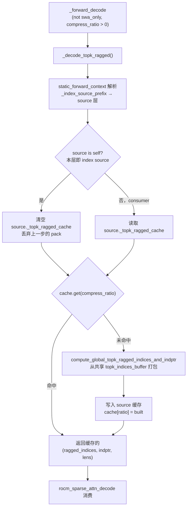
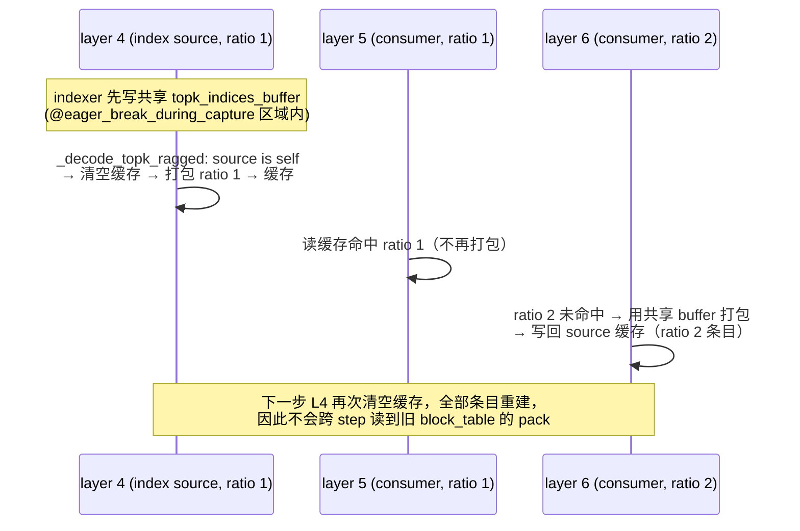

# PR #57434: [ROCm][DSv4.1][Perf] Reuse the decode topk ragged metadata across layers

> **Author**: @Fangzhou-Ai | **State**: OPEN (2026-09-17) | **Labels**: rocm, deepseek, DSv4.1
> **Branch**: `rocm-dsv41-topk-ragged-reuse` → `main` | **Changes**: +66 -13 lines across 1 file
> **ROCm 相关性**: 完全相关（DSv4.1 AMD 稀疏 MLA decode 路径）
> 本报告分两部分：§1–6 为 PR 详细总结，§7–8 为 ROCm review 意见。

---

## 1. 总结 (Summary)

本 PR 解决 DeepSeek-V4.1-Flash 在 ROCm 上 decode 阶段的一个重复计算问题：每个 compressed 层都会把共享的 `topk_indices_buffer` 重新打包成 ragged 形式（`_pack_global_topk_ragged_kernel` + `_compute_topk_lens_kernel`），而打包结果只是 index source 层发布的索引的纯函数，层间唯一的差异项是 `compress_ratio`。PR 让 index source 层按 compress ratio 记忆化（memoize）打包结果，下游层通过 `static_forward_context` 解析 source 并直接读取缓存，把每步 38 次重建降为 8 次（每个 index source 一次）。实测（MI355X TP4，10 步 decode trace）pack 相关 kernel 时间从 ~331 us/step 降到 ~72 us/step，launch 数从 380 降到 80，GSM8K 精度不变（0.9025）。

## 2. 背景与动机 (Background & Motivation)

DSv4.1 的稀疏 attention 拓扑中，只有 `index_source_layer_ids`（如 8 个）上的层运行 indexer 并把 topk 索引写入全模型共享的 `topk_indices_buffer`；其余 compressed 层消费该 buffer。但当前实现里**每个** compressed 层在 `_forward_decode` 中都会重新执行 ragged 打包（`compute_global_topk_ragged_indices_and_indptr`），尽管输入完全相同（共享 buffer + 每步元数据 + 仅 per-layer 的 compress ratio）。在 DSv4.1-Flash 上 38 个 compressed 层每步重建 8 种不同结果，冗余 4.8x；10 步 trace 显示两个打包 kernel 合计占全部 kernel 时间 2.2%（~322 us / 76 launches 每步）。

作者在 PR 描述中明确做了去重调研（"Not a duplicate"）：#56638（混合 prefill 的 index combine）、#57282（消费本元数据的 HIP decode kernel）、#57109/#54394（上游 indexer）都不改变 per-layer 重建行为。动机是纯 kernel 级收益（~1.8% decode GPU 时间），作者同时在 "What is not measured" 一节诚实说明端到端 ITL 无法分辨该量级变化（concurrency-32 的配对采样 -0.54% 方向正确但 3 个样本不足以分离 sub-1% 效应；关掉 spec decode 后循环 host-bound，省下的 GPU 时间落进 host slack）。

## 3. 代码修改分析 (Code Change Analysis)

### 3.1 修改的模块

| 模块 | 改动 |
|------|------|
| `vllm/models/deepseek_v41/amd/rocm.py` (+66/-13) | 唯一改动文件：新增 `_TopkRagged` 类型别名（397 行）、`__init__` 中解析并校验 index source（508–524 行）、新增 `_decode_topk_ragged()` 记忆化封装（758–793 行）、`_forward_decode` 调用点替换（814–818 行）、导入 `_replace_layer_index`（15–18 行） |

### 3.2 架构 / 流程图

单层 `_decode_topk_ragged` 的缓存读写决策：



一个 decode 步内各层的时序（失效 = 结构性，而非版本化）：



### 3.3 关键实现细节

- **缓存所有权**：`self._topk_ragged_cache: dict[int, _TopkRagged]`（rocm.py:512）挂在每个 attention 层上，但只有作为 index source 的层会被写入；consumer 通过 `static_forward_context[_index_source_prefix]` 拿到 source 层对象后读写同一 dict。
- **source 解析**：`_index_source_prefix = _replace_layer_index(self.prefix, self.index_source_layer_id)`（rocm.py:516）。`index_source_layer_id = max(s <= layer_id)` 保证 source 层序在前、source 自己解析到自己（`source is self` → True）。
- **PP 防护**：`__init__` 中若 source 前缀不在 `static_forward_context`（即 PP 切在 index-sharing 组内）则抛 `NotImplementedError`（rocm.py:519–524），与既有 kv-source 的同类防护（attention.py:441–448）一致。
- **失效机制**：source 层每次执行 `_decode_topk_ragged` 时整体清空自己的缓存（rocm.py:779），随后重建；由于 source 层序永远在 consumer 之前，同一 step 内 consumer 不会读到上一步的 pack。prefill 路径完全未动。
- **打包函数复用**：打包仍走原 `compute_global_topk_ragged_indices_and_indptr`（rocm.py:322），输出仍是三个新分配 tensor（`torch.empty` + triton kernel 写入），无 in-place 复用，共享给多个 consumer 安全。
- **swa_only 路径**：`swa_only = compress_ratio == 0`，只有 compressed 层（ratio ∈ {1,2}）进入打包分支；ratio=0 层（含 MTP）不受影响。

## 4. 涉及的技术原理 (Technical Principles)

- **DSv4.1 稀疏 MLA 拓扑**：`compress_ratios` 逐层配置（0 = 纯滑窗，1/2 = compressed）；indexer 只存在于 `index_source_layer_ids` 层，把每 token 的 topk 候选索引写入模型级共享的 `topk_indices_buffer`（`amd/model.py:402` 一次分配、传给所有层）。consumer 层复用"其下方最近的 index source"发布的索引。
- **ragged 打包（全局 slot 映射）**：`_pack_global_topk_ragged_kernel` 把（token, topk 位）的局部索引经 `block_table[req][local_idx // block_size]` 映射成全局 KV slot id，并按 `topk_lens` 压成 ragged 数组；`block_size // compress_ratio` 是唯一 per-layer 项。`block_table` 来自 CommonAttentionMetadata（sparse_mla.py:213），各层共享同一 tensor。
- **breakable CUDA graph 与 eager break**：该模型 attention 的 indexer + MLA 部分在 `@eager_break_during_capture`（`_sparse_indexer_and_attn`，attention.py:879）装饰的 eager 区域内执行——捕获时该区域真实 launch kernel 并在 replay 时逐 step 重跑 Python。因此本 PR 的 Python 级 dict 缓存/失效在默认运行模式下每步都真实执行，收益是真实的 launch 与 GPU 时间节省；同时该设计也避开了"captured 区域内 Python 分支/字典修改破坏捕获"的问题（MRV1 路径经 `_prepare_and_attn_eager` 同样在 eager 区域内）。
- **记忆化失效设计**：缓存按 ratio 为 key、跨 step 存活于 layer 对象上，靠"source 先于 consumer 运行且 source 运行时清空"这一层序不变式保证数据新鲜，而非版本号比对。该不变式由 `max(s <= layer_id)` + 层顺序执行保证，PP 分裂被显式拒绝。

## 5. 评论区讨论亮点 (Discussion Highlights)

- 目前无实质 reviewer 讨论（无 inline review comments；`claude[bot]` 仅提示 fork PR 需 maintainer 触发 `@claude review`）。
- 评论区实际事件：@shen-shanshan 两次 `/ci run`；第一次被 bot 拒绝（"This PR is 27 commits behind upstream main"），第二次成功触发 Buildkite CI #89774（commit `bea2fcdfcf2e`）。
- 讨论质量体现在 PR 描述本身：作者主动完成与 #56638/#57282/#57109/#54394 的去重对比；"What is not measured" 一节对端到端 ITL 测量做了正确的方法学陈述（3 样本无法分离 sub-1% 效应、host-bound 时 GPU 节省落入 slack），并以 GSM8K 统计等价（0.9025 = 0.9025，invalid 0.0%）而非逐 token diff 验证（因该栈非 run-to-run 确定性）。PR 标注使用了 AI 辅助并声明逐行审查。

## 6. 风险与潜在问题 (Risk Analysis)

| 风险 | 严重程度 | 说明 |
|------|---------|------|
| 正确性 — 失效依赖层序不变式 | 中 | "source 运行时清空缓存"隐含 source 每步先于所有 consumer 执行；当前成立（§7 F1），但无运行时防护，未来层跳过/乱序调度会静默读到旧 pack |
| 正确性 — full-graph 模式下语义变化 | 低 | 若运行于非 breakable 的 full CUDA graph，Python 不重跑、清空不执行；正确性转而依赖 captured pack kernel 每步重放刷新缓存 tensor + graph pool 地址稳定（已分析成立），但代码无注释说明（§7 F4） |
| 性能 — 收益模式依赖运行模式 | 低 | eager/breakable 模式收益 = 每步少 30 次 launch；full-graph 模式收益 = 图中少 30 个 kernel。两种模式都受益，量级相当 |
| 兼容性 — PP 分裂 | 中 | PP 切在 index-sharing 组内直接 `NotImplementedError`——显式拒绝，与既有 kv-source 防护行为一致，可接受 |
| 兼容性 — 与邻近 PR 的关系 | 低 | #57282（HIP decode kernel）消费同一 ragged 元数据，共享后语义不变；#56638 只动 prefill combine，无冲突 |
| 测试覆盖 — memoization 语义无自动化测试 | 中 | 现有单测只覆盖 kernel 本身，缓存命中/失效逻辑靠手工 trace + GSM8K（§7 F2） |
| CI — 分支落后 main + CI 未绿 | 中 | 落后 main 27 commits，Buildkite #89774 处于 blocked（§7 F3），合入前需 rebase 并确认 AMD CI 步骤跑到该 diff |

---

## 7. Review 意见 (Findings)

> 意见类型 × 数量：⚠️ 建议修复 × 3，📝 建议/备注 × 2。
> 本 PR 未触及 aiter/mori/requirements/CI 配置，相关专项规则不适用；P 类性能证据检查通过（数字齐全、方法论清晰、TP4 实测）；幻觉符号扫描通过（`_replace_layer_index`、`index_source_layer_id`、`_static_forward_context`、共享 `topk_indices_buffer` 均已对照仓库代码证实存在且语义一致）。

### 按严重程度排序

**⚠️【设计】结构性失效（source 运行时清空缓存）依赖层序不变式，无任何运行时防护** `[推测]`
- **问题**: `vllm/models/deepseek_v41/amd/rocm.py:776-779`——缓存失效完全依赖"source 层每步先于其 consumer 执行"这一隐含不变式：source 在自己运行 `_decode_topk_ragged` 时整体清空缓存，consumer 无条件信任缓存命中。该不变式当前成立（`index_source_layer_id = max(s <= layer_id)` + 层顺序执行 + PP 分裂已显式拒绝），但代码中没有 assert/版本号/forward-id 来检测破坏。
- **影响**: 若未来引入层跳过、乱序调度或 speculative layer-skipping 类优化，consumer 会静默读到上一步的 pack（旧 `block_table` → 错误的全局 KV slot → 错误的稀疏 attention 结果），无 crash、无报错，且 GSM8K 类统计验证在开发期大概率抓不到这种偶发陈旧。
- **行动**: 建议作者给缓存条目附带当前 forward/step 标识（如 `forward_context` 的 id 或 metadata 对象身份）做版本化比对，或在 consumer 命中缓存时断言"缓存在本步内由 source 构建"；至少用注释把该不变式写明（见 §9 C1）。

**⚠️【测试】memoization 语义本身没有任何自动化测试** `[已验证]`
- **问题**: PR 的 test plan 是 `tests/kernels/attention/test_rocm_triton_attn_dsv4.py`（68 passed）+ 手工 10 步 decode trace + GSM8K 400 题。前者只测 `compute_global_topk_ragged_indices_and_indptr` 的 kernel 数值正确性，**不经过** `DeepseekV41ROCMAiterMLAAttention._decode_topk_ragged` 的缓存路径；缓存命中/失效/多 ratio 组（source ratio=1、consumer ratio=2 由 consumer 填条目）这些新逻辑全部落在手工验证里。
- **影响**: 未来任何改动删掉 rocm.py:779 的清空行或改坏 `source is self` 判断，CI 全绿而 decode 结果在真实服务中静默错误（读上一步 pack）。
- **行动**: 建议作者补一个层级单测：构造共享同一 `topk_indices_buffer` 与 `static_forward_context` 的 source + consumer attention 实例，断言 (a) 同一步内同 ratio 的 consumer 命中缓存且不再 launch pack kernel；(b) 第二步 source 运行后缓存被重建（新旧 pack tensor 不同或内容随新 block_table 更新）；(c) ratio 不同的 consumer 走 miss 分支且结果与独立打包一致。

**⚠️【测试】CI 未跑完且分支落后 main 27 commits** `[已验证]`
- **问题**: 2026-09-18 的 `/ci run` 被 bot 拒绝过一次（分支落后 upstream main 27 commits），随后重触发 Buildkite #89774（commit `bea2fcdfcf2e`）状态为 **blocked**：61 步通过、0 失败、320 步 waiting（典型的等待 label/approval 输入状态）。PR 带 `rocm` label，但无法确认 AMD ROCm 队列的步骤是否已执行到该 diff。
- **影响**: 该改动位于 ROCm 专属 decode 热路径，主 CI 以 CUDA 为主；ROCm CI 未实际跑过的情况下，合入风险由 AMD 用户承担。
- **行动**: 建议作者 rebase 到最新 main（该文件近期在 main 上仍活跃变更，存在冲突风险）后重新 `/ci run`，并确认 ROCm 相关步骤（如 `rocm` label 对应的 AMD 队列）真正执行且变绿。

**📝【注释/文档】docstring 说"source 按 ratio 记忆化"，实际多 ratio 条目由 consumer 计算写入** `[已验证]`
- **问题**: `_decode_topk_ragged` 的 docstring（rocm.py:765-770）声称 "the source memoizes one result per ratio"，但实现中 miss 分支用**当前调用者自己的** `attn_metadata`/`topk_indices_buffer` 打包后写回 source 的缓存（rocm.py:784-791）——当 consumer 的 ratio 与 source 不同（DSv4.1 组内 ratio 1/2 混合）时，该条目由第一个该 ratio 的 consumer 计算。语义上等价（buffer 全模型共享、`block_table` 来自 CommonAttentionMetadata 同一 tensor、`num_decode_tokens` 各层一致），但注释与实现有出入。
- **影响**: 读者可能误以为 source 预填了所有 ratio；且该等价性依赖"所有 consumer 的 `num_decode_tokens`/`block_table` 与 source 完全一致"这一未写明的事实。
- **行动**: 建议作者更新 docstring 说明"miss 时由当前层打包并写回 source 缓存"，并补一句等价性前提（共享 buffer + 共享 per-step metadata）。

**📝【注释/文档】full CUDA graph 模式下缓存跨 step 存活、失效语义不同，代码未说明** `[已验证]`
- **问题**: 该路径的 graph 行为由 `@eager_break_during_capture` 装饰器（attention.py:879，实现见 `vllm/compilation/breakable_cudagraph.py`）决定：breakable（默认）模式下，attention 位于 eager 区域内，Python 每步重跑、清空每步执行；而在 full graph 模式下，装饰器内 `cudagraph_runtime_mode == CUDAGraphMode.FULL` 的分支（breakable_cudagraph.py:107-110）会抑制打断、直接执行 `fn`——整条路径被捕获，**Python 缓存逻辑只在 capture 时执行一次，replay 时不跑**。此时两层语义分开看：(1) kernel 层——source 层的两个打包 kernel 被记录进图、每次 replay 真实执行并**原地重写缓存 tensor**；consumer 层 capture 时命中缓存，打包 kernel 不记录、其 `rocm_sparse_attn_decode` kernel 的参数地址指向 source 缓存的 tensor；(2) Python 层——dict 清空/命中判断不入图，数据新鲜度完全靠"captured pack kernel 每步重放刷新 + CUDA graph memory pool 地址稳定"保证。重新 capture（如 batch size 变化）时 Python 重跑、source 先清空再重建，旧 graph 回放写旧 pool 中仍存活的 tensor，互不干扰。分析确认两种模式下均正确、收益形态不同（breakable 省每步 launch；full 省图内 kernel 数量 + capture 时 30 组 pool 分配），但 PR 描述中 "the source clears its own entry when it runs" 的表述仅在 eager/breakable 模式下字面成立，代码中也无任何注释说明上述依赖。
- **影响**: 无当前故障；风险在于维护者不了解该隐含依赖时改变 graph 模式或移动代码位置（例如把 pack 路径移出捕获区、或依赖 replay 时 Python 失效逻辑生效）。
- **行动**: 建议作者在缓存初始化处（rocm.py:508-512）加注释说明两种 graph 模式下的行为差异（kernel 入图 / Python 只跑一次）与依赖（graph pool 地址稳定、captured pack kernel 原地刷新）；可选：在 `_decode_topk_ragged` 入口断言当前不在 full 捕获路径或显式读取 `cudagraph_runtime_mode`，以免未来模式切换时语义静默漂移。

## 8. 结论 (Verdict)

⚠️ **NEEDS WORK** — 设计正确、性能数据与方法论扎实（数字内部自洽、诚实标注未测量项、GSM8K 精度等价），核心语义经交叉验证成立（共享 buffer、元数据一致性、层序不变式、graph 模式兼容性）。但失效机制完全依赖隐含的层序不变式且无运行时防护，memoization 语义无自动化测试，CI 未绿且分支落后 main。建议：补版本化/断言 + 层级回归测试、rebase 后跑绿 ROCm CI，即可合入。

## 9. 英文 Review 评论 (Copy-Paste English Comments)

**C1** `vllm/models/deepseek_v41/amd/rocm.py:779-782` — ⚠️ comment

```text
The invalidation here is structural: the source layer clears its whole cache
when it runs, and correctness relies on the source always executing before
its consumers within a step. That invariant holds today
(`index_source_layer_id = max(s <= layer_id)` plus in-order layer execution,
with PP splits rejected in `__init__`), but nothing in the code detects a
violation — a future layer-skip or reordering optimization would make
consumers silently read the previous step's pack (stale block table →
wrong global slots → wrong sparse attention, no crash). I think it's worth
making this explicit: either version the cache entries with the current
forward/step id and assert on hit, or at least assert at the consumer side
that the entry was built during the current step. Could you consider adding
such a guard?
```

**C2** `vllm/models/deepseek_v41/amd/rocm.py:784-791` — ⚠️ comment

```text
The docstring says "the source memoizes one result per ratio", but on a
cache miss the entry is computed by the current layer (the consumer) with
its own `attn_metadata` and stored into the source's dict — that's the path
every ratio-2 consumer takes when its source is a ratio-1 layer. This is
semantically fine only because `topk_indices_buffer` is shared across all
layers, `block_table` comes from the common attention metadata (same
tensor), and `num_decode_tokens` is identical for every layer in the step.
Could you update the docstring to describe who computes each entry, and
state that equivalence assumption explicitly? A one-line assert that all
consumers of a source share the same `num_decode_tokens` would also guard
against future metadata divergence.
```

**C3** `vllm/models/deepseek_v41/amd/rocm.py:508-512` — ⚠️ comment

```text
One note on CUDA-graph interaction: under breakable cudagraphs this path
sits in the `@eager_break_during_capture` region, so Python re-runs each
step and the clear-on-source-run executes every step. Under full
(non-breakable) cudagraphs, Python does not re-run at replay — the clear
only happens at capture time and the cached tensors persist across replays;
correctness there relies on the captured pack kernels rewriting the cached
tensors in place at every replay plus the graph memory pool keeping those
addresses stable for the graph's lifetime. That holds today, but it's an
easy invariant to break if this code is ever moved out of the eager break
or the graph mode changes. Consider documenting this in a comment here, and
optionally asserting that the pack path is not executing inside a capture
region.
```
