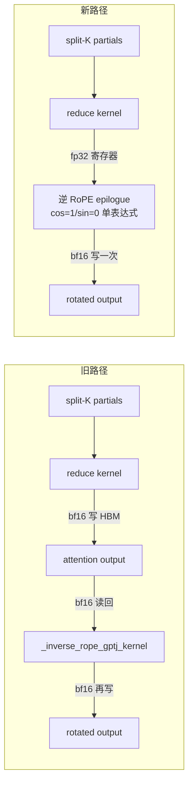
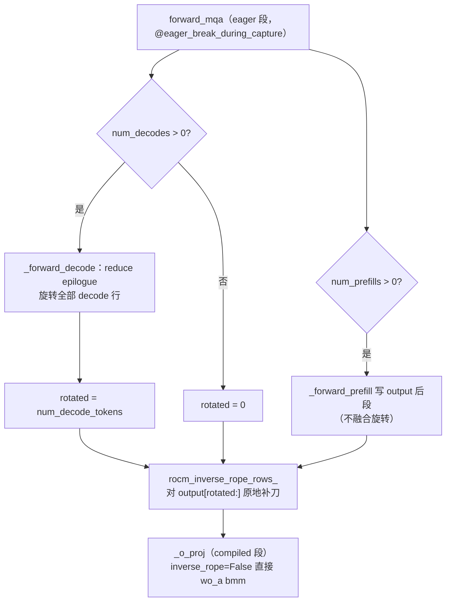

# PR #57435: [ROCm][DSv4.1][Perf] Fuse the inverse RoPE into the sparse decode reduce

> **Author**: @Fangzhou-Ai | **State**: OPEN | **Date**: 2026-09-17
> **Branch**: `rocm-dsv41-fuse-inv-rope` → `main` | **Labels**: `rocm`, `deepseek`, `DSv4.1`
> **Changes**: +205 -22 across 4 files | **ROCm 相关性**: 完全相关
> 本报告分两部分：§1–6 为 PR 详细总结，§7–8 为 ROCm review 意见。

---

## 1. 总结 (Summary)

ROCm 稀疏 decode 路径目前把 attention 输出写两遍：`_sparse_attn_decode_reduce_kernel` 把 split-K 部分和归约后写入 `[T, H, 512]`，随后 `_inverse_rope_gptj_kernel` 把整个张量读回、旋转尾部 64 个 rope lane、再写一遍——每层每个 step 一次完整的 HBM 往返。本 PR 把逆 RoPE 融合进 reduce kernel 的 epilogue：数据还在寄存器里（fp32 accumulator）时直接完成旋转，NoPE lane 以 cos=1/sin=0 的单一无分支表达式覆盖整行，使 decode-only step 上独立 kernel 的 launch 数从 430 归零。行数簿记（哪些行已在 epilogue 中旋转）放在 eager attention 段而非 compiled 区域，避免 `skip_all_guards_unsafe` 下 Python int 冻结重演此前 GSM8K 0.087 的静默精度事故。

## 2. 背景与动机 (Background & Motivation)

在 MI355X（TP4，rank 0）的 10-step decode trace 中，`_inverse_rope_gptj_kernel` 占 1965.5us（430 次调用，1.35% 的 kernel 时间）。430 = 43 层 × 10 steps，滑动窗口层和 MTP 层每层都付这份成本——而它只是一个旋转 epilogue，处理的数据 reduce kernel 刚在寄存器里持有。

FlashMLA 的 mega-attention kernel 在 SM100 上早已把同样的旋转和 FP8 cast 折叠进 epilogue（`flash_mla_mega_attn.py`），且层接口（`_alloc_attn_out` / `_o_proj`、`accepts_unnormed_unroped_query`）是平台无关的，ROCm Triton 路径只是从未采用。本 PR 是这一方向的 ROCm 侧补课，预期效果：每 step 移除约 196us 和 43 次 launch。

作者明确说明与相邻 PR 的关系：#54894 是不同模型（deepseek_v4）经 AITER `inverse_rope_group_quant` 的融合且保留独立 pass；#57282 的 opt-in HIP decode kernel 与本 PR 的 Triton 路径互补，本 PR 的 rotated-row 计数正是两者协作的契约。

## 3. 代码修改分析 (Code Change Analysis)

### 3.1 修改的模块

| 文件 | 修改 |
|------|------|
| `vllm/v1/attention/ops/rocm_aiter_mla_sparse.py` | reduce kernel 增加可选逆 RoPE epilogue；`_fused_inverse_rope_gptj` 支持 `out=` in-place；新增 `rocm_inverse_rope_rows_`；`rocm_inv_rope_einsum` 增加 `inverse_rope` 开关；`rocm_sparse_attn_decode` 增加融合参数并返回 rotated 行数；`FP8_DTYPE` 模块级常量改为逐调用 `current_platform.fp8_dtype()`（与本 PR 目的无关，见 §7 意见 2） |
| `vllm/models/deepseek_v41/amd/rocm.py` | `forward_mqa` 在 eager 段对未旋转行调用 `rocm_inverse_rope_rows_` 补刀；`_forward_decode` 传入 positions/cos_sin_cache 并返回 rotated 行数；`_o_proj` 固定 `inverse_rope=False` |
| `tests/kernels/attention/test_dsv41_rocm_fused_inv_rope.py` | 新增：epilogue 数学的 torch 镜像测试（不启动真实 kernel） |
| `tests/kernels/attention/test_rocm_triton_attn_dsv4.py` | `_launch_sparse_decode_reduce` 适配新签名，仅 FUSE_INV_ROPE=False |

### 3.2 架构 / 流程图

新旧两条 decode 输出路径的数据流对比：



`forward_mqa` 中 rotated 行数与 eager/compiled 边界：



### 3.3 关键实现细节

- **epilogue 数学**（`rocm_aiter_mla_sparse.py:2861-2879`）：`pair_idx = arange(COMB_DIM//2) - NOPE//2` 把 512 lane 分为 256 对，rope lane 恰在最后 32 对；`cos = where(is_rope, load(cache + pos*cs_stride + k), 1.0)`、`sin = where(is_rope, load(cache + pos*cs_stride + HALF + k), 0.0)`，非 rope lane 的 k 被钳到 0 保证加载在界内；`tl.split/tl.join` 完成 `out_even = a*cos + b*sin`、`out_odd = b*cos - a*sin`。与 standalone `_inverse_rope_gptj_kernel`（1342-1387 行）逐项一致：相同公式、相同 cos|sin 布局（前半 cos、后半 sin）、相同 int64 pos 处理。
- **行数簿记**：`rocm_sparse_attn_decode` 返回 `output.shape[0] if inv_rope_positions is not None else 0`——融合条件与返回值严格绑定；`forward_mqa` 对 `output[rotated:]` 调用 `rocm_inverse_rope_rows_` 原地补刀（prefill 行 + 任何未来不融合的 decode 路径）。decode-only step 上切片为空，kernel 零 launch。
- **eager/compiled 边界**：`_sparse_indexer_and_attn` 带 `@eager_break_during_capture`（`deepseek_v41/attention.py:879`），`forward_mqa` 在其中以 eager 方式执行，batch 相关的 Python int 保持动态；`_o_proj` 在 compiled 区域，`inverse_rope=False` 是 backend 属性（跨 step 常量），trace 期冻结无害。
- **in-place 安全性**：`_inverse_rope_gptj_kernel` 先加载全部 rope 对（1380-1381 行）再存储（1386-1387 行），每个 program 独占一个 (token, head) 行，`out=o` 别名安全；kernel 显式传入 input/output stride（s_t/s_h/os_t/os_h），`output[rotated:, :n_local_heads, :]` 这类非连续切片地址计算正确。
- **精度语义**：旋转发生在 fp32 accumulator 上（旧路径是对已舍入的 bf16 输出旋转），少一次舍入；NoPE lane 恒等（x·1.0 + 0.0）。
- **FP8_DTYPE 重构**：模块级常量删除，4 个调用点改为局部 `current_platform.fp8_dtype()`——与融合无关，maintainer 已要求回退。

## 4. 涉及的技术原理 (Technical Principles)

- **GPT-J 逆 RoPE**：GPT-J（non-neox）布局下相邻 lane 成对旋转，forward 为 `x2i = a·cos - b·sin, x2i+1 = b·cos + a·sin`；逆旋转即 sin 项取负：`out_even = a·cos + b·sin, out_odd = b·cos - a·sin`。cos/sin 缓存布局 `[P, rope_dim] = cos[:half] | sin[half:]`，attention 输出 `[T, H, nope+rope]` 只有尾部 rope lane 参与。
- **split-K reduce + epilogue 融合**：decode 的注意力打分由 split-K partial kernel 产生部分和，reduce kernel 做 softmax 校正的加权归约。把旋转放在 reduce 的寄存器 epilogue 里，省掉「bf16 写 HBM → 读回 → 再写」的一整轮往返，这是本 PR 性能收益的全部来源（kernel 时间从两段 2214+1966us 变为单段 2270us）。
- **vLLM V1 eager/compiled 边界**：`@eager_break_during_capture` 标记的函数在 cudagraph capture 期间以 eager 方式真实执行，其内部 batch 相关的 Python 控制流和 int 值保持动态；而 compiled 区域内 `skip_all_guards_unsafe` 会把 Python int 冻结为 trace 值且不报错——这正是 PR 自述的前身版本 GSM8K 0.087 静默事故的机制（rotated 行数冻结为 0，行被旋转零次或两次）。
- **MTP spec decode 与滑动窗口层**：DSv4.1 的 SWA-only 层（compress_ratio==0）与 MTP 层复用同一 `forward_mqa` 路径，每层每 step 都付独立的 kernel 成本，故 430 = 43 层 × 10 steps 全部命中本优化。

## 5. 评论区讨论亮点 (Discussion Highlights)

- **早期版本的编译冻结事故（PR body 自述）**：此前修订把 rotated 行数交给 compiled 区域内的 `_o_proj`，`skip_all_guards_unsafe` 使 Python int 冻结在 trace 值，GSM8K 跌至 0.087（基线 0.902）且输出流畅、无任何报错——lane 算术始终正确，只有 eval 能发现。这一事故直接驱动了「簿记放 eager 段」的最终设计，是本 PR 最重要的设计决策依据。
- **@tjtanaa（CHANGES_REQUESTED）** 三条意见：
  1. `rocm_aiter_mla_sparse.py:32` — 要求回退 FP8_DTYPE 模块级常量的删除：模块级常量已缓存，逐调用 `current_platform.fp8_dtype()` 会在 prefill 期间引入不必要的 host 端元数据查询；
  2. `test_dsv41_rocm_fused_inv_rope.py` — 新单测是"development code"，应改为对 `_sparse_attn_decode_reduce_kernel` + epilogue 的整体正确性测试；
  3. `test_rocm_triton_attn_dsv4.py:285` — 要求补 FUSE_INV_ROPE=true 的覆盖。
- **@tjtanaa 追问 eval 证据**：要求附上 conc 256、numshot 30 的 lm eval 命令与分数（PR body 只有 conc 32 的"分数不变"叙述）。
- CI：Buildkite #89754 已在 head commit 触发，结果需等作者在 PR 内确认。

## 6. 风险与潜在问题 (Risk Analysis)

| 风险 | 严重程度 | 说明 |
|------|---------|------|
| 正确性 — eager/compiled 边界依赖 | 中 | 设计正确性依赖 `@eager_break_during_capture` 结构（已核验：`_sparse_indexer_and_attn` 装饰器存在、`_o_proj` 在 compiled 区域）。未来若有人把 `forward_mqa` 挪回 compiled 段，会静默重演 0.087 事故；`rocm_sparse_attn_decode` 的 docstring 已警告，但契约脆弱 |
| 正确性 — bit-exact 声明例外 | 低 | PR body 声称 NoPE lane bit-exact，但等价性表格自述 (32,128) 时 max abs diff 4.9e-4，例外来源未解释（量级在 bf16 rounding 内，数值无碍，见 §7 意见 5） |
| 性能 | 低 | 融合使 reduce 增加 8.3us/step，净省 193us/step；epilogue 额外寄存器压力小（COMB_DIM=512 fp32 分布 128 线程），与实测吻合 |
| 兼容性 | 低 | `deepseek_v4/amd/rocm.py` 也调用 `rocm_sparse_attn_decode`（1111 行）与 `rocm_inv_rope_einsum`（975 行），新参数默认值保持旧行为，DSv4 不受影响；已核验 |
| 测试覆盖 | 中 | 真实 kernel 的融合路径无提交级覆盖（见 §7 意见 1） |
| 可维护性 | 中 | FP8_DTYPE 无关注入（§7 意见 2）；融合无临时 kill-switch（§7 意见 4） |

---

## 7. Review 意见 (Findings)

| 意见类型 | 数量 |
|---------|------|
| ⚠️ 建议修复 | 3 |
| 📝 建议/备注 | 2 |

核心实现经逐项核验**未发现 🔴 级问题**：in-place 旋转的读序（先读后写）、stride 显式传递、cos/sin 布局与 standalone kernel 逐项一致、rotated 计数与融合条件严格绑定、swa_only/direct_out 旁路均保持正确。以下发现集中在测试覆盖与卫生问题上。

**⚠️【测试】融合 epilogue 的真实 kernel 无提交级测试覆盖** `[已验证]`
- **问题**: `tests/kernels/attention/test_dsv41_rocm_fused_inv_rope.py:29-53` 的 `_epilogue` 与 `_standalone` 都是 torch 重实现，测试从不启动 `_sparse_attn_decode_reduce_kernel`；`test_rocm_triton_attn_dsv4.py:285` 的 reduce 测试仅覆盖 FUSE_INV_ROPE=False。PR body 中真正有价值的 kernel 等价性数据（fused vs unfused+standalone，4 种 shape）来自未提交的脚本。
- **影响**: `tl.split`/`tl.join` 顺序、cos/sin 索引或 mask 行为若在 Triton 实现中写错（或未来 combine 布局改动），torch 镜像与 kernel 会同时错、永远一致，测试全绿而输出静默错误——与本 PR 前身 0.087 事故同型的失败模式。maintainer @tjtanaa 已提出同样意见（CHANGES_REQUESTED）。
- **行动**: 作者应当把 kernel 等价性脚本转成提交级测试（真 kernel FUSE_INV_ROPE=True 对照 `_fused_inverse_rope_gptj` 输出），或至少为 `_launch_sparse_decode_reduce` 增加 fusion=True 用例。

**⚠️【可维护性】FP8_DTYPE 模块级常量删除与 PR 目的无关** `[已验证]`
- **问题**: `rocm_aiter_mla_sparse.py:32` 的 `FP8_DTYPE = current_platform.fp8_dtype()` 被删除，改为 263、468、519、1024 四个调用点逐次调用；PR body 未说明动机，与逆 RoPE 融合无任何依赖。
- **影响**: prefill 热路径每次 kernel 调用多一次 host 端元数据查询（模块级常量本已缓存）；且无关注入扩大 review 面积。maintainer 已要求回退。
- **行动**: 作者应当回退该重构，或说明本 PR 为何需要它；建议保持 diff 聚焦于融合本身。

**⚠️【测试/文档】精度与性能证据待补全** `[已验证]`
- **问题**: GSM8K eval 未给出具体分数（仅"remains the same"），lm eval 命令与 conc 256 / numshot 30 的分数缺失（@tjtanaa 已在评论区要求）；Buildkite #89754 结果未在 PR 中确认。
- **影响**: 鉴于前身版本曾出现无任何报错的静默精度事故（0.087），可复现的 eval 证据是本 PR 合入的必要条件；perf 声明（193us/step）的复现配置（命令、checkpoint）也待补充。
- **行动**: 作者应当附上 lm eval 命令与 conc 256 / numshot 30 的分数，并确认 CI 全绿。

**📝【可维护性】融合无临时 kill-switch** `[推测]`
- **问题**: `_forward_decode` 无条件传入 `inv_rope_positions`，DSv4.1 decode 路径上融合始终开启，无 env var 回退。前身版本的静默精度事故说明该区域出问题时无任何报错信号。
- **影响**: 低——本 PR 的 kernel 等价性与 eval 验证较充分；但一个临时 env var（如 `VLLM_DSV41_DISABLE_FUSED_INV_ROPE`）的成本近乎为零，可在生产环境出现数值异常时快速定位/回退。
- **行动**: 建议作者加临时 kill-switch 并在验证稳定后移除（permanent feature-flag 会被 maintainer 拒）。

**📝【正确性】"NoPE lanes bit-exact" 声明有未解释的例外** `[已验证]`
- **问题**: PR body 声称 NoPE lane bit-exact，但等价性表格自述 (32, 128) 时 max abs diff 为 4.9e-4——与 bit-exact 表述矛盾，例外来源未解释（疑为该 shape 下 split 配置或两次独立 run 的 partial 累加差异）。
- **影响**: 数值上无碍（4.9e-4 在 bf16 rounding 量级），但若未来 bit-exactness 被当作设计不变式（如 #54894 路线的 FP8 cast 依赖），这个例外会成为坑。
- **行动**: 建议作者在 body 中解释 (32,128) 例外的来源，或把 bit-exact 表述收窄为"除 32-query shape 外"。

## 8. 结论 (Verdict)

**⚠️ NEEDS WORK** — 核心实现质量高且经逐项核验正确（in-place 安全性、stride 处理、布局一致性、eager 段放置、边界条件均无问题），但提交级测试未覆盖真实 kernel 的融合路径，且 maintainer 已 CHANGES_REQUESTED（FP8_DTYPE 回退 + eval 证据补全）。补齐测试与证据后值得合入。

## 9. 英文 Review 评论 (Copy-Paste English Comments)

**C1** `tests/kernels/attention/test_dsv41_rocm_fused_inv_rope.py:43-53` — ⚠️ comment

```text
This test re-implements both the fused epilogue and the standalone inverse
RoPE in torch, so it never launches _sparse_attn_decode_reduce_kernel. A
wrong tl.split/tl.join order, an off-by-one in the cos/sin indexing, or a
future change to the combine layout in the real kernel would pass here
silently, since both torch mirrors would encode the same mistake. The
kernel-equivalence numbers in the PR body (fused vs unfused +
_fused_inverse_rope_gptj) come from an uncommitted script. Could you turn
that into a committed test — e.g. extend _launch_sparse_decode_reduce in
test_rocm_triton_attn_dsv4.py with a FUSE_INV_ROPE=True case and compare
against the standalone kernel output on the same inputs?
```

**C2** `tests/kernels/attention/test_rocm_triton_attn_dsv4.py:285` — ⚠️ comment

```text
_launch_sparse_decode_reduce was updated for the new signature but only
exercises FUSE_INV_ROPE=False. Since the fused epilogue is the entire point
of this PR, please add at least one FUSE_INV_ROPE=True case (e.g. NOPE=448,
ROPE=64, a few decode rows) and check the rotated output against
_fused_inverse_rope_gptj applied to the unfused reduce output, including
the NoPE lanes.
```

**C3** `vllm/v1/attention/ops/rocm_aiter_mla_sparse.py:263-264` — ⚠️ comment

```text
Removing the module-level FP8_DTYPE constant and calling
current_platform.fp8_dtype() at each use site looks unrelated to the
inverse-RoPE fusion, and it replaces a cached import-time value with a
per-call host-side query on the prefill path. Could you revert this
refactor (or explain why this PR needs it) and keep the diff scoped to the
fusion?
```
