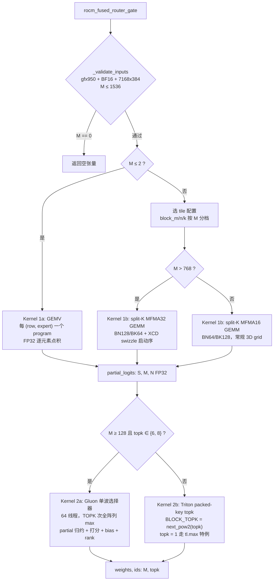
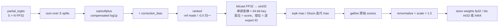

# PR #57478: [ROCm][DSv4.1][Perf] Fused router gate for gfx950

> **Author**: @Fangzhou-Ai | **State**: OPEN | **Date**: 2026-09-18
> **Branch**: fork → main | **Labels**: performance, rocm, ready, DSv4.1
> **Changes**: +794 -0 across 3 files | **ROCm 相关性**: 完全相关（gfx950 专属融合 router gate kernel）
> 本报告分两部分：§1–6 为 PR 详细总结，§7–8 为 ROCm review 意见。

---

## 1. 总结 (Summary)

本 PR 为 gfx950（MI350/MI355）实现一个融合的 MoE router gate 算子：把 DeepSeek-V4.1-Flash 的 gate GEMM（`X[M,7168] @ W[384,7168].T`，BF16）与 sqrtsoftplus 打分、correction bias、top-k 专家选择、权重归一化与缩放全部融合进两个 kernel（split-K BF16 MFMA GEMM + 融合的 partial 归约/选择 kernel，M≥128 且 topk∈{6,8} 时选择 kernel 走 Gluon 单波路径）。作者报告在 MI355X 上冷输入条件下相对未融合基线（`torch.mm` + `fused_topk_bias`）全面提速 1.47–3.86×，同时诚实地说明只达到理想 roofline 的 ~8–15%，且**未接入任何 serving dispatch、不声称模型级收益**。

## 2. 背景与动机 (Background & Motivation)

DeepSeek V4.1 系列模型的 router gate 是每个 token 必经的窄 GEMM（M=1–1536，N=384，K=7168）：GEMM 本身 FLOP 很小，但基线实现要经历多次 kernel 启动（`torch.mm` + `fused_topk_bias` 内部的多步打分/排序），启动开销与中间结果（FP32 logits）的 HBM 往返在 decode 场景（M 小）下占主导。本 PR 的目标是把 GEMM 与选择融合为两个 kernel，减少启动次数与中间张量流量。PR 描述同时坦承：作者先搜索了既有工作（"fused router gate" 的 open PR 搜索），决定更新本 PR 而不是另开竞争 PR；NVIDIA 的 Mega-Gate 与 ROCm 侧 selection-only 的改动都不提供 gfx950 BF16 投影实现。PR 附带了一份相当完整的测量协议（HIP graph replay、cold/warm 两种 cache 模式、roofline 分析、计数器消融、被否决的替代方案清单），并明确声明使用了 AI 辅助（Codex 并行调优/审查）。

## 3. 代码修改分析 (Code Change Analysis)

### 3.1 修改的模块

| 模块 | 改动 |
|------|------|
| `vllm/model_executor/layers/fused_moe/router/rocm_fused_router_gate.py`（新增，403 行） | 核心：`rocm_fused_router_gate()` 入口 + `_validate_inputs`/`can_use_rocm_fused_router_gate()` + 4 个 Triton/Gluon kernel（GEMM、GEMV、Triton 选择、Gluon 选择） |
| `benchmarks/kernels/benchmark_rocm_fused_router_gate.py`（新增，213 行） | 对比 benchmark：HIP graph replay、cold（128 组旋转输入）vs warm、33 个 M 值 × topk 6/8，输出 JSON 含 p10/p90 与 kernel 源码 SHA256 |
| `tests/kernels/moe/test_topk_softplus_sqrt.py`（+178） | 4 个 gfx950-gated 测试：主对比测试（12 个 M × 3 组配置）、ties/负尾部专项、空输入、非法输入拒绝 |

### 3.2 架构 / 流程图

两 kernel 流水线与 dispatch 决策：



融合选择 kernel 内部的数据流：



### 3.3 关键实现细节

- **两 kernel 设计**：Kernel 1 是 split-K BF16 GEMM（`tl.dot` 三参形式，MFMA16/MFMA32），partial logits 落 `(S, M, N)` FP32 buffer；Kernel 2 在同一次启动里完成 split 归约、sqrtsoftplus、bias、排序、归一化。M≤2 走 GEMV 特化路径（`_router_gate_gemv`，避免 GEMM 开销）。
- **确定性 tie-break**：把 FP32 分数 bitcast 成可排序 uint32（负数取反、正数置符号位），再与 `(BLOCK_N - expert_id)` 拼接成 64-bit key——分数相同则 expert ID 小者 key 更大，与参考实现 `torch.argsort(stable=True)` 的语义一致。选择后权重仍取未加 bias 的原始 score。
- **compensated log1p**：`correction = exp_value - (rounded_sum - 1.0)` 恢复被舍入吞掉的负尾部，避免更慢的 OCML `log1p` 库函数路径；`ranked == 0.0` 归一化保证 -0.0 与 +0.0 的 bit 表示一致。
- **Gluon 单波选择器**（`_router_gate_reduce_topk_gluon`）：`gl.BlockedLayout([1,1],[1,64],[1,1],[1,0])` 64 线程单波，`gl.static_range(TOPK)` 迭代做全阵列 `gl.max`；Triton 路径则用 `tl.topk(keys, BLOCK_TOPK)` + mask，topk=1 特例用 `tl.max(...)[None]`（作者称 Triton `topk(k=1)` 在其环境中编译失败）。
- **XCD-aware 启动序**：M>768 时把 1D grid 按 `(pid % 8) * cdiv(num_blocks, 8) + pid // 8` 重排（8 个 XCD），意图是让相邻 expert tile 落在同一 XCD 的 L2；同时换 BM128/BN128/MFMA32 大 tile。计数器消融显示 L2 hit 64.4%→74.6%、FetchSize beyond L2 减半。
- **输入验证**：shape 锁死 `(7168, 384)`（`ROCM_FUSED_ROUTER_GATE_SUPPORTED_SHAPES`）、`M ∈ [0, 1536]`、BF16 + contiguous + 同 device 校验；`indices_dtype` 支持 int32/int64。
- **dispatch 未接入**：没有任何 serving/model 调用点使用该算子；`can_use_rocm_fused_router_gate()` 是为将来接入预留的判据。

## 4. 涉及的技术原理 (Technical Principles)

**MoE router gate 的计算链**。DSv4.1 的 gate 是 `logits = X @ W.T`（BF16 输入、FP32 累加），随后 `score = sqrt(softplus(logits))`，选择用 `score + correction_bias` 排序取 top-k，输出权重取**未加 bias 的 score** 做归一化再乘 `routed_scaling_factor`。本 PR 的融合点在第二段：bias 只影响选择不影响权重，所以可以在同一个 kernel 里先算 ranked 用于排序、再 gather 原始 score 输出。

**split-K 与确定性**。K=7168 的窄 GEMM 单 CTA 一行时 wave 利用率低，split-K 把 K 切成 S=7（M>64）或 14（M≤64）段并行累加，partial 再归约。BF16×BF16 的每个乘积在 FP32 里是精确的，kernel 与 FP32 参考的 logits 差异只来自累加顺序，量级 ~1e-5；MFMA 与固定归约顺序使该算子在固定 (shape, tile, Triton 版本) 配置下**确定性**（对比 cublas/hipblas 无此保证）。

**Gluon（triton.experimental.gluon）单波编程模型**。Gluon 是 AMD 在 Triton 上的实验性扩展：显式 `BlockedLayout`/`SliceLayout` 控制元素到线程的映射，单波 kernel 避免多次 wave 间的通信，适合这类"每 token 一行、全专家列做归约/排序"的选择算子。vLLM 的 inkling AMD 路径已在用 Gluon（`vllm/models/inkling/amd/ops/gluon/`），`vllm/triton_utils` 透传导出 `gluon`/`gl`。

**排序 key 的位操作**。IEEE754 FP32 的 bit 序对负数不是单调的，`bits ^ 0x80000000`（正数）/`~bits`（负数）把浮点序映射为 uint32 序；`(ordered << 32) | (BLOCK_N - expert_id)` 把"分数相同取小 ID"编码进一次 topk max。掩码专家置 `-inf`（映射到 `0x007FFFFF`，低于一切实数值），选中后置 key=0（低于一切合法 key）防止重复选择。

**XCD 与 L2 局部性**。gfx950 由 8 个 XCD 组成，每 XCD 有独立 L2 slice。按 8 取模重排 CTA 启动序，使并发执行的 CTA 组在权重矩阵上形成跨 XCD 的分布、而同一 XCD 内相邻 CTA 访问邻近的 expert 块——这是对 gfx950 多 XCD L2 的启发式优化（消融数据支持其有效性，但作者也注明消融同时改了三件事，不能单独归因）。

## 5. 评论区讨论亮点 (Discussion Highlights)

截至 2026-09-21，PR 尚无实质性 code review 讨论：只有 AndreasKaratzas 开 CI（`/ci run`，#89917）、作者 09-21 rebase 后重跑 CI（#90283），以及作者 @shen-shanshan 的邀请评论（"it should help both dsv4 and dsv4.1"）。@claude[bot] 提示 fork PR 自动 review 被禁用。PR 正文自述了与既有工作的关系（更新本 PR 而非新开 PR；Mega-Gate 与 selection-only 改动不覆盖本场景）与 AI 辅助声明，但尚未经过 maintainer 的实质技术讨论。

## 6. 风险与潜在问题 (Risk Analysis)

| 风险 | 严重程度 | 说明 |
|------|---------|------|
| 测试覆盖 | High | 新测试 gfx950-gated，而 kernels/moe 的 AMD CI mirror 是 MI300（gfx942）——CI 上这些测试永远 skip（见 §7-1） |
| 正确性基准 | Medium | 测试/benchmark 的参考是 FP32 GEMM 而非实际被替换的 BF16 基线，near-tie 时 ID 断言存在跨硬件/Triton 版本的 flaky 风险（见 §7-2） |
| 兼容性 | Medium | 依赖 `triton.experimental.gluon` 实验性 API（layout/`static_range`/`gl.uint64`），Triton 版本升级敏感（见 §7-3） |
| 性能 | Low | 未接入 serving，端到端收益未知；作者已明确不声称模型级加速；M=1024/1536 时冷加速仅 ~1.5× |
| 可维护性 | Medium | 选择 kernel 有 Triton/Gluon 双实现，语义需同步维护；bit 操作 key 构造无注释（见 §7-4） |
| 正确性 | Low | shape 锁死 (7168,384)、M≤1536 硬上限，dispatch 接入时必须有 fallback 路径（`can_use_...` 已预留） |

---

## 7. Review 意见 (Findings)

| 意见类型 | 数量 |
|---------|------|
| 🔴 必须修复 | 0 |
| ⚠️ 建议修复 | 3 |
| 📝 建议/备注 | 1 |

**⚠️【测试】gfx950 专属测试在任何 CI 队列上都不会执行** `[已验证]`
- **问题**: 4 个新测试都带 `@pytest.mark.skipif(not _on_gfx950())`（test_topk_softplus_sqrt.py:633/697/745/763），而 CI 中覆盖 `tests/kernels/moe` 的 AMD mirror 是 MI300（gfx942，`.buildkite/test_areas/kernels.yaml` 的 kernels-moe-test mirror `device: mi300_1`）。本次 head commit（6831f4c）的 30 个 CI job 中，AMD 硬件只有 `amd-mi355-cuda-platform` 与两个 `amd-mi250` 短任务，没有任何队列会执行这些测试——合并后 gfx950 路径零回归保护，后续 Triton/vLLM 改动静默破坏该 kernel 也不会被 CI 发现。
- **影响**: 该 kernel 是 Tier-1 级别的静默数值错误风险面（路由错误 = 模型输出静默变差），却只依赖作者本地的一次性验证。
- **行动**: 建议作者与 AMD CI 维护者协调，为 kernels/moe 增加 MI355 mirror/queue（或在现有 mi355 queue 上挂载该测试文件），至少在 PR 描述中注明"CI 无法覆盖、依赖本地硬件验证"的现状。

**⚠️【测试】正确性对比对象是 FP32 参考，而非实际被替换的 serving 基线** `[已验证]`
- **问题**: 测试（test_topk_softplus_sqrt.py:645 起）与 benchmark `check()`（benchmark_rocm_fused_router_gate.py:79-89）的参考都是 `hidden_states.float() @ router_weight.float().T` 的 FP32 GEMM；但该算子未来要替换的基线是 **BF16 gate GEMM（`torch.mm(out_dtype=fp32)`）+ `fused_topk_bias`**。kernel 的 MFMA 累加与 FP32 参考的 logits 存在 ~1e-5 量级差异，随机数据下偶发的 top-k 边界 near-tie 可能让 ID 断言（`assert_close(..., atol=0, rtol=0)`，要求逐位一致）在另一块硬件/Triton 版本上失败，甚至掩盖"相对真实基线才是回归"的问题。benchmark 里 baseline 函数已经构造好了（`make_functions`），却没有被用作正确性参照。
- **影响**: 测试可能脆弱（flaky）且验证目标错位——它证明的是"接近 FP32 参考"，不是"与将被替换的路径路由一致"。
- **行动**: 建议作者在 benchmark `check()` 与测试中增加 candidate vs baseline 的直接对比（baseline 即 BF16 `torch.mm` + `fused_topk_bias`），并把 FP32 参考降级为辅助校验；对 score gap 小于容差的 near-tie 行豁免 ID 断言或记录差异。

**⚠️【兼容性】Gluon 实验性 API 的版本敏感度未在代码中声明** `[已验证]`
- **问题**: `_router_gate_reduce_topk_gluon` 使用了 `gl.BlockedLayout/SliceLayout`、`gl.static_range`、`gl.uint64`、`gl.gather` 等 `triton.experimental.gluon` API（rocm_fused_router_gate.py:40-102，dispatch 在 :382）。Gluon 是实验性命名空间，vLLM 主 CI 的 ROCm 镜像 Triton 版本升级时这些 API 可能改名/改语义（inkling 的 Gluon kernels 已在此类问题上踩过坑）。PR 描述记录了测试环境（Triton 3.8.0），但代码与 CI 配置没有版本锚点，且因 finding 1 的存在 CI 不会在版本升级时暴露问题。
- **影响**: ROCm 镜像 Triton pin 变化后，该路径可能编译失败或静默产生错误布局——而错误只会在 gfx950 上出现。
- **行动**: 建议作者在模块 docstring 记录测试过的 Triton/ROCm 版本下限，并确认 CI 镜像的 Triton 版本能编译该 kernel；最理想是配合 finding 1 的 MI355 CI 队列形成版本回归防线。

**📝【可维护性】排序 key 位操作与 -0.0 归一化无注释** `[已验证]`
- **问题**: rocm_fused_router_gate.py:73/76（Gluon）与 :209-210（Triton）的 `ranked == 0.0` 归一化 + `bits ^ 0x80000000 / ~bits` 单调变换是决定 tie-break 正确性的核心不变量（-0.0 若不归一化会破坏"同分取小 ID"；`(BLOCK_N - experts)` 的逆 ID 拼接决定 tie-break 方向），代码中没有一行注释解释。PR 正文有说明，但读者看代码需要自行推导。
- **影响**: 后续维护者修改打分/排序逻辑时极易破坏不变量而不自知（这正是该类位操作的经典翻车点）。
- **行动**: 建议作者在 key 构造处补 2-3 行注释说明单调性不变量与 tie-break 方向，并在两处实现（Triton/Gluon）之间互相引用。

（非 ROCm 问题之外的 housekeeping 已检查：无新增 env var、无 sys.path hack、无未注册依赖、benchmark 落位 `benchmarks/kernels/` 符合仓库惯例。）

## 8. 结论 (Verdict)

⚠️ **NEEDS WORK** — kernel 本身质量高、数值设计严谨（compensated log1p、tie-break key、-0.0 处理都经得起推敲），作者在 MI355X 上做了 53 个测试 + 全规模 benchmark 且测量协议异常诚实（明确标注未达 roofline、不声称模型级收益）。但测试在 CI 上永远不会执行（gfx950-gated vs MI300 mirror）、正确性基准选用了 FP32 参考而非被替换的 BF16 基线，这两点应在合入前解决或明确豁免；其余为 Gluon 版本敏感性与注释问题。无 🔴 级发现。

## 9. 英文 Review 评论 (Copy-Paste English Comments)

**C1** `tests/kernels/moe/test_topk_softplus_sqrt.py:633` — ⚠️ comment

```text
These new tests are gated on gfx950, but the AMD CI mirror for the kernels/moe area runs on MI300 (gfx942), so every one of them will silently skip in CI forever. Since this kernel determines expert routing (a silent-numerical-corruption risk surface), I think it needs some form of recurring coverage before it gets wired into serving. Could you coordinate with the AMD CI maintainers to add an MI355 mirror/queue for this test file (or attach it to an existing mi355 queue)? At minimum, it would help to state in the PR description that CI cannot cover these tests and that validation depends on local hardware runs.
```

**C2** `benchmarks/kernels/benchmark_rocm_fused_router_gate.py:79-89` — ⚠️ comment

```text
The check() reference here (and in the pytest file) is an FP32 matmul, but the path this op is meant to replace is the BF16 gate GEMM (torch.mm with out_dtype=fp32) followed by fused_topk_bias. The kernel's MFMA accumulation differs from the FP32 reference by ~1e-5 on logits, so exact-ID assertions can flip on near-ties between the top-k boundary experts — flaky on other hardware or Triton versions, and the comparison doesn't actually prove equivalence with the baseline being replaced. Since make_functions already builds the baseline, could you assert candidate vs baseline ID/weight agreement directly, and treat the FP32 reference as a secondary check (or exempt rows whose score gap at the top-k boundary is below a tolerance)?
```

**C3** `vllm/model_executor/layers/fused_moe/router/rocm_fused_router_gate.py:382` — ⚠️ comment

```text
The Gluon path depends on several triton.experimental.gluon APIs (BlockedLayout/SliceLayout, static_range, gl.uint64, gl.gather). Gluon is an experimental namespace and these have changed across Triton releases; since CI never exercises this path today, a future Triton pin bump in the ROCm image could break or silently miscompile it. Could you document the minimum tested Triton/ROCm versions in the module docstring (the PR body says Triton 3.8.0 / ROCm 10.0), so whoever bumps the pin knows this kernel is a canary? Ideally this pairs with an MI355 CI queue for the moe kernels (see my comment on the test file).
```

**C4** `vllm/model_executor/layers/fused_moe/router/rocm_fused_router_gate.py:344-346` — 📝 comment

```text
For the eventual serving integration: this allocates the (split_k, num_tokens, num_experts) FP32 partial buffer on every call — up to ~16.5 MiB at M=1536. When this gets wired into the router hot path, allocating and freeing a large workspace per forward is something vLLM usually avoids (persistent per-runner workspaces are the established pattern). Not a blocker for this standalone-kernel PR, but consider preallocating the workspace in the caller or exposing a workspace argument now so the future dispatch site can reuse it across steps.
```
