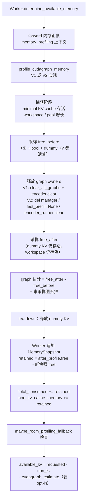

# PR #57865: [Bugfix] Account for workspace retained by graph profiling before KV sizing

> **Author**: @AndreasKaratzas | **State**: OPEN | **Date**: 2026-09-21
> **Labels**: bug, ready, nvidia, mrv2 | **Changes**: +267 -51 across 6 files
> **ROCm 相关性**: 部分相关（PR 标签为 nvidia/mrv2，但根因是 ROCm CI + AITER 升级暴露；修改的 3 个源文件全部是 CUDA/ROCm 共享的 V1/V2 worker 内存画像路径，且测试 skipif 从 `is_cuda()` 扩到 `is_cuda_alike()`，明确覆盖 ROCm）
> 本报告分两部分：§1–6 为 PR 详细总结，§7–8 为 ROCm review 意见。

---

## 1. 总结 (Summary)

vLLM 在 graph 捕获（capture）阶段分配的持久 workspace（如 aiter prefill scratch）从未计入 KV cache 容量预算：2025 年 7 月 #49208 把 graph profiling 移出了 forward 内存画像的上下文，导致其快照不再覆盖 graph setup 期间留存的分配。本 PR 重构 V1（`gpu_model_runner.py`）与 V2（`cudagraph_utils.py`）的 graph 内存测量方式——从"捕获时逐图采样"改为"释放时测 free-memory 差值"——并在 worker 侧对 profiling 前后各拍一次快照，把留存 workspace 无条件计入 `total_consumed` / `non_kv_cache_memory`，从而在 KV cache sizing 之前预留出这部分内存。

## 2. 背景与动机 (Background & Motivation)

- **触发链路**：#49208 把 graph profiling 移出 forward 内存画像上下文 → graph setup 期间首次留存下来的分配（workspace）落在 KV sizing 使用的 closing snapshot 之外 → 老账本缺口一直存在。
- **暴露事件**：2026 年 9 月 AITER 升级（vLLM #56885）后，上游 [AITER #3606](https://github.com/ROCm/aiter/pull/3606) 作为正确性修复把 prefill scratch 分配调大，使这笔"无预算"的分配大到足以耗尽剩余显存——ROCm CI build 90039 的 job 因此失败。**这是 PR 的直接动机。**
- **双重修复**：(1) graph 估计值只算"释放掉的 graph 内存"（released graphs），"留存 workspace"（retained workspace）改由 worker 的 post-profiling 快照收费——即使 `VLLM_MEMORY_PROFILER_ESTIMATE_CUDAGRAPHS` opt-in 关闭，留存内存也必须预留；(2) V2 的 `FastPrefillHelper` 在测量前释放，避免其对 graph manager 的引用把 profiling pool 吊住。
- **Related work**：#51590 与本题大量重叠但把 setup/workspace 和临时 KV 都算进 graph 估计；#46883 是早期 FlashInfer reservation 方案。作者明确声明本实现保留采样、分离 persistent/released、覆盖 V2，且不需要 backend opt-in。PR 描述注明 "Implementation, investigation, tests, and this description were AI-assisted."（已披露）。

## 3. 代码修改分析 (Code Change Analysis)

### 3.1 修改的模块

| 模块 | 文件 | 改动 |
|------|------|------|
| Worker 内存核算 | `vllm/v1/worker/gpu_worker.py` (+9) | graph profiling 后追加 `MemorySnapshot`，把 free-memory 下降量（retained workspace）加进 `total_consumed` / `non_kv_cache_memory`，并用新快照替换 `after_profile` |
| V1 graph 测量 | `vllm/v1/worker/gpu_model_runner.py` (+25 -16) | `profile_cudagraph_memory` 从"first-capture + per-graph 外推"改为"捕获后采样 free → clear_all_graphs → 再采样 free，差值 = released graph 内存"，只对未采样图外推 |
| V2 graph 测量 | `vllm/v1/worker/gpu/cudagraph_utils.py` (+28 -17) | 同样改为释放差值测量；释放顺序调整为：drop manager 引用 / `fast_prefill = None` / encoder clear → **测量** → teardown（dummy KV 在测量期间保持存活） |
| 测试 | `tests/v1/worker/test_gpu_model_runner.py` (+80) | V1 fake 内存计数器单测：验证 pool 内存计入估计、warmup 留存 workspace 排除在估计之外 |
| 测试 | `tests/v1/worker/test_gpu_model_runner_v2_cudagraph_profiling.py` (+74 -18) | 新增 workspace 阶段参数化测试；真实 GPU 测试（`torch.cuda.CUDAGraph` + 真实 pool）从 `is_cuda()` 扩展到 `is_cuda_alike()` |
| 测试 | `tests/v1/worker/test_gpu_worker.py` (+51) | worker 预算回归：graph setup 留存的 workspace 计入 budget，估计值仅按 opt-in flag 扣减 |

### 3.2 架构 / 流程图



核心核算契约：**released graph 内存 → graph 估计（受 opt-in flag 控制）；retained workspace → worker 预算（无条件生效）**。两个 runner 各自实现同一契约。

### 3.3 关键实现细节

- **V1**（`gpu_model_runner.py:6726-6826`）：新增 `free_before_graph_cleanup` / `sampled_graph_memory` / `uncaptured_memory_estimate` 三个变量；`first_capture` 与 `encoder_memory_estimate` 仍被测量但只用于 debug 日志；`total_estimate = sampled_graph_memory + uncaptured_memory_estimate`。
- **V2**（`cudagraph_utils.py:900-966`）：`capture_model(profile_only=True)` 的返回值不再使用；新增 `free_with_graphs` / `graph_memory` / `uncaptured_graph_memory`；`_teardown_profiling_state` 不再负责释放 manager / encoder / fast_prefill，这些引用在测量**之前**被显式置空。
- **Worker**（`gpu_worker.py:591-599`）：`after_cudagraph_profile = MemorySnapshot(device=self.device)`；`retained_memory = max(profile_result.after_profile.free_memory - after_cudagraph_profile.free_memory, 0)`；随后 `+=` 进两个字段并替换 `profile_result.after_profile`。
- **快照替换的副作用**：下游 `free_gpu_memory`、`maybe_rocm_profiling_fallback` 内部的 `torch_reserved` 计算、`maybe_apply_startup_plan` 消费的都是新快照——这意味着 fallback 的 torch-reserved 下界现在也覆盖 graph profiling 窗口内留存的 torch 分配。

## 4. 涉及的技术原理 (Technical Principles)

- **vLLM 内存画像与 KV sizing**：启动时用 dummy 输入跑一次 forward，记录前后 free-memory 快照得到 `total_consumed` / `transient_peak_headroom`；`available_kv_cache = requested_memory - non_kv_cache_memory - cudagraph_memory_estimate_applied`。graph 估计受 `VLLM_MEMORY_PROFILER_ESTIMATE_CUDAGRAPHS` opt-in 控制，而本次修复的 retained workspace 收费是无条件的。
- **CUDA/HIP graph pool 语义**：`torch.cuda.graph(pool=handle)` 捕获时，图的中间激活与 exec 对象从 mempool 分配（mempool 由 driver 保留，计入 `cudaMemGetInfo`/`hipMemGetInfo` 的 used 部分）。torch 侧以 use_count 跟踪 pool：最后一个使用该 pool 的 graph 销毁时 pool 被释放、内存还给 driver——这正是"释放差值测量"能测到 pool heap 的前提（V2 代码注释里的 `use_count > 0 INTERNAL ASSERT FAILED` 印证了这套语义）。因此测量必须在**所有** graph 引用（manager、fast_prefill、encoder）drop 之后进行。
- **FULL graph 必须先于 KV sizing 采样**：FULL graph 把 KV cache 指针 bake 进图里，真实 KV 分配前只能用小 KV + throwaway pool 捕获最大的几个图做外推；throwaway pool 避免在主 pool 中留下碎片。V1 中 FULL/PIECEWISE 共享一个 pool，释放差值天然反映 overlay 关系，不再需要旧代码的 `max(shared_estimate)` 叠加逻辑。
- **ROCm profiling fallback**：`maybe_rocm_profiling_fallback`（`gpu_worker.py:116`）在 `total_consumed < 0`（画像期间 free 不降反升，说明同机其他进程释放了显存，AMD CI 组机器常见）时，改用 torch reserved 的增量作为 KV sizing 的下界。
- **触发本 bug 的 aiter 面**：ROCm V1/V2 的 attention scratch（aiter 算子所需 prefill workspace）在 graph profiling 期间首次分配并留存；AITER #3606 调大该分配后，这笔从未计入预算的内存直接导致 KV sizing 后 OOM。

## 5. 评论区讨论亮点 (Discussion Highlights)

- 无 maintainer 的 inline review 或实质设计辩论（fork PR，claude[bot] 提示自动 review 需 maintainer 手动触发）。
- 作者对 nightly CI（build 90134）的全部 8 个失败 job 逐一分类并附证据：GH200 wheel 超 500MiB、XPU HF 503、AMD extended pooling 夹具超时（#57864）、AMD extended generation 1 选了 ROCm 不支持的 `FLASHMLA_SPARSE_DSV41`（#56625）、NVIDIA extended generation 1 的 `GPU<->CPU sync`（#56625，本地 MI300 复现于 base 与 head 一致）、H100 DeepEP 超时（main 复现）、Quantized models 挂起（main 复现）、DFlash KV 分配失败（main 上 -0.53 GiB vs 本 PR -0.49 GiB，略有改善但预存失败）。分类质量高，全部指向预存问题。
- PR body 对 #51590 / #46883 的取舍说明清楚：保留采样、分离 persistent/released、覆盖 V2、无需 backend opt-in。

## 6. 风险与潜在问题 (Risk Analysis)

| 风险 | 严重程度 | 说明 |
|------|---------|------|
| 正确性 — V1 释放测量未在真实硬件上验证 | High | 见 §7 Finding 2：V1 只有 fake 计数器单测，释放差值机制（pool 在最后一个 graph 销毁时归还 driver）仅由 V2 的真实 GPU 测试背书 |
| 正确性 — ROCm profiling fallback 与 retained 核算的交互 | Medium | 见 §7 Finding 1：fallback 触发时会整体覆盖 `+= retained`；触发条件也被 retained 前置偏移 |
| 兼容性 — 可用 KV 变小是行为变化 | Medium | retained workspace 无条件收费（本意如此），所有用户（含 opt-out 用户）的可用 KV 都会比旧版小；若 workspace 测量过度保守（如把本可复用的内存算死），会白损失容量 |
| 测试覆盖 | Medium | V1 fake 单测的 `clear_all_graphs` 假实现把 pool 内存直接还给 free 计数器，建模的行为真实代码不一定兑现；真实 GPU 测试只覆盖 V2 |
| 可维护性 | Low | 同一核算契约在 V1/V2 双实现，未来改动需同步维护；`first_capture` / `encoder_memory_estimate` 只剩日志用途，见 Finding 3 |

---

## 7. Review 意见 (Findings)

意见类型 × 数量：⚠️ 建议修复 ×2，📝 建议/备注 ×1。无 🔴。

**⚠️【正确性】ROCm profiling fallback 会覆盖 retained 核算，且其触发窗口被 retained 前置偏移** `[已验证]`（代码级；运行时影响为推断）
- **问题**：`gpu_worker.py:597-599` 先把 `retained_memory` 加进 `total_consumed` / `non_kv_cache_memory`，随后 `gpu_worker.py:610` 调用 `maybe_rocm_profiling_fallback`，其触发时在 `gpu_worker.py:624-626` **整体覆盖**这两个字段（`total_consumed = rocm_fallback`）。两个后果：
  1. **覆盖**：fallback 路径上 `+= retained` 被丢弃。缓解因素是本 PR 的快照替换（`after_profile = after_cudagraph_profile`，599 行）让 fallback 的 `torch_reserved = after_profile.torch_memory - baseline.torch_memory` 覆盖到 graph profiling 窗口——**torch 分配器内**的留存 workspace（aiter scratch 若经 `torch.empty` 分配）会被计入；但**非 torch 分配器**分配（raw `hipMalloc`、aiter 内部池）仍无预算。触发环境恰是本 PR 要修的 AMD CI 组机器（fallback docstring 明确 "Kept to ROCm, where the AMD CI groups hit this"）。
  2. **触发窗口偏移**：`total_consumed` 先加 retained（≥0）再做 `< 0` 判断，fallback 的触发条件从"画像期间 free 增长超过 consumed"收紧为"增长超过 consumed + retained"；中间地带的场景会静默使用被同机进程污染过的 free-memory 测量（total_consumed 低估最多 retained 量级），KV cache 相应多分、同机进程回收显存时可能 OOM。
- **影响**：在 ROCm 共享 GPU（AMD CI 组）上，修复效果取决于留存 workspace 是否全部经 torch 分配器分配；且部分干扰场景下行为与旧版不一致。
- **行动**：建议作者在 fallback 分支同样加上 retained 核算（或在 `torch_reserved` 基础上显式补上非 torch 分配的 workspace），并考虑用加 retained **之前**的 `total_consumed` 做 fallback 触发判断。

**⚠️【测试】V1 的释放差值测量缺乏真实硬件验证** `[已验证]`
- **问题**：V1（`gpu_model_runner.py:6810-6819`）的 `sampled_graph_memory` 依赖"最后一个使用 profiling pool 的 graph 销毁时，torch 把 pool heap 还给 driver"这一 use_count 语义；该语义由 V2 的真实 GPU 测试（`test_profile_cudagraph_memory_frees_throwaway_pool`，真实 `torch.cuda.CUDAGraph` + 真实 pool）背书，但该测试只覆盖 V2 的所有权模型（显式 drop manager / fast_prefill 引用后再测）。V1 的测量窗口内 `profiling_pool` / `encoder_profiling_pool` 仍被函数局部变量引用，且 `encoder_cudagraph_manager.clear()` 是否 drop 全部 graph 引用未验证；V1 唯一的单测用 fake 计数器把 `clear_all_graphs` 建模为"直接归还 pool 内存"，真实代码若不符合该模型，估计值会静默低估（KV 过大 → 真实捕获 OOM），测试无法发现。
- **影响**：V1 + `VLLM_MEMORY_PROFILER_ESTIMATE_CUDAGRAPHS=1` 的用户（含 ROCm V1）依赖一个未经验证的测量机制；低估的后果是真实 graph 捕获阶段 OOM。
- **行动**：建议作者为 V1 补一个与 V2 对称的真实 GPU 测试（真实 graph + 真实 pool，断言估计值 ≥ 实际 pool 占用），或在 CUDA 与 MI300 上人工验证 V1 估计值与真实捕获内存一致。

**📝【可维护性】V1 的 `first_capture` 与 `encoder_memory_estimate` 只剩日志用途** `[已验证]`
- **问题**：`gpu_model_runner.py:6761` 的 `first_capture` 与 6798 附近的 `encoder_memory_estimate` 仍被测量并写入 debug 日志（6770-6774 行日志以 "first-capture" 为标题），但新估计公式（6826 行）完全不再使用它们；释放差值若低估，没有任何信号提示。
- **影响**：调试时日志数字与最终估计脱节，容易误导排查方向。
- **行动**：建议作者在 debug 日志中对比 `sampled_graph_memory` 与 `first_capture`（相差显著时打 warning），或删掉不再参与计算的测量项。

## 8. 结论 (Verdict)

⚠️ **NEEDS WORK** — 无 🔴 阻塞项。核心设计（released-graph 与 retained-workspace 分离核算、快照替换修复 fallback 路径）是正确且论证充分的，CI 分类也扎实；但 ROCm fallback 与 retained 核算的交互（Finding 1）和 V1 释放测量缺硬件验证（Finding 2）值得在合入前处理或至少在 PR 内给出验证证据。

## 9. 英文 Review 评论 (Copy-Paste English Comments)

**C1** `vllm/v1/worker/gpu_worker.py:591-599` — ⚠️ comment

```text
On ROCm, when `maybe_rocm_profiling_fallback` fires (free memory grew during
profiling — the AMD CI group scenario this bug was found in), lines 624-626
overwrite `total_consumed` / `non_kv_cache_memory` entirely, discarding the
`retained_memory` added here. The snapshot replacement does extend the
fallback's `torch_reserved` window to cover graph profiling, so torch-allocator
retained workspace is counted, but any retained allocation made outside the
torch allocator (raw hipMalloc / aiter-internal pools) is still unbudgeted on
that path. There is also a subtler interaction: adding `retained_memory` to
`total_consumed` before line 610 narrows the fallback's trigger condition
(`total_consumed < 0`) by the retained amount, so intermediate interference
levels now silently size from the polluted free-memory measurement instead of
falling back. Could you add the retained charge to the fallback branch as well
(or confirm all retained workspace is torch-allocated), and consider
evaluating the fallback condition on the pre-retained `total_consumed`?
```

**C2** `vllm/v1/worker/gpu_model_runner.py:6810-6819` — ⚠️ comment

```text
The V1 release-delta measurement relies on torch destroying the profiling
graph pool when the last graph captured into it is destroyed (the use_count
semantics validated for V2 by
`test_profile_cudagraph_memory_frees_throwaway_pool` with real pools), but V1
has no equivalent real-GPU test: the unit test in
`test_graph_profile_excludes_retained_workspace_and_minimal_kv` models
`clear_all_graphs` as directly returning pool memory to the free counter. If
the real mechanism diverges (e.g. `encoder_cudagraph_manager.clear()` keeps a
graph reference, or the pool handle locals keep the heap reserved), the
estimate silently undercounts and the oversized KV cache OOMs at real capture
for V1 users with `VLLM_MEMORY_PROFILER_ESTIMATE_CUDAGRAPHS=1`. Could you add a
V1 real-GPU test mirroring the V2 one (capture real graphs into a throwaway
pool, assert the estimate covers the pool baseline), or share hardware
verification results for the V1 path on CUDA and MI300?
```

**C3** `vllm/v1/worker/gpu_model_runner.py:6770-6774` — 📝 comment

```text
Minor: `first_capture` (and `encoder_memory_estimate`) are still measured and
logged as "first-capture", but the new estimate at line 6826 no longer uses
them. If the release-delta measurement ever undercounts (e.g. a pool that was
not actually released), nothing in the logs would hint at it. Consider
comparing `sampled_graph_memory` against `first_capture` in the debug log and
warning when they diverge significantly, or dropping the now-unused
measurements.
```
