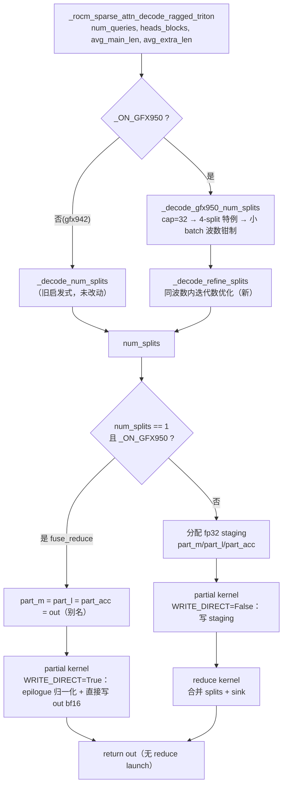
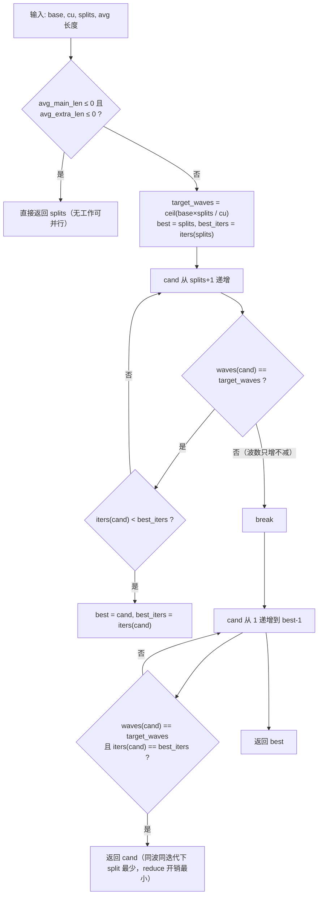
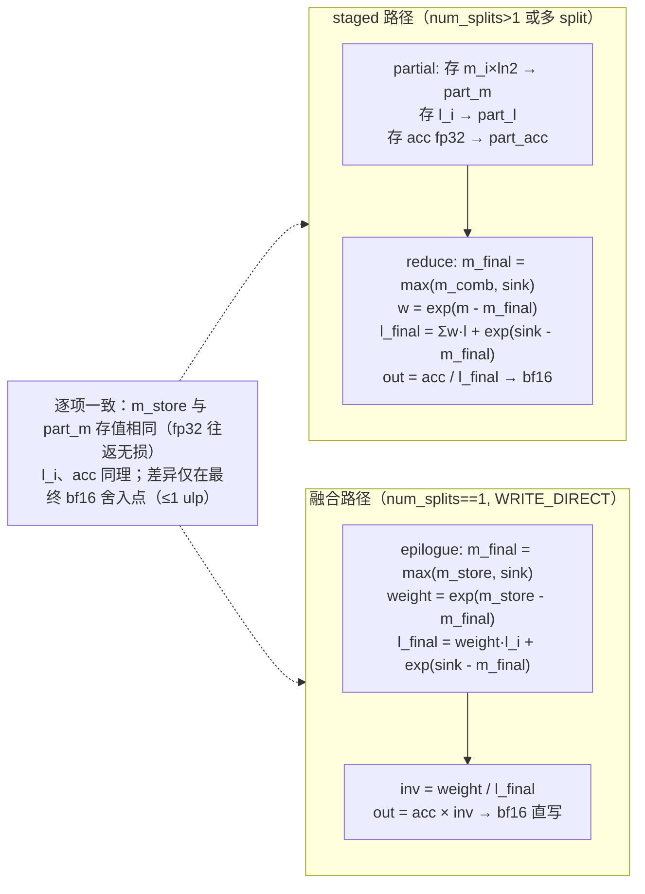

# PR #57880: [ROCm][DSv4][DSV4.1][Perf] Fill decode wave counts and fuse the reduce at one split

> **Author**: @Fangzhou-Ai | **State**: OPEN | **Date**: 2026-09-21
> **Branch**: `Fangzhou-Ai:decode` → `vllm-project:main` | **Labels**: performance, rocm, DSv4, DSv4.1
> **Changes**: +123 -23 across 1 file | **ROCm 相关性**: 完全相关
> 本报告分两部分：§1–6 为 PR 详细总结，§7–8 为 ROCm review 意见。

---

## 1. 总结 (Summary)

本 PR 对 ROCm (gfx950) 上 DeepSeek V4/V4.1 稀疏 MLA decode 的 split-K Triton 路径做了两项性能优化：(1) 重写 split 数启发式的收尾逻辑 —— 在波数（wave count）相同的候选 split 数之间，选择每个 workgroup 走最少 `BLOCK_K` 迭代的那个，必要时**增加** split 数而不是只减小；(2) 当启发式选出 `num_splits == 1` 时，把 reduce kernel 融合进 partial kernel 的 epilogue —— 直接在寄存器里完成 softmax 归一化（含 attention sink 折叠）并写出 bf16 结果，跳过 fp32 staging buffer 往返和第二次 kernel launch。单文件改动（`vllm/v1/attention/ops/rocm_aiter_mla_sparse.py`），kernel 级 sweep 在 46 个受影响形状上几何平均 1.139x、零回归，端到端 serving 在 TP=4、并发 32 处测得 1.0344x。

## 2. 背景与动机 (Background & Motivation)

DSv4 稀疏 MLA decode 的 split-K 机制是为了给低并发 decode 增加并行度：把每行的 KV 序列切成 `num_splits` 段，由多个 workgroup 并行计算 partial 状态（`part_m`/`part_l`/`part_acc`），再由 reduce kernel 合并。但作者指出两个系统性浪费：

1. **启发式留下的迭代空间**：旧逻辑只把 split 数"向下吸附"到同波数、同迭代数的最小值，从不向上探索。而波数（`ceil(base × splits / CU)`）决定设备排空次数，workgroup 迭代数决定每次排空时长 —— 在同波数内，更多 split 能让每次排空更短，且"多出来的 split 搭在已经付过钱的波里"。典型场景：batch 96、2 个 head block 时，3 splits 与 4 splits 都占 3 个波，但 4 splits 每个 workgroup 只走 5 次迭代（vs 3 splits 的 8 次）。
2. **单 split 时 split-K 机制纯属开销**：当行数填满设备（高并发、长 spec-decode —— 恰好是决定 decode 吞吐的点），启发式选 1 split。此时 partial kernel 把 fp32 运行状态写进 staging buffer，reduce 立刻读回、除以 l、存成 bf16 —— 一次完整的内存往返加第二次 launch，去完成 partial kernel 寄存器里已有的工作。

PR 的 roofline 分析（MI355X：576B 随机 gather 3.4 TB/s、流式 4.63 TB/s、decode MFMA tile 232 TFLOP/s、graph-replay launch 单 kernel 10.8 us / 双 kernel 12.5 us）进一步定位：低行数区间的瓶颈是 launch + KV gather，融合直接砍掉其中一块；而大行数区间 gather/MFMA 无重叠的剩余空间需要 kernel 重构，明确留给后续 PR。

## 3. 代码修改分析 (Code Change Analysis)

### 3.1 修改的模块

单文件 `vllm/v1/attention/ops/rocm_aiter_mla_sparse.py`，四处改动：

| 位置 | 改动 |
|------|------|
| `_sparse_attn_decode_gfx950_partial_kernel` (L2585) | 新增 4 个运行期参数（`attn_sink_ptr`、`out_ptr`、`out_stride0/1`）与 2 个 constexpr（`HAS_ATTN_SINK`、`WRITE_DIRECT`）；新增 WRITE_DIRECT 分支：单 split 时在 epilogue 完成归一化并直接写 `out`，跳过 staging 存储 |
| `_decode_refine_splits` (L3305, 新函数) | 同波数内迭代数优化的 split 细化：先向上找更少迭代的候选，再向下取同迭代的最小 split |
| `_decode_gfx950_num_splits` (L3350) | 旧 `return 4` 改为 `num_splits = 4` 后继续走 refine；旧 snap-down 循环整体替换为 `_decode_refine_splits` 调用 |
| `_rocm_sparse_attn_decode_ragged_triton` (L3385) | 新增 `fuse_reduce = _ON_GFX950 and num_splits == 1` 门控；融合时 `part_m = part_l = part_acc = out` 别名传参（kernel 不解引用）并跳过 reduce launch 直接 `return out` |

### 3.2 架构 / 流程图

**图 1：decode 调度的融合分支（host 侧）**



**图 2：`_decode_refine_splits` 算法（新函数）**



**图 3：融合 epilogue 与 staged 路径的数值等价性（两种路径）**



### 3.3 关键实现细节

- **WRITE_DIRECT 分支**（kernel L2864–2903）：有 sink 时加载 per-head sink（`other=neg_large` 掩码语义与 reduce 完全一致），`m_final = max(m_store, sink)`、`weight = exp(m_store - m_final)`、`l_final = weight·l_i + exp(sink - m_final)`；无 sink 时 `weight = 1`、`l_final = l_i`。随后 `inv = where(l_final > 0, weight / max(l_final, 1e-30), 0)`，四个 128 维 chunk（`nope_0a/0b/1 + tail_128`）乘以 `inv` 后以 `out_dtype`（bf16）直写 `out`，偏移与 staged 路径 `part_acc` 布局逐字节对应。
- **数值域约定**：partial 的在线 softmax 在 log2 域（`exp2`），存 staging 前乘 `ln2` 转自然对数域（`m_store = m_i × 0.6931…`）；reduce/fusion 用 `tl.exp` 消费该值。sink 按 ln 域质量处理 —— 与 aiter 路径 `torch.logaddexp(lse, self.sinks)`（backend L1009）的约定一致，融合分支逐项复刻 reduce 的 sink 数学。
- **空行/掩码头的退化行为**：`l_i = 0` 的行 `m_store = neg_large`（有限值 -FLT_MAX，非 -inf，避免 `exp(0)` 的 NaN 来源问题）；融合与 staged 两条路径在该边界上的输出均为 0（acc 初始为零），无实际分歧。
- **别名传参**：融合时 host 把 bf16 的 `out` 以 `part_m/part_l/part_acc` 的角色传入 kernel。WRITE_DIRECT 编译变体下这三个指针永不被解引用（epilogue 存储被 `return` 跳过；ADAPTIVE_SPLITS 早退分支因 host 侧 `num_splits > 4` 门控不可达）。
- **启发式**：`_decode_refine_splits` 两个循环 —— 先向上（`splits+1..32`）在波数不变时取迭代数严格更小的候选（`waves(s)` 单调，`break` 安全）；再向下（`1..best-1`）取波数相同且迭代数相同的**最小** split（reduce 开销最小）。`avg 长度 ≤ 0` 时直接返回。`max_splits=32` 与 `_decode_gfx950_num_splits` 的 `min(32, …)` cap 一致。
- **4-split 特例语义变化**：旧代码在 `base ≥ 16 ∧ num_splits > 4 ∧ iters(4) ≤ 3` 时直接 `return 4`；新代码设为 4 后继续 refine（可微调到 5/6…，同波数内）。此时 host 侧 `adaptive_splits` 门控（`num_splits > 4`）可能被翻转，但 kernel 的 ADAPTIVE_SPLITS 机制按设计处理（运行时 `work_splits` 动态缩减，多余 split 写 `neg_large` 退出）。

## 4. 涉及的技术原理 (Technical Principles)

- **Split-K flash decode**：decode 场景 workgroup 数 = `num_queries × heads_blocks`，低并发时远填不满设备。把 KV 序列切 `s` 段并行，每段 workgroup 维护在线 softmax 运行状态（max `m_i`、sum `l_i`、加权累加 `acc`），reduce 阶段合并：全局 max 取各 split 的 max，权重 `w_s = exp(m_s − m_final)`，输出 `Σ w_s·acc_s / (Σ w_s·l_s)`。**波数模型**：`waves = ceil(base × s / CU)` 是设备排空次数，workgroup 迭代数是每次排空时长 —— 同波数内"更多 split 搭便车"是本次启发式改动的核心依据。
- **在线 softmax 的数值域**：kernel 内 `m_i` 在 log2 域（`exp2` 指令更快），跨界（staging/reduce）时乘 `ln2` 转自然对数域，使 reduce 的 `exp(m − m_final)` 直接给出正确比值。融合分支必须沿袭同一约定，否则 sink 的 `max`/`exp` 混域比较会静默错值。
- **Attention sink**：DSv4 稀疏 MLA 的 per-head sink 以**额外 token 的质量**参与 softmax（`m_final = max(m, sink)`、`l += exp(sink − m_final)`），sink 值按 ln 域存储 —— 与 aiter 算子路径的 `logaddexp(lse, sinks)` 一致。
- **CUDA graph 回放下的 launch 开销**：MI355X 上 graph-replay 双 kernel launch 约 12.5 us（单 kernel 10.8 us），低行数（≤48 行）区间 launch 占主导 —— 融合省掉一次 launch 与 staging 往返，是低行数区间收益的直接来源。
- **fp8_ds_mla 压缩 KV 与 gfx950**：KV 以 576B/block 的 fp8 压缩布局存放（fnuz/OCP 由 dtype 区分），decode 的 KV 访问模式是 576B 随机 gather，实测 3.4 TB/s 上限 —— PR 的 roofline 以此建模"gather-bound"区间。

## 5. 评论区讨论亮点 (Discussion Highlights)

- 评论极少：mergify bot 提示 **PR 有 merge conflict，需 rebase**；claude bot 仅发自动消息（fork PR 自动 review 被禁用）。
- 无实质 review 讨论。PR 描述本身值得注意 —— 方法论异常严谨：kernel 级对比采用同进程内 back-to-back 交替计时取中位数（因为"重测同代码跨 session 漂移几个百分点"）；端到端 A/B 在单节点两个 4-GPU half 上并发运行、交换 half 复测以排除系统性差异；并用 Amdahl 定律把 kernel 级加速换算到端到端预期（+0.58/+0.00/+0.75/+3.18% vs 实测 +0.49/−0.09/+0.75/+3.44%，各点偏差 ≤0.26 点）。此外还记录了测量方法的坑（采样窗口内 token 限未到才会被计数）。

## 6. 风险与潜在问题 (Risk Analysis)

| 风险 | 严重程度 | 说明 |
|------|---------|------|
| 正确性 | 中 | 融合 epilogue 与 reduce kernel 数学已逐项核对一致（含 sink 的 ln 域约定、空行/掩码头的 `neg_large` 退化路径、`1e-30` 下界）；fp32 staging 往返无损，唯一差异是最终 bf16 舍入点（作者实测 ≤1.2e-4 ≈ 1 bf16 ulp），GSM8K 1319 题严格/灵活匹配均与基线一致到 4 位小数。 |
| 兼容性 | 中 | gfx942 路径未触及（`fuse_reduce` 与 `_decode_refine_splits` 均由 `_ON_GFX950` 或 gfx950 专属函数限定）；隐式不变量 `WRITE_DIRECT ⟺ num_splits==1 ∧ ADAPTIVE_SPLITS=False` 依赖两处分离代码的耦合，kernel 内无断言保护 —— 见 §7 Finding 1。 |
| 性能 | 低 | 数字可溯源到 PR 描述的方法论（192 形状 sweep、GPU-half swap A/B、Amdahl 交叉验证，内部一致性良好），但 benchmark 脚本未随 PR 提交、ROCm 版本未注明，无法独立复现；refine 可能产生旧启发式不会出现的新 split 值（如 5/7/9），带来少量额外 JIT 编译变体（有缓存摊销）。 |
| 测试覆盖 | 中 | 融合路径被现有测试覆盖：`test_sparse_attn_decode_split_k_kernel` 用 monkeypatch 固定 `num_splits=1`，与 torch reference 对照 `with_extra × with_sink` 全组合（作者报告 MI355X 上 72 passed）；但 `_decode_refine_splits` 的新增行为无直接单测 —— 见 §7 Finding 2。 |
| 可维护性 | 低 | `part_m = part_l = part_acc = out` 的别名传参依赖"kernel 不解引用"的约定，仅靠注释说明；合并后可加断言固化。 |

---

## 7. Review 意见 (Findings)

意见类型 × 数量：⚠️ 建议修复 × 3，📝 备注 × 1。无 🔴（所有候选阻断项均未通过具体触发输入 gate —— 当前代码下融合与 adaptive 路径互斥成立、数学等价性已验证）。

**⚠️【设计/可维护性】WRITE_DIRECT 与 `NUM_SPLITS==1`、`ADAPTIVE_SPLITS=False` 的耦合是隐式不变量，kernel 内无 static_assert 保护** `[已验证]`
- **问题**: `_sparse_attn_decode_gfx950_partial_kernel` 在 `WRITE_DIRECT=True` 时依赖两条 host 侧约定：(a) `fuse_reduce = _ON_GFX950 and num_splits == 1`（L3551）保证 `NUM_SPLITS==1` —— 若为多 split，每个 split 的 workgroup 都会写 `out`，直接数据竞争；(b) `adaptive_splits = … and num_splits > 4`（L3540–3542）保证 ADAPTIVE_SPLITS 编译变体不可达 —— 该变体的早退分支（kernel L2661–2665）会写 `part_m_ptr/part_l_ptr`，而融合时这两个指针别名到 bf16 的 `out`，写坏输出。两条约定跨三处代码隐式耦合，kernel 侧没有任何 `tl.static_assert` 把不变式固化。
- **影响**: 未来任何人调整 split 启发式（本 PR 的 refine 正是干这个的 —— 它已展示 4→5 的翻转会触发 `adaptive_splits` 门控变化）或改动 `adaptive_splits` 条件，一旦组合失效，结果是 GPU 上无崩溃的静默错值，极难定位。当前代码无具体触发输入，故非阻断。
- **行动**: 建议作者在 kernel 的 `WRITE_DIRECT` 分支加 `tl.static_assert(NUM_SPLITS == 1)`（并可加注释说明 ADAPTIVE_SPLITS 由 host 排除），把不变式从"恰好成立"变为"编译期强制"。

**⚠️【测试】`_decode_refine_splits` 的新增"增加 split 数"行为没有直接单元测试** `[已验证]`
- **问题**: `tests/kernels/attention/test_rocm_triton_attn_dsv4.py` 中 `test_decode_num_splits_gfx950` 只断言 3 个用例（`(1,1,128,8192)==32`、`(17,1,128,32)==4`、`(512,1,128,7812)==1`）。逐一代入新代码验证：这三个用例的 refine 均不改变结果（第一个用例 refine 的第二个循环因 extra 迭代数约束在 cand=32 处取不到更小值；第二个用例同波数候选迭代数无严格下降；第三个用例 `waves(2)=4≠2` 直接 break），即**新 refine 的核心行为没有任何断言固定**。docstring 中的典型场景（batch 96：3→4 splits 同 3 波、迭代 8→5）也没有对应的测试。
- **影响**: refine 是纯 Python host 函数，极易单测；其第一循环的 break 条件、第二循环的"同波同迭代取最小"语义一旦回归，现有测试套件全绿也无法察觉。
- **行动**: 建议作者在 `test_decode_num_splits_gfx950` 中补充 refine 行为断言：docstring 的 batch-96 场景、同波数内迭代下降的用例、`avg 长度 ≤ 0` 的直通路径、以及 `max_splits` 边界。

**⚠️【兼容性/流程】PR 存在 merge conflict，且 CI 状态未知** `[已验证]`
- **问题**: mergify bot 评论要求 rebase（PR 与 main 有冲突，当前无法合并）；fetch 的 checks 数据为空（fork PR 的 CI 通常需 maintainer 批准才运行）。本文件是 DSv4/V4.1 稀疏 MLA decode 的**生产路径**（经 `rocm_sparse_attn_decode` 公共入口被 serving 路径调用），且改动触及 softmax 数值路径（融合 epilogue）与调度启发式。
- **影响**: 无法合并；若 AMD CI 队列未在该 PR 上执行，ROCm 路径的覆盖缺口会让静默数值问题有机会合入 main（作者在 MI355X 上自测了 72 个 kernel 测试 + e2e，但不能替代 CI）。
- **行动**: 作者应当 rebase 解决冲突；review 时建议确认带 rocm label 的 AMD CI 队列在本 PR 上执行且通过后再合并。

**📝【可维护性】融合路径的 staging buffer 别名传参依赖"kernel 不解引用"约定** `[已验证]`
- **问题**: `part_m = part_l = part_acc = out`（L3553）把 bf16 的 `out` 以 fp32 staging buffer 的角色传入 kernel。Triton 按实参推导指针类型，bf16 指针上 store fp32 也合法，因此这一别名的安全性完全依赖 WRITE_DIRECT 编译变体不触碰这三个指针（当前成立：早退分支被 ADAPTIVE_SPLITS 门控排除、epilogue 存储被 `return` 跳过）。
- **影响**: 未来在此 kernel 中新增 staging 相关代码时，编译器不会给出任何提示。
- **行动**: 建议作者在该行补一句注释明确"安全性依赖 WRITE_DIRECT 变体不解引用；kernel 侧已加 static_assert"（与 Finding 1 配套，Finding 1 落地后本条即被覆盖）。

## 8. 结论 (Verdict)

**⚠️ NEEDS WORK** — 核心改动质量高：融合 epilogue 与 reduce kernel 的数学等价性经逐项核对成立（含 sink ln 域约定、空行/掩码边界），现有测试确实覆盖 `num_splits=1 × sink × extra` 全组合，性能方法论与交叉验证（Amdahl、GPU-half swap）在 vLLM PR 中属上乘。但 PR 当前有 merge conflict 无法合并，且有两个值得落地的小修复（kernel 不变式 static_assert、refine 新行为的直接单测）—— 均为低成本改动，不构成阻断。

## 9. 英文 Review 评论 (Copy-Paste English Comments)

**C1** `vllm/v1/attention/ops/rocm_aiter_mla_sparse.py:2864` — ⚠️ comment

```text
The WRITE_DIRECT path relies on two host-side invariants that are not enforced anywhere in this kernel: NUM_SPLITS == 1 (otherwise every split's workgroup would write `out`, a data race) and ADAPTIVE_SPLITS == False (its early-exit branch at the top stores to part_m/part_l, which the host aliases to `out` in fused mode). Today this holds because `fuse_reduce = _ON_GFX950 and num_splits == 1` and `adaptive_splits = ... and num_splits > 4` are mutually exclusive, but the coupling spans three separate locations and nothing catches a future refactor that breaks it — the failure mode would be silent wrong outputs on GPU. Could you add `tl.static_assert(NUM_SPLITS == 1)` here (with a brief comment noting ADAPTIVE_SPLITS is excluded by the host) so the invariant is compile-time enforced?
```

**C2** `vllm/v1/attention/ops/rocm_aiter_mla_sparse.py:3551` — ⚠️ comment

```text
Minor: when fuse_reduce is true, part_m/part_l/part_acc alias the bf16 `out` tensor and are passed as if they were fp32 staging buffers. This is safe only because the WRITE_DIRECT specialization never dereferences them (the ADAPTIVE_SPLITS early-exit store is unreachable with num_splits == 1, and the epilogue stores are skipped by the early return), but Triton gives no feedback if that ever stops being true — a bf16 pointer accepting an fp32 store compiles fine. Could you add a one-line comment here spelling out that this aliasing depends on WRITE_DIRECT never touching these pointers, cross-referencing the kernel-side static_assert (see the kernel comment above)?
```

**C3** `vllm/v1/attention/ops/rocm_aiter_mla_sparse.py:3305` — ⚠️ comment

```text
The new increase-splits behavior of _decode_refine_splits has no direct unit-test coverage: test_decode_num_splits_gfx950 only asserts three cases ((1,1,128,8192)==32, (17,1,128,32)==4, (512,1,128,7812)==1), and in each of them the refinement happens to be a no-op, so the wave-plateau logic this PR exists for is never pinned by an assertion. Since this is a pure Python function, could you add a few assertions to test_decode_num_splits_gfx950 — e.g. the docstring's batch-96 case (3 and 4 splits share the same wave count, refine picks the one with fewer per-workgroup iterations), the same-waves-same-iters snap-down to the smallest split count, and the avg-length-zero passthrough?
```
