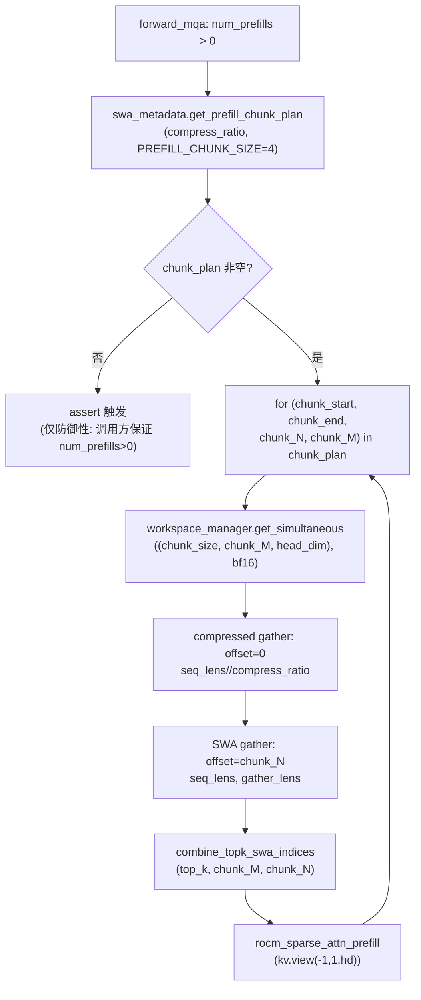
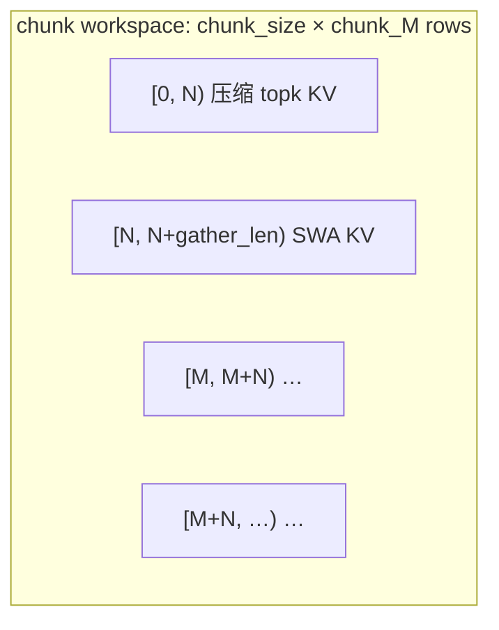

# PR #58405: [ROCm][DSv4][Perf] Use the shared prefill chunk plan in the ROCm sparse prefill

> **Author**: @ZhengGong-amd | **State**: OPEN | **Date**: 2026-09-23
> **Branch**: `ZhengGong-amd:rocm-dsv4-prefill-chunk-plan` → `vllm-project:main` | **Labels**: rocm, deepseek, DSv4, verified
> **Changes**: +11 -16 across 1 file | **ROCm 相关性**: 完全相关
> 本报告分两部分：§1–6 为 PR 详细总结，§7–8 为 ROCm review 意见。

---

## 1. 总结 (Summary)

DeepSeek-V4 ROCm MLA 的 prefill 路径此前把 prefill 请求按固定 `PREFILL_CHUNK_SIZE = 4` 分组，并按静态最坏情况（`N = ceil(max_model_len / compress_ratio)`、`M = N + window_size + max_num_batched_tokens`）预留 bf16 gather workspace。本 PR 改用 NVIDIA FlashMLA 路径（#45061）已经使用的 `DeepseekSparseSWAMetadata.get_prefill_chunk_plan()`：按 workspace 面积打包请求，每个 chunk 按真实宽度（`chunk_N` / `chunk_M`）分配 workspace 并传给 SWA gather 与 `combine_topk_swa_indices`。多 prefill 请求的 step 现在合并为更少、更大的 chunk，MI355X 上微基准提速 +3.9%～+182%（Triton 路由下限），e2e 总吞吐 +6.8%、TTFT −7.1%，且峰值显存不变、准确率持平。

## 2. 背景与动机 (Background & Motivation)

- **问题**：ROCm 的 `_forward_prefill` 固定每 4 个 prefill 请求一个 chunk。短请求场景（如 53 个 90–250 token 的请求）会产生 14 个小 chunk——kernel 启动多、每 chunk 并行度低；同时 workspace 按静态最坏情况预留（`max_model_len` 级别的 `N`），与实际需要严重脱节。
- **已有基础**：NVIDIA FlashMLA 路径（#45061）已实现共享的 area-based chunk plan——按「chunk 内请求数 × chunk 宽度」≤ 最坏面积上界来贪心打包，返回每个 chunk 的真实边界与宽度。ROCm 路径此前未接入。
- **额外收益**：gfx950 上更大的 chunk 会跨越 1024-query 阈值，从而路由到 AITER OPUS kernel（#54855），带来超线性增益（53 请求场景 +182%）。将路由钉在 Triton 时增益为 +3.9/+5.0/+17/+62%，且输出 bit-identical，说明收益来自两部分：更少的 kernel 启动/更大的并行度 + OPUS 路由。
- 由 [Hyperloom](https://github.com/AMD-AGI/Hyperloom) 发现，作者手工复测。

## 3. 代码修改分析 (Code Change Analysis)

### 3.1 修改的模块

| 文件 | 变更 | 说明 |
|------|------|------|
| `vllm/models/deepseek_v4/amd/rocm.py` | +11 −16 | `DeepseekV4ROCMAiterMLAAttention._forward_prefill`：静态 M/N → 共享 chunk plan；workspace 按 chunk 分配；`offset=chunk_N`、`chunk_M/chunk_N` 下传 |

未改动（PR 描述明确说明）：`vllm/models/deepseek_v41/amd/rocm.py` 保留了相同的旧循环。

### 3.2 架构 / 流程图



Workspace 行布局（每 chunk，请求 `r` 的行区间为 `[chunk_M*r, chunk_M*r + chunk_M)`）：



### 3.3 关键实现细节

- **Plan 来源**：`swa_metadata.get_prefill_chunk_plan(compress_ratio, prefill_chunk_size)`（`vllm/v1/attention/backends/mla/sparse_swa.py:248`）。按 `chunk_size × (chunk_max_compressed + chunk_max_gather) ≤ PREFILL_CHUNK_SIZE × (ceil(max_model_len/ratio) + window_size + max_num_batched_tokens)` 贪心打包；`gather_lens` 估计 = `query_len + clamp(prefix_len, 0, W−1)`（replay 只会缩小，是安全上界）。
- **删除**：静态 `N = ceil(max_model_len/ratio)`、`M = N + W + max_num_batched_tokens`、`num_chunks` 固定分组逻辑；workspace 从「循环外一次分配」改为「每 chunk 按 `(chunk_size, chunk_M, head_dim)` 分配」。
- **下传**：SWA gather 的 `offset` 从静态 `N` 改为 `chunk_N`；`combine_topk_swa_indices`（本文件内的本地 Triton 实现）的 `M`/`N` 参数改为 `chunk_M`/`chunk_N`。
- **新增 assert**：`assert chunk_plan, "prefill chunk plan must be non-empty when num_prefills > 0"`（防御性；调用方 `forward_mqa` 仅在 `num_prefills > 0` 时调用）。

## 4. 涉及的技术原理 (Technical Principles)

- **DSv4 稀疏注意力（Sparse SWA + 压缩 topk）**：每层同时有 SWA（sliding window）KV 与压缩 KV（compress_ratio 4 或 128，仅保留 topk 索引对应的压缩位置）。prefill 时把两个 cache 的 KV 行 gather 进 bf16 workspace，再按组合索引做稀疏 attention。
- **Workspace 布局与 M/N 语义**：请求 `r` 的行区间为 `[M·r, M·r+M)`；`[M·r, M·r+seq_len/ratio)` 放压缩 KV（topk 索引须 `< N`），`[M·r+N, M·r+N+gather_len)` 放 SWA KV（gather `offset=N`）。`M`/`N` 必须同时满足「N ≥ 每请求压缩行数」与「N + gather_len ≤ M」。
- **vLLM V1 workspace manager**：`get_simultaneous` 返回同一 per-(ubatch, lane) 大 buffer 的视图，buffer 只增长到历史最大请求；capture 后 `lock()`，运行期超过已预留大小直接 AssertionError。因此「warmup 预留 ≥ 运行期每 chunk 需求」是正确性前提。
- **gfx950 OPUS 阈值（#54855）**：AITER OPUS kernel 在 query 数超 1024 时启用；chunk 变大后更容易跨过阈值，属于本 PR 在 gfx950 上的附加收益来源。

## 5. 评论区讨论亮点 (Discussion Highlights)

- **simondanielsson（AMD）**：首轮 review LGTM（"battle tested in nv implementation"），但建议把 chunk-plan 单元测试移到公共模块，让 ROCm 也能跑；随后追问作者确认测试运行范围。
- **AndreasKaratzas**：质疑为何要移动测试文件（是否 NVIDIA 专属），要求澄清。
- **作者回应**：确认 `tests/kernels/attention/test_flashmla_sparse.py` 已在 AMD 上运行——`test-amd.yaml` 的 `(MI300) Attention Kernels` job 跑整个 `kernels/attention` 目录（nightly 而非每 PR）。因本 PR 不改 `get_prefill_chunk_plan()`，作者撤回测试移动，PR 回到单文件改动；DCO 也已修复。
- **CI**：最新 head（09-29）pre-commit、DCO、pre-run-check 全绿；09-27 旧版本曾有一次 pre-run-check 失败（当时带测试移动），已随 rebase 解决。

## 6. 风险与潜在问题 (Risk Analysis)

| 风险 | 严重程度 | 说明 |
|------|---------|------|
| 正确性 — chunk_M/chunk_N 语义 | 低 | 已验证：plan 的 `chunk_N = max floor(seq_len/ratio)`、`chunk_M = chunk_N + max gather` 满足布局不变式（含 image/left-right visibility 场景，见 §7 验证过程） |
| 兼容性 — v41 兄弟路径未同步 | 中 | `deepseek_v41/amd/rocm.py` 保留旧循环；见 §7 发现 3 |
| 测试覆盖 — TP>1 / gfx942 | 中 | 全部测试 TP=1、gfx950；见 §7 发现 1、4 |
| 性能 — 峰值显存 | 低 | 已验证：每 chunk 面积 ≤ warmup 预留（`forward_mqa` 预留的就是旧静态最坏情况），且 workspace manager 单 buffer grow-to-max 不叠加 |
| 可维护性 — 与 NVIDIA 孪生路径 | 低 | 本 PR 使 ROCm 循环与 `nvidia/flashmla.py` 结构一致；本地 `combine_topk_swa_indices` 与 NVIDIA 版实现不同属既有差异，非本 PR 引入 |

---

## 7. Review 意见 (Findings)

| 意见类型 | 数量 |
|---------|------|
| 🔴 必须修复 | 0 |
| ⚠️ 建议修复 | 2 |
| 📝 建议/备注 | 2 |

**⚠️【测试】TP > 1 场景未覆盖** `[已验证]`
- **问题**: PR 的全部测试（微基准、e2e、GSM8K）都在 TP=1 下完成。chunk plan 本身按 per-request 长度计算、与 TP 无关，head_dim 也不随 TP 变化，理论风险低；但 DSv4 稀疏 prefill 的 c128a topk 元数据、`rocm_sparse_attn_prefill` 在 TP=4/8（head 切分）下的行为未经本次改动后的验证。
- **影响**: 低概率的 TP>1 专属回归（如分头后 shape/索引假设）无法被现有证据排除。
- **行动**: 建议作者补充一次 TP=4 或 TP=8 的 prefill 冒烟测试（可复用现有 e2e 脚本），或在 PR 描述中说明 TP>1 无风险的理由。

**⚠️【测试】AMD CI 未在本 PR 上运行** `[已验证]`
- **问题**: 本 PR 来自 fork，check-runs 只有 pre-commit / DCO / pre-run-check（全绿），`.buildkite` 的 AMD 队列（test-amd.yaml）未触发。chunk plan 的单元测试只在 MI300 nightly 的 `(MI300) Attention Kernels` job 覆盖，本 PR 的集成改动（ROCm `_forward_prefill` 循环）没有被 CI 直接执行。
- **影响**: 合入后若有 ROCm 专属回归，将由 AMD 用户第一时间遇到。作者提供了详尽的 MI355X 手工测试（微基准 + 多组 e2e + 精度），大幅降低了这一风险，但手工测试不能替代 CI 回归。
- **行动**: 建议 maintainer 在合入前触发一次 AMD CI（`test-amd.yaml`）。

**📝【可维护性】deepseek_v41/amd/rocm.py 兄弟循环未同步** `[已验证]`
- **问题**: `vllm/models/deepseek_v41/amd/rocm.py:992-1005` 保留了旧的固定 `PREFILL_CHUNK_SIZE` 分组循环；而 NVIDIA 的 v41 路径已使用共享 plan（plan 的 `has_compressed` 参数就是为 v41 设计的——v41 的 compress_ratio==1 层也有全量压缩 cache）。PR 描述明确声明不改 v41，属范围决策。
- **影响**: 两条路径持续分化；且未来把 v41 迁移到 plan 时若照抄 v4 调用（不传 `has_compressed=True`），ratio==1 层会得到 `chunk_N=0`，SWA 行偏移错误（静默数值错误）。
- **行动**: 建议作者开一个 follow-up issue/PR 记录 v41 ROCm 的 plan 迁移，并在其中注明 `has_compressed=True` 的必要性。

**📝【测试】gfx942（MI300）集成路径未实测** `[已验证]`
- **问题**: 所有手工测试在 MI355X (gfx950) 完成。循环改动本身是 arch 无关的 Python，plan 单元测试也在 MI300 nightly 上跑，但组合后的性能表现（gfx942 无 OPUS 阈值加成）没有数据。
- **影响**: 无正确性影响；仅 gfx942 上的性能增益幅度未知（预期为 Triton 路由档位，+3.9%～+62% 量级）。
- **行动**: 建议在 PR 描述或后续报告中补充一组 MI300 数据，或注明预期增益范围。

### 已验证的要点（无需行动）

- **chunk_N / chunk_M 正确性**：`get_prefill_chunk_plan`（`sparse_swa.py:248-327`）的 `chunk_N = max floor(seq_len/ratio)`、`chunk_M = chunk_N + max(query_len + clamp(prefix_len, 0, W−1))`；实际 `prefill_gather_lens`（`ComputePrefillMetadataKernel`，含 replay 收缩）恒 ≤ plan 估计。image/left-right visibility 场景下 `swa_len ≤ window_size + max_image_tokens`，gather 范围仍被 `query_len + min(prefix, W−1)` 覆盖。旧静态 `N = ceil(max_model_len/ratio)` 是 plan `chunk_N` 的严格上界，索引合法性检查 `topk_indices < N` 语义保持不变。
- **峰值显存不变**：workspace manager 为单 buffer grow-to-max（`workspace.py:178-280`）；warmup dummy run 中 `forward_mqa` 预留 `(PREFILL_CHUNK_SIZE, ceil(max_model_len/ratio)+W+max_tokens, head_dim)`（rocm.py:1203-1219），恰好等于 plan 的面积上界，故 lock 后运行期每 chunk 请求不会触发增长断言，峰值与旧代码一致。
- **调用方不变式**：`forward_mqa` 仅当 `num_prefills > 0` 才调用 `_forward_prefill`（rocm.py:1240），plan 在该条件下必非空，新 assert 为纯防御。
- **CUDA graph 兼容性**：旧代码同样有运行期变化的循环次数与切片，chunk 边界动态性非本 PR 引入；NVIDIA 孪生路径（`nvidia/flashmla.py:310-323`）已在生产验证同一模式。
- **性能数据溯源**：微基准与 e2e 数字均可追溯到 PR 描述中的命令与 config（TP=1、fp8 KV、`VLLM_ROCM_USE_AITER=1`、main `4fb767ff0a`），e2e 每轮明细在评论中公开，噪声下限 1.1% 已声明，方法论（interleaved blocks、首轮丢弃）规范。

## 8. 结论 (Verdict)

⚠️ **NEEDS WORK（轻）** — 核心改动经交叉验证正确：chunk 边界、workspace 布局、warmup 预留与调用方不变式全部自洽，且与 NVIDIA 已上生产验证的孪生路径逐行对齐。剩余问题均为测试覆盖类：建议补 TP>1 冒烟测试，并由 maintainer 在合入前触发 AMD CI；v41 兄弟路径建议以 follow-up 处理。

---

## 9. 英文 Review 评论 (Copy-Paste English Comments)

**C1** `vllm/models/deepseek_v4/amd/rocm.py:1411-1415` — ⚠️ comment

```text
Nice cleanup — using the shared chunk plan makes the ROCm path structurally
identical to the NVIDIA one, which makes both easier to review.

One coverage gap: all testing (micro, e2e, GSM8K) was done at TP=1. The plan
itself is per-request and TP-agnostic, so I don't expect issues, but the
sparse prefill path under TP=4/8 (head slicing, c128a topk metadata) is
never exercised with the new chunking. Could you add a TP=4 or TP=8 prefill
smoke run, or note in the PR why TP>1 is unaffected?
```

**C2** `vllm/models/deepseek_v4/amd/rocm.py:1405-1408` — ⚠️ comment

```text
Could you open a follow-up issue (or PR) for porting the same chunk plan to
vllm/models/deepseek_v41/amd/rocm.py? The NVIDIA v4.1 path already uses
get_prefill_chunk_plan(), and the has_compressed parameter exists precisely
for v4.1's compress_ratio==1 layers that still have a full compressed cache.
Worth flagging now so a future v4.1 port doesn't copy this call verbatim —
without has_compressed=True those layers would get chunk_N=0 and the SWA
gather offset would be silently wrong.
```

**C3** PR-level — ⚠️ comment

```text
The manual MI355X evidence here is thorough (interleaved micro runs with a
stated noise floor, per-run e2e tables, accuracy parity), but no AMD CI jobs
ran on this PR. Could a maintainer trigger test-amd.yaml before merging?
The chunk-plan unit test only runs in the MI300 nightly, so the ROCm
integration loop change itself currently has no CI coverage on this PR.
```

---

*Report generated by vllm-rocm-pr-review skill. Rule codes (A/B/C/D/E/F/G/P/HK) are internal and omitted from findings.*
