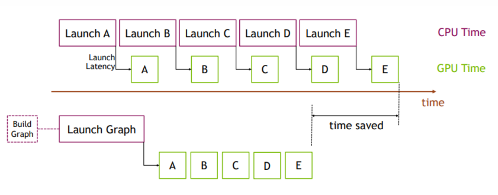
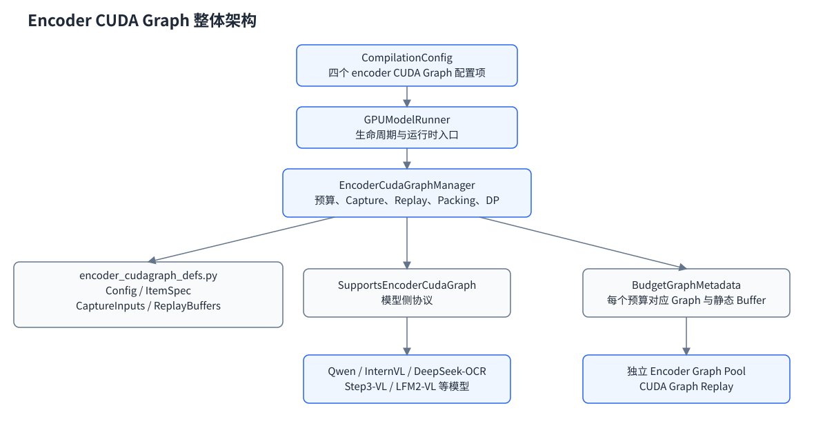
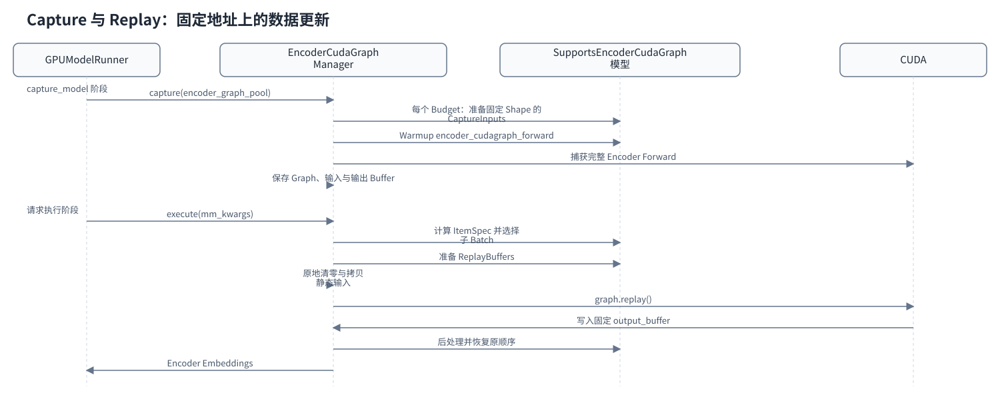
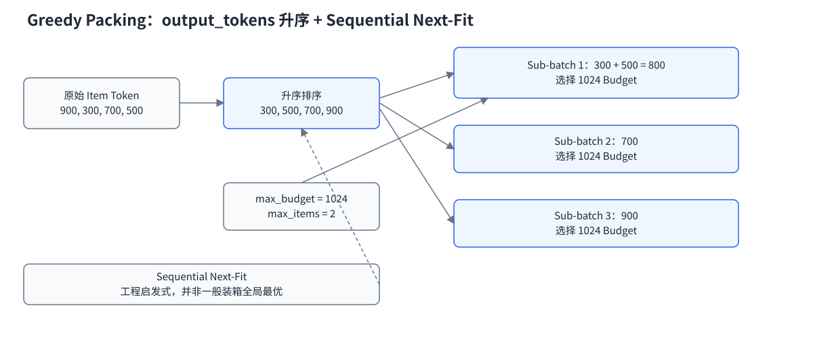
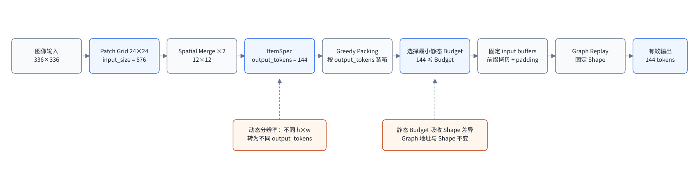
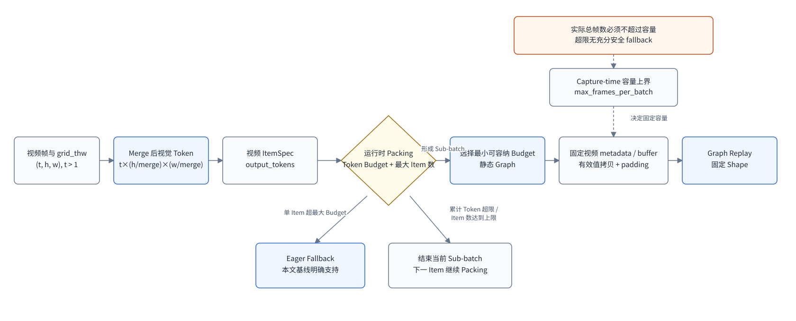
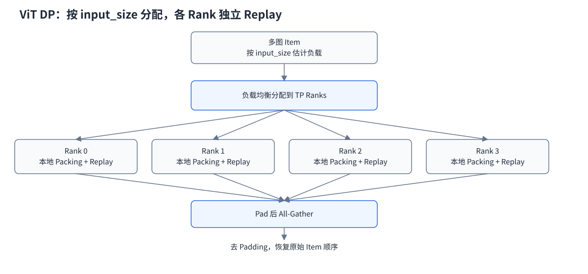
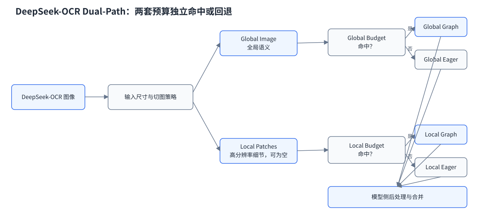
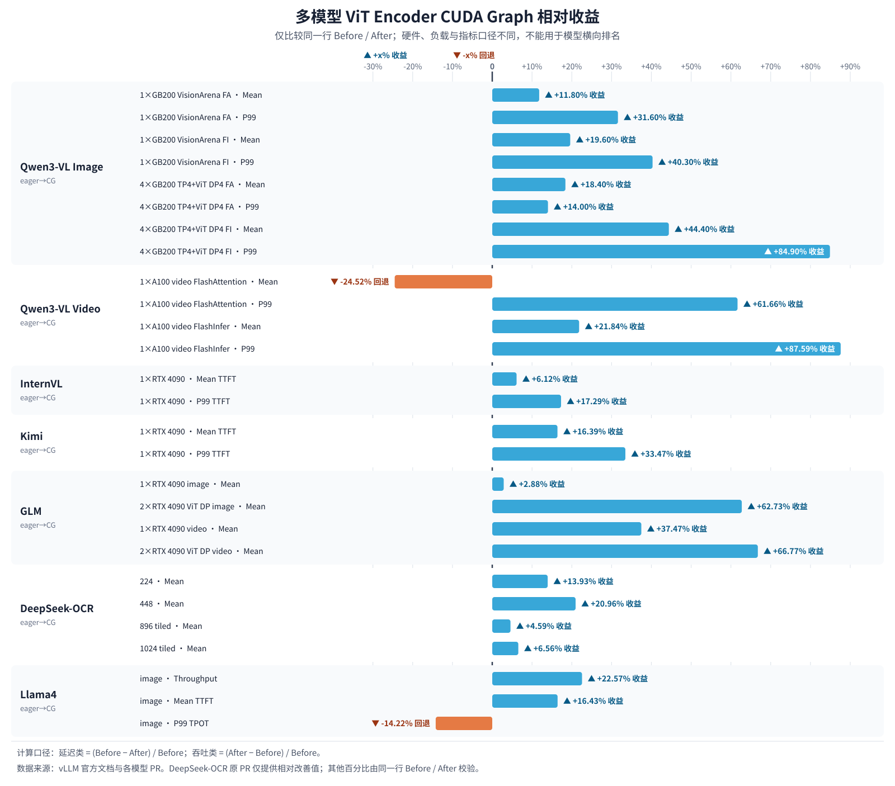

# vLLM 多模态推理｜ViT Full CUDA Graph

## 一、引言✅

多模态理解一直是大模型推理中非常重要的一个场景，其中，ViT（Vision Transformer）作为视觉编码器需要处理大量的图像和视频信息。以 Qwen3-VL 为例，一张 336×336 的图像会产生大约 576 个 Patch（也就是图像的“token”），而在多图或视频推理场景下，模型需要处理的 Patch 数量更是成倍增长。

在传统的 Eager 模式下，每个 CUDA Kernel 的启动都需要 Host 侧的 CPU 去做调度，这个 Kernel Launch Overhead 在 ViT 前向计算包含大量执行时间较短、计算粒度较小的 CUDA Kernel 时尤为显著。在 vLLM 中，社区早已为 LLM Backbone 的部分支持了 CUDA Graph（包括 4 种模式），极大地提高了语言模型的推理速度，而 ViT Full CUDA Graph 则将 CUDA Graph 的覆盖范围从语言模型扩展到了 ViT Encoder，两者相互独立、可以同时启用。该特性的引入为 vLLM 的多模态模块补齐了关键的一角，极大地提高了推理引擎针对视觉输入的推理性能。

本文将从 CUDA Graph 的基本原理开始介绍，并以 vLLM 中 LLM Backbone CUDA Graph 的设计作为参考，深入解析 ViT Full CUDA Graph 的整体设计、关键算法、扩展功能、模型集成以及性能调优等内容。

## 二、CUDA Graph 的基本原理

> NOTE：对 CUDA Graph 的基本原理已经非常熟悉了的读者可以跳过本章，直接从第三章开始阅读。

### 2.1 Motivation：为什么需要 CUDA Graph？✅

随着现代 GPU 性能的不断提升，单个 GPU 操作（如 Kernel 执行或内存拷贝）的耗时已经降低到微秒级。然而，CPU 每次向 GPU 提交任务时仍需经历参数准备、Kernel 调度以及 Python、C++ 和 CUDA Driver 等软件栈的处理，这些提交开销同样处于微秒级。当计算包含大量小型 Kernel 时，CPU 的启动开销逐渐成为性能的瓶颈。

CUDA Graph 正是为了解决这一问题而提出的，它将多个 GPU 操作及其依赖关系预先组织成一个计算图，并在运行时通过一次 `cudaGraphLaunch` 调用即可完成整个计算图的提交与执行。



由于 Graph 中的 Kernel 和参数在创建后保持固定，Graph 重放（Replay）无需重复执行参数设置和 Kernel 调度等流程，从而可以显著减少 CPU 的开销，提高 CPU 与 GPU 的协同效率。虽然 Graph 中的 Kernel 在 GPU 上通常也会获得一定的执行效率提升，但 CUDA Graph 最主要的优势还是在于消除频繁的 CPU → GPU 提交开销，从而提升整体的执行性能。

### 2.2 Workflow：怎么使用 CUDA Graph？✅

一个基于 CUDA Graph 的基本工作流如下：

1. **Graph 捕获**：在 `cudaStreamBeginCapture` 和 `cudaStreamEndCapture` 之间，对提交到 CUDA Stream 上的所有 GPU 操作进行捕获（Capture），从而生成 Graph；
2. **Graph 实例化**：调用 `cudaGraphInstantiate` 对 Graph 进行实例化。该过程会创建并预初始化所有 Kernel 的 Work Descriptors，使得该 Graph 能够在后续被尽可能快速地重复启动；
3. **Graph 重放**：调用 `cudaGraphLaunch` 提交并执行该 Graph。

相比于直接使用这些底层的 CUDA 接口，像 vLLM 这种上层的推理框架会更倾向于直接使用 PyTorch 已经封装好的能力，从而带来更好的开发体验。

PyTorch 提供了对 CUDA Graph 的原生支持，可以通过 `torch.cuda.graph` 将一段 CUDA 工作负载捕获为可重复执行的计算图。Graph 创建完成后，可通过 Replay 重复执行相同的 GPU 计算，而无需重新进行 Kernel 调度和参数设置。由于每次 Replay 使用固定的内存地址，因此只需更新输入 Tensor 中的数据即可处理新的输入。

示例代码如下：

```python
g = torch.cuda.CUDAGraph()

# Placeholder input used for capture
static_input = torch.empty((5,), device="cuda")

# Warmup before capture
s = torch.cuda.Stream()
s.wait_stream(torch.cuda.current_stream())
with torch.cuda.stream(s):
    for _ in range(3):
        static_output = static_input * 2
torch.cuda.current_stream().wait_stream(s)

# Captures the graph
# To allow capture, automatically sets a side stream as the current stream in the context
with torch.cuda.graph(g):
    static_output = static_input * 2

# Fills the graph's input memory with new data to compute on
static_input.copy_(torch.full((5,), 3, device="cuda"))
g.replay()
# static_output holds the results
print(static_output)  # full of 3 * 2 = 6

# Fills the graph's input memory with more data to compute on
static_input.copy_(torch.full((5,), 4, device="cuda"))
g.replay()
print(static_output)  # full of 4 * 2 = 8
```

### 2.3 Constraints：什么时候不能用 CUDA Graph？✅

CUDA Graph 通过将多个 GPU 操作打包为一次提交，大幅降低了 CPU 的调度开销，但这种高性能是以牺牲一定的灵活性为代价的。

Graph 在 Capture 时就已经确定了执行流程，因此后续 Replay 只能按照预先记录的计算图执行。如果计算过程中需要 CPU 根据运行结果动态决定后续执行逻辑，就必须退出 Graph，重新回到传统的 Eager 执行模式。

为了确保 Graph 能够被正确地捕获和重放，PyTorch 对 Capture 的代码提出了许多限制：

- **地址固定**：每次 Replay 必须使用相同的内存地址，因此 Capture 使用的输入、输出 Tensor 需要保持长期存活，并在 Replay 时复用；
- **形状固定**：不支持动态 Shape，即每次 Replay 中所有 Tensor 的形状、布局和数据类型都必须与 Capture 时保持一致；
- **无 D2H 同步**：Capture 期间不能发生 CPU 与 GPU 的同步操作，例如调用 `tensor.item()`、`torch.cuda.synchronize()` 等需要等待 GPU 完成计算的操作；
- **无动态控制流**：不允许包含基于运行时数据的动态控制流（如 `if`、`for` 等），除非使用 `torch.cond()` 等基于 GPU 的控制流机制。

下面我们将通过一些具体的例子来说明到底什么情况下是不能使用 CUDA Graph 的。

**（1）动态显存分配（❌️）：**

```python
y = torch.cat([a, b], dim=0)
```

`torch.cat()` 本身并不是不能 Capture，但它通常会创建新的 Tensor，并触发显存分配。如果 Capture 或 Replay 时发生新的内存分配，就可能导致地址不稳定，从而 Capture 失败。

因此，我们更推荐提前分配好 Buffer，再使用原地写入：

```python
out[:len(a)].copy_(a)
out[len(a):].copy_(b)
```

**（2）动态 Shape 或动态图（❌️）：**

```python
torch.cat([a[:k], b], dim=0)
```

或：

```python
xs = []
for i in range(n):
    xs.append(...)
y = torch.cat(xs)
```

这里输出 Shape 或输入 Tensor 数量依赖运行时数据，每次执行的 Graph 拓扑都可能不同，因此无法进行 Capture。

**（3）GPU→CPU 同步（❌️）：**

```python
x.item()
x.tolist()
x.cpu()
x.numpy()
print(x)
```

这些操作都会把 GPU 数据同步到 CPU，甚至创建 Python 对象。CUDA Graph Replay 只会重新执行 GPU Kernel，不会重新执行 Python，因此这类操作不能出现在 Capture 的过程中。

正确的做法应该是：

```python
with torch.cuda.graph(g):
    output.copy_(x.sum())

g.replay()
value = output.item()  # 在 Graph 外读取
```

**（4）根据 GPU 结果执行 Python 逻辑（❌️）：**

```python
if x.sum() > 0:
    ...
```

或：

```python
idx = x.argmax().item()
```

这里需要先将 GPU 计算结果同步回 CPU，再决定后续执行路径，因此也无法被 CUDA Graph 捕获。

**总结一下：CUDA Graph 并不是禁止 Python API，而是禁止“运行时的动态行为”。凡是涉及动态分配、动态 Shape、GPU→CPU 同步、或依赖 GPU 结果进行 Python 控制流的操作，都不适合放在 CUDA Graph 的 Capture 路径中。**

### 2.4 Tricks：CUDA Graph 的显存管理

CUDA Graph 每次 Replay 都会访问与 Capture 时完全相同的虚拟内存地址，如果 Capture 期间使用的内存被 PyTorch 释放，Replay 时就可能访问非法地址；如果这些内存被重新分配给其他 Tensor，则 Replay 可能会覆盖这些 Tensor 的数据，导致结果错误。因此，Graph 使用的内存必须在整个 Graph 生命周期内保持有效，并在每次 Replay 时保持相同的地址。

为了解决这一问题，PyTorch 的 Caching Allocator 在检测到 CUDA Graph Capture 开始后，会为当前 Graph 创建一个**私有内存池（Graph-private Memory Pool）**。Capture 过程中所有新的 GPU 内存分配都来自该私有内存池，而不会被普通的内存分配器复用。该内存池会一直保留，直到对应的 CUDAGraph 对象以及 Capture 期间创建的所有 Tensor 都被释放，从而保证 Graph Replay 始终能够访问正确的内存地址。

默认情况下，每一次 Capture 都会创建一个独立的私有内存池。这种方式能够完全避免不同 Graph 之间的内存相互干扰，但当一个程序包含多个 CUDA Graph 时，也可能导致 GPU 内存占用增加。

为了减少内存开销，PyTorch 提供了**共享私有内存池（Shared Private Memory Pool）**，多个 CUDA Graph 可以共享同一个内存池，但必须满足以下条件：

- 这些 Graph 不会并发执行；
- 如果 Graph 之间存在依赖关系，则必须始终按照 Capture 时相同的顺序进行 Replay；
- 如果 Graph 之间没有数据依赖，也可以共享内存池，但需要注意，一个 Graph 的 Replay 可能会覆盖另一个 Graph 的输出，因此如果需要保留输出结果，应提前对输出 Tensor 调用 `clone()`。

这种共享内存池的方式能够在保证正确性的前提下显著降低 CUDA Graph 的额外内存开销，在 vLLM 等需要维护多个 Graph（针对不同 Batch Size）的推理框架中被广泛采用。

### 2.5 FAQ

**💡 Q1：在 Capture 之前为什么还需要 Warmup？**

Warmup 并不是 CUDA Graph 本身的要求，而是 PyTorch（以及其他深度学习框架）为了保证 Capture 得到一个稳定、可复用的 Graph 而必须做的准备工作。

在 Capture 之前，通常需要先对模型执行若干次 Warmup。其原因在于，CUDA Graph 希望捕获的是一段稳定、可重复执行的 GPU 工作负载，而首次执行模型时往往伴随着大量一次性的初始化操作，例如 CUDA Context 创建、Kernel 加载、cuBLAS/cuDNN 等计算库的 Handle 初始化、算法自动选择（Autotuning）、GPU 内存池建立以及 Workspace 分配等。

如果直接进行 Capture，这些初始化操作也会被记录到 Graph 中，不仅增加额外开销，还可能导致 Graph 无法正确复用。

因此，Warmup 的作用就是提前完成这些一次性的初始化工作，使 Capture 阶段仅记录真正需要重复执行的 Kernel 和内存操作，从而保证后续 Graph Replay 能够以固定的执行流程和内存地址高效运行，充分发挥 CUDA Graph 降低 CPU 调度开销的优势。

另外，Warmup 使用的 Shape、dtype、backend 和真正 Capture 的路径也要一致。Warmup 的目的不是“把所有输入都跑一遍”，而是让当前待捕获路径中的一次性初始化先发生；如果后续切换了 Attention backend 或走到另一条模型分支，仍然可能触发新的初始化。

**💡 Q2：CUDA Graph 和 `torch.compile` 的区别是什么？**

它们解决的是不同层面的问题：

- **CUDA Graph 是运行期的优化**：在第一次运行时，把 GPU 上所有的 kernel 启动序列“捕获”下来，之后每次推理直接“回放”这段录像，省掉了 CPU 侧反复下发 kernel 的开销。它不关心你的代码写得好不好、有没有优化过，它只管“一次性下发”；
- **`torch.compile` 是编译期的优化**：把你写的 Python 代码追踪（trace）成一张计算图（FX Graph），然后在这张图上做各种变换：算子融合、内存优化、最后直接生成更贴近硬件的 kernel 代码（比如 GPU 上的 Triton kernel）。即使不配合 CUDA Graph，仅仅以普通的 eager 路径去执行这些编译后的子图，性能也可能比原始 eager 执行更好。但当它和 CUDA Graph 叠加时，重点就不再是 CPU 侧的 launch 开销，而是 fusion、codegen 以及调度优化带来的收益。

它们二者可以结合起来进行使用：CUDA Graph 让计算的启动开销趋近于零，而 `torch.compile` 则让你的计算本身跑得更快（更少的 kernel、更少的中间张量，不同资源的利用效率更高）。

在 vLLM 中，两者的关系还多一层：`torch.compile` 不只是做算子融合，也为 `PIECEWISE` 模式提供统一的图表示和切分边界；ViT Full CUDA Graph 则由独立的 Encoder 管理器直接捕获完整视觉编码器路径。不要因此把“编译图”和“CUDA Graph”混为一谈：前者决定计算如何组织，后者决定一串已经确定的 GPU 工作如何一次提交。

## 三、vLLM 中的 CUDA Graph

> NOTE：本小节将简要介绍 vLLM 中现有 text-only CUDA Graph 的设计思想，不深入具体的代码细节，对这部分已经非常熟悉了的读者可以跳过本节，直接从第四节开始阅读。

### 3.1 Challenge - 动态 Shape 下的 Bucketing 策略

CUDA Graph 在大模型推理场景下的关键挑战：推理请求的 `num_tokens` 是动态的，而 CUDA Graph 需要静态 Shape。为了解决这个问题，vLLM 采用了 Bucketing 策略：**预先为多个固定桶大小分别捕获 Graph，运行时将实际请求向上对齐到最近的桶，并通过 padding 补齐。**

该策略本质上是 Padding 开销与 Graph 收益的权衡：

- **桶粒度过粗**：Padding 冗余计算增加；
- **桶粒度过细**：需要维护更多的 Graph，增加显存和捕获成本。

因此，在 vLLM 中，小 Batch 的请求更适合使用 CUDA Graph，大 Batch 的请求一般直接走 Eager 更划算。

这里的 Bucket 命中并不意味着没有代价：运行时仍要准备元数据、把有效输入拷入固定 Buffer，并执行 Padding 对应的冗余计算。因此判断是否入图不能只看“实际 Shape 能否放进桶”，还要看该 Shape 下节省的 launch overhead 是否能覆盖拷贝和冗余计算。

### 3.2 Flexibility - 四种 Graph Mode

目前，vLLM 提供了四种 Graph Mode，本质上是在权衡性能和兼容性：

- `PIECEWISE`：Attention 保持 Eager，其余部分入图，兼容性最高，但无法消除 Attention 的 launch overhead；
- `FULL`：整个 Forward 入图，性能最佳，但对 Attention backend 和 Shape 要求最高；
- `FULL_DECODE_ONLY`：仅 Decode 使用整图，Prefill 回退 Eager，利用 Decode Shape 更规整的特点获取稳定收益；
- `FULL_AND_PIECEWISE`（默认）：Decode 使用 `FULL`，Prefill 使用 `PIECEWISE`，在性能与兼容性之间取得最佳平衡。

> NOTE：最终能否使用某种模式，还受 Attention backend、模型结构和运行时 Shape 限制，不满足条件时会自动降级或回退 Eager。

这四种模式描述的是语言模型 Forward 的捕获边界，并不控制本文第四节的 Encoder CUDA Graph。ViT Full CUDA Graph 由 `cudagraph_mm_encoder` 单独开启，使用独立的 Graph、Buffer 和内存池，所以可以与 Decoder 侧任一可用模式同时工作。

### 3.3 FAQ

**💡 Q1：为什么要将 Attention 排除在 Graph 之外？**

因为 Attention 是整个推理过程中动态性和实现复杂度最高的模块：

- 依赖不同的 Attention Backend（如：FlashAttention、FlashInfer、Triton、ROCm AIter 等），且不同 Backend 对 CUDA Graph 的支持能力差异较大；
- Attention 的输入 Shape（如 KV Cache 长度、BlockTable、PageTable 等）变化也最频繁，更容易触发 Graph 捕获限制。

所以 vLLM 的 `PIECEWISE` 模式选择将 Attention 保留在 Eager 路径，仅将 MLP、LayerNorm 等 Shape 更稳定的部分纳入 CUDA Graph，以较小的性能损失换取更好的兼容性和更高的 Graph 命中率。

严格来说，KV Cache 长度变化本身不一定改变被捕获 Tensor 的物理 Shape，vLLM 可以通过固定大小的 PageTable、BlockTable 和元数据 Buffer 把运行时状态写进静态地址；真正的限制是 backend 是否能在这些固定 Buffer 上以可捕获、可重放的方式工作。

**💡 Q2：为什么默认使用 `FULL_AND_PIECEWISE` 模式？**

因为 Decode 和 Prefill 对 CUDA Graph 的适配性不同：

- Decode 阶段每步通常只生成 1 个新 Token，`query_len` 基本固定为 1，输入 Shape 的变化主要来自 Batch Size 和 KV Cache 长度，动态性相对较小，更容易通过 Bucketing 实现 CUDA Graph 的复用；
- Prefill 阶段需要一次性处理不同长度的 Prompt，`query_len` 变化范围很大，Shape 更加动态，Attention 兼容性也更复杂，因此采用 `PIECEWISE` 能获得更高的 Graph 命中率和更好的稳定性。

所以 vLLM 默认使用 `FULL_AND_PIECEWISE`：即 Decode 追求性能最大化，Prefill 兼顾兼容性与稳定性，在收益、兼容性和工程复杂度之间取得了最佳平衡。

默认值只是通用折中，不代表所有模型和硬件上的最优配置。若 backend 明确支持 Prefill Full Graph，且业务 Shape 足够集中，可以通过基准测试评估更激进的模式；反之，兼容性检查可能把用户请求的模式降级。

**💡 Q3：为什么小 Batch 比大 Batch 更适合使用 CUDA Graph？**

因为 CUDA Graph 消除的是 CPU 侧的 kernel launch 开销，而不是 GPU 计算本身：

- **小 Batch 时**：每个 Kernel 的计算量较小，launch overhead 占比较高，因此 Graph 带来的收益更明显；
- **大 Batch 时**：Kernel 执行时间本身已经占据主要开销，即使消除了 launch overhead，整体加速也有限。
  
此外，大 Batch 往往需要更大的 Bucket 和更多 padding，会引入额外冗余计算，因此收益可能进一步下降。

因此更准确的说法是：CUDA Graph 更偏爱“CPU launch 开销占比较高、Shape 可复用”的负载，而不是简单地偏爱某个 Batch Size。若小 Batch 的 Shape 极其分散、频繁回退 Eager，收益同样有限。

## 四、ViT Full CUDA Graph

### 4.1 Overview - 整体设计

Issue [#38175](https://github.com/vllm-project/vllm/issues/38175) 把 ViT Full CUDA Graph 作为一项跨模型演进工作来跟踪。最初的 [PR #35963](https://github.com/vllm-project/vllm/pull/35963) 先在 Qwen3-VL 图像路径上建立“按 Token Budget 捕获 + 运行时 Packing”的基础框架；[PR #38061](https://github.com/vllm-project/vllm/pull/38061) 又把同一框架扩展到 Qwen3-VL 视频，补上每 Batch 最大帧数这一维约束。随后社区继续增加 InternVL、Kimi-VL、DeepSeek-OCR、Step3-VL、Llama4、GLM 等模型适配，并持续调整协议边界。到本文基线 `5559679229bc961848b121ccdeaa8fa5d79bec98`（2026-07-26），它已经不是某个 Qwen 模型里的专用优化，而是一套模型无关的 Encoder Graph 管理框架。

整体架构如下图所示：



核心组件的职责比较清晰：

- `EncoderCudaGraphManager`：定义在 `vllm/v1/worker/encoder_cudagraph.py`，负责预算生成、Graph Capture/Replay、Greedy Packing、Eager Fallback 和 ViT DP；
- `encoder_cudagraph_defs.py`：定义 `EncoderCudaGraphConfig`、`EncoderItemSpec`、`EncoderCudaGraphCaptureInputs`、`EncoderCudaGraphReplayBuffers` 等数据对象；
- `SupportsEncoderCudaGraph`：模型侧协议。Manager 不理解 `pixel_values`、`grid_thw`、RoPE 或切图规则，这些差异由模型实现封装；
- `GPUModelRunner`：负责生命周期集成。Encoder Graph 在 `capture_model` 阶段捕获，运行时 `_execute_mm_encoder` 决定走 Graph Manager 还是普通 Encoder 路径；
- `BudgetGraphMetadata`：保存一个预算对应的 Graph、固定输入 Buffer 和输出 Buffer。

这套设计有两个关键点。第一，动态 Shape 不直接进入 Graph，而是被转换为有限组静态 Token Budget；第二，Manager 只调度“Item”和“预算”，模型负责把真实多模态输入转换成可复制到固定地址的 Tensor。这样 Qwen 的 MRoPE、InternVL 的 Batch 输入和 DeepSeek-OCR 的双路径都可以复用同一个管理器。

Encoder Graph 使用独立于 Decoder Graph 的私有内存池。`GPUModelRunner` 在捕获阶段还会通过临时的 Capture Profile 计入这部分显存，避免 Capture 完成后才发现可用显存估算过于乐观。

### 4.2 Workflow - 执行流程

整个流程可以分为 Capture 和 Replay 两段：



**Capture 阶段：**

1. `GPUModelRunner.capture_model()` 检查配置是否开启，并确认模型满足 `SupportsEncoderCudaGraph`；
2. Manager 读取模型提供的预算范围与静态配置，再结合用户配置生成多个 `token_budget`；
3. 对每个 Budget，模型通过 `prepare_encoder_cudagraph_capture_inputs()` 构造固定 Shape 的虚拟输入；
4. 先执行 Warmup，再在 `torch.cuda.graph(..., pool=encoder_graph_pool)` 中调用 `encoder_cudagraph_forward()`；
5. 将 Graph、长期存活的输入 Buffer 和固定输出 Buffer 保存到 `BudgetGraphMetadata`。

**Replay 阶段：**

1. 模型先把请求中的每张图或每段视频转换为 `EncoderItemSpec`，其中 `output_tokens` 用于 Packing，`input_size` 可用于 ViT DP 的负载均衡；
2. Manager 生成一个或多个 Sub-batch，并为每个 Sub-batch 选择最小可容纳的 Budget；
3. 模型通过 `select_encoder_cudagraph_items()` 提取这些 Item，再由 `prepare_encoder_cudagraph_replay_buffers()` 生成真实 Tensor；
4. Manager 在 Capture 时保存的 `input_buffers` 上原地清零和拷贝，保持地址不变，然后调用 `graph.replay()`；
5. 模型后处理固定输出 Buffer 中的有效部分，并按请求原始顺序恢复结果；若没有任何 Budget 能容纳某个 Item，则该部分走 `encoder_eager_forward()`。

这里需要纠正一个容易产生的误解：`buffer_keys` 是模型配置的一部分，用于描述静态 Buffer 集合和校验接口，但它并不直接“驱动某个 key 的 Replay Copy”。运行时真正参与拷贝的是 Capture 保存的 `input_buffers` 与模型返回的 `EncoderCudaGraphReplayBuffers.values`；某个值为 `None` 时可以保持 Capture 值不变，自定义 `padding_logics` 则负责特殊的填充语义。

### 4.3 Algorithm - 关键算法

Manager 的 Packing 可以概括为：**按 `output_tokens` 升序排序，然后做 Sequential Next-Fit**。遍历 Item 时，只要加入当前 Sub-batch 后不超过最大 Token Budget，且 Item 数不超过 `encoder_cudagraph_max_vision_items_per_batch`，就继续放入；否则立即结束当前 Sub-batch，重新开一个。每个 Sub-batch 最后再选择最小可容纳其 Token 总量的已捕获 Budget。



举个例子，假设 Budget 为 `[512, 1024]`，`max_items=2`，四张图的输出 Token 分别是 `[900, 300, 700, 500]`：

1. 升序后得到 `[300, 500, 700, 900]`；
2. `300 + 500 = 800`，且 Item 数为 2，因此第一个 Sub-batch 选择 1024 Budget，Padding 224；
3. 下一个 700 无法再与 900 放在同一个 1024 Budget 中，于是 700 单独选择 1024；
4. 900 同样单独选择 1024；
5. 最终按原始索引把三次 Replay 的输出散射回 `[900, 300, 700, 500]` 对应的顺序。

为什么不直接保持请求顺序？因为小 Item 先放能更容易形成紧凑的 Sub-batch，减少大 Item 提前占满 Budget 的概率。为什么不求解一般 Bin Packing 的最优解？因为运行时调度需要足够便宜、确定且易于与 Item 索引恢复结合；一个复杂的全局优化器本身也会增加 CPU 开销。

需要强调的是，这只是一个工程启发式，**不能宣称它对一般 Bin Packing 问题全局最优**。例如它不会回头把后续 Item 填进已经结束的 Sub-batch，也不会枚举不同组合。它的价值在于实现简单、复杂度低，并且对视觉 Token 分布通常能得到足够好的 Packing 结果。

### 4.4 Basic Example - 图像推理

以 Qwen3-VL 图像推理为例，`image_grid_thw` 中每个 Item 的 `(t, h, w)` 描述时间、高度和宽度方向的 Patch Grid。模型根据 `spatial_merge_size` 计算：

```text
input_size = t × h × w
output_tokens = t × (h / merge) × (w / merge)
```

对于图像，`t=1`。以 `336×336`、`patch_size=14`、`spatial_merge_size=2` 为例，原始 Patch Grid 是 `24×24=576`，Merge 后输出约 `12×12=144` 个视觉 Token。本文引言中的 576 指原始 Patch 数，而 Manager Packing 使用的是 Merge 后的 `output_tokens`，二者不要混淆。

下面这张图从左向右串起一次图像 Replay，其中蓝色节点分别标出了进入 ViT 的 576 个 Patch 与用于 Packing 的 144 个输出 Token：



Qwen3-VL 的 `pixel_values` 是按 Patch 展平并拼接的 Tensor，因此 `select_encoder_cudagraph_items()` 需要根据每个 Item 的 Patch 数计算累计 Offset，再提取 Sub-batch。Capture 时，模型为目标 Budget 构造固定大小的 `pixel_values`，并提前准备位置编码、Rotary Embedding、`cu_seqlens`、`max_seqlen`、`sequence_lengths` 等元数据。Replay 时真实数据只覆盖这些固定 Buffer 的有效前缀，剩余部分使用对应的 Padding 逻辑补齐。

这样处理的目的，是把 `grid_thw` 引起的 Python 侧动态元数据计算移出 Graph 内部。Graph 中真正执行的是固定 Shape 的 Vision Encoder Forward；请求的分辨率差异已经在 Replay 前被转换为 Tensor 内容差异。

Qwen3.5 和 Qwen3.6 复用或继承 Qwen3-VL 的视觉实现，因此其 Encoder CUDA Graph 能力也来自这条视觉实现链路，而不是复制一套新的 Manager。

### 4.5 Advanced Feature - 视频推理

视频与图像的 Encoder 主体相同，但 `t>1` 后，一个视频 Item 会包含多帧，`cu_seqlens` 等元数据容量不能再只按“视觉 Item 数”估算。因此 [PR #38061](https://github.com/vllm-project/vllm/pull/38061) 引入 `encoder_cudagraph_max_frames_per_batch`，把总帧数作为额外的 Capture 上界。

读下面这张图时，先沿主线看运行时 Packing：它只使用 Token Budget 和最大 Item 数形成 Sub-batch；上方虚线表示 `max_frames_per_batch` 决定的 Capture-time 固定容量，并不是 Packing 的第三个 Gate。



运行时仍然以“视频 Item”为 Packing 单位：`output_tokens = t × (h / merge) × (w / merge)`，但 Capture 输入会在 `max_batch_size` 与 `max_frames_per_batch` 约束下构造足够大的固定 Buffer。真实视频帧数低于 Capture 上限时，Replay 前填充未使用部分；Token Budget 超出所有已捕获预算时会明确走 Eager Fallback。需要注意的是，截至本文基线，超过捕获帧容量并没有充分的安全拆分或 Eager Fallback 保证，相关修复 [PR #43403](https://github.com/vllm-project/vllm/pull/43403) 尚未合入。因此用户应把 `encoder_cudagraph_max_frames_per_batch` 配置到能够覆盖实际请求的上限，并用最大帧数请求验证正确性。

这也解释了视频场景为什么更敏感：帧数使 Token 分布跨度更大，过小的帧上限可能造成 Capture Buffer 容量不匹配，过大的帧上限又会放大 Buffer 和 Padding。第五节的 A100 数据中，FlashAttention 的 Mean Encoder Forward 甚至从 3.67ms 回退到 4.57ms，但 P99 从 17.03ms 降至 6.53ms；这说明“均值一定提升”并不是该特性的承诺，具体原因若没有 Profile 证据就不应猜测。

### 4.6 Advanced Feature - ViT DP Mode

当 `--mm-encoder-tp-mode data` 且 TP Size 大于 1 时，ViT 可以把不同视觉 Item 分配给不同 Rank，而语言模型仍按原有 TP 方式执行。Manager 根据 `EncoderItemSpec.input_size` 估计各 Item 的视觉计算量，做负载均衡分配；每个 Rank 再对自己的 Item 独立执行 Packing、Graph Replay 或 Eager Fallback。



本地输出长度通常不同，因此 Gather 前需要 Pad 到统一长度，再通过 Tensor Model Parallel Group 做 All-Gather，最后去掉 Padding 并恢复原始 Item 顺序。ViT DP 与 Full CUDA Graph 的收益可以叠加：DP 减少每个 Rank 的计算量，CUDA Graph 减少每个 Rank 的 Kernel 提交开销；代价则是额外的分配、Pad 和通信。

官方 4×GB200 数据使用 TP4 + ViT DP4，每个请求 20 张 `336×336` 图像。在 FlashInfer 下，Mean Encoder Forward 从 23.24ms 降至 12.91ms，P99 从 172.41ms 降至 26.05ms。不过这组数据同时包含 DP 场景、特定 Backend 和固定工作负载，不能外推为所有多卡配置的固定收益。

### 4.7 Advanced Feature - Dual-Path Graph

DeepSeek-OCR 的视觉输入并不是单一 Shape：它同时保留 `global_image` 来编码全局语义，并根据图像尺寸生成若干 `local_patch` 来保留高分辨率文字细节。小图可能不需要 Local Patch，大图则会产生多个 Local Patch。若强行用一条 Graph 路径表达两者，要么用最大 Local 容量为所有请求填充，浪费大量计算与显存；要么无法覆盖 Local 数量变化。

Dual-Path 的做法是分别维护 Global 与 Local 两套 Budget Graph：



每个 `EncoderItemSpec` 同时携带 Global 与 Local 输出 Token。Packing 时要同时检查两个维度能否放入当前 Sub-batch；执行时，两条路径分别选择 Budget，因此允许“Global 命中 Graph、Local 回退 Eager”或反过来，而不是要求两侧同时命中。最后由模型侧 `postprocess_encoder_output()` 合并两条路径并恢复每个 Item 的结果。

DeepSeek-OCR 的测试也体现了这种结构差异：224/448 输入的 Mean Encoder Forward 改善分别为 13.93%/20.96%，而 896/1024 的 Tiled 输入仅改善 4.59%/6.56%。这只能说明较大的 Tiled 路径在该 PR 测试中获益较小，不能在缺少 Profile 的情况下断言具体瓶颈。

当前至少 DeepSeek-OCR 与 Step3-VL 使用 Dual-Path。Step3-VL 也有 `pixel_values` 与 Patch 路径的双输入处理，不能把它列为普通 Single-Path 模型。

### 4.8 Extensibility - 新模型集成

为新模型接入时，真正困难的通常不是“加上 `SupportsEncoderCudaGraph`”，而是把原本依赖 Python List、动态 Shape 或 `.item()` 的 Encoder 路径拆成“Graph 外准备元数据 + Graph 内固定 Shape Forward”。

建议按下面的顺序开发：

1. **确定可捕获边界**：只把视觉 Encoder 中 Shape 可固定、没有 D2H 同步和数据依赖控制流的部分放入 `encoder_cudagraph_forward()`；
2. **实现静态配置**：通过 `get_encoder_cudagraph_config()` 声明支持的 Modality、输出 Hidden Size、Padding 逻辑，以及是否启用 Dual-Path；
3. **定义预算范围和 ItemSpec**：`get_encoder_cudagraph_budget_range()` 给出模型可接受的最小/最大预算，`get_encoder_cudagraph_item_specs()` 必须准确计算 `input_size` 与 `output_tokens`；
4. **实现 Item 选择**：`select_encoder_cudagraph_items()` 需要在 Packing 和 DP Shard 后仍保持 Item 与视觉 Embedding 一一对应；
5. **准备 Capture/Replay 输入**：Capture 输入负责构造最坏上界下的固定 Shape，Replay 输入只提供真实值；所有参与 Graph 的 Tensor 地址由 Manager 长期持有；
6. **实现双路径**：如果同一个 Item 存在结构不同、预算独立的两条 Encoder 路径，应启用 Dual-Path，而不是把动态分支塞进单图；
7. **验证正确性与边界**：至少覆盖最小/最大预算、多图、空 Local Path、视频帧上限、超预算 Eager Fallback、DP 分片和输出顺序恢复。

在本文基线上，Qwen3.5/3.6 继承 Qwen3-VL 视觉实现；LFM2-VL 源码已经实现支持，但官方支持矩阵存在漏列。因此判断“模型是否支持”时，当前源码与端到端测试比文档矩阵更可靠。

另一个注意点是接口演进。早期实现曾把主输入和元数据分开管理，当前协议统一使用 `values: dict[str, Tensor]`。新模型应以本文指定 Commit 的 `encoder_cudagraph_defs.py` 和现有模型实现为模板，不要照搬旧 PR 中已经变化的签名。

### 4.9 FAQ

**💡 Q1：ViT 模块为什么要用 Full Graph 而不用 Piecewise Graph？**

ViT Encoder 通常是一段连续、重复且相对静态的 Attention + MLP 计算，没有 Decoder 那样必须围绕 KV Cache 和多种 Attention Backend 切图的需求。将完整 Encoder Forward 捕获为一张 Graph，可以最大限度减少 Kernel Launch，也避免 Piecewise Graph 在段与段之间重新回到 Python 调度。

但“Full”不等于把所有图像预处理都放进去。Resize、切图、`grid_thw` 解析、Item Packing 和动态元数据准备仍在 Graph 外；只有经过静态化处理后的 Encoder Forward 被完整捕获。

**💡 Q2：该 ViT Full CUDA Graph 特性在什么场景下会有性能收益？在什么场景下不建议开启？**

比较适合的场景是：同一模型被长期服务、视觉 Encoder 会被重复调用、输入 Token 分布能被少量 Budget 覆盖、Kernel 较碎且 CPU Launch 开销占比较高。多图 Batch、ViT DP 和某些 FlashInfer 场景在现有数据中收益较明显，P99 也常比 Mean 更受益。

不建议盲目开启的场景包括：请求极少、Capture 成本无法摊薄；视觉 Shape 高度离散、Graph Miss 频繁；超大输入使 Encoder 本身计算占绝对主导；显存紧张，无法承受多预算 Graph Pool；以及模型路径包含尚未静态化的动态控制流。即使能开启，也要同时观察 Mean、P99、吞吐、完整 TTFT 和显存，而不是只看单一 Encoder 指标。

## 五、Evaluation

### 5.1 Benchmark

先看官方 `cuda_graphs_multimodal` 文档中的主数据。这里的指标来自 mm-processor Profiler 的 `encoder_forward_ms`，只覆盖视觉 Encoder Forward，**不是完整用户 TTFT**；表中保留官方记录的 `3000+300` 和 `1000+200` 测试规模写法，不再自行扩展其计时口径。

| 模型与场景 | Backend | Mean Encoder Forward | P99 Encoder Forward |
|---|---|---:|---:|
| Qwen3-VL-30B-A3B，1×GB200，VisionArena，3000+300 | FlashAttention | 5.13 → 4.52ms（-11.8%） | 9.16 → 6.26ms（-31.6%） |
| Qwen3-VL-30B-A3B，1×GB200，VisionArena，3000+300 | FlashInfer | 5.42 → 4.36ms（-19.6%） | 10.87 → 6.49ms（-40.3%） |
| Qwen3-VL-32B，4×GB200，TP4 + ViT DP4，20×336×336/request，1000+200 | FlashAttention | 28.39 → 23.16ms（-18.4%） | 238.78 → 205.28ms（-14.0%） |
| Qwen3-VL-32B，4×GB200，TP4 + ViT DP4，20×336×336/request，1000+200 | FlashInfer | 23.24 → 12.91ms（-44.4%） | 172.41 → 26.05ms（-84.9%） |

下面补充各模型 PR 中的自报数据。它们的硬件、模型规模、输入、指标甚至计时边界不同，**只用于说明各自 PR 的 Before/After，不能横向排名**。

| 来源场景 | 指标 | Before → After | 变化 |
|---|---|---:|---:|
| [Qwen3-VL 视频，1×A100，FlashAttention](https://github.com/vllm-project/vllm/pull/38061) | Mean / P99 Encoder Forward | 3.67 → 4.57ms / 17.03 → 6.53ms | Mean +24.52% 回退；P99 -61.66% |
| [Qwen3-VL 视频，1×A100，FlashInfer](https://github.com/vllm-project/vllm/pull/38061) | Mean / P99 Encoder Forward | 8.38 → 6.55ms / 58.62 → 7.27ms | -21.84% / -87.59% |
| [Step3-VL Dual-Path，448×448](https://github.com/vllm-project/vllm/pull/46034) | Mean / P99 Encoder Forward | Single-Path Graph 109.31 → Dual-Path Graph 103.54ms / 142.16 → 136.38ms | 改善 5.28% / 4.07% |
| [Step3-VL Dual-Path，1024×448 Tiled](https://github.com/vllm-project/vllm/pull/46034) | 可运行性；Mean / P99 Encoder Forward | Single-Path Graph：RuntimeError；Dual-Path Graph：221.26ms / 258.26ms | 从报错到可运行，不计算相对收益 |
| [InternVL3-2B，1×RTX 4090](https://github.com/vllm-project/vllm/pull/41759) | Mean / P99 TTFT | 81.82 → 76.81ms / 147.65 → 122.11ms | -6.12% / -17.29% |
| [Kimi-VL-A3B，1×RTX 4090](https://github.com/vllm-project/vllm/pull/41992) | Mean / P99 TTFT | 132.91 → 111.13ms / 290.47 → 193.25ms | -16.39% / -33.47% |
| [GLM，1×RTX 4090，Image](https://github.com/vllm-project/vllm/pull/40576) | Mean Encoder Forward | 4.17 → 4.05ms | -2.88% |
| [GLM，2×RTX 4090，ViT DP，Image](https://github.com/vllm-project/vllm/pull/40576) | Mean Encoder Forward | 6.01 → 2.24ms | -62.73% |
| [GLM，1×RTX 4090，Video](https://github.com/vllm-project/vllm/pull/40576) | Mean Encoder Forward | 7.26 → 4.54ms | -37.47% |
| [GLM，2×RTX 4090，ViT DP，Video](https://github.com/vllm-project/vllm/pull/40576) | Mean Encoder Forward | 9.51 → 3.16ms | -66.77% |
| [DeepSeek-OCR，224 / 448](https://github.com/vllm-project/vllm/pull/43586) | Mean Encoder Forward | — | 改善 13.93% / 20.96% |
| [DeepSeek-OCR，896 / 1024 Tiled](https://github.com/vllm-project/vllm/pull/43586) | Mean Encoder Forward | — | 改善 4.59% / 6.56% |
| [Llama4](https://github.com/vllm-project/vllm/pull/40660) | Throughput / Mean TTFT | 2.88 → 3.53 req/s / 1428.66 → 1193.91ms | +22.57% / -16.43% |
| [Llama4](https://github.com/vllm-project/vllm/pull/40660) | P99 TPOT | 138.57 → 158.27ms | +14.22% 回退 |

下面把官方 Qwen3-VL 图像数据和各模型 PR 中比较 Eager（CG off）与 Encoder CUDA Graph（CG on）、且可计算相对收益的条目放进同一张图。读图时先看 0 轴和文字标记：`▲ +x% 收益`、`▼ -x% 回退` 分别表示同一行的改善与退化。不同硬件、负载、Backend 和指标口径不能横向排名。



*图：不同模型、不同场景从 Eager（CG off）到 Encoder CUDA Graph（CG on）的相对收益。延迟类按 `(Before - After) / Before`、吞吐类按 `(After - Before) / Before` 计算；正值为收益，负值为回退。不同测试的硬件、负载、Backend 和指标口径不同，不能横向排名。可复现源数据见 [`multi-model-performance-gains.csv`](./images/multi-model-performance-gains.csv)。*

Qwen3-VL 图像场景的八项指标全部改善：1×GB200 上 FlashAttention 的 Mean/P99 分别改善 11.8%/31.6%，FlashInfer 分别改善 19.6%/40.3%；4×GB200 TP4 + ViT DP4 上 FlashAttention 分别改善 18.4%/14.0%，FlashInfer 分别改善 44.4%/84.9%。在当前测试中，FlashInfer 和 4 GPU DP 的部分指标更高，但这些条目同时改变了 Backend、并行方式和负载，缺少 Kernel Timeline 与 CPU/GPU Profile 时不能进一步归因。

Qwen3-VL 视频在 A100 上呈现出更复杂的结果：FlashAttention 的 Mean Encoder Forward 回退 24.52%，但 P99 改善 61.66%；FlashInfer 的 Mean/P99 则分别改善 21.84%/87.59%。这说明结果对 Attention Backend 和统计指标都很敏感，不能用单个 Mean 或 P99 概括整个视频路径。

Step3-VL 的比较口径是 Single-Path Graph → Dual-Path Graph，因此未纳入上面的 Eager → CG 总图。其 448×448 数据中 Mean/P99 仅改善 5.28%/4.07%。不过该尺寸不会生成 Local Patches，因此它主要反映切换到新框架后 Global Path 的开销变化；真正需要同时处理 Global Image 与 Local Patches 的 1024×448 Tiled 输入，关键价值不是速度百分比，而是 Single-Path Graph 会触发 `RuntimeError`，Dual-Path Graph 可以运行并得到 Mean 221.26ms、P99 258.26ms。由于没有可用 Before 延迟，不能把“报错 → 可运行”折算成 Speedup。

GLM 的 ViT DP 数据在同类 Image/Video 测试中高于对应单卡收益，而 DeepSeek-OCR 的 896/1024 Tiled 改善小于其 224/448 输入。不过它们来自不同模型和 PR，只能结合各自实现、硬件与测试配置分析，不能把图中的百分比当作跨模型排行榜。

最后需要特别关注两项负收益：Qwen3-VL 视频 FlashAttention 的 Mean Encoder Forward，以及 Llama4 的 P99 TPOT。它们说明局部 Encoder 收益不保证完整服务指标同向变化；实际评估应同时覆盖 TTFT、吞吐、尾延迟和峰值显存。原始 PR 没有提供足够 Profile 证据时，不能根据结果猜测 Padding、通信或 Backend 是确定根因。官方基线的补充原始数据仍保存在 [`performance-data.csv`](./images/performance-data.csv)，便于后续按统一硬件和计时口径复测。

### 5.2 用户配置 & 调优建议

当前四个配置项都位于 `CompilationConfig`：

| 配置项 | 作用 | 调优影响 |
|---|---|---|
| `cudagraph_mm_encoder` | Encoder CUDA Graph 总开关 | 关闭时全部走原 Encoder 路径 |
| `encoder_cudagraph_token_budgets` | 要捕获的 Token Budget 列表 | 越密集越少 Padding，但 Capture 时间和显存更高 |
| `encoder_cudagraph_max_vision_items_per_batch` | 单次 Graph 可容纳的最大视觉 Item 数 | 太小会增加 Replay 次数，太大可能增加固定 Buffer 与 Padding |
| `encoder_cudagraph_max_frames_per_batch` | 单次视频 Graph 可容纳的总帧数 | 过小可能造成 Capture Buffer 容量不匹配，过大增加视频 Buffer 与 Capture 成本 |

最简单的方式是只开启总开关，让模型和 Manager 自动推导：

```bash
vllm serve Qwen/Qwen3-VL-32B \
  --compilation-config '{"cudagraph_mm_encoder": true}'
```

若线上图像分辨率比较集中，可以根据 `output_tokens` 分布设置更密的常用 Budget。例如大部分请求落在 512～2048 Token：

```bash
vllm serve Qwen/Qwen3-VL-32B \
  --compilation-config '{
    "cudagraph_mm_encoder": true,
    "encoder_cudagraph_token_budgets": [512, 768, 1024, 1536, 2048],
    "encoder_cudagraph_max_vision_items_per_batch": 8
  }'
```

视频服务则还要覆盖常见的总帧数上界：

```bash
vllm serve Qwen/Qwen3-VL-32B \
  --compilation-config '{
    "cudagraph_mm_encoder": true,
    "encoder_cudagraph_token_budgets": [2048, 4096, 8192, 13824],
    "encoder_cudagraph_max_vision_items_per_batch": 4,
    "encoder_cudagraph_max_frames_per_batch": 64
  }'
```

调优时建议遵循下面的顺序：

1. 先使用自动配置建立 Eager 与 Graph 的 Mean/P99、吞吐、完整 TTFT 和峰值显存基线；
2. 统计真实请求的 `output_tokens`、每请求视觉 Item 数和视频帧数，而不是按输入分辨率凭感觉设置；
3. 若常见请求被向上对齐到过大的 Budget，增加一两个高频区间的 Budget；若显存或启动时间压力大，删除低命中 Budget；
4. 多图且 TP Size 大于 1 时，再单独对比 `--mm-encoder-tp-mode data`，把 DP 通信成本与 Graph 收益一起测；
5. 保留超大或罕见输入的 Eager Fallback，不必为了 100% 命中率捕获一个很大的低频 Graph。

Budget 越多并不一定越快。每张图都需要固定 Buffer 和 Capture 资源，且 Encoder Graph 使用独立 Pool；最终目标是覆盖高频 Shape，而不是消灭所有 Miss。

## 六、总结

ViT Full CUDA Graph 的核心不是简单地在 Vision Encoder 外套一层 `torch.cuda.graph`，而是先把动态多模态输入拆成可管理的 Item，再用 Token Budget、固定 Buffer 和 Greedy Packing 将其映射到有限组静态 Graph。`EncoderCudaGraphManager` 负责模型无关的 Capture、Replay、Fallback 和 DP，`SupportsEncoderCudaGraph` 则把 Qwen 的 MRoPE、视频帧元数据、DeepSeek-OCR/Step3-VL 的 Dual-Path 等差异留在模型侧。

从现有数据看，它可以明显降低部分模型的 Encoder Mean/P99 延迟，尤其在多图、ViT DP 和某些 Backend 下；但它不是无条件收益，Padding、显存、Capture 成本和端到端指标回退都必须通过真实业务负载验证。调优时最重要的是统一计时口径，并记住 `encoder_forward_ms` 只是视觉 Encoder 的局部耗时，不等于用户看到的完整 TTFT。

## 七、参考资料

- [NVIDIA Docs - Getting Started with CUDA Graphs](https://developer.nvidia.com/blog/cuda-graphs/?utm_source=chatgpt.com)
- [NVIDIA Docs - Enabling Dynamic Control Flow in CUDA Graphs with Device Graph Launch](https://developer.nvidia.com/blog/enabling-dynamic-control-flow-in-cuda-graphs-with-device-graph-launch/)
- [Accelerating PyTorch with CUDA Graphs](https://pytorch.org/blog/accelerating-pytorch-with-cuda-graphs/)
- [PyTorch Docs - CUDA Graphs](https://docs.pytorch.org/docs/2.13/notes/cuda.html)
- [vLLM Docs - CUDA Graphs](https://docs.vllm.ai/en/stable/design/cuda_graphs/)
- [vLLM Docs - CUDA Graphs for Multimodal Models](https://docs.vllm.ai/en/latest/design/cuda_graphs_multimodal/)
- [从 vLLM Ascend 的图模式聊开去：扩大视野，来聊聊编译](https://yiz-liu.github.io/blog/graphs-in-vllm-ascend-1/)
- [从 vLLM Ascend 的图模式聊开去：理解全局后，再看设计方案](https://yiz-liu.github.io/blog/graphs-in-vllm-ascend-2/)
- [RFC: Support ViT Full CUDA Graph](https://github.com/vllm-project/vllm/issues/38175)
- [PR #46034 - Step3-VL Dual-Path Encoder CUDA Graph](https://github.com/vllm-project/vllm/pull/46034)
- [Qwen3-VL Technical Report](https://arxiv.org/pdf/2511.21631)
- [Step3-VL-10B Technical Report](https://arxiv.org/pdf/2601.09668)
- [DeepSeek-OCR: Contexts Optical Compression](https://arxiv.org/pdf/2510.18234)
