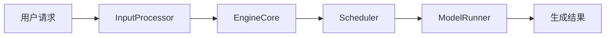

# 技术图片规范

图片的目标是减少理解成本，而不是增加视觉效果。默认使用白底或透明底、深色文字、少量强调色和清晰连线。

## 选择图形

- **架构图**：展示模块边界、层次和依赖关系。
- **流程图**：展示单向处理步骤、条件分支和数据变换。
- **时序图**：展示进程、线程或组件之间按时间发生的调用与返回。
- **状态图**：展示 Scheduler、FSM、Request 等对象的状态迁移。
- **数据布局图**：展示 Tensor Shape、Shard、Patch、KV Block 或内存排布。Mermaid 不清晰时直接编写 SVG。
- **表格**：只有二维对比关系时用表格，不要为表格内容画图。

一张图只回答一个主要问题。复杂主题拆成“整体架构”和“局部流程”两张图，不要塞进一张超大图。

## 文件组织

每篇新文章：

```text
outputs/<article-slug>/
├── <article-slug>.md
└── images/
    ├── <name>.mmd
    ├── <name>.svg
    └── <name>.png
```

- 文件名使用简短的 lowercase `kebab-case` 英文。
- Mermaid 图保留 `.mmd` 源文件和 `.svg` 渲染结果。
- 只有发布平台不支持 SVG 或用户明确要求时再生成 PNG。
- Markdown 使用相对路径：``。
- 场景二的 `images/` 位于被编辑文章旁边，不复制文章到 skill 的 `outputs/`。

## Mermaid 约束

- 架构图和流程图默认使用 `flowchart LR` 或 `flowchart TB`。
- 节点 ID 使用 ASCII `camelCase`，展示文本可以使用中文。
- 节点文本控制在两行内；详细解释放到正文。
- 同层节点保持同一抽象级别。
- 边上只写动作、数据或条件，不写完整句子。
- 时序图参与者通常不超过 6 个；超过时拆图。
- 不手动指定大面积背景色、渐变、阴影或装饰图标。
- 不依赖颜色作为唯一语义，必须同时有文字或线型区分。
- 不使用 emoji。

示例：



## SVG 约束

当 Mermaid 无法清楚表达 Tensor 切分、二维网格、内存块或算子内部结构时，直接生成 SVG：

- 使用标准 SVG 元素和内嵌字体回退，不依赖外部资源。
- 使用规整网格、直线和圆角矩形；避免拟物图标。
- 保证文字在常见 Markdown 预览宽度下可读。
- 画布四周留出安全边距。
- 同类组件尺寸一致，对齐到统一基线。
- 颜色控制在中性色加 1～2 个强调色。

## 渲染与检查

1. 将 Mermaid 源保存到目标文章的 `images/`。
2. 优先使用已安装的 `mmdc`；否则使用可用的 Mermaid 渲染工具。不要只创建 `.mmd` 后假装图片已完成。
3. SVG 默认使用透明或白色背景，确保浅色和深色 Markdown 预览均可辨认。
4. 打开渲染结果检查：
   - 中文是否缺字；
   - 标签是否截断或重叠；
   - 箭头方向是否正确；
   - 连线是否大量交叉；
   - 字号是否可读；
   - 图是否与当前代码版本一致。
5. 修正后再写入 Markdown 链接。

如果环境中没有可靠的渲染能力，直接生成结构简单、可检查的 SVG；不要引用不存在的文件，也不要用 ASCII 图冒充最终图片。

## 内容检查

每张图都应满足：

- 从标题或图注能看出它解释的问题。
- 节点和边可从源码或可靠资料中核验。
- 正文明确告诉读者从哪里开始看、关键路径是什么。
- 删除任意装饰元素都不会损失技术含义。
- 删除整张图会明显增加正文的解释成本；否则不需要这张图。
